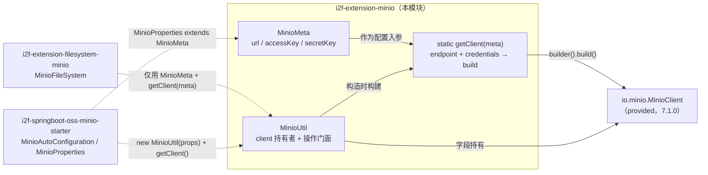

# i2f-extension-minio

> MinIO Java SDK（`io.minio:minio:7.1.0`，`provided`）的**零内部依赖薄封装**：`MinioMeta`（20 行）承载 `url`/`accessKey`/`secretKey` 连接配置，`MinioUtil`（171 行）包装 `MinioClient` 提供桶 / 对象上传下载 / 前缀（伪目录）/ 预签名 URL 等便捷方法，并把 SDK 抛出的受检异常统一降级为 `IOException`。本模块自身不依赖任何 `i2f-*` 内部模块，产物仅 2 个类，是 `i2f-extension-filesystem-minio`（契约适配层）与 `i2f-springboot-oss-minio-starter`（自动装配）共同依赖的连接底座——但二者实际仅复用其 `MinioMeta` 与 `MinioUtil` 的构造器 / `getClient` 静态工厂，`MinioUtil` 的 CRUD 方法面向外部使用方。

## 模块路径

- `i2f-extension/i2f-extension-minio`

## 模块依赖

| 依赖 | groupId:artifactId | 版本 | scope | optional | 作用 |
| --- | --- | --- | --- | --- | --- |
| Lombok | `org.projectlombok:lombok` | 根 POM 管理 | provided | true（继承根 POM） | `MinioMeta`/`MinioUtil` 的 `@Data`/`@NoArgsConstructor` 注解处理 |
| MinIO SDK | `io.minio:minio` | `7.1.0`（**模块内硬编码**，未走根 POM `dependencyManagement`） | provided | 否 | 提供 `MinioClient` 及 `*Args`/`ObjectStat`/`Result<Item>` 等类型；`provided` 表示运行期由使用方自备 SDK 与其 okhttp/okio/simple-xml 依赖链 |

> **内部依赖：无**。本模块 `pom.xml` 未声明任何 `i2f.turbo:*` 依赖，是纯三方 SDK 的适配壳（区别于 `filesystem-minio` 依赖 `i2f-io-filesystem` 契约）。

## 模块设计

单包 `i2f.extension.minio`，2 个类，无测试、无资源文件（无 SPI/DTD/示例）。

| 文件 | 行数 | 职责 |
| --- | --- | --- |
| `MinioMeta.java` | 20 | 连接配置 POJO：`url`（endpoint）/`accessKey`/`secretKey`；`@Data @NoArgsConstructor`。被 `MinioUtil.getClient` 消费，并被 Spring 侧 `MinioProperties` 继承为配置属性基类 |
| `MinioUtil.java` | 171 | `MinioClient` 便捷门面：持有一个 `protected MinioClient client`；构造器（注入 `MinioClient` 或由 `MinioMeta` 经静态 `getClient` 构建）；封装桶/对象/前缀/预签名 URL 操作 |



设计要点：

1. **双构造入口**：`MinioUtil(MinioClient)` 允许外部注入已构建的客户端（复用连接池 / 单例共享）；`MinioUtil(MinioMeta)` 走静态 `getClient(meta)`（`MinioClient.builder().endpoint(url).credentials(ak,sk).build()`，构造即建、不发 HTTP）。
2. **操作按对象模型分三层**：桶级（`bucketExists`/`bucketCreate`/`bucketRemove`）、对象级（`getObjectInfo`=stat、`upload`×4 重载、`download`、`list`×2）、前缀伪目录级（`prefixExists`/`prefixCreate`），外加预签名 URL（`urlOf`×2）。
3. **`upload` 重载梯度**：最全参 `(bucket,object,is,fileSize,partSize,type)` 直通 `putObject(...stream(is,fileSize,partSize)...)`；其余重载以 `-1L` 哨兵缺省 `fileSize`/`partSize`，`File` 版自行开流并以 `file.length()` 填长度、`finally` 关流。
4. **异常归一**：每个 SDK 调用 `try { ... } catch (Exception e) { throw new IOException(e.getMessage(), e); }`，对使用方只暴露 `IOException`（`list`/`prefixExists` 的部分签名例外，见瑕疵）。
5. **`@Data` 承载可变客户端**：`MinioUtil` 上的 `@Data` 为 `client` 生成 `getClient`/`setClient`/`equals`/`hashCode`/`toString`（无显式全参构造需求，两显式构造器抑制了 Lombok 的隐式构造生成）。

## 模块目的

- 把 MinIO 7.1.0 冗长的「builder-args」式 API（每次调用都要 `XxxArgs.builder().bucket(..).build()`）收敛为一组直接传 `bucketName`/`objectName` 的短方法，降低调用样板。
- 提供一个可复用的**连接配置模型**（`MinioMeta`）与**客户端工厂**（`getClient`），供契约适配层（`filesystem-minio`）与 Spring Boot 自动装配共享，避免各处重复拼装 endpoint/credentials。
- 以 `provided` 隔离 MinIO SDK 及其重型依赖链，使本模块产物保持极薄、不污染下游 classpath。

## 模块功能

- 连接构建：由 `MinioMeta` 或外部 `MinioClient` 得到 `MinioUtil`。
- 桶管理：存在性检查、幂等创建（已存在即返回）、删除。
- 对象读写：`statObject` 元信息、`putObject` 上传（含 `File`/`InputStream`/带不带长度分片的重载）、`getObject` 下载返回 `InputStream`。
- 列举：`listObjects`（`recursive=false`）非递归列举整桶或按 `prefix`。
- 伪目录：`prefixExists`（依据列举项 `isDir`）、`prefixCreate`（写入空对象占位）。
- 预签名：对对象生成 `GET` 方法的临时访问 URL（`urlOf`），或直接从 `ObjectWriteResponse` 取桶名/对象名生成。

## 模块主要使用方法

```java
// 1) 由配置对象构建（MinioMeta 亦可被子类如 MinioProperties 继承后注入）
MinioMeta meta = new MinioMeta();
meta.setUrl("http://127.0.0.1:9000");
meta.setAccessKey("minioadmin");
meta.setSecretKey("minioadmin");
MinioUtil minio = new MinioUtil(meta);   // 内部 getClient(meta) 构建 MinioClient

// 2) 桶：幂等创建 + 上传（推荐用 File 版或显式 fileSize 版，见瑕疵①）
minio.bucketCreate("images");
minio.upload("images", "a/cat.png", new File("/tmp/cat.png"), "image/png");

// 3) 预签名访问 URL
String url = minio.urlOf("images", "a/cat.png");
```

注意事项：

- **无长度上传是雷区**：`upload(bucket,object,is,contentType)` 与 `upload(bucket,object,is,fileSize,contentType)` 会把未知长度（`-1L`）与默认分片（`-1L`）一并传入，在 7.1.0 下于 `build()` 期即失败（详见瑕疵①）；上传流务必给出**已知 `fileSize` 且合法 `partSize`**，或直接用 `File` 版重载。
- `MinioUtil` 内部只被生态内复用 `getClient`/构造器；`upload`/`download`/`list` 等方法在本仓库内无调用方，属对外门面。
- 客户端非 `Closeable` 封装，连接池由 SDK 内部管理；`download` 返回的 `InputStream` 由调用方负责关闭。

## 模块特性总结

- **零内部依赖**：不引 `i2f-*`，纯三方 SDK 适配壳，产物只 2 个类。
- **配置模型可继承**：`MinioMeta` 作为 Spring `@ConfigurationProperties` 基类（`MinioProperties extends MinioMeta`）与 ops DTO 字段类型复用。
- **客户端可注入或自建**：双构造器兼顾「共享单例客户端」与「按配置即建」。
- **API 收敛**：屏蔽 `*Args.builder()` 样板，桶/对象/前缀/URL 四类操作一屏可览。
- **异常收口**：统一以 `IOException` 对外（简化受检异常传播）。

## 模块瑕疵或错误

> 仅静态识别，不做运行时实证（遵循 `.qoder/rules/project-docs.md`）。

1. **无长度 `upload` 重载在 7.1.0 恒失败（高）**：`upload(...,is,contentType)`→`upload(...,-1L,-1L,type)`、`upload(...,is,fileSize,contentType)`→`upload(...,fileSize,-1L,contentType)` 中，当 `fileSize` 亦为 `-1L` 时同时给出「未知对象大小 + 未提供分片大小」，命中 `PutObjectArgs.Builder.validateSizes` 在 `build()` 期抛 `IllegalArgumentException`（被 catch 后包装为 `IOException`）。与姊妹 `filesystem-minio` 的 `store()` 缺陷同因同果；`File` 版与显式 `fileSize`+合法 `partSize` 版不受影响。
2. **`@Data` 用在不合适的持有者上**：`MinioUtil` 的 `@Data` 为 `client` 生成 `setClient(...)`（运行期可被悄悄替换、无重新校验、线程安全隐患）与 `equals`/`hashCode`/`toString`（对持有 okhttp 资源的 `MinioClient` 语义无意义、`toString` 可能代价高）。`@Getter` + 显式构造器更贴切。
3. **异常信息过度有损**：`throw new IOException(e.getMessage(), e)` 把 `ErrorResponseException`（含错误码 / HTTP 状态）、`InvalidKeyException`、`ServerException` 等 typed 异常一律塌缩为通用 `IOException`，且用 `e.getMessage()` 作新异常消息（部分异常 `getMessage()` 可能为 `null`）——调用方无法程序化区分「桶不存在 / 对象不存在 / 权限拒绝 / 网络故障」。
4. **装箱长度参数无 null 防护**：`upload` 的 `fileSize`/`partSize` 形参为 `Long`，而底层 `stream(InputStream,long,long)` 取基本型，调用方传 `null` 将在拆箱处 NPE，且重载易混淆。
5. **`prefixCreate`/`prefixExists` 语义不对称**：`prefixCreate` 以 `object(prefix)` 写入 0 字节对象；若 `prefix` 未以 `/` 结尾则只是建了一个字面名对象、并非「目录」，而 `prefixExists` 依赖非递归列举项的 `isDir()` 判定，二者未必互认，易造成「创建了却探测不到」。
6. **`list` 固定 `recursive(false)`**：无法递归列举深层对象；深层前缀下的对象不会经此 API 浮现（`prefixExists` 亦仅看顶层）。
7. **预签名 URL 定制性缺失**：`urlOf` 写死 `Method.GET` 且使用默认有效期，无法生成 PUT 或自定义时效的链接。
8. **门面未彻底屏蔽 SDK 类型**：`getObjectInfo` 返回 `ObjectStat`、`list` 返回 `Iterable<Result<Item>>`、`upload` 返回 `ObjectWriteResponse` 均直接暴露 MinIO 类型，`provided` 依赖会传染到使用方签名（与「薄封装收敛 API」的初衷略有出入）。

## 消费方与生态位置

| 消费方 | 关系与用法 | 说明 |
| --- | --- | --- |
| `i2f-extension-filesystem-minio` | `pom.xml:27` compile 依赖；`MinioFileSystem` `import` 两类，仅用 `MinioMeta`（构造入参）与 `MinioUtil.getClient(meta)` 静态工厂 | 契约适配层（把 MinIO 装为 `i2f-io-filesystem` 的 `IFileSystem`/`IFile`）；**不调用** `upload`/`download`/`list` 等本模块方法 |
| `i2f-springboot-oss-minio-starter` | `MinioProperties extends MinioMeta`（`@ConfigurationProperties("i2f.minio")`）；`MinioAutoConfiguration` `@Bean MinioUtil = new MinioUtil(props)`、`@Bean MinioFileSystem = new MinioFileSystem(minioUtil.getClient())` | 以本模块为连接装配底座，向 Spring 容器发布 `MinioUtil`/`MinioFileSystem` 单例 |
| `i2f-springboot-ops-starter` | `MinioOperateDto`（L3/L14）持有 `MinioMeta meta` 字段 | 复用 `MinioMeta` 作为运维文件控制器的连接配置载体 |

- **登记位置**：`i2f-extension/pom.xml` 聚合 `<module>` `:65`；根 `pom.xml` `dependencyManagement` `:1140`（`${i2f.version}`）；`i2f-extension-all/pom.xml` `:213` 聚合；`bash/{backup,deploy}-{jdk8,jdk17}/i2f-extension-minio-1.0-jdk{8,17}.jar` 分发产物存在（经核）。
- **姊妹对比**：本模块（`minio`）= 面向 MinIO SDK 的**原始便捷封装 / 连接底座**；`filesystem-minio` = 在其之上实现统一 `IFileSystem` 契约的**适配层**。同类「原始 SDK 便捷封装」还有 `oss-aliyun`、`oss-aws-s3`（分别面向阿里云 OSS、AWS S3），三者互为对象存储厂商的平行工具层，`filesystem-*` 系列则把它们拉平到同一文件系统抽象。
