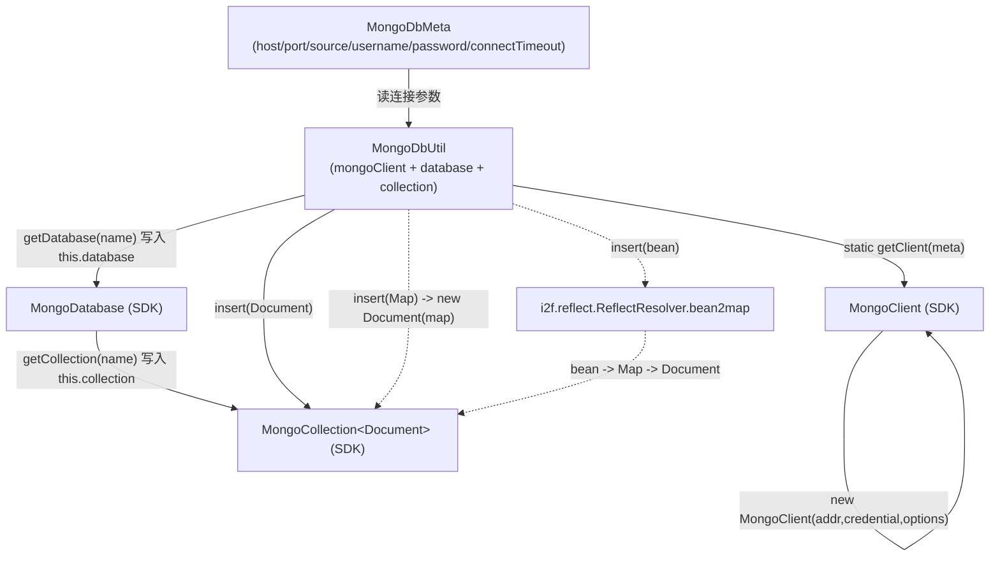

# i2f-extension-mongodb

> MongoDB 旧版统一驱动（`org.mongodb:mongo-java-driver:3.10.2`，`provided`）的**极简写入门面薄封装**：`MongoDbMeta`（20 行）承载 `host`/`port`/`source`/`username`/`password`/`connectTimeout` 连接配置，`MongoDbUtil`（83 行）包装 `MongoClient` 并以内部可变状态持有当前 `MongoDatabase` / `MongoCollection<Document>`，仅暴露「建连接 → 选库 → 选集合 → 插入（单条 / 批量 / Bean / Map）」的 **insert-only** 链路；其中 `insert(Object bean)` 借内部依赖 `i2f-reflect` 的 `ReflectResolver.bean2map` 把 JavaBean 反射为字段 Map 再转 `Document`。本模块只依赖一个 `i2f-*` 内部模块（`i2f-reflect`，`compile`），驱动本体为 `provided` 不进产物，自身仅 2 个类，仓库内**无任何消费方**，是纯对外可用的连接/写入工具壳。

## 模块路径

- `i2f-extension/i2f-extension-mongodb`

## 模块依赖

| 依赖 | groupId:artifactId | 版本 | scope | optional | 作用 |
| --- | --- | --- | --- | --- | --- |
| i2f-reflect（内部） | `i2f.turbo:i2f-reflect` | 根 POM `dependencyManagement` | compile | 否 | 提供 `ReflectResolver.bean2map`，供 `insert(Object bean)` 把 Bean 反射为字段 Map |
| Lombok | `org.projectlombok:lombok` | 根 POM 管理 | provided* | 否 | `MongoDbMeta` 的 `@Data`/`@NoArgsConstructor` 编译期生成器 |
| MongoDB 统一驱动 | `org.mongodb:mongo-java-driver` | **3.10.2（模块内硬编码）** | provided | 否 | `MongoClient`/`MongoCredential`/`MongoCollection`/`Document` 等 SDK 类型 |

> \* Lombok 未在本模块 POM 显式声明 scope，实际继承父/根 POM 的 `provided` 约定；`mongo-java-driver` 版本在本模块内直接写死为 `3.10.2`，**未走根 POM `dependencyManagement`**（与姊妹 `i2f-extension-minio` 的驱动版本处理方式一致）。

## 模块设计

### 包结构

| 包 | 类 | 职责 |
| --- | --- | --- |
| `i2f.extension.mongodb` | `MongoDbMeta` | 连接配置 POJO：`host`、`port`（默认 `27017`）、`source`、`username`、`password`、`connectTimeout`（默认 `30000`ms） |
| `i2f.extension.mongodb` | `MongoDbUtil` | 有状态写入门面：`protected` 持有 `mongoClient`/`database`/`collection`，静态 `getClient(meta)` 建连，实例方法选库、选集合、插入 |

### 类协作与调用链



### 设计要点

- **有状态链式定位**：`MongoDbUtil` 用字段缓存当前 `database` 与 `collection`，`getDatabase` → `getCollection` → `insert` 需按序调用，后两者依赖前者写入的内部状态。
- **两种构造入口**：`MongoDbUtil(MongoClient)` 直接接管外部已建客户端；`MongoDbUtil(MongoDbMeta)` 内部调 `getClient(meta)` 现建。
- **PLAIN 认证 + 单点地址**：`getClient` 固定用 `MongoCredential.createPlainCredential(username, source, password)` 与 `new ServerAddress(host, port)`，`MongoClientOptions` 仅设置 `connectTimeout`。
- **Bean 走反射摊平**：`insert(Object)` 经 `bean2map` 以**字段**（非 getter）为名、原始 Java 值为值摊平成 `HashMap`，再 `new Document(map)`；`bean2map` 对每个字段的反射取值包裹了空 `catch`。
- **产物自研类仅 2 个**：`mongo-java-driver` 为 `provided` 不入产物；经 `maven-assembly-plugin` 组装的分发 jar 额外内联了 `compile` 作用域的 `i2f-reflect` 及其传递 `i2f-*` 模块（clock/cache/lru/typeof/convert/invokable/reflect）。

## 模块目的

- 让「连一台 MongoDB 并把对象/文档写进去」这件事无需直接铺陈 SDK 的 `MongoClient`/`MongoCredential`/`MongoClientOptions` 三件套构造细节。
- 以最小面积（2 个类）复用 i2f 反射能力，把 JavaBean 直投为 Mongo 文档，省去手写 `Document` 逐字段 `put`。
- 保持与 i2f 扩展族一致的薄封装范式：连接配置对象化（`*Meta`）+ 门面工具（`*Util`），SDK 依赖 `provided` 交由使用方按版本提供。

## 模块功能

| 方法 | 说明 |
| --- | --- |
| `static MongoClient getClient(MongoDbMeta)` | 依据 meta 构造 PLAIN 认证、单 `ServerAddress`、仅 `connectTimeout` 的 `MongoClient` |
| `MongoDbUtil(MongoDbMeta)` / `MongoDbUtil(MongoClient)` | 两种构造：内部建连 / 接管外部客户端 |
| `MongoDatabase getDatabase(String)` | `mongoClient.getDatabase(name)` 并缓存到 `this.database` |
| `MongoCollection<Document> getCollection(String)` | 基于 `this.database.getCollection(name)` 并缓存到 `this.collection` |
| `void insert(Document)` | `collection.insertOne(doc)` |
| `void insert(Map<String,Object>)` | `new Document(map)` 后走 `insert(Document)` |
| `void insert(Object bean)` | `bean2map` 摊平为 `HashMap` 后走 `insert(Map)` |
| `void insertBatch(List<Document>)` | `collection.insertMany(list)` |
| `void insertBatchMap(List<Map<String,Object>>)` | 逐条 `new Document` 后走 `insertBatch` |

## 模块主要使用方法

```java
MongoDbMeta meta = new MongoDbMeta();
meta.setHost("127.0.0.1");
meta.setPort(27017);
meta.setSource("admin");
meta.setUsername("root");
meta.setPassword("root");

MongoDbUtil util = new MongoDbUtil(meta);   // 内部 getClient(meta)
util.getDatabase("mydb");                    // 必须先选库
util.getCollection("users");                 // 必须先选集合（依赖上一步）
util.insert(new Document("name", "i2f"));    // 单条
util.insert(userBean);                        // Bean -> bean2map -> Document
util.insertBatch(Arrays.asList(doc1, doc2));  // 批量
```

注意事项：

- **调用顺序敏感**：未经 `getDatabase` 直接 `getCollection`、或未经 `getCollection` 直接 `insert*`，会因内部字段为 `null` 触发 `NullPointerException`。
- 客户端生命周期由使用方负责：本类不提供 `close()`，`MongoClient` 需自行关闭以免连接泄漏。
- 无查询 / 更新 / 删除 / 建索引能力，仅覆盖写入侧。

## 模块特性总结

- **零 SDK 入产物**：`mongo-java-driver` `provided`，产物只含 2 个自研类。
- **唯一内部依赖**：仅 `i2f-reflect`（`compile`），用于 Bean→Map 摊平。
- **连接配置默认值**：`port` 默认 `27017`、`connectTimeout` 默认 `30000`ms，其余（`host`/`source`/`username`/`password`）默认 `null`。
- **有状态门面**：库、集合以字段缓存，链式收窄后再写入。
- **多种写入重载**：`Document` / `Map` / `Bean` 三种单条 + `List<Document>` / `List<Map>` 两种批量。

## 模块瑕疵或错误

> 仅静态识别潜在问题，不做运行时实证。

1. **`getClient` 对 `null` 配置无防护**：`meta.getPassword().toCharArray()` 在 `password` 为 `null`（默认值）时直接 NPE；`username`/`source` 为 `null` 时 `createPlainCredential` 抛 `IllegalArgumentException`。`@NoArgsConstructor` + 可变 setter 使这些字段默认可为空。
2. **认证机制可能与环境不匹配**：固定使用 `createPlainCredential`（SASL **PLAIN**，通常对接 LDAP/`$external`），而 MongoDB 常见的独立/副本集用户默认走 **SCRAM-SHA-1/256**。在未启用 PLAIN 的常规部署下会认证失败——若原意是普通用户名密码认证，此处属选型偏差。
3. **有状态、顺序耦合、非线程安全**：`database`/`collection` 为可变字段，跨库跨集合复用同一实例会互相覆盖，且并发下竞态；调用顺序错误即 NPE。作为「Util」暴露的是隐藏可变状态而非无副作用工具。
4. **连接资源泄漏**：`MongoClient` 实现 `Closeable`，但本类无 `close()`，`getClient`/`new MongoDbUtil(meta)` 每次现建新客户端却不纳入池、无从关闭；反复构造将累积连接与后台线程。
5. **仅设置 `connectTimeout`**：`MongoClientOptions` 未设 socket 读超时、服务器选择超时、连接池上限等；`MongoDbMeta` 也未提供对应字段，慢查询/网络异常可能长时间阻塞。
6. **单点连接、无 URI/副本集**：只以 `new ServerAddress(host, port)` 连单机，不支持多 seed、副本集、SRV/Data API URI，尽管 `MongoClient` 本身支持。
7. **insert-only 且结果被丢弃**：只有插入路径，无查询/更新/删除；`insertOne`/`insertMany` 的 `InsertOneResult`/`InsertManyResult` 未返回，写结果与 `acknowledged` 信息不可得。
8. **Bean 摊平的隐性风险**：`bean2map` 以字段原值入 `Document`，默认 `CodecRegistry` 不编码任意嵌套 POJO（无 `PojoCodecProvider` 时写入会在驱动编码期报错），`null` 字段亦会作为键写入；且每字段反射取值包裹空 `catch`，静默丢失异常字段而不报错。`insert(null)` 亦存在重载歧义。
9. **版本硬编码 + 旧 API**：`mongo-java-driver:3.10.2` 写死、未走根 `dependencyManagement`；所用 `com.mongodb.MongoClient` 为旧统一驱动入口（后续以 `mongodb-driver-sync` 取代），版本与 SDK 演进脱耦。

## 消费方与生态位置

- **仓库内消费方**：`grep` 全仓扫描 `MongoDbUtil`/`MongoDbMeta`/`i2f.extension.mongodb` 仅命中本模块自身，**无其他 i2f 模块引用**——非任何 starter / 适配层的连接底座，纯对外可用工具壳。
- **POM 登记**：`i2f-extension/pom.xml` `:66`（minio `:65` 之后）、根 POM `dependencyManagement` `:1145`、`i2f-extension-all` `:217` 三处均登记。
- **分发产物**：`bash/{backup,deploy}-jdk{8,17}` 四份 `i2f-extension-mongodb-1.0-jdk*.jar` 齐备。
- **同类对照**：与 `i2f-extension-minio`（对象存储薄封装）同为「`*Meta` + `*Util`、SDK `provided`、版本硬编码」范式；差异在于 mongodb 额外引入 `i2f-reflect` 支撑 Bean 写入，且为**有状态、insert-only、PLAIN 单点**门面，抽象完成度更低。
