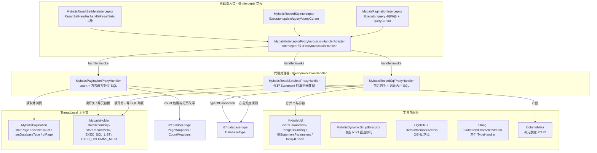
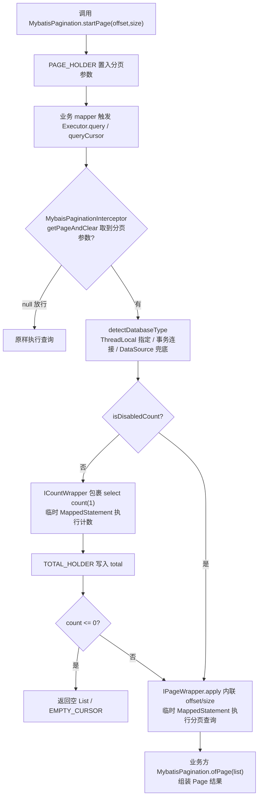

# i2f-extension-mybatis

> MyBatis 桥接扩展层：以「`@Intercepts` 空壳拦截器 + 适配器 + `IProxyInvocationHandler`」范式，在 MyBatis 插件体系上实现三条 **ThreadLocal 驱动的横切功能线**——①Executor 级**物理分页**（`MybatisPagination` PageHelper 风格 API，count 与分页 SQL 改写委托 `i2f-bindsql-page` 按方言执行）；②**SQL 执行记录**（`MybatisHolder` ThreadLocal 收集，`MybatisUtil` 把 `?` 占位符与参数合并为可读 SQL，支持 Oracle `TO_DATE` 字面量）；③**结果集列元数据捕获**（动态代理 `Statement` 抓取 `ResultSetMetaData` 转 `ColumnMeta`，反射回填 MyBatis 映射属性）。另有脱离 `SqlSessionFactory` 的**动态 script 直连执行器**、`String↔LOB` TypeHandler 三件与 **OGNL 求值辅助**。17 个源文件，MyBatis 依赖 `provided` 不入产物，仓库内唯一源码消费方为 `i2f-springboot-mybatis-starter`。

## 模块路径

- `i2f-extension/i2f-extension-mybatis`

## 模块依赖

| 依赖 | groupId:artifactId | 版本 | scope | optional | 作用 |
| --- | --- | --- | --- | --- | --- |
| i2f-bindsql-page（内部） | `i2f.turbo:i2f-bindsql-page` | 根 POM `dependencyManagement` | compile | 否 | `BindSql`/`IPageWrapper`/`ICountWrapper`/`PageWrappers`/`CountWrappers`：按 `DatabaseType` 方言做 count 包裹与分页 SQL 改写 |
| i2f-database-type（内部） | `i2f.turbo:i2f-database-type` | 根 POM 管理 | compile | 否 | `DatabaseType.typeOfConnection` 方言识别（记录 SQL 的日期转换与分页方言探测） |
| i2f-proxy-std（内部） | `i2f.turbo:i2f-proxy-std` | 根 POM 管理 | compile | 否 | `IProxyInvocationHandler`：三大代理处理器的统一契约 |
| i2f-match（内部） | `i2f.turbo:i2f-match` | 根 POM 管理 | compile | 否 | `RegexUtil.regexFindAndReplace`：`mergeBoundSql` 逐个遍历替换 `?` 占位符 |
| i2f-lru-map（内部） | `i2f.turbo:i2f-lru-map` | 根 POM 管理 | compile | 否 | `LruMap(4096)`：`OgnlUtil` 表达式解析树缓存 |
| Lombok | `org.projectlombok:lombok` | 根 POM 管理 | provided* | 否 | `@Data`/`@NoArgsConstructor` 编译期生成器 |
| MyBatis Spring Boot Starter | `org.mybatis.spring.boot:mybatis-spring-boot-starter` | **3.0.3（模块内硬编码）** | provided | 否 | 经传递依赖提供 `org.mybatis:mybatis` 核心类型（`MappedStatement`/`BoundSql`/`Executor`/`Plugin` 等）仅供编译期；运行期需使用方自备 MyBatis |

> \* Lombok 未在本模块 POM 显式声明 scope，继承父/根 POM 的 `provided` 约定。注意 `provided` **不传递**：本模块产物不含任何 MyBatis 类，接入方必须自带 mybatis-spring-boot-starter 或 mybatis。starter `3.0.3` 属 Spring Boot 3.x / Java 17 系，模块编译实际只消费其传递而来的 mybatis 核心类型（Java 8 兼容），该兼容成立依赖「不引用 starter 自身类型」这一前提（见瑕疵 15）。

## 模块设计

### 包结构

| 包 | 类 | 职责 |
| --- | --- | --- |
| `i2f.extension.mybatis` | `MybatisUtil` | SQL 文本工具：参数提取（`extraParameters`）、参数填充（`fillStatementParameters`）、`?`+参数合并为可读 SQL（`mergeBoundSql`）、字符串 SQL 字面量装饰（`decorateAsSqlString`）、Oracle `TO_DATE` 字面量（`toSql4Oracle`/`toDate4Oracle`） |
| `i2f.extension.mybatis.data` | `ColumnMeta` | 结果集列元数据 POJO：列名/原始列名/映射属性名/元素类型/JDBC 类型与精度刻度/可空自增等 14 字段 |
| `i2f.extension.mybatis.dynamic` | `MybatisDynamicScriptExecutor` | 动态 `<script>` XML 直连执行器：解析为 `SqlSource` → 临时 `MappedStatement` → `SimpleExecutor`+`JdbcTransaction` 直查/直改 |
| `i2f.extension.mybatis.handler` | `StringBlobTypeHandler` / `StringClobTypeHandler` / `StringCharacterStreamTypeHandler` | `String↔BLOB/CLOB/LONGVARCHAR` 三个 `BaseTypeHandler<String>` |
| `i2f.extension.mybatis.interceptor` | `MybatisPagination` | 分页 ThreadLocal 上下文：`PAGE_HOLDER`/`TOTAL_HOLDER`/`DATABASE_HOLDER`/`DISABLED_COUNT` 四槽 + `ofPage` 组装结果 |
| `i2f.extension.mybatis.interceptor` | `MybatisHolder` | 记录 ThreadLocal 上下文：SQL 记录开关 + `EXEC_SQL_LIST`、元数据开关 + `EXEC_COLUMNS_META` |
| `i2f.extension.mybatis.interceptor` | `MybaisPaginationInterceptor` / `MybatisRecordSqlInterceptor` / `MybatisResultSetMetaInterceptor` | 三个 `@Intercepts` 签名声明空壳，组装对应 handler |
| `i2f.extension.mybatis.ognl` | `OgnlUtil` / `DefaultMemberAccess` | 基于 mybatis 内嵌（shaded）`org.apache.ibatis.ognl` 的表达式求值与宽松成员访问策略 |
| `i2f.extension.mybatis.proxy.adapter` | `MybatisInterceptorProxyInvocationHandlerAdapter` | MyBatis `Interceptor` → i2f `IProxyInvocationHandler` 适配器 |
| `i2f.extension.mybatis.proxy.handler` | `MybatisPaginationProxyHandler` / `MybatisRecordSqlProxyHandler` / `MybatisResultSetMetaProxyHandler` | 三条功能线的实际执行逻辑 |

### 整体架构



### 分页执行链



### 设计要点

- **插件适配范式**：`MybatisInterceptorProxyInvocationHandlerAdapter` 实现 MyBatis `Interceptor`，`plugin()` 用 `Plugin.wrap`、`intercept()` 把 `Invocation` 转成 i2f 的 `IInvokable`（`JdkMethod`）后委托 `IProxyInvocationHandler.invoke(target, invokable, args)`。三个拦截器子类仅承载 `@Intercepts` 签名与 handler 组装；handler 遇非 `IMethod` 的 invokable 直接抛 `IllegalStateException`。
- **ThreadLocal 上下文分离**：`MybatisPagination`（分页/总数/方言/禁用 count）与 `MybatisHolder`（SQL 记录/元数据记录）互不依赖。`getPageAndClear()` 为**消费型语义**——一次 `startPage` 只影响随后一条查询。
- **分页双阶段执行**：count 阶段 `ICountWrapper` 包裹（`select count(1) from (原SQL) tmp_cnt` 子查询），结果写入 `TOTAL_HOLDER`，`count<=0` 时短路返回空 `List`/`EMPTY_CURSOR`；page 阶段 `IPageWrapper.apply(sql, page)` 两参重载**内联** offset/size（embed 语义）。两阶段均以 `copyMappedStatement` 生成 `ms.getId()+"_pagination_count"`/`"_pagination_page"`/`"_pagination_page_cursor"` 的临时 `MappedStatement`，经反射复制 `BoundSql.additionalParameters` 后在**原 executor** 上执行；`copyMappedStatement` 复制 resource/fetchSize/statementType/keyGenerator/keyProperty/timeout/parameterMap/resultMaps/resultSetType/cache/flushCacheRequired/useCache。
- **方言解析三级**：`MybatisPagination.setDatabaseType` 强制指定 → `executor.getTransaction().getConnection()` → `Environment.getDataSource().getConnection()` 兜底，最终交 `PageWrappers.DIALECT_MAPPING.dialectOf(connection)` 归并。
- **SQL 记录链**：仅 `MybatisHolder.isRecordingSql()` 开启时生效；`recordSqlBefore`/`recordSqlAfter` 为可覆写钩子。`recordSqlAfter` 用 `MybatisUtil.mergeBoundSql` 合并 SQL 后 `addSql` 进 ThreadLocal 列表，`enablePrintSql` 时按 `namespace 最后两段 ==> SQL` 格式直打 stdout/stderr。`getTypeStringifier` 按 `DatabaseType.typeOfConnection` 判定 ORACLE/ORACLE_12C/POSTGRE_SQL/DM/OCEAN_BASE 时返回 `MybatisUtil::toSql4Oracle`。
- **参数提取复刻 `DefaultParameterHandler`**：`extraParameters` 按「`BoundSql.additionalParameter` 优先 → parameterObject 为 null → `TypeHandlerRegistry.hasTypeHandler(parameterObject.getClass())` 整对象直取 → `MetaObject.getValue`」顺序取值并跳过 `OUT` 模式；`fillStatementParameters` 逐个 `TypeHandler.setParameter`，value 为 null 且无 JdbcType 时回落 `configuration.getJdbcTypeForNull()`。
- **元数据捕获链**：JDK 动态代理包装 `Statement`（仅 `Statement` 接口），拦截所有「返回类型为 `ResultSet`」的方法调用 `parseResultSetColumns` 读 `ResultSetMetaData`；随后反射探测 handler 的 `MappedStatement` 字段与 `autoMappingsCache` 字段，用自动映射键 `id + "-Inline:null"`（取不到时取 map 首个 entry）与 `resultMaps[0].propertyResultMappings` 回填 `ColumnMeta.prop`，`resultMap.getType()` 回填 `elemType`。全程 `catch(Throwable)` 静默降级。
- **动态 script 直连执行**：`wrapAsScriptXml`（XML prolog + `<script>` 包裹）→ `XPathParser` + `XMLScriptBuilder.parseScriptNode()` 得 `SqlSource` → 构建 UUID 命名的临时 `MappedStatement`（SELECT 空 resultMaps 或 UPDATE）→ `SimpleExecutor` 包 `JdbcTransaction(conn)` 直接 `doQuery`/`doUpdate`；`DEFAULT_CONFIGURATION` 开启 `StdOutImpl` 日志、`callSettersOnNulls`、`mapUnderscoreToCamelCase`。
- **`mergeBoundSql` 分类字面量化**：按 `ParameterMapping.getJdbcType()` 分派——数值族（TINYINT..ROWID）`String.valueOf`；字符族（CHAR/VARCHAR/LONGVARCHAR/N 族/SQLXML）与 CLOB/NCLOB 走 `decorateAsSqlString`（单引号翻倍 + 两侧加 `'`）；无 jdbcType 时按 `Number`/`Date`/`LocalDate`/`LocalTime`/`LocalDateTime` 依次兜底，再兜底统一加引号；`typeStringifier` 返回非 null 时优先采用（供 Oracle `TO_DATE` 等方言转换注入）。

## 模块目的

- 以最小侵入（注册 1~2 个 `Interceptor` Bean）为既有 MyBatis 应用补齐**物理分页、SQL 审计记录、结果集元数据**三类横切能力，无需改造 mapper。
- 分页能力复用 `i2f-bindsql-page` 的方言体系，使 MyBatis 生态与 i2f JDBC/BQL 生态共享同一套分页/计数方言与 `ApiOffsetSize` 分页参数模型。
- 提供 `PageHelper` 同构的 ThreadLocal 编程模型（`startPage` → 查询 → `ofPage`），降低使用心智。
- 提供不依赖 `SqlSessionFactory`/mapper XML 的动态 SQL 执行通道，服务逆向工程、动态报表、元数据探测等场景。
- 沉淀 MyBatis 相关通用小件：`String↔LOB` TypeHandler、可读 SQL 合并器、OGNL 求值器，供上层模块（如 springboot starter、逆向生成器）复用。

## 模块功能

| 功能 | 入口 | 说明 |
| --- | --- | --- |
| 物理分页 | `MybatisPagination.startPage(offset,size)` + `MybaisPaginationInterceptor` | 拦截 `Executor.query`（4/6 参）与 `queryCursor`，先 count 后分页；`disableCount` 跳过计数、`setDatabaseType` 指定方言、`ofPage(list)` 组装 `Page<T>`（含 total） |
| SQL 执行记录 | `MybatisHolder.startRecordSql()` + `MybatisRecordSqlInterceptor` | 记录每次 Executor 执行的合并后 SQL（含参数），`getLastSql`/`getLastSqlAndClear` 取回；`enablePrintSql` 直打日志；子类可覆写 `recordSqlBefore/After`、`getTypeStringifier` |
| 结果集元数据 | `MybatisHolder.startRecordMeta()` + `MybatisResultSetMetaInterceptor` | 捕获结果集列名/原始列名/JDBC 类型/精度/可空/自增等，回填 MyBatis 映射属性名与元素类型，`getColumnsMetaAndClear` 取回 `List<ColumnMeta>` |
| 参数填充 | `MybatisUtil.fillStatementParameters(ps, boundSql[, ms/configuration])` | 在 MyBatis 之外（自拼 JDBC）按 `ParameterMapping` 逐个 `TypeHandler.setParameter` |
| 可读 SQL 合并 | `MybatisUtil.mergeBoundSql(boundSql, ms/configuration[, typeStringifier])` | `?` 占位符按参数映射替换为字面量；`decorateAsSqlString` 单引号翻倍；`toSql4Oracle` 产出 `TO_DATE('...','yyyy-MM-dd HH24:mi:ss')` |
| 动态 SQL 执行 | `MybatisDynamicScriptExecutor.query/find/update(script, params, ...)` | 对裸 `Connection` 执行含 `<if>/<foreach>/<where>` 的动态 script；`find` 期望单行（多行抛 `SQLException`）；`parseSqlSource` 单独解析复用 |
| LOB TypeHandler | `StringBlobTypeHandler`/`StringClobTypeHandler`/`StringCharacterStreamTypeHandler` | `String↔BLOB`（UTF-8 字节流）、`String↔CLOB/NCLOB`（字符流/`getSubString`）、`String↔LONGVARCHAR`（字符流写入/`getString` 读取） |
| OGNL 求值 | `OgnlUtil.evaluateExpression(expression, root)` | mybatis 内嵌 OGNL 解析求值，解析树 LRU 缓存（4096）；`DefaultMemberAccess` 控制成员可见性 |

## 模块主要使用方法

### 1. Spring Boot 中注册拦截器（见 i2f-springboot-mybatis-starter）

```java
// 分页拦截器：继承并复制 @Intercepts 注解，注册为 Bean
@Component
@Intercepts({ /* 与 MybaisPaginationInterceptor 完全一致的三组 @Signature */ })
public class MyPaginationInterceptor extends MybaisPaginationInterceptor { }
```

注意：MyBatis `Plugin` 以**类上注解**识别签名，继承不会继承 `@Intercepts`——子类必须原样复制注解；也可在 `@Configuration` 中直接 `@Bean` 返回拦截器实例。

### 2. 物理分页

```java
MybatisPagination.setDatabaseType(DatabaseType.MYSQL); // 可选：免去连接级方言探测
MybatisPagination.disableCount();                      // 可选：跳过 count
MybatisPagination.startPage(0, 10);                    // 紧邻其后的一条查询被分页

List<User> users = userMapper.selectList(param);       // 被拦截器改写为 limit 分页 SQL
Page<User> page = MybatisPagination.ofPage(users);     // 组装 total + list 并清理 ThreadLocal
```

### 3. SQL 执行记录

```java
MybatisHolder.startRecordSql();                        // 开始记录（可配合 enablePrintSql）
try {
    userMapper.selectList(param);
    String sql = MybatisHolder.getLastSqlAndClear();   // 取最后一条合并后 SQL 并清列表
} finally {
    MybatisHolder.stopRecordSql(true);                 // 关闭记录并清空
}
```

自定义日志：继承 `MybatisRecordSqlInterceptor`（复制 `@Intercepts`）并覆写 `recordSqlAfter` 或换掉 `infoLogger`/`errorLogger`。

### 4. 结果集元数据捕获

```java
MybatisHolder.startRecordMeta();
try {
    userMapper.selectList(param);
    List<ColumnMeta> metas = MybatisHolder.getColumnsMetaAndClear();
    // name/columnName/prop/elemType/jdbcType/precision/scale/nullable/autoIncrement ...
} finally {
    // 记录开关无专用关闭方法，见瑕疵 2
}
```

### 5. 动态 script 直连执行

```java
String script = "SELECT id, name FROM t_user "
        + "<where><if test=\"name != null\">AND name LIKE CONCAT('%', #{name}, '%')</if></where>";
List<Map<String, Object>> rows = MybatisDynamicScriptExecutor.query(
        script, Collections.singletonMap("name", "i2f"), Map.class, connection);
Map<String, Object> one = MybatisDynamicScriptExecutor.find(
        script, params, Map.class, connection);        // 多行抛 SQLException
```

### 6. LOB TypeHandler（字段/注解式注册）

```xml
<result javaType="java.lang.String" jdbcType="BLOB" typeHandler="i2f.extension.mybatis.handler.StringBlobTypeHandler"/>
```

```java
// mybatis-plus 注解
@TableField(jdbcType = JdbcType.BLOB, typeHandler = StringBlobTypeHandler.class)
```

### 7. 手工合并可读 SQL / 填充参数

```java
String readable = MybatisUtil.mergeBoundSql(boundSql, mappedStatement);       // 日志友好
MybatisUtil.fillStatementParameters(ps, boundSql, configuration);            // 自拼 JDBC 场景
```

## 模块特性总结

- **零 MyBatis 入产物**：mybatis 经 starter 传递且 `provided`，产物只含自研类与内联的 compile 级 i2f 模块；运行期由使用方提供 MyBatis。
- **适配器 + 处理器两层结构**：拦截器只管 `@Intercepts` 签名，逻辑全部在 `IProxyInvocationHandler`，可脱离 MyBatis 单测与复用。
- **ThreadLocal 消费型语义**：`startPage`/`startRecordSql`/`startRecordMeta` 三开关均与查询强耦合，取值即清理（`*AndClear` 族）。
- **方言统一走 i2f-bindsql-page**：分页模板与 count 包裹与 JDBC/BQL 生态同源，支持 ThreadLocal 强制 / Provider SPI / 方言重定向 / 内置分发四级解析。
- **可读 SQL 双通路**：既可 `enablePrintSql` 直接打日志，也可经 ThreadLocal 列表编程取回，Oracle 系日期转 `TO_DATE` 字面量。
- **元数据反射回填**：同时兼容自动映射（`autoMappingsCache`）与显式 `resultMap` 两种属性映射来源，`ColumnMeta` 附带完整 JDBC 元数据。
- **动态 script 全能力**：复用 MyBatis 官方 `XMLScriptBuilder`，`<if>/<foreach>/<where>/<set>` 等标签全部可用，无需 SqlSessionFactory。
- **OGNL 树缓存**：表达式解析树以 LRU(4096) 复用，求值入口对 root 做 `setRoot` + `$root` 上下文双注册。

## 模块瑕疵或错误

> 仅静态识别潜在问题，不做运行时实证。

1. **`StringBlobTypeHandler` 空指针分叉**：仅 `getNullableResult(ResultSet, String)` 判了 `bts == null`，`getNullableResult(CallableStatement, int)` 与 `getNullableResult(ResultSet, int)` 未判空即 `new String(bts, ...)`——BLOB 列为 NULL 时 NPE。
2. **`MybatisHolder` 取值与生命周期缺陷**：`getLastSql`/`getLastSqlAndClear` 只判 list 为 null 不判**空列表**，开启记录但未执行 SQL 时 `list.get(size-1)` 抛 `IndexOutOfBoundsException`；`EXEC_SQL_LIST` 无上限累积，忘记 clear 有 OOM 风险（类注释已自认）；元数据开关只有 `startRecordMeta` 无关闭方法，线程池复用场景标志位泄漏导致后续无关查询持续抓取元数据。
3. **`detectDatabaseType` 连接泄漏与静默吞异常**：从 `DataSource.getConnection()` 兜底新取的连接从不关闭（`closeConnection` 赋值后未使用）；两路获取连接的异常均空 `catch` 吞掉，双双失败时 `connection == null` 传入 `DIALECT_MAPPING.dialectOf(null)`，后续 NPE/`UnsupportedOperationException` 风险。
4. **分页/计数的 CacheKey 语义错位**：count 与 page 的 `CacheKey` 均用**改写前**的原始 `boundSql` 生成，而实际执行的是改写后 SQL；`wrapCountSql` 接收 `countKey` 参数却完全忽略（key 不携带任何 count 差异量）；6 参 `query` 路径直接 `cacheKey.update(offset/size)` **原地修改调用方传入的 CacheKey**（副作用）；key 未纳入方言信息——同 key 不同方言改写可能命中彼此的（一/二级）缓存，开启缓存时存在错位命中与类型转换异常风险。
5. **count 查询复用业务 `ResultHandler`**：`executeCount` 把调用方的 `resultHandler` 传给 count 查询，计数行（Long）会被投递进业务结果回调，与后续分页查询的行混流。
6. **count 结果强转与死代码**：`((Number) list.get(0)).longValue()` 对驱动返回非数值类型时 CCE；`executePageCursor` 中 `CacheKey countKey` 创建后未使用（命名误导的死代码）。
7. **`startPage` ThreadLocal 残留**：`getPageAndClear()` 仅在查询真正经过拦截器时消费；`startPage` 后查询抛异常或未发起查询，`PAGE_HOLDER` 残留，线程内**下一条无关查询被意外分页**（PageHelper 经典坑，无 `clearPage` 兜底调用约定）。
8. **`mergeBoundSql` 的 `?` 全量正则替换不感知 SQL 语境**：`RegexUtil.regexFindAndReplace(sql, "\\?", ...)` 会命中字符串字面量/注释中的 `?`（如 `WHERE note = 'a?b'` 被误替换、占位符错位）；参数数少于 `?` 数时多余 `?` 原样保留且无告警。
9. **类型化字面量化盲区**：CLOB/NCLOB 分支注释自述「Reader 只能读一次应直接 valueOf」，但实现对 `Reader`/`Clob` 对象调 `String.valueOf` 产出 `java.io.BufferedReader@xxx` 之类对象串再包引号；`byte[]`/`InputStream`/BLOB 等未列类型走兜底 `decorateAsSqlString` 同样产出对象串；`java.sql.Time` 被 `yyyy-MM-dd HH:mm:ss` 格式化带上 1970-01-01 日期部分。
10. **`decorateAsSqlString` 仅转义单引号**：不处理反斜杠（MySQL 语义下含 `\` 的字符串错义/注入面）与各方言引号差异——用于日志展示尚可，用于拼 SQL 执行则危险。
11. **`toSql4Oracle` 方言映射过宽**：`POSTGRE_SQL`/`DM`/`OCEAN_BASE` 与 Oracle 系统一映射到 `TO_DATE('...','yyyy-MM-dd HH24:mi:ss')`，PG/OceanBase(MySQL 模式) 的日期格式模型不匹配风险；`getTypeStringifier` 中 `SQLException` 静默吞掉返回 null 降级。
12. **`MybatisResultSetMetaProxyHandler` 深度依赖内部实现**：依赖 `autoMappingsCache` 字段名、自动映射对象的 `column`/`property` 私有字段与 `id + "-Inline:null"` 键格式猜测，fallback 还会取 autoMap **首个 entry**（跨语句属性映射污染）；`ResultSetHandler` 被其他插件代理包装时 `getClass().getDeclaredFields()` 取不到字段则 prop/elemType **静默缺失**；动态代理只实现 `Statement` 接口，下游强转 `PreparedStatement`/`CallableStatement` 即 CCE；多结果集时 `AtomicReference` 仅保留最后一次元数据；大量 `catch(Throwable)` 空吞。
13. **`DefaultMemberAccess` 默认放行私有成员**：`INSTANCE = new DefaultMemberAccess(true)` 允许 private/protected 访问，`OgnlUtil` 可对任意对象求值私有属性/方法，越权与安全面暴露。
14. **OGNL 缓存与空根**：`EXPRESSION_MAP` 为静态共享 LruMap，解析树跨类加载器全局共享；`expression == null` 时 `Ognl.parseExpression(null)` 无防护。
15. **starter 版本与 jdk8 产物线的隐式耦合**：`mybatis-spring-boot-starter:3.0.3`（Spring Boot 3.x / Java 17 系）版本硬编码于模块内、未走根 `dependencyManagement`；当前编译兼容完全依赖「只使用传递而来的 mybatis 核心类型」这一事实，一旦引用 starter 自身类型即断链。
16. **杂项**：分页接管后以 `RowBounds.DEFAULT` 执行，调用方原始 `RowBounds` 内存分页参数被静默丢弃；`MybaisPaginationInterceptor` 类名拼写（Mybais）；`StringCharacterStreamTypeHandler` 的 `@MappedJdbcTypes` 重复声明 `LONGVARCHAR` 两次且读取走 `getString` 与「CharacterStream」命名不符；`EMPTY_CURSOR` `isOpen()` 恒 true、`isConsumed()` 恒 false 语义不真实；`copyAdditionalParameters` 反射访问 `BoundSql.additionalParameters` 私有字段，MyBatis 版本升级脆弱；`SimpleExecutor` 每次动态执行新建且不 `close()`（依赖调用方管理连接与提交）。

## 消费方与生态位置

- **源码级消费方（唯一）**：`i2f-springboot/i2f-springboot-mybatis-starter`——
  - `MybatisAutoConfiguration`：注册 `MybaisPaginationInterceptor`（分页自动装配）；
  - `MybatisDynamicAutoConfiguration`：注册 `MybatisRecordSqlInterceptor`、`MybatisResultSetMetaInterceptor` 与两个 ProxyHandler（记录/元数据自动装配）；
  - `SpringMybatisDynamicScriptExecutor`：包装 `MybatisDynamicScriptExecutor` 提供 Spring 事务连接的动态 SQL 执行。
- **POM 登记**：根 POM `:67`（modules）、根 POM `dependencyManagement` `:1150`、父 POM `i2f-extension/pom.xml` `:67`、聚合 `i2f-extension-all/pom.xml` `:221` 四处登记。
- **生态位置**：i2f 持久化族的「MyBatis 桥接层」——上游消费 `i2f-bindsql-page`（分页/计数方言）与 `i2f-database-type`（方言识别）的能力，下游由 `i2f-springboot-mybatis-starter` 装配为开箱即用的自动配置插件；与姊妹模块 `i2f-extension-mybatis` 同族的 `i2f-jdbc-proxy-xml`、`i2f-bindsql-page` 共享同一方言底座。
- **分发产物**：经父 POM `maven-assembly-plugin` 组装为 `i2f-extension-mybatis-1.0-jdk8.jar`（target 下已见产物）。
