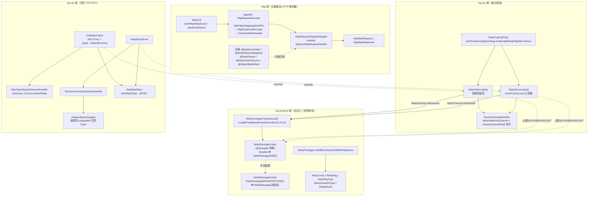
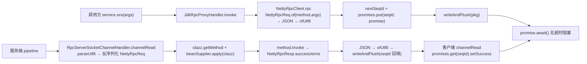

# i2f-extension-netty

> Netty 桥接扩展层（Netty `netty-all:4.1.65.Final` 以 provided 引入）：在 Netty 之上提供三条独立能力线——①**注解驱动 HTTP 服务器**（`@NettyController`/`@NettyRequestMapping` 扫描路由 + URL/表单/JSON 三源参数绑定与类型转换，`HttpObjectAggregator` 整包聚合）；②**自定义 TCP 二进制协议栈**（16 字节头 `0xface1024` 协议：魔数/版本/序列化类型/包类型/flag/seqId/长度，`LengthFieldBasedFrameDecoder` 拆粘半包 + `@Sharable` 包编解码器，`NettyClient`/`NettyServer` 内置心跳、ECHO 回显与 BROADCAST 广播）；③**同步风格 TCP-RPC**（JDK 动态代理 + seqId→`DefaultPromise` 应答匹配 + JSON 序列化 + 服务端按类型查 bean 反射调用）。另含流式分片重组编解码器 `NettyMessageCodec`（BEGIN/PART/END，内存+溢盘）与字符串 echo 演示工具 `NettyTcpUtil`。28 个主源文件 + 10 个手动 main 型测试，仓库内无源码级消费方（仅被 i2f-extension-all 聚合），属独立使用的网络扩展件。

## 模块路径

- `i2f-extension/i2f-extension-netty`（聚合于 `i2f-extension/pom.xml` module 列表，根 POM `dependencyManagement` 统一版本 `1.0-jdk8`）

## 依赖

| 依赖 | 范围 | 用途 |
|------|------|------|
| `io.netty:netty-all:4.1.65.Final` | provided | Netty 内核（bootstrap/channel/codec/http），不入产物，由使用方引入 |
| `i2f.turbo:i2f-serialize-impl` | compile | `IJsonSerializer` 标准 JSON 序列化门面（RPC 与 HTTP 均依赖） |
| `i2f.turbo:i2f-reflect` | compile | `ReflectResolver`：注解获取、方法匹配、按注解过滤方法集 |
| `i2f.turbo:i2f-resources` | compile | `ResourcesLoader.scanClassNamesBasePackages`：类路径扫描 `@NettyController` |
| `i2f.turbo:i2f-extension-jackson` | provided | 仅测试使用 `JacksonJsonSerializer` |
| `org.projectlombok:lombok` | compile | `@Data`/`@Getter`/`@ToString` |

## 架构设计



协议包 `NettyPackage` 线型：`magicNumber(4B)` + `version(1B)` + `serializeType(1B)` + `pkgType(1B)` + `flag(1B)` + `seqId(4B)` + `length(4B)` + `content(length B)`，总头长 16 字节，与 `NettyPackageFrameDecoder(maxFrameLength, 12, 4, 0, 0)` 的 length 字段偏移/长度严格对齐（整帧 = 16 + length）。

RPC 调用链：



## 设计目的

- 以极薄的成本（provided 依赖 + 静态工具类）在 Netty 之上提供**注解驱动的小型 HTTP 服务器**，让无 Web 容器的场景也能用 Spring MVC 风格注解暴露 HTTP 接口。
- 将 TCP 通讯中重复的**粘包半包处理、心跳保活、flag 语义（ECHO/BROADCAST/HEART_BEAT）**固化为默认协议栈，业务侧只需实现 `ISocketChannelHandler` 的读回调。
- 提供**接口透明**的 TCP-RPC：客户端面向接口代理编程，服务端只注册实现 bean，双方以 JSON 通讯，`seqId + Promise` 把异步应答抹平为同步调用。

## 功能清单

**HTTP 域**（`i2f.extension.netty.http`）

- `NettyUtil`：`httpChannelInitializer` 组装 HTTP pipeline；`startNettyServer`（boss=1/worker=默认，阻塞至关闭）；`startHttpNettyServer`（自定义 handler）；`startNettyHttpServer`（注解扫描 + 自动分发）。
- 注解五件：`@NettyController`（类级，value 为路径前缀）、`@NettyRequestMapping`（方法级，value 默认方法名，methods 默认 GET/PUT/POST/DELETE）、`@NettyParam`（参数级，名称/忽略大小写/来源/日期格式）、`@NettyParamSource`（URL/BODY/HEADER）、`NettyHttpMethod`（枚举桥接 Netty `HttpMethod` 常量）。
- `AbstractHttpRequestHandler`：`@Sharable` 抽象基类；channelRead0 中抽取 GET query 参数、POST 表单（`x-www-form-urlencoded`）/JSON（`application/json`）参数，组装 `HttpWebRequest`/`HttpWebResponse` 后回调 `doRequest`。
- `HttpRequestDispatchAdapter`：路径→Method 的 `ConcurrentHashMap` 路由表；类路径扫描注册；请求时校验 method 支持、按 `HttpWebRequest`/`HttpWebResponse` 类型直注入参数、其余参数按 `@NettyParam` 三源检索并做 String/整数族/浮点族/BigDecimal/BigInteger/Date 类型转换；返回值 JSON 序列化响应。

**TCP 协议域**（`i2f.extension.netty.tcp.protocol` + `tcp` + `handler`）

- 协议常量：`NettyConst`（魔数 `0xface1024`、版本 1、默认端口 1024、默认帧 64K、心跳 300s、flag/心跳开关）；`NettyFlag`（NONE/ECHO/BROADCAST/HEART_BEAT/CUSTOM≥9）；`NettyPkgType`（NONE/BEGIN/PART/END/CUSTOM）；`NettySerializeType`（BIN/JAVA/UTF8/GBK/CUSTOM≥10）。
- 编解码：`NettyPackageFrameDecoder` 按 length 拆帧；`NettyPackageCodec`（`@Sharable` 静态单例 `NettyProtocol.sharedCodec`）完成 `ByteBuf⇄NettyPackage`，decode 校验魔数；`NettyMessageCodec` 将 `NettyMessage(InputStream)` 按 `partSize`（默认 32K）分片编码为 BEGIN/PART/END 包序列，解码端内存重组、超 `memSize`（默认 1G）溢写 `netty-message/` 临时文件。
- 包构造/解析：`NettyPackages.instance/ofBin/ofJava/ofUtf8/ofGbk/parse` 与共享心跳包 `HEART_BEAT_PKG`。
- 端点：`NettyTcpEndPoint` 承载通用配置；`NettyClient`（pipeline：IdleStateHandler(3×idle, 1×idle) → 协议栈 → 日志 → 心跳/flag 处理 → 用户钩子 → 业务 read；连接成功即返回，关闭时 shutdown group）；`NettyServer`（IdleStateHandler(3×idle, 0, 0)，clients 集合维护，HEART_BEAT 回显、ECHO 回显、BROADCAST 群发；`closeFuture().sync()` 阻塞至关闭）。
- 扩展点：`ISocketChannelHandler` 全 default 方法（initBootstrap/initServerBootstrap/before/afterInitChannel/Active/Inactive/Read），测试中以 `beforeInitChannel` 插入 XOR 0x73 内容混淆收发过滤器即为标准用法。

**RPC 域**（`i2f.extension.netty.tcp.rpc`）

- `NettyRpcClient`：`instance(host/port, serializer)` 以 `host:port` 缓存实例；`proxy(inter)` 生成 JDK 动态代理；`rpc()` 序列化 `NettyRpcReq`（声明类/方法名/参数类型/实参），分配 `seqId` 并注册 `DefaultPromise` 后 `writeAndFlush`，`await()` 同步等待响应，成功取 `resp.ret` 强转返回，失败抛 `IllegalStateException`。
- `NettyRpcServer`：`instance(port, beanSupplier, serializer)`；`RpcServerSocketChannelHandler` 反序列化请求→接口 `getMethod`→`InstanceBeanSupplier.apply(clazz)` 按 `isAssignableFrom`（优先精确 equals）匹配注册 bean→反射调用→`success/error` 响应（`InvocationTargetException` 解包 cause），`seqId` 原样回填。
- 数据：`NettyRpcReq`/`NettyRpcResp`（success/ret/message/exception(Class)）均为 public 字段 POJO。

## 使用示例

**示例 1：注解驱动 HTTP 服务器**

```java
@NettyController("/user")
public class UserController {
    @NettyRequestMapping("/get")
    public Map<String, Object> get(@NettyParam("id") long id, HttpWebRequest req, HttpWebResponse resp) {
        Map<String, Object> ret = new HashMap<>();
        ret.put("id", id);
        return ret; // 非 void 返回值自动 JSON 响应
    }
}

// 启动：扫描包并监听 8080
NettyUtil.startNettyHttpServer(new JacksonJsonSerializer(), 8080, "com.demo.controller");
```

**示例 2：协议 TCP 服务端/客户端（心跳 + ECHO + BROADCAST）**

```java
NettyServer server = new NettyServer(8088, new ISocketChannelHandler() {
    @Override
    public void channelRead(ChannelHandlerContext ctx, Object msg) {
        Object data = NettyPackages.parse((NettyPackage) msg); // 按 serializeType 还原
        System.out.println(ctx.channel().remoteAddress() + " send :" + data);
    }
});
server.setEnablePkgFlag(true);   // 开启 ECHO/BROADCAST flag 语义
server.setEnableHeartBeat(true); // 开启心跳（默认开启）
server.setLogLevel(LogLevel.DEBUG);
server.start();                  // 阻塞至服务器关闭

// 客户端：flag 以 '@'/'!' 前缀切 ECHO/BROADCAST
NettyPackage pkg = NettyPackages.ofUtf8("hello");
pkg.flag = (byte) NettyFlag.ECHO.code();
channel.writeAndFlush(pkg);
```

**示例 3：TCP-RPC**

```java
// 服务端
InstanceBeanSupplier beanSupplier = new InstanceBeanSupplier();
beanSupplier.registerBean(new RpcServiceImpl());
NettyRpcServer server = NettyRpcServer.instance(9999, beanSupplier, new JacksonJsonSerializer());
server.start();

// 客户端
NettyRpcClient client = NettyRpcClient.instance("localhost", 9999, new JacksonJsonSerializer());
client.start();
IRpcService service = client.proxy(IRpcService.class);
boolean ok = service.login("admin", "123456"); // 同步阻塞获取结果
```

**示例 4：beforeInitChannel 插入内容混淆（扩展点示范，见测试 TestNettyRpcClient/Server）**

```java
new RpcServerSocketChannelHandler(beanSupplier, jsonSerializer) {
    @Override
    public void beforeInitChannel(SocketChannel channel) {
        channel.pipeline().addLast(new ChannelInboundHandlerAdapter() {
            @Override
            public void channelRead(ChannelHandlerContext ctx, Object msg) {
                NettyPackage pkg = (NettyPackage) msg;
                for (int i = 0; i < pkg.content.length; i++) pkg.content[i] ^= 0x73; // XOR 解混淆
                ctx.fireChannelRead(pkg);
            }
        });
        // 出站对称 XOR 加混淆
    }
}
```

**示例 5：流式大消息分片（NettyMessageCodec，需手动装配）**

```java
channel.pipeline().addLast(new NettyPackageFrameDecoder(64 * 1024));
channel.pipeline().addLast(NettyProtocol.sharedCodec);
channel.pipeline().addLast(new NettyMessageCodec()); // NettyMessage ⇄ 分片 NettyPackage
// 出站写 NettyMessage{template, is=InputStream}；入站收到重组后的 NettyMessage
```

**示例 6：字符串 echo 演示工具**

```java
NettyTcpUtil.starterServer(9110);                    // 服务端 echo（注意 bind 未 sync）
Channel ch = NettyTcpUtil.startClient("localhost", 9110); // 客户端（String 编解码）
ch.writeAndFlush("hello");
```

## 特性总结

- **零侵入装配**：Netty 依赖 provided，全部能力经由静态工具类/实例方法即可启动；`ISocketChannelHandler` 全 default 方法实现即插即用。
- **协议自描述**：16 字节头携带版本/序列化类型/包类型/flag/seqId，魔数校验 + `LengthFieldBasedFrameDecoder` 天然抗粘包半包；CUSTOM 段位（flag≥9、serializeType≥10、pkgType≥9）留给用户扩展。
- **心跳双端联动**：客户端 5 分钟写空闲发心跳、15 分钟读空闲断连；服务端 15 分钟读空闲断连，心跳包服务端回显以喂饱客户端读空闲计时。
- **RPC 同步化**：seqId→Promise 应答匹配、`await()` 阻塞、异常经 `error` 响应跨网传播（`exception` 记录 `Throwable` 的 Class）。
- **可共享编解码**：`NettyPackageCodec` 无状态 `@Sharable` 并以 `NettyProtocol.sharedCodec` 全局复用；帧解码器有状态按 channel 新建。

## 已知问题（静态识别，未实证）

> 以下问题均为源码静态阅读识别的疑似缺陷，未经运行时验证。

**HTTP 域**

1. **响应头拼写错误**：`AbstractHttpRequestHandler.makeFullHttpResponse` 写入 `Content_Length`（下划线）而非 `Content-Length`，HTTP 客户端将无法识别消息长度。
2. **POST 缺 Content-Type 即 NPE**：`getPostParamsFromChannel` 中 `headers().get("Content-Type").trim()` 未判空；且 `channelRead0` 对 `doRequest` 及参数抽取过程无 try-catch，异常经 `exceptionCaught` 传播后**无任何响应直接断连**。
3. **异常时无 500 语义**：`HttpRequestDispatchAdapter.doRequest` 捕获 Throwable 仅 `printStackTrace`，`HttpWebResponse.status` 默认 null；后续 `DefaultFullHttpResponse(null status)` 构造存在 NPE 风险，客户端得不到规范的错误响应。
4. **每次请求反射新建 Controller**：`exec.getDeclaringClass().getConstructor().newInstance()` 无实例缓存，且要求无参构造，违背常规单例控制器习惯。
5. **路径规整复制粘贴错误**：`getRequestPathMapping` 对 `mpath.endsWith("/")` 的截断误写为 `mpath.substring(0, cpath.length() - 1)`（用了类路径长度），方法路径以 `/` 结尾时错误截断或 `StringIndexOutOfBoundsException`。
6. **参数名匹配依赖编译期开关**：无 `@NettyParam` 注解时按 `param.getName()` 匹配，未启用 `-parameters` 编译时得到 `arg0/arg1`，路由将永远注入 null。
7. **数组参数未实现**：`findParam` 中 `if (type.isArray()) {}` 为空块，数组参数恒为 null。
8. **多值丢弃与解析静默失败**：GET 参数仅取 `value.get(0)`；JSON body 解析 `UnsupportedEncodingException` 被空捕获，表单 `HttpPostRequestDecoder` 未 `destroy()`（契约泄漏）。
9. **失败响应头丢失**：`makeFullHttpResponse` 中 `content == null`（如 500）时直接返回，不复制 `response.headers`。
10. **硬约束**：`HttpObjectAggregator(65535)` 请求体上限 64KB 且不可配置；`URI.create(fullHttpRequest.uri())` 遇未转义字符抛异常断连。

**TCP 协议域**

11. **NettyMessageCodec 溢盘路径二次溢出必崩**：PART/END 分支溢出时 `((ByteArrayOutputStream) os).toByteArray()`——首次溢盘后 `os` 已替换为 `FileOutputStream`，再次到达溢出分支（或 END 时已 PART 溢出过）抛 `ClassCastException`；`netty-message` 临时目录未 `mkdirs`（不存在时 `createTempFile` 抛 IOException）；实例字段 `tmpFile` 被覆盖后旧临时文件泄漏且用后从不删除；中断/断连后 `os/template/osSize` 状态残留无 RESET 包语义，下一条消息错乱重组。
12. **空消息黑洞**：`NettyMessageCodec.encode` 以 `is.read(buf) > 0` 循环分片，空流不产出任何协议包，接收端对应请求将永久无响应；`is` 流的关闭责任无归属。
13. **解码长度未防御**：`NettyPackageCodec.decode` 中 `new byte[pkg.length]` 未校验负值（`NegativeArraySizeException`）；`encode` 未校验 `content.length == pkg.length`，不一致时写出畸形帧；`content==null && length>0` 时 NPE。
14. **共享心跳包可变单例**：`NettyPackages.HEART_BEAT_PKG` 为 public static final 可变 POJO，任何使用方改动其字段将污染全局心跳语义。
15. **Java 反序列化无白名单**：`NettyPackages.parseJava` 直接 `ObjectInputStream.readObject`，存在反序列化攻击面（安全）。
16. **NettyTcpUtil 两处瑕疵**：`starterServer` 的 `bind(port).channel()` 缺少 `sync()`，端口被占用不会报错、返回未就绪 channel（`startClient` 有 sync，命名 starterServer 与之不对称）；每次调用 `new NioEventLoopGroup` 且从不 shutdown。
17. **端点阻塞语义不对称**：`NettyServer.start()` 以 `closeFuture().sync()` 永久阻塞调用线程，`NettyClient.start()` 连接成功即返回；`NettyServer.start()` 以 `catch (Exception)` 吞掉 bind 失败与 `InterruptedException`（中断标志丢失），调用方无法感知启动失败；`NettyClient.start()` 连接失败时 group 未 shutdown（listener 挂在 closeFuture 上不触发），EventLoop 线程泄漏，且无重连机制。
18. **BROADCAST 回显发起者**：服务端群发遍历 `clients`（含消息发起连接），发起者会收到自己发出的广播。

**RPC 域**

19. **promise 永久阻塞与泄漏**：`NettyRpcClient.rpc` 的 `promise.await()` 无超时；`RpcClientSocketChannelHandler` 未在 `channelInactive` 清空 `promises`，连接断开后在途请求永久挂起且 promise 泄漏；seqId 在 `0x07ffff` 处归零回绕，与在途请求冲突时响应错配；意外/重复 seqId 响应使 `promises.get` 返回 null → `setSuccess` NPE → catch 中再次对 null `setFailure` 二次 NPE。
20. **调用线程与异常语义**：`promise` 绑定 `channel.eventLoop()`，在 eventLoop 线程内调用 `rpc()` 触发 Netty `BlockingOperationException`；`throw promise.cause()` 被外层 `catch (Throwable)` 捕获后统一包装为 `IllegalStateException`，checked 异常类型跨网丢失（`cause==null` 时 NPE）；`channel == null` 时先 `start()`，启动失败仍为 null 则 `channel.eventLoop()` NPE；`fastClientMap` 缓存断连后的失效实例且永不清理。
21. **JSON 类型保真缺失（重大）**：默认 `JacksonJsonSerializer` 未启用 default typing——`NettyRpcReq.arguments` 在服务端反序列化为 `LinkedHashMap` 而非实参类型（`method.invoke` 抛参数不匹配）、`resp.ret` 在客户端反序列化为 Map（`(T)` 强转 ClassCastException），仅 String/基础类型调用来得安全；需改用 `JacksonJsonWithTypeSerializer`（其 `LaissezFaireSubTypeValidator` 全放行本身又引入反序列化安全面）。`JdkRpcProxyHandler` 未拦截 `Object.toString/hashCode/equals`，这些调用会被当成 RPC 发往服务端。服务端 `method.invoke` 同步执行于 eventLoop，无业务线程池，慢服务阻塞同 channel 后续所有消息。

## 生态位置与消费方

- 仓库内**无源码级消费方**：仅由 `i2f-extension/pom.xml`（module 聚合）、根 POM `dependencyManagement`、`i2f-extension/i2f-extension-all/pom.xml`（聚合依赖）登记，不参与任何 starter 自动装配。
- 定位为独立使用的网络编程扩展件：需要轻量 HTTP 服务、自定义 TCP 协议或学习型 RPC 实现时引入；生产使用需重点复核「已知问题」中第 2、3、11、19、20、21 条。
- 测试（`src/test`，10 个 main 型手动用例，非 JUnit）：`TestNettyTcpServer/Client`（字符串 echo）、`TestNettyServer/Client`（协议聊天室，'@'/'!' 前缀切 ECHO/BROADCAST）、`TestNettyRpcServer/Client`（RPC 双端 + XOR 混淆扩展示范）、`IRpcService/RpcServiceImpl/User`（RPC 演示契约）。
