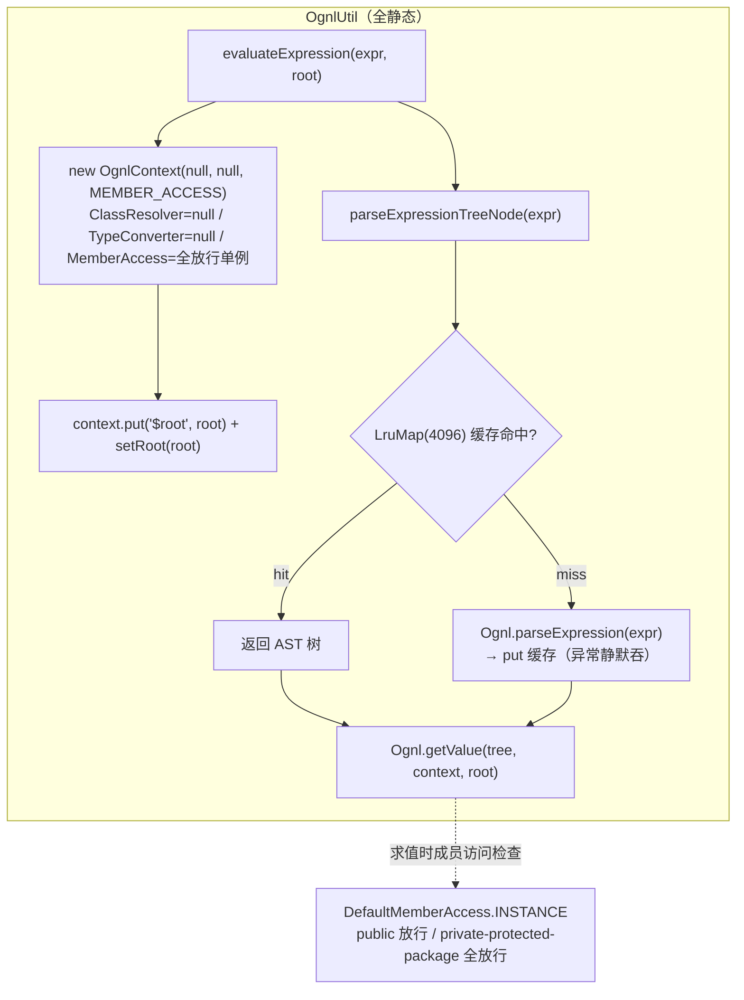

# i2f-extension-ognl

> OGNL 表达式桥接扩展（ognl `3.4.11` 以 provided+optional 引入）：仓库内最小的扩展模块之一，2 个源文件——`OgnlUtil` 提供 `LruMap(4096)` 表达式 AST 树缓存 + `evaluateExpression` 求值入口（root 双通道注入：`setRoot` + `#$root` 上下文变量），`DefaultMemberAccess` 提供**默认全放行**的 MemberAccess 单例（允许触达 private/protected 成员）。虽小却是 i2f 数据访问 DSL 的表达式引擎底座：`i2f-extension-xproc4j`（JDBC 存储过程脚本求值/预载/语法报告）、`i2f-jdk/i2f-jdbc-proxy-xml`（MyBatis mapper XML 的 OGNL inflate）与 `i2f-springboot-jdbc-bql-starter`（`@ConditionalOnClass` 条件装配）三条链路都依赖本模块。与 `i2f-extension-mybatis` 内嵌的 ognl 包（shaded `org.apache.ibatis.ognl` 版）是同源分叉复制品。

## 模块路径

- `i2f-extension/i2f-extension-ognl`
- 根 `pom.xml` `<module>` 登记（70 行）；`i2f-extension/pom.xml` 依赖管理（1165 行）；`i2f-extension/i2f-extension-all` 聚合依赖（233 行）

## 依赖

| 依赖 | 版本 | 作用域 | 说明 |
| --- | --- | --- | --- |
| `ognl:ognl` | 3.4.11（模块内硬编码） | provided + optional | 表达式引擎；provided+optional 保证运行期缺失时消费方可退避（配合 `@ConditionalOnClass`） |
| `i2f.turbo:i2f-lru-map` | - | compile | `LruMap` 表达式 AST 缓存载体 |
| `org.projectlombok:lombok` | - | compile | **源码零使用**（依赖冗余） |

运行期需调用方自带 ognl；缺失时消费链路以条件装配退避，不炸启动。

## 架构设计



- **求值链**：`evaluateExpression` 每次新建 `OgnlContext`（三参构造 `(ClassResolver, TypeConverter, MemberAccess)`，前两者传 null），root 同时以 `setRoot` 与 `$root` 变量双通道注入——表达式导航过程中 root 被改写后仍可用 `#$root` 回到原始根对象。
- **解析缓存**：`parseExpressionTreeNode` 先查 `EXPRESSION_MAP`（LruMap，容量 4096），未命中则 `Ognl.parseExpression`（昂贵操作）后回填缓存；缓存读写异常均空 catch 静默降级。
- **成员访问**：`DefaultMemberAccess` 实现 OGNL `MemberAccess` 三方法（setup 提权 + restore 回滚 + isAccessible 判定）；判定逻辑仅看 `Modifier`，`INSTANCE` 经无参构造 `this(true)` 落为**三级全放行**。

## 设计目的

- 把 OGNL 收拢为免配置的静态求值入口：调用方只面对 `evaluateExpression(expr, root)`，不接触 OgnlContext/MemberAccess 装配与表达式解析细节。
- AST 解析缓存：`Ognl.parseExpression` 是解析器级昂贵操作，DSL 场景（JDBC 存储过程脚本、mapper inflate）同一表达式反复求值，LruMap(4096) 缓存解析结果树；`parseExpressionTreeNode` 独立暴露供预热（xproc4j 的 ScriptPreload/GrammarReporter 用它预解析全脚本节点）。
- 全放行 MemberAccess：i2f 的 DSL/数据访问场景需要触达 DTO 私有字段与无 setter 属性，默认放行换取零配置——安全权衡被有意省略（见已知问题）。
- provided+optional 双保险：ognl 不进产物也不传递，运行期由消费方决定是否引入，配合 starter 的 `@ConditionalOnClass` 实现优雅退避。

## 功能清单

| 功能 | API | 说明 |
| --- | --- | --- |
| 表达式求值 | `OgnlUtil.evaluateExpression(String, Object)` | 新建 context + root 双通道注入 + 缓存树求值 |
| 表达式预解析 | `OgnlUtil.parseExpressionTreeNode(String)` | LruMap(4096) 缓存 AST 树，供预热/语法预检 |
| 缓存载体 | `OgnlUtil.EXPRESSION_MAP` | public static LruMap，可被外部清空/巡检 |
| 成员访问策略 | `DefaultMemberAccess.INSTANCE` | 全放行单例；另有布尔构造可定制三级放行 |
| 提权/回滚 | `setup` / `restore` | `setAccessible(true)` 提权并记录原状态，求值后回滚 |

## 使用示例

```java
// 基本求值（ognl 依赖由调用方 provided 提供）
Object name = OgnlUtil.evaluateExpression("user.name", params);
```

```java
// 嵌套导航 + 方法调用（MemberAccess 全放行，可触达私有成员）
Object ret = OgnlUtil.evaluateExpression("user.address.city.toUpperCase()", params);
```

```java
// $root 双通道：导航深入后仍可用 #$root 回到原始根对象
Object ret = OgnlUtil.evaluateExpression("items[0].owner == #$root.user", params);
```

```java
// 预热缓存（xproc4j ScriptPreloadEventListener 模式）：脚本加载期预解析全部 OGNL 节点
OgnlUtil.parseExpressionTreeNode(node.getTextBody());
```

```java
// 自定义访问策略（不用全放行单例）
DefaultMemberAccess safe = new DefaultMemberAccess(false, false, false);
OgnlContext ctx = new OgnlContext(null, null, safe);
```

## 特性总结

- **极小实现面**：2 文件约 120 行，静态入口零状态实例。
- **AST 缓存**：解析与求值分离，解析结果 LruMap 缓存 + 预解析 API 外露，DSL 批量脚本场景友好。
- **root 双通道**：`setRoot` + `#$root` 变量并存，导航改写根后可回溯。
- **优雅退避**：provided+optional 与消费方 `@ConditionalOnClass` 配合，ognl 缺失不阻断启动。
- **默认全放行**：私有/受保护成员可直达，换取 DSL 零配置表达力。

## 已知问题（静态识别，未实证）

1. **MemberAccess 默认全放行（安全面）**：`INSTANCE = new DefaultMemberAccess()` → 无参构造 `this(true)` → private/protected/package 三级全放行；字段初始化 `= false` 被构造器覆盖，语义易误读。表达式一旦来源于外部输入（DSL 脚本、mapper 属性），即构成 OGNL 表达式注入的完整触达面（`#this`/`@class@`/反射链），无白名单/黑名单/审计点。
2. **ClassResolver 传 null 且 ognl 无兜底**：`new OgnlContext(null, null, ...)` 的第一参 ClassResolver 为 null；经 javap 静态核对 ognl 3.4.2 字节码，`getClassResolver()` 直接 `getfield; areturn`，无 `DEFAULT_CLASS_RESOLVER` fallback——表达式一旦触达类解析路径（如 `@java.lang.String@format(...)` 静态成员、类名字符串转换），将以 NPE 失败。简单属性导航不受影响，属**功能覆盖缺口**。
3. **null 表达式行为未定义**：`parseExpressionTreeNode` 对 null 表达式跳过 trim 后直接 `get(null)` / `Ognl.parseExpression(null)`，后者在 ognl 内部抛 NPE/OgnlException，无前置校验与明确异常语义。
4. **缓存读写空 catch 吞异常**：两处 `catch (Exception e) {}` 全空——缓存层异常（并发修改、容量操作）静默吞掉，无日志无计数，排障盲区。
5. **共享 AST 树并发求值依赖 ognl 内部实现**：缓存命中后同一 Node 树被多线程并发 `getValue`，ognl 节点存在常量折叠等内部可变状态（如 `constantValueHasBeenCalculated`），只读并发安全性属实现细节而非官方契约，模块未做隔离或文档声明。
6. **缓存穿透口径**：`get` 返回 null 即判定 miss 并重复解析——当前 parse 结果非 null 故无害，但契约上「缓存 null 值」与「未命中」未区分。
7. **`evaluateExpression` 声明 `throws Exception`**：宽泛受检异常（OgnlException 等被泛化），调用方被迫整体 catch，异常分类能力丧失。
8. **isAccessible 语义弱化**：仅按 modifier 三分判定，不考察声明类与访问方类的可见性关系（同包/子类 protected 差异、跨包 package-private 等），与 OGNL 生态标准 MemberAccess（如 SecurityMemberAccess 的类关系校验）相比粒度粗。
9. **setup/restore 契约脆弱**：`restore` 对 `state` 硬转 `(Boolean)`、对 `member` 硬转 `(AccessibleObject)`——本类内自洽，但任何返回非 Boolean 的扩展实现即 CCE。
10. **`AccessibleObject.isAccessible()` 已废弃**：Java 9+ 标记废弃（替代 `canAccess`）；当前 jdk8 产物线可接受，升级线需迁移。
11. **提权残留风险**：`setup` 中 `setAccessible(true)` 是全局持久效果，依赖 ognl 在求值后成对调用 `restore` 回滚——异常路径的回滚保证属 ognl 实现细节，模块自身无兜底。
12. **公共静态可变缓存**：`EXPRESSION_MAP` 为 public static 可变对象，外部可清空/污染（put 假树），且容量 4096 无命中率统计面。
13. **与 mybatis 内嵌 ognl 包分叉重复**：`i2f-extension-mybatis` 内嵌同源 `OgnlUtil`/`DefaultMemberAccess`（shaded `org.apache.ibatis.ognl` 版），双份维护、双缓存（各自 4096），语义漂移风险；两版 OgnlContext 三参构造器签名经 javap 核对一致（`(ClassResolver, TypeConverter, MemberAccess)`）。
14. **依赖冗余**：lombok 声明于 pom 但源码零使用；ognl 的 provided+optional 双标记中 optional 与 provided 的不传递语义重叠（表达意图可读，技术上冗余）。

## 生态位置（消费方）

| 消费方 | 用途 |
| --- | --- |
| `i2f-extension/i2f-extension-xproc4j` | JDBC 存储过程 DSL：`DefaultJdbcProcedureExecutor` 求值脚本表达式、`ScriptPreloadEventListener` 预解析预热、`DefaultGrammarReporter` 语法预检、`LangEvalJavaNode` 生成代码 import 引用 |
| `i2f-jdk/i2f-jdbc-proxy-xml` | `OgnlMybatisMapperInflater` 在 mapper XML inflate 时求值 OGNL 脚本片段 |
| `i2f-springboot/i2f-springboot-jdbc-bql-starter` | `JdbcProxyAutoConfiguration` 以 `@ConditionalOnClass({OgnlMybatisMapperInflater, OgnlUtil, Ognl})` 条件装配，ognl 缺失时退避 |
| 平行分叉 | `i2f-extension-mybatis` 内嵌 shaded ognl 版同名类（`i2f.extension.mybatis.ognl`），供 MyBatis 拦截器内部求值 |
