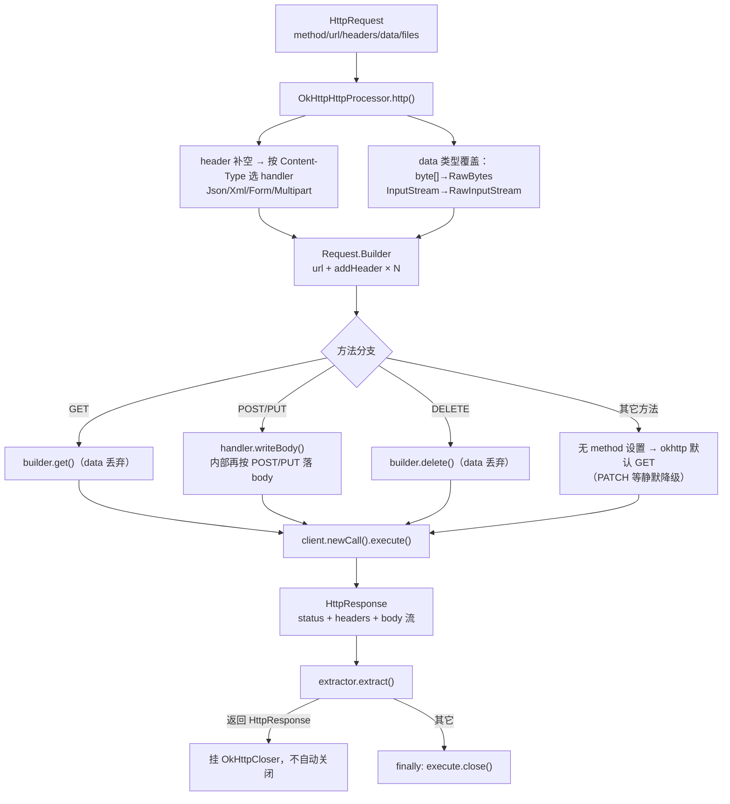

# i2f-extension-okhttp

> OkHttp HTTP 客户端桥接扩展（okhttp `4.9.3` 以 provided 引入）：`i2f-network` 的 `IHttpProcessor` 统一 HTTP 契约在 OkHttp 上的适配实现。核心 `OkHttpHttpProcessor` 把 i2f 的 `HttpRequest`（URL/方法/头/表单/JSON/XML/raw/文件清单）翻译为 okhttp `Request` 并同步执行，按 Content-Type 分派 6 个 `RequestBodyHandler`（表单/JSON/XML/Multipart/RawBytes/RawInputStream），响应以 `HttpResponse`（状态码 + 头 + body 流）回吐，`OkHttpCloser` 托管连接释放。8 个主源文件（handler 族 2022 年、Processor 2026 年封装），零测试，仓库内无源码级消费方（仅 i2f-extension-all 聚合）。

## 模块路径

- `i2f-extension/i2f-extension-okhttp`
- 根 `pom.xml` `<module>` 登记（71 行）；`i2f-extension/pom.xml` 依赖管理（1170 行）；`i2f-extension/i2f-extension-all` 聚合依赖（237 行）

## 依赖

| 依赖 | 版本 | 作用域 | 说明 |
| --- | --- | --- | --- |
| `com.squareup.okhttp3:okhttp` | 4.9.3（模块内硬编码） | provided | okhttp 4.x 为 Kotlin 库，随附 kotlin-stdlib 传递依赖 |
| `i2f.turbo:i2f-network` | - | compile | 契约与数据模型：`IHttpProcessor`/`HttpRequest`/`HttpResponse`/`HttpHeaders`/`MultipartFile`/`HttpUtil`/常量 |
| `i2f.turbo:i2f-io-file` | - | compile | `StreamUtil.readBytes`（multipart 与 raw 流读取） |
| `i2f.turbo:i2f-form-url-encoded` | - | compile | `FormUrlEncodedEncoder.toForm` 表单编码 |
| `org.projectlombok:lombok` | - | compile | `@Data`/`@NoArgsConstructor`（Processor 可注入 client 与序列化器） |

运行期需调用方自带 okhttp 4.9.3；客户端实现可按 `IHttpProcessor` 契约与 JDK 版互换。

## 架构设计



- **handler 分派**：先按请求头 Content-Type 选 Json/Xml/Form/Multipart handler，再按 data 运行时类型覆盖（byte[]→RawBytes、InputStream→RawInputStream）；各序列化 handler 内部又内嵌 raw 类型转发，与 Processor 层分派形成双重冗余。
- **方法处理**：GET→`builder.get()`、DELETE→`builder.delete()`（均丢弃 data）；POST/PUT 交给 handler 落 body；其余方法（PATCH/HEAD 等）未处理——okhttp `Request.Builder` 默认方法为 GET，**静默降级**。
- **响应生命周期**：`extractor.extract(response)` 返回 `HttpResponse` 类型时挂 `OkHttpCloser`（内部持 `Response`，close 幂等置空）交调用方释放；否则 finally 立即 `execute.close()`，防止连接滞留。
- **客户端注入**：字段 `client` 默认 `createClient()`（连接 30s/读 5min），支持构造器或 setter 注入外部共享 OkHttpClient 以复用连接池。

## 设计目的

- 用 OkHttp 替换 i2f-network 默认的 JDK `HttpURLConnection` 实现：获得连接池复用、HTTP/2、更优的超时与 TLS 栈，同时保持 `IHttpProcessor` 契约不变，调用方零改动切换。
- Content-Type 驱动的请求体策略内聚在 handler 族：JSON/XML 序列化器可注入替换（`IJsonSerializer`/`IXmlSerializer` 字段 + lombok setter），表单/Multipart/raw 各自独立可复用。
- 以 okhttp 原生对象为桥接终点（`Request.Builder` 直通 handler），保留 okhttp 全部原生能力（拦截器、DNS、缓存）由注入的 client 承载。

## 功能清单

| 功能 | API | 说明 |
| --- | --- | --- |
| 统一执行入口 | `OkHttpHttpProcessor.http(HttpRequest, IHttpResponseExtractor<T>)` | 契约方法，同步执行 |
| 客户端构建 | `createClient()` | 连接 30s / 读 5min 的默认 OkHttpClient |
| 客户端注入 | 构造器 / `setClient(OkHttpClient)` | 外部单例共享连接池 |
| 表单体 | `OkHttpFormRequestBodyHandler` | `FormUrlEncodedEncoder.toForm(data)`，byte[]/InputStream 转发 raw |
| JSON 体 | `OkHttpJsonRequestBodyHandler` | 注入 `IJsonSerializer` 序列化 |
| XML 体 | `OkHttpXmlRequestBodyHandler` | 注入 `IXmlSerializer` 序列化 |
| Multipart 体 | `OkHttpMultipartFormRequestBodyHandler` | data（Map/bean）普通字段 + `request.getFiles()` 文件清单（全量读内存） |
| 原始字节体 | `OkHttpRawBytesRequestBodyHandler` | `(byte[]) data` 直传 |
| 原始流体 | `OkHttpRawInputStreamRequestBodyHandler` | 流全量 readBytes 后直传（非真流式） |
| handler 契约 | `IOkHttpHttpRequestBodyHandler` | `IHttpRequestBodyHandler<Request.Builder>` 的 okhttp marker 扩展 |

## 使用示例

```java
// 1) 注入 okhttp 依赖（模块 provided，需调用方自带 4.9.3）
// 2) 基本用法：与 JDK 版 IHttpProcessor 可互换
OkHttpHttpProcessor processor = new OkHttpHttpProcessor();
```

```java
// POST JSON
HttpRequest request = new HttpRequest();
request.setMethod("POST");
request.setUrl("https://api.example.com/user");
request.getHeader().addHeader("Content-Type", "application/json");
request.getData().toString(); // 占位：data 为任意可 JSON 化对象
HttpResponse resp = processor.http(request, new HttpResponseExtractor());
```

```java
// 共享 client（推荐：复用连接池）
OkHttpClient shared = new OkHttpClient.Builder()
        .connectTimeout(5, TimeUnit.SECONDS)
        .readTimeout(60, TimeUnit.SECONDS)
        .build();
OkHttpHttpProcessor processor = new OkHttpHttpProcessor(shared);
```

```java
// Multipart 文件上传
HttpRequest request = new HttpRequest();
request.setMethod("POST");
request.setUrl("https://api.example.com/upload");
request.getHeader().addHeader("Content-Type", "multipart/form-data");
request.setFiles(Arrays.asList(new MultipartFile("file", "a.png", inputStream)));
HttpResponse resp = processor.http(request, extractor);
```

```java
// 替换序列化器（lombok setter 注入）
processor.setJsonSerializer(myJsonSerializer);
```

## 特性总结

- **契约可插拔**：实现 i2f `IHttpProcessor`，与 JDK 版实现互换零成本；okhttp 依赖 provided+调用方自带。
- **连接池复用**：支持注入外部共享 OkHttpClient（构造器/setter），连接池与线程池随 client 复用。
- **序列化器可替换**：JSON/XML handler 的序列化器为可注入字段。
- **响应生命周期托管**：`OkHttpCloser` 幂等 close + 「返回 HttpResponse 则移交所有权，否则 finally 自关」的双模释放。
- **类型分派双通道**：Content-Type 选型 + data 运行时类型覆盖，raw 优先级最高。

## 已知问题（静态识别，未实证）

1. **缺 Content-Type 头即 NPE（最关键）**：`http()` 中 `contentType.contains(...)` 前未判空，而 `HttpHeaders.getFirstHeader` 无值时返回 null（已核对 i2f-network 源码）——POST 不带 Content-Type 头（常见默认场景）直接 NPE，无任何兜底或默认表单回退。
2. **请求级超时被默认 client 架空**：`request.getConnectTimeout()/getReadTimeout()`（毫秒，i2f-network 契约）仅在 `client == null` 分支生效；默认构造 `client = createClient()` 恒非空，该分支几乎不可达——除非手动 `setClient(null)`，请求级超时**永不生效**；且该分支每次请求新建 OkHttpClient（连接池不复用、资源放大）。
3. **PATCH/HEAD/OPTIONS 静默降级为 GET**：方法分支只处理 GET/POST/PUT/DELETE，其余方法未调用 `builder.method(...)`——okhttp `Request.Builder` 默认方法 GET，PATCH 语义完全丢失且 body 静默丢弃。
4. **DELETE/GET 的 data 静默丢弃**：`builder.delete()`/`builder.get()` 不带 body，请求 data 无提示忽略（RFC 允许 DELETE 携带 body）。
5. **「流式」上传实为全量内存**：`OkHttpRawInputStreamRequestBodyHandler` 与 Multipart 文件均 `StreamUtil.readBytes(is, true)` 全量读入 byte[]——大文件上传 OOM 风险；okhttp 原生支持流式 RequestBody 未使用；流被读完关闭，调用方不可复用。
6. **handler 与 Processor 双重 raw 分派冗余**：Processor 已按 data 类型覆盖 handler，各序列化 handler 内又内嵌 `new OkHttpRawBytes/InputStreamRequestBodyHandler()` 转发——逻辑重复且每次转发新建实例。
7. **multipart 普通字段语义损失**：非字符串值 `String.valueOf` 平铺（嵌套对象/List 变 toString 串），null 值变空串；无 JSON 化或深度编码选项。
8. **文件 part Content-Type 硬编码**：统一 `application/octet-stream`，不探测类型、不支持 per-file Content-Type。
9. **raw handler 无类型守卫**：`(byte[]) data`/`(InputStream) data` 直接强转、`request.getHeader().getContentType()` 不判空——Processor 调用路径下安全，独立调用（handler 直接使用）即 CCE/NPE。
10. **响应头大小写规范化差异**：okhttp `headers().toMultimap()` 的 key 大小写与 JDK 版 IHttpProcessor 实现可能不一致，跨实现切换时按头名取值的调用方行为漂移风险。
11. **所有权移交契约脆弱**：`extractor.extract` 返回 `HttpResponse` 时挂 closer 的前提是返回的即传入 response（流在其上）；extractor 若返回新建异构实例，closer 挂错对象、原流随 finally 关闭——全靠 extractor 契约自觉，无校验。
12. **默认 client 配置面窄**：`createClient()` 仅设连接/读超时，无写超时（okhttp 默认 10s，慢速大上传可能触发）、callTimeout、重试与拦截器扩展点。
13. **入参副作用**：`http()` 内 `request.setHeader(HttpHeaders.create())` 直接改写调用方传入的 request 对象。
14. **GET/DELETE 场景的手设 Content-Type 无效但保留**：okhttp BridgeInterceptor 仅在 body != null 时以 `body.contentType()` 覆盖 Content-Type 头——无 body 方法手设头原样发出（无意义）；有 body 时手设头被 body MediaType 覆盖（multipart 场景恰好正确注入 boundary，但用户自定义 charset 等头参数会被替换）。
15. **命名瑕疵**：`IOkHttpHttpRequestBodyHandler` 双 `Http` 冗余（IOkHttpHttpRequestBody），且为无方法 marker 接口。
16. **零测试**：无任何 JUnit/手工 main 测试，okhttp 分派矩阵（4 方法 × 6 handler × raw 覆盖）全靠人工回归。

## 生态位置（消费方）

- 仓库内**无源码级消费方**：仅 `i2f-extension-all` 聚合打包，属「按需引入」的客户端适配器。
- 与 `i2f-network` 的 JDK 版 `IHttpProcessor` 实现平行：调用方按 classpath 引入 okhttp + 本模块即可切换实现，API 层不变。
