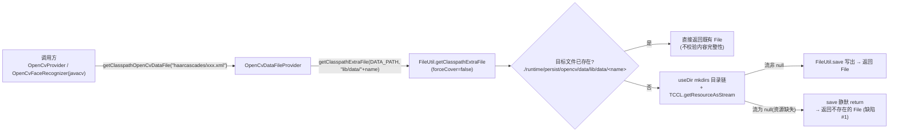
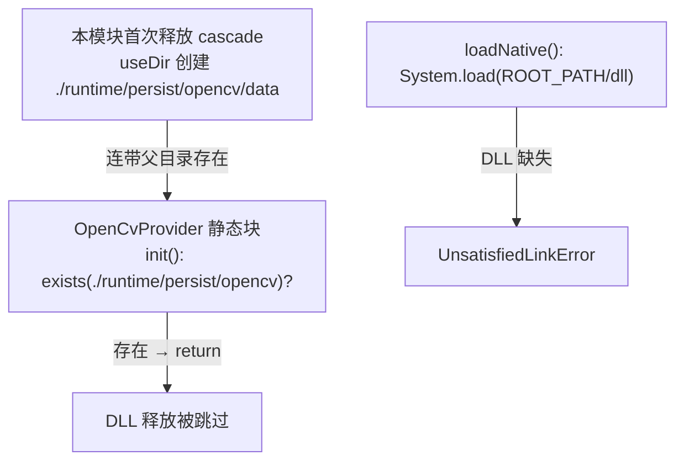

# i2f-extension-opencv-data

> OpenCV 训练数据资源模块：仓库内最小的扩展模块之一，**单类 `OpenCvDataFileProvider`（26 行）+ 35 个 OpenCV 官方级联分类器 XML**（约 25MB）。Java 侧唯一职责是把 classpath 下 `lib/data/**` 的级联分类器资源释放到工作目录 `./runtime/persist/opencv/data`（`FileUtil.getClasspathExtraFile` 幂等释放契约：已存在直接复用、不存在才解压写出）并返回 `File`，供 `CascadeClassifier` 加载。它是 `i2f-extension-opencv`（原生 OpenCV 桥接）与 `i2f-extension-opencv-javacv`（JavaCV 桥接，人脸识别 LBPH）两个功能模块的**共享数据底座**；另附带承载原生库引导路径常量 `ROOT_PATH`（`OpenCvProvider` 以此定位 DLL 释放目录）。

## 模块路径

- `i2f-extension/i2f-extension-opencv-data`
- 根 `pom.xml` `<module>` 登记（73 行）；`i2f-extension/pom.xml` 依赖管理（1180 行）；`i2f-extension/i2f-extension-all` 聚合依赖（245 行）

## 依赖

| 依赖 | 版本 | 作用域 | 说明 |
|---|---|---|---|
| `org.projectlombok:lombok` | 父 POM 管理 | compile | **源码零使用，冗余声明** |
| `i2f.turbo:i2f-std-const` | 同版本 | compile | `StdConst.RUNTIME_PERSIST_DIR`（`runtime/persist`） |
| `i2f.turbo:i2f-io-file` | 同版本 | compile | `FileUtil.getClasspathExtraFile` 资源释放契约 |

- 本模块**无 OpenCV 依赖**——纯数据+工具类，不触碰任何 `org.opencv.*` API。

## 资源清单（src/main/resources，约 25MB）

| 目录 | 数量 | 大小 | 内容 |
|---|---|---|---|
| `lib/data/haarcascades/` | 19 | ≈10.3MB | Haar 级联 CPU 版：眼/猫脸/正脸（default/alt/alt2/alt_tree）/全身/下身/上身/微笑/俄文车牌（licence+license 双拼写）/左眼右眼 2splits/侧脸/眼眼镜 |
| `lib/data/haarcascades_cuda/` | 13 | ≈14.5MB | Haar 级联 CUDA 版（`CascadeClassifier_cuda` 专用格式，CPU 部署完全冗余） |
| `lib/data/hogcascades/` | 1 | 134KB | 行人检测 `hogcascade_pedestrians.xml` |
| `lib/data/lbpcascades/` | 5 | 342KB | LBP 级联：正脸/improved/侧脸/猫脸/银器 |

- 打包插件：父 POM 的 `maven-assembly-plugin`（随父配置打包）。
- **注意**：本模块 resources 只有 `lib/data/**` XML，**不含任何 DLL/so**——`OpenCvProvider` 期望的 `lib/opencv_java430_*.dll` 并不在本模块（见已知问题 #12）。

## 架构设计



跨模块交互（DLL 引导短路缺陷，见 #11）：



## 设计目的

1. **数据与代码分离**：约 25MB 级联数据独立成模块，只有需要人脸/行人检测能力的应用才引入，避免 OpenCV 桥接模块被数据体积绑架。
2. **classpath → 磁盘释放**：OpenCV `CascadeClassifier` 只接受文件路径，jar 内资源必须先落盘；`FileUtil.getClasspathExtraFile` 的幂等释放（存在即复用）让多次调用只付一次 IO。
3. **双桥接共享**：原生 OpenCV（`i2f-extension-opencv`）与 JavaCV（`i2f-extension-opencv-javacv`）走同一数据源、同一磁盘布局，避免双份释放。
4. **统一运行时持久目录**：路径常量锚定 `StdConst.RUNTIME_PERSIST_DIR`，与 ocr-tesseract（`./runtime/persist/tesseract/ocr`）等自备引导模块同一目录约定。

## 功能清单

| 成员 | 类型 | 职责 |
|---|---|---|
| `ROOT_PATH` | 常量 | `./runtime/persist/opencv`（DLL 释放目录 + 数据根目录） |
| `DATA_PATH` | 常量 | `ROOT_PATH + "/data"`（cascade 释放根目录） |
| `getClasspathOpenCvDataFile(String)` | 静态方法 | 把 classpath `lib/data/<name>` 幂等释放到 `DATA_PATH/lib/data/<name>` 并返回 `File`；`IOException` 裸包装为 `RuntimeException` |

- 释放契约（`FileUtil.getClasspathExtraFile`，forceCover=false）：目标存在 → 直接返回旧文件；不存在 → TCCL 加载资源 + `FileUtil.save` 写出；**资源不存在时 save 对 null 流静默返回，最终返回一个不存在的 File**。
- 路径反斜杠：传给 OpenCV 前需 `getAbsolutePath()`，本模块返回 `File` 不做平台归一。

## 用法示例

```java
// 1. 直接加载某个级联分类器（首次调用释放，之后复用磁盘文件）
File xml = OpenCvDataFileProvider.getClasspathOpenCvDataFile("haarcascades/haarcascade_frontalface_default.xml");
CascadeClassifier classifier = new CascadeClassifier(xml.getAbsolutePath());
```

```java
// 2. i2f-extension-opencv 高层 API 内部即走本模块（用户无感）
List<Rectangle> faces = OpenCvProvider.detectFrontFace(new File("photo.jpg"));
// detectMultiScale 内部: getClasspathOpenCvDataFile("haarcascades/haarcascade_frontalface_alt.xml")
```

```java
// 3. JavaCV 人脸识别器默认分类器同样来自本模块
OpenCvFaceRecognizer recognizer = new OpenCvFaceRecognizer();
// 字段初始化即: getClasspathOpenCvDataFile("haarcascades/haarcascade_frontalface_default.xml")
```

```java
// 4. 换用其他检测器（行人/眼睛/微笑等，全部内置于本模块资源）
File body = OpenCvDataFileProvider.getClasspathOpenCvDataFile("haarcascades/haarcascade_fullbody.xml");
File eye = OpenCvDataFileProvider.getClasspathOpenCvDataFile("haarcascades/haarcascade_eye.xml");
File lbp = OpenCvDataFileProvider.getClasspathOpenCvDataFile("lbpcascades/lbpcascade_frontalface.xml");
```

```java
// 5. 自定义检测器文件也可借用释放契约（同一方法，任意 lib/data 下资源）
File custom = OpenCvDataFileProvider.getClasspathOpenCvDataFile("lbpcascades/lbcascade_silverware.xml");
```

## 特性总结

- **单类零状态**：全静态 API、无常量外可变状态，线程安全的「读 classpath + 幂等落盘」。
- **约 25MB 内置数据**：OpenCV 官方 cascade 全家桶（Haar CPU/CUDA + HOG + LBP）随 jar 分发，离线可用。
- **幂等释放**：`forceCover=false` 语义下多次调用只释放一次，热重启零 IO。
- **双桥接共享底座**：opencv / opencv-javacv / i2f-tools-face-recognizer（测试）三方复用同一数据与磁盘布局。
- **与 tesseract 同构的自备引导约定**：运行时目录 `./runtime/persist/*` 统一锚定 `StdConst`。

## 已知问题（静态识别，未实证）

1. **资源缺失静默黑洞（核心缺陷）**：资源名拼错/未打包时 `getResourceAsStream` 返回 null，`FileUtil.save` 首行 `if (is == null || ...) return` 静默跳过，方法返回**不存在的 File**——调用方（`CascadeClassifier`）报「文件打不开」而非「资源缺失」，排障信息完全失真；本模块无任何资源存在性校验或引导提示（对比 ocr-tesseract 的引导异常设计）。
2. **首次释放非原子、残缺永久化**：写出中途 IO 失败留下残缺 XML，下次 `!exists()` 判定 false 直接返回残缺文件，无 forceCover 重试/无完整性校验（如字节数/MD5）——**一次故障永久污染**。
3. **并发释放竞态**：多线程/多进程首次同时释放同一资源，无锁、无临时文件+原子 rename，可能交错写出损坏文件；与 #2 叠加后果放大。
4. **释放目录四级冗余嵌套**：落盘路径为 `./runtime/persist/opencv/data/lib/data/<目录>/<文件>`——`data/lib/data` 双前缀复制了 classpath 包路径，未扁平化。
5. **相对路径工作目录耦合**：`./runtime/persist/opencv` 依赖进程工作目录，工作目录漂移导致重复释放或找不到已释放文件（多服务同机部署互相不可见）。
6. **TCCL 强依赖**：`Thread.currentThread().getContextClassLoader()`，TCCL 为 null 或非预期类加载器（容器/反序列化线程）时资源加载失败，且因 #1 静默。
7. **异常裸包装**：`IOException → RuntimeException`，异常类型语义丢失、无引导文案。
8. **参数命名误导**：`fontFaceXmlName`（字体？）实为级联分类器 XML 名——复制粘贴痕迹，误导调用方。
9. **lombok 冗余依赖**：pom 声明但 26 行源码零使用。
10. **CUDA 版数据全量打包**：`haarcascades_cuda/` 13 个文件约 14.5MB（占模块体积 58%）为 CUDA 专用格式，纯 CPU 部署完全冗余且无法被 CPU `CascadeClassifier` 有效使用，无 profile/依赖粒度可裁剪。
11. **跨模块交互缺陷——cascade 释放短路 DLL 引导**：本模块首次释放 cascade 时 `useDir` 创建 `./runtime/persist/opencv/data`（连带父目录存在），而 `OpenCvProvider.init()` 以 `releaseDir.exists()` 判断是否释放 DLL——**只要 cascade 先释放过，`init()` 即短路 return，DLL 永不释放**，随后 `loadNative()` 对缺失 DLL `System.load` 抛 `UnsatisfiedLinkError`。
12. **DLL 资源根本不在 classpath**：`OpenCvProvider.CLASS_PATHS` 找 `lib/opencv_java430_x64.dll`，但本模块 resources 只有 `lib/data/**`，opencv 模块 resources 只有 `opencv-430.jar`——DLL 释放链本就空转；且 `init()` 中 `FileUtil.save(is,...)` 后直接 `is.close()`，null 流场景（DLL 资源缺失）**NPE**。（缺陷主体在 i2f-extension-opencv，此处记录交互事实）
13. **官方数据双拼写冗余**：`haarcascade_licence_plate_rus_16stages.xml`（89KB）与 `haarcascade_license_plate_rus_16stages.xml`（47KB）并随 jar 打包（OpenCV 官方历史遗留）。
14. **构造即 IO 的消费方放大**：`OpenCvFaceRecognizer`（javacv）字段初始化直接调本方法——任何场景 new 该类都会触发 25MB 数据模块的落盘（即便只想用 LBPH 不想用默认 Haar）。

## 生态位置

| 消费方 | 依赖声明 | 用法 |
|---|---|---|
| `i2f-extension-opencv` | pom 直接依赖 | `OpenCvProvider`：ROOT_PATH 定位 DLL 释放目录；detect 系列经 `getClasspathOpenCvDataFile` 加载 cascade |
| `i2f-extension-opencv-javacv` | pom 直接依赖 | `OpenCvFaceRecognizer` 默认 classifier；测试 `TestOpenCvFaceRecognizer` / `TestRawFaceRecognize` |
| `i2f-tools/i2f-tools-face-recognizer` | （无直接声明，测试引用） | `TestOpenCvFaceRecognizer` 引用 `getClasspathOpenCvDataFile` |

- 本模块自身无 OpenCV 运行时依赖、无测试、无源码级间接消费方；`i2f-extension-all` 聚合引入。
- 与 `i2f-extension-ocr-tesseract` 同属「官方模型/数据资源 + 运行时目录自备引导」范式的数据模块（tesseract 需用户下载 traineddata，本模块数据内置）。
