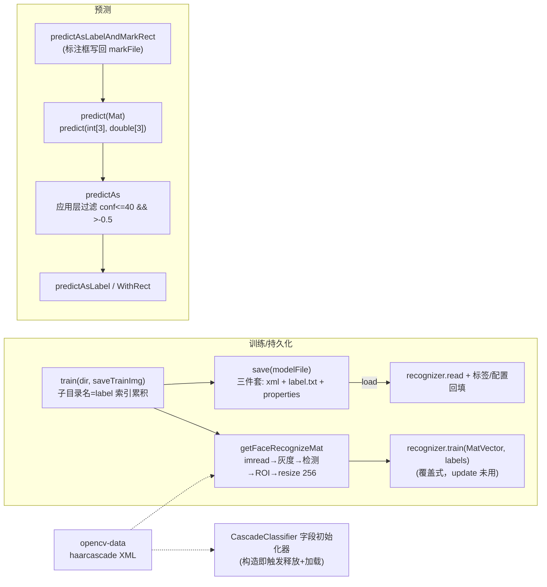

# i2f-extension-opencv-javacv

> JavaCV 桥接的人脸检测与识别扩展（javacv `1.5.9` + javacv-platform `1.5.9` 双依赖以 provided 引入，各裁掉 11 个无关 platform 组件仅留 OpenCV 线，绑定 OpenCV 4.7.0）：单主类 `OpenCvFaceRecognizer`（392 行，`@Data`/`@NoArgsConstructor`/`Closeable`）封装「目录约定训练 + LBPH 识别」门面——训练/测试数据按「子目录名=label，目录内文件=人脸图」组织，模型持久化为三件套（`*.xml` 模型 + `*.label.txt` 标签 + `*.properties` 配置），预处理链统一为 `imread → 灰度 → CascadeClassifier.detectMultiScale 取第一个脸 ROI → resize 256×256`，识别引擎默认 `LBPHFaceRecognizer.create()`，置信度判定为应用层后置过滤（`confidenceLimit<=40 && >-0.5`）。级联 XML 来自 `i2f-extension-opencv-data`（共享数据底座）。1 主源文件 + 2 个 main 型测试，仓库内唯一源码级消费方为 `i2f-tools-face-recognizer`（可执行工具壳，把本模块测试类原样复制进自身 main 源集）。

## 模块路径

- `i2f-extension/i2f-extension-opencv-javacv`
- 根 `pom.xml` `<module>` 登记（74 行）；`i2f-extension/pom.xml` 依赖管理（1185 行）；`i2f-extension/i2f-extension-all` 聚合依赖（249 行）

## 依赖

| 依赖 | 版本 | 作用域 | 说明 |
|---|---|---|---|
| org.bytedeco:javacv | 1.5.9 | provided | JavaCV 门面（模块内硬编码版本），绑定 OpenCV 4.7.0 |
| org.bytedeco:javacv-platform | 1.5.9 | provided | 全平台 native 汇总，排除 ffmpeg/flycapture/libdc1394/libfreenect(2)/librealsense(2)/videoinput/artoolkitplus/tesseract/leptonica 共 11 项 |
| i2f.turbo:i2f-extension-opencv-data | - | compile | 级联分类器 XML 释放底座（haarcascade_frontalface_default 等） |
| i2f.turbo:i2f-io-file | - | compile | `FileUtil.useParentDir` 模型目录 mkdirs |
| i2f.turbo:i2f-std-const | - | compile | `RUNTIME_PERSIST_DIR`（测试用） |
| org.projectlombok:lombok | - | provided | `@Data`/`@NoArgsConstructor` |

## 架构设计



- **识别管线**（`getFaceRecognizeMatWithRect`）：`imread` → `clone` → `cvtColor(BGR2GRAY)` → `detectMultiScale` → 命中则取 `arr[0]` ROI 并 `grayMat.close()`，未命中则整图充当 submat → `resize(submat, submat, 256×256)`；返回 `Mat + Rectangle`（未命中 rect=null）
- **标签管理**：`labelNameList` 索引 ↔ 名称映射，train 时 `indexOf` 复用或 `size()` 新增；持久化与模型文件同名派生（`getModelLabelFile`/`getModelProprtiesFile`）
- **预测层级**：`predict`（原始 labels/confidences 数组）→ `predictAs`（应用层置信度过滤，不过则返回 null）→ `predictAsLabel`/`predictAsLabelWithRect`/`predictAsLabelAndMarkRect`（后者 `opencv_imgproc.rectangle` 标注并 `imwrite` 写回）
- **资源生命周期**：`Closeable.close()` 关闭 recognizer 与 classifier；Mat 实例手动 close（无 try-finally）

## 设计目的

- 在 `i2f-extension-opencv`（原生桥接，仅检测）之外提供**可训练的人脸识别**能力，选型 JavaCV（bytedeco）获得跨平台 native 自动引导（javacv-platform），替代手放 DLL 的自引导方式
- 以**目录约定**降低训练成本：不用任何配置文件即可按文件夹组织训练/测试集；`non-` 前缀目录表示"非此人"负测试样本
- 以**三件套模型文件**把模型、标签映射、预处理参数（width/height/confidence.limit）一并持久化，训练与识别可跨进程分离

## 功能清单

| 方法 | 功能 |
|---|---|
| `train(File[, boolean])` | 按目录结构训练 LBPH 模型（可选导出 `.train.png` 调试图） |
| `test(File[, boolean])` | 按目录结构批量预测并 System.out 输出对比结果（`non-` 前缀目录为负样本） |
| `save(File)` / `load(File)` | 模型三件套持久化/恢复（labels.txt UTF-8 逐行、properties 存 width/height/confidence.limit） |
| `predict(File/Mat)` | 返回 `(int[3] labels, double[3] confidences)` 原始预测 |
| `predictAs(File/Mat)` | 应用层置信度过滤（<=40 且 >-0.5），不过返回 `(null, conf)` |
| `predictAsLabel(File)` | 直接返回人名字符串（或 null） |
| `predictAsLabelWithRect(File)` | 返回 `(label, 脸部矩形)` |
| `predictAsLabelAndMarkRect(File, File)` | 预测并在原图上以红色矩形标注后写出 markFile |
| `getFaceRecognizeMat(File/Mat)` / `WithRect` | 预处理管线（灰度/检测/ROI/resize），供扩展复用 |
| `close()` | 释放 recognizer 与 classifier（native 句柄） |

## 用法示例

```java
// 1. 默认构造（字段初始化器即从 opencv-data 释放并加载 haarcascade）
OpenCvFaceRecognizer recognizer = new OpenCvFaceRecognizer();

// 2. 按目录约定训练：trained/tom/*.png、trained/jack/*.png
recognizer.train(new File("./runtime/persist/trained"));

// 3. 模型三件套持久化：face.xml / face.label.txt / face.properties
recognizer.save(new File("./runtime/persist/models/face.xml"));

// 4. 跨进程恢复后识别
OpenCvFaceRecognizer r2 = new OpenCvFaceRecognizer();
r2.load(new File("./runtime/persist/models/face.xml"));
Map.Entry<String, Double> hit = r2.predictAs(new File("photo.jpg"));
if (hit.getKey() != null) {
    System.out.println("识别为: " + hit.getKey() + " conf=" + hit.getValue());
}

// 5. 识别 + 标注框写回
Map.Entry<String, Rectangle> marked = r2.predictAsLabelAndMarkRect(
        new File("in.jpg"), new File("out.mark.png"));

// 6. 自定义检测器/识别引擎（Fisher/Eigen 可替换 LBPH）
CascadeClassifier c = new CascadeClassifier(xmlPath);
OpenCvFaceRecognizer r3 = new OpenCvFaceRecognizer(c);
```

```bash
# 工具壳消费方（i2f-tools-face-recognizer）以 main.class 运行：
# load-or-train → 批量 test ./runtime/persist/testing → 标注指定文件
```

## 特性总结

- **零配置训练协议**：目录名即标签、文件即样本、`non-` 前缀即负样本，训练/测试/预测共用同一套预处理
- **模型三件套**：模型本体、标签映射、预处理参数分离持久化，标签以索引 ↔ 行号对应
- **置信度语义**：LBPH 越小越像，应用层 `confidenceLimit`（默认 40）+ 有效性下界 `-0.5`（未预测填充值 -1.0 的判别）双重判定
- **可插拔引擎**：classifier/recognizer 均可注入替换（javadoc 注明可换 Fisher 及其他检测级联）
- **裁剪依赖**：javacv-platform 排除 11 项无关组件，native 产物体积收敛到 OpenCV 线

## 已知问题（静态识别，未实证）

- **标签文件名双分支不一致**：`getModelLabelFile` 无扩展名 fallback 生成 `xxx.labels.txt`（复数），有扩展名生成 `xxx.label.txt`（单数）；类 javadoc 写 `test.labels.txt` 与实现矛盾——同模型两种命名并存，跨工具互操作性混乱
- **`test()` 标签越界**：未预测时 labels/confidences 填充 -1，`labelNameList.get(entry.getKey())` 与 `get(preLabel)` 均未守卫 -1 → `IndexOutOfBoundsException`（`predictAs` 有置信度守卫间接规避，test 无）
- **无脸静默整图**：未检测到人脸时整图灰度直接 resize 参与训练/预测（负样本语义伪装），rect=null 但多数调用方忽略——错图/无人脸图片静默产出错误标签
- **重复 train 覆盖模型但标签累积**：javap 证实 `train`（覆盖）与 `update`（增量）是独立 API，本模块仅用 train；再次 `train` 后模型重建而 `labelNameList` 保留旧索引 → 跨目录训练时标签错位；load 后 train 同理
- **构造即 IO 的字段初始化器**：`classifier` 字段初始化触发 opencv-data 资源释放 + 级联加载（叠加其资源缺失静默黑洞缺陷：`imread` 空 classifier 延迟到 detectMultiScale 才报错）；`@NoArgsConstructor` 无法延迟/绕开
- **`clone()` 冗余分配**：`getFaceRecognizeMatWithRect` 中 `mat.clone()` 的结果立刻被 `cvtColor` 覆盖重分配（目标类型不同必重分配），白白多一次全图分配拷贝
- **Mat 异常路径泄漏**：train 中 `getFaceRecognizeMat` 抛异常时 matList/vector/labelMat 不释放；`predictAsLabelAndMarkRect` 的 mat/submat 无 try-finally
- **取脸策略硬编码**：多人脸图片只取 `arr[0]`（OpenCV 顺序即扫描序，非最大脸），其余静默丢弃
- **置信度魔数双份**：`test()` 硬编码 `<=40 && >-0.5`，`predictAs` 用 `confidenceLimit` 字段 + 同一 `-0.5` 魔数；LBPH 自带 `setThreshold`（javap 证实）未使用——模型层无阈值，误识全靠应用层过滤
- **imread 失败静默**：坏图/缺失文件返回空 Mat 继续走管线（检测/训练空数据，LBPH train 空集断言崩溃或产出空模型）
- **模型半程状态**：`load` 中 `recognizer.read` 成功而 label/properties 文件缺失时抛 FileNotFoundException——模型已加载但标签缺失，索引/名称错位；且 `labelNameList` 不清空，重复 load 累积重复行
- **properties 解析无校验**：`Integer.valueOf`/`Double.valueOf` 坏值直接 NumberFormatException；`getModelProprtiesFile` 方法名拼写错误（Proprties），其无扩展名 fallback 与主分支结果相同（冗余）
- **生命周期/并发**：`@Data` 生成的 setter 可替换 classifier/recognizer 但旧实例不 close（native 句柄泄漏）；close 后复用无守卫；可变字段 + native 对象非线程安全且无同步
- **工程瑕疵**：`test()` 以 System.out 输出结果（工具方法带 IO 副作用）；`import java.util.Arrays` 与 `java.util.*` 冗余并存；两个 main 型测试硬编码路径（`s7/4.pgm`、`./runtime/persist/trained`），`TestRawFaceRecognize` 的 `listFiles()` 未判空（mkdirs 失败 NPE）、流手动 close 无 try-with-resources

## 生态位置

| 方向 | 模块 | 关系 |
|---|---|---|
| 上游数据 | i2f-extension-opencv-data | 提供 haarcascade 级联 XML（构造时释放加载） |
| 上游工具 | i2f-io-file | `useParentDir` 模型目录 mkdirs |
| 平行实现 | i2f-extension-opencv | 原生 OpenCV 桥接：仅检测不识别，DLL 手放自引导 vs 本模块 JavaCV native 自动引导 |
| 下游消费 | i2f-tools-face-recognizer | 唯一源码级消费方：把 `TestOpenCvFaceRecognizer` 原样复制进自身 main 源集，`main.class` 指向它并以 assembly 打成可执行工具（javacv 双依赖转 compile） |
| 聚合 | i2f-extension-all | 聚合依赖（249 行） |
