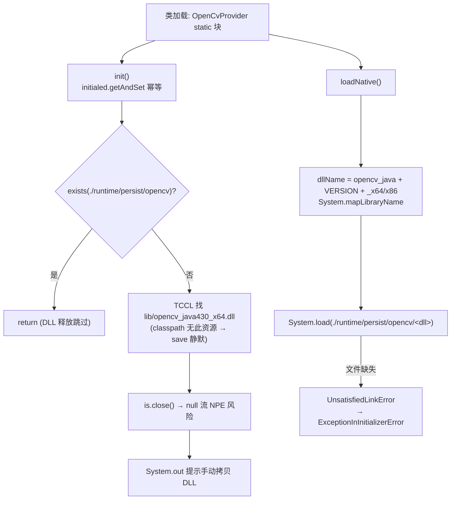
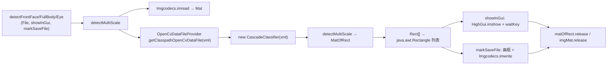

# i2f-extension-opencv

> 原生 OpenCV 4.3.0 桥接扩展：把 OpenCV Java API 封装为**静态块自引导 + 全静态门面**——类加载即完成「DLL 释放提示 + `System.load` 本地库装载」，随后提供人脸/全身/眼睛检测（`CascadeClassifier` + Haar 级联）与轮廓提取（Sobel 梯度 + 二值化 + `findContours`）两条高层 API 线，支持 GUI 预览（`HighGui.imshow`）与检测结果标注保存。级联 XML 数据来自 `i2f-extension-opencv-data`（共享数据底座），本地库按 `OsUtil.is64bit` 选 `opencv_java430_x64/x86.dll`，从 `./runtime/persist/opencv` 加载（DLL 本体需用户自备放置）。OpenCV 依赖以 **system scope + systemPath** 指向 `src/main/resources/lib/opencv-430.jar`（652KB，jar 进 resources）。2 个主源文件 + 1 个 main 型测试，仓库内无源码级消费方（仅 i2f-extension-all 聚合）。

## 模块路径

- `i2f-extension/i2f-extension-opencv`
- 根 `pom.xml` `<module>` 登记（72 行）；`i2f-extension/pom.xml` 依赖管理（1175 行）；`i2f-extension/i2f-extension-all` 聚合依赖（241 行）

## 依赖

| 依赖 | 版本 | 作用域 | 说明 |
|---|---|---|---|
| `org.opencv:opencv` | **4.3.0** | **system** | `systemPath=${pom.basedir}/src/main/resources/lib/opencv-430.jar`——OpenCV Java API jar 直接放进 resources；system scope **不传递、不入 assembly 产物** |
| `i2f.turbo:i2f-extension-opencv-data` | 同版本 | compile | cascade XML 数据 + `ROOT_PATH` 运行时目录常量 |
| `i2f.turbo:i2f-os` | 同版本 | compile | `OsUtil.is64bit()` 选 DLL 架构 |
| `i2f.turbo:i2f-io-file` | 同版本 | compile | `FileUtil.save`/`useParentDir` |
| `org.projectlombok:lombok` | 父 POM 管理 | compile | **源码零使用，冗余声明** |

- 父 POM `maven-assembly-plugin`（`jar-with-dependencies`）**未配置 `includeSystemScope=true`**——system 依赖不进 fat jar（见已知问题 #1）。

## 架构设计

静态块自引导链：



检测调用链（detectMultiScale）：



## 设计目的

1. **零样板接入 OpenCV**：静态块自动装载本地库 + 全静态门面，业务侧一行 `OpenCvProvider.detectFrontFace(file)` 即得结果，无需感知 `System.loadLibrary`、`CascadeClassifier` 生命周期。
2. **与数据模块解耦**：约 25MB 级联数据在 `i2f-extension-opencv-data`，本模块只管 API 封装与本地库引导，二者共享 `./runtime/persist/opencv` 目录。
3. **检测结果可视化闭环**：检测 → `java.awt.Rectangle` 标注 → GUI 预览或落盘保存，开箱即用。
4. **算法演示级封装**：`findContours` 内联完整 Sobel 边缘 → 高斯模糊 → 二值化 → 轮廓提取流水线，兼作 OpenCV 图像处理范式示例。

## 功能清单

| 成员 | 类型 | 职责 |
|---|---|---|
| 静态块 | 初始化 | `init()`（DLL 释放提示，幂等 AtomicBoolean）+ `loadNative()`（`System.load` 本地库） |
| `OpenCvVersion.VERSION` | 可变常量 | `"430"`（**非 final**，测试注释演示可改 480）；与 `DLL_BASE_NAME="opencv_java430"` 双份硬编码 |
| `detectFrontFace(File[, showInGui[, markSave]])` | 静态方法 | Haar 正脸检测（`haarcascade_frontalface_alt.xml`） |
| `detectFullBody(...)` / `detectEye(...)` | 静态方法 | 全身 / 眼睛检测（内置常量 XML 名） |
| `detectMultiScale(File, xmlName[, ...])` | 静态方法 | 通用级联检测入口：imread → classifier → MatOfRect → Rectangle 列表 + 标注保存 |
| `findContours(File[, ...])` | 静态方法 | Sobel×2 梯度 → addWeighted 融合 → 二值化 → findContours → `List<List<Point>>` |
| `OFFICIAL_URL` / `DLL_BASE_PREFIX` / `DLL_BASE_NAME` / `CLASS_PATHS` | 常量 | 官网链接 / DLL 命名与 classpath 路径（x64+x86 两个） |
| `HAARCASCADE_FRONTALFACE_ALT_XML` 等 | 常量 | 内置检测器 XML 名 |

- 矩阵资源管理：`Mat`/`MatOfRect`/`MatOfPoint`/`MatVector` 手动 `release()/close()`（无 try-with-resources）。

## 用法示例

```java
// 1. 引入依赖后直接静态调用（首次类加载自动装载本地库）
List<Rectangle> faces = OpenCvProvider.detectFrontFace(new File("photo.jpg"));
```

```java
// 2. GUI 预览 + 检测结果标注落盘
List<Rectangle> faces = OpenCvProvider.detectFrontFace(new File("in.png"), true, new File("marked.png"));
```

```java
// 3. 换检测目标（全身/眼睛），XML 全部内置于 opencv-data
List<Rectangle> bodies = OpenCvProvider.detectFullBody(new File("street.jpg"));
List<Rectangle> eyes   = OpenCvProvider.detectEye(new File("face.png"));
```

```java
// 4. 任意级联 XML 的通用入口（路径相对 lib/data/）
List<Rectangle> ret = OpenCvProvider.detectMultiScale(new File("img.png"),
        "lbpcascades/lbpcascade_frontalface.xml", false, null);
```

```java
// 5. 轮廓提取（Sobel 流水线）
List<List<java.awt.Point>> contours = OpenCvProvider.findContours(new File("shape.png"), false, null);
```

```java
// 6. 跨版本本地库（不换 jar 仅换 DLL 版本——风险自负）
// OpenCvVersion.VERSION = "480";  // 测试源码中注释演示的玩法
```

## 特性总结

- **静态块自引导**：类加载即完成 DLL 装载，业务零初始化代码；`AtomicBoolean` 幂等防重入。
- **全静态门面**：所有检测/轮廓 API 无状态可直接调用，输入输出均为 JDK 类型（`File`/`List`/`java.awt.Rectangle`）。
- **检测器开箱即用**：正脸/全身/眼睛三内置 + 通用入口接 opencv-data 的全部 35 个级联。
- **可视化闭环**：imshow 预览与画框保存一步到位。
- **跨架构选择**：`OsUtil.is64bit()` 自动选 x64/x86 DLL。

## 已知问题（静态识别，未实证）

1. **system scope 依赖的运行时可见性断裂（核心缺陷）**：`org.opencv:opencv` 为 system scope 且父 POM assembly 无 `includeSystemScope`——system 依赖**不传递、不进 fat jar**；resources 里的 `opencv-430.jar` 会作为普通资源打进产物成为 **jar-in-jar（JVM 不加载）**；manifest `Class-Path: . ./resources/` 指向产物旁的文件系统目录布局，fat jar 自身不满足。结果：编译期通过，**独立运行产物时 `org.opencv.*` 缺失 → NoClassDefFoundError**，除非部署侧手动把 opencv-430.jar 释放到 `./resources/` 或手动拼 classpath。
2. **DLL 释放链空转 + NPE**：`CLASS_PATHS` 找 `lib/opencv_java430_x64.dll`，但 classpath 无此资源（两模块 resources 均无 DLL）→ `getResourceAsStream` 返回 null → `FileUtil.save` 静默跳过后 **`is.close()` 直接 NPE**；且「please copy *.dll」提示到达前就已崩溃。
3. **DLL 引导目录判定被跨模块短路**：`init()` 以 `exists(./runtime/persist/opencv)` 判断是否释放，而 opencv-data 首次释放 cascade 时连带创建该父目录——**cascade 先释放则 DLL 释放逻辑永久跳过**；反过来 `loadNative()` 要求 DLL 必须已存在，否则 `System.load` 抛 `UnsatisfiedLinkError`。
4. **静态块半失败继续执行**：`init()` 异常仅 `printStackTrace` 后继续走 `loadNative()`；`loadNative()` 抛出则 `ExceptionInInitializerError`，整个类不可用且无重试入口。
5. **imread 结果未校验**：`Imgcodecs.imread` 对不存在/不可解码文件返回空 Mat（`imgMat.empty()` 未判），直接送 `detectMultiScale`/`cvtColor`，失败信息以 OpenCV 断言错误形式出现，排障失真。
6. **版本双份硬编码**：`DLL_BASE_NAME="opencv_java430"`（释放用）与 `OpenCvVersion.VERSION="430"`（loadNative 拼接用）来源不同步，改 VERSION 不影响 CLASS_PATHS；且 `VERSION` 为**非 final 可变静态**，并发写不可见、任意代码可篡改。
7. **CascadeClassifier 重复构建**：每次 `detectMultiScale` 都 `new CascadeClassifier` 并重新加载 XML 文件（opencv-data 释放的磁盘文件），无缓存——批量图片场景重复 IO + 解析开销。
8. **GUI 资源管理缺失**：`HighGui.imshow + waitKey` 后无 `destroyWindow/destroyAllWindows`，批量检测 GUI 模式窗口累积；headless 环境（无显示）imshow 直接崩溃且无降级。
9. **x86 释放冗余**：`CLASS_PATHS` 同时释放 x64+x86 两个 DLL，`loadNative` 只按当前架构加载其一，另一份纯浪费磁盘。
10. **findContours Mat 管理繁琐且冗余 clone**：`imgSobelX/imgSobelY` 均由 `imgGray.clone()` 创建后立即被 Sobel 输出覆盖（clone 浪费）；`imgSobel`（new Mat）在 release imgSobelX/Y 之后使用正确，但整体 7 个 Mat 手动配对 release，无 try-with-resources，中途异常即泄漏本地内存。
11. **依赖 AWT 类型**：返回 `java.awt.Rectangle`/`Point`，headless 模块化部署或裁剪 AWT 的运行时引入不需要的传递面。
12. **`${pom.basedir}` 废弃写法**：systemPath 使用旧占位符（现行 `${project.basedir}`），依赖 Maven 兼容行为。
13. **异常与日志粗放**：`System.out.println` 提示代替日志；`RuntimeException` 语义由底层抛出，无统一异常体系。
14. **lombok 冗余依赖**：pom 声明但源码零使用；零 JUnit 测试（仅 main 型 `TestOpenCvDetect`，依赖仓库根 `tmp.png`）。

## 生态位置

| 维度 | 说明 |
|---|---|
| 下游消费 | 仓库内**无源码级消费方**——仅 `i2f-extension-all` 聚合（241 行）；JavaCV 路线（`i2f-extension-opencv-javacv`）不依赖本模块，仅共享 opencv-data 数据 |
| 平行实现 | `i2f-extension-opencv-javacv`（bytedeco JavaCV 全家桶，LBPH 人脸识别等重功能）——本模块胜在零传递依赖体积、败在 4.3.0 老版本与 system scope 装配 |
| 数据底座 | `i2f-extension-opencv-data`（cascade XML + `ROOT_PATH` 目录约定） |
| 运行前提 | 用户自备 `opencv_java430_x64.dll` 放入 `./runtime/persist/opencv/`（或 Windows PATH），并保证 `org.opencv` 类在 classpath（system scope 不传递） |

- 与 `i2f-extension-ocr-tesseract` 同属「本地库 + 自备引导」范式；本模块 DLL 连资源都不内置，引导契约最弱。
