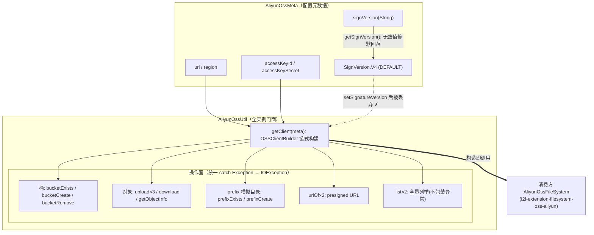

# i2f-extension-oss-aliyun

> 阿里云 OSS 对象存储桥接扩展（aliyun-sdk-oss `3.17.4` 以 provided+optional 引入）：2 个主源文件的轻量适配——`AliyunOssMeta` 承载 endpoint/region/AK/SK/签名版本配置（默认 `SignVersion.V4`，字符串配置容错解析为枚举），`AliyunOssUtil` 以全实例方法门面封装 OSS 客户端构建与四组操作（桶管理 exists/create/remove、对象上传三形态/下载/元信息、prefix 模拟目录 exists/create、presigned URL 生成），统一把 SDK 异常包装为 `IOException`。与 `i2f-extension-oss-aws-s3`（AwsS3OssMeta/AwsS3OssUtil）为平行同构实现，**无共享契约接口**；仓库内唯一源码级消费方为 `i2f-extension-filesystem-oss-aliyun`（`AbsFileSystem` 适配层，构造即调 `AliyunOssUtil.getClient(meta)`）。核心静态缺陷：`getClient` 构建的 `ClientBuilderConfiguration` **从未传入 builder 链**（javap 证实 fluent API 有 `clientConfiguration(...)` 而代码未调用）——签名版本配置整体架空，实际永远走 SDK 默认签名。

## 模块路径

- `i2f-extension/i2f-extension-oss-aliyun`
- 根 `pom.xml` 依赖管理（1190 行）；`i2f-extension/pom.xml` 模块登记（75 行）；`i2f-extension/i2f-extension-all` 聚合依赖（253 行）

## 依赖

| 依赖 | 版本 | 作用域 | 说明 |
| --- | --- | --- | --- |
| `com.aliyun.oss:aliyun-sdk-oss` | 3.17.4 | provided + optional | OSS 官方 SDK，版本模块内硬编码 |
| `javax.xml.bind:jaxb-api` | 2.3.1 | provided + optional | java 9+ 需要（JAXB 剥离补偿） |
| `javax.activation:activation` | 1.1.1 | provided + optional | java 9+ 需要 |
| `org.glassfish.jaxb:jaxb-runtime` | 2.3.3 | provided + optional | 上限 2.3.3（注释约束） |
| `org.projectlombok:lombok` | 继承 | provided | `@Data`/`@NoArgsConstructor` |

> jaxb 三件为 SDK 官方给出的 java 9+ 运行时补偿依赖，均 provided+optional 不入产物。

## 架构设计



- **配置面**：`AliyunOssMeta` 是纯 POJO（`@Data`/`@NoArgsConstructor`），`signVersion` 以 String 存储、经 `SignVersion.valueOf` 解析为枚举，空/无效一律回落 `DEFAULT_SIGN_VERSION=V4`。
- **客户端构建**：`getClient` 静态方法组装 `CredentialsProviderFactory.newDefaultCredentialProvider(AK, SK)` + `ClientBuilderConfiguration`（显式声明签名版本），经 `OSSClientBuilder.create().endpoint(...).credentialsProvider(...).region(...).build()` 产出 `OSS` 实例。
- **操作面**：所有方法持单一 `client` 字段执行；SDK 受检/运行时异常统一包装为 `IOException(message, cause)` 上抛（`list` 两个重载除外）。

## 设计目的

1. **给 i2f 文件系统抽象层补 OSS 后端**：`AbsFileSystem` 适配层（`i2f-extension-filesystem-oss-aliyun`）需要 bucket/object 两级映射的客户端工厂与基础操作，本模块提供最小封装。
2. **驯服 SDK 异常模型**：阿里云 SDK 抛 `OSSException`/`ClientException`（RuntimeException 系），包装为 `IOException` 使调用方可按 IO 语义统一处理。
3. **为 V4 签名预留配置通道**：OSS V4 签名要求 region 且与 V1 行为差异大，`AliyunOssMeta` 提供显式签名版本配置位（尽管当前构建链把它架空了，见已知问题 #1）。
4. **java 9+ 可运行**：随 SDK 附带 jaxb/activation 补偿依赖声明，保证高版本 JDK 下的 XML 处理链完整。

## 功能清单

| 方法 | 功能 | 备注 |
| --- | --- | --- |
| `getClient(meta)` | 构建 `OSS` 客户端 | 静态；配置对象未传入 builder（缺陷 #1） |
| `bucketExists` / `bucketCreate` / `bucketRemove` | 桶存在/创建/删除 | check-then-act；删除未清空 |
| `upload(bucket, object, is, fileSize, mimeType)` | 流式上传（长度+类型） | 核心重载 |
| `upload(bucket, object, is, contentType)` | 流式上传 | `-1L` 哨兵泄漏到 setContentLength |
| `upload(bucket, object, file, contentType)` | 文件上传 | finally 关流 |
| `download` / `getObjectInfo` | 下载流 / 元信息 | OSSObject 上下文丢失 |
| `list(bucket)` / `list(bucket, prefix)` | 全量列举 | 不包装异常；复制粘贴重载 |
| `prefixExists` / `prefixCreate` | 0 字节对象模拟目录 | 语义错位（缺陷 #7/#8） |
| `urlOf` ×2 | presigned URL | 未设 expiration |

## 用法示例

**1. 配置与客户端构建**

```java
AliyunOssMeta meta = new AliyunOssMeta();
meta.setUrl("https://oss-cn-hangzhou.aliyuncs.com");
meta.setRegion("cn-hangzhou");
meta.setAccessKeyId("ak");
meta.setAccessKeySecret("sk");
meta.setSignVersion("V4"); // 无效值静默回落 V4，且当前构建链不生效

OSS client = AliyunOssUtil.getClient(meta);
AliyunOssUtil util = new AliyunOssUtil(client);
```

**2. 桶管理**

```java
if (!util.bucketExists("my-bucket")) {
    util.bucketCreate("my-bucket");
}
// 删除要求桶为空，否则抛 SDK 异常
util.bucketRemove("my-bucket");
```

**3. 上传三形态**

```java
try (InputStream is = new FileInputStream("a.jpg")) {
    util.upload("my-bucket", "img/a.jpg", is, is.available(), "image/jpeg");
}
util.upload("my-bucket", "img/a.jpg", new FileInputStream("a.jpg"), "image/jpeg"); // -1L 哨兵
util.upload("my-bucket", "img/a.jpg", new File("a.jpg"), "image/jpeg"); // 内部开流 finally 关闭
```

**4. 下载 / 元信息 / 列举**

```java
try (InputStream is = util.download("my-bucket", "img/a.jpg")) {
    StreamUtil.streamCopy(is, System.out);
}
ObjectMetadata info = util.getObjectInfo("my-bucket", "img/a.jpg");
List<OSSObjectSummary> all = util.list("my-bucket", "img/"); // 全量拉入内存
```

**5. prefix 模拟目录与 presigned URL**

```java
util.prefixCreate("my-bucket", "dir/");              // 0 字节标记对象
boolean exists = util.prefixExists("my-bucket", "dir/"); // 仅命中标记对象
String url = util.urlOf("my-bucket", "img/a.jpg");   // 未设 expiration
```

**6. 消费方视角（filesystem 适配层）**

```java
AliyunOssFileSystem fs = new AliyunOssFileSystem(meta); // 构造即 getClient(meta)
// path 语义: /bucket/object，经 splitPathAsBucketAndObjectName 映射
IFile f = fs.getFile("/my-bucket/img/a.jpg");
```

## 特性总结

- **极简门面**：2 类合计约 240 行，无接口抽象、无连接池托管、无重试策略——SDK 能力直通。
- **异常驯服**：SDK RuntimeException 系统一包装 `IOException`（`list` 除外），调用方按 IO 语义处理。
- **配置容错**：签名版本字符串解析失败静默回落默认值，不抛配置异常。
- **provided+optional 全线隔离**：SDK 与 jaxb 补偿均不入产物、不传递，按需引入。
- **同构平行族**：与 `i2f-extension-oss-aws-s3` 结构完全平行（Meta + Util），为将来的云存储抽象预留了合并点。

## 已知问题（静态识别，未实证）

1. **【核心】`getClient` 配置架空**：构建 `ClientBuilderConfiguration` 并 `setSignatureVersion(meta.getSignVersion())` 后**从未传入 builder 链**——javap 证实 fluent API 为 `endpoint/credentialsProvider/clientConfiguration/region/build`，代码未调用 `clientConfiguration(...)`，配置对象成为无效局部变量；签名版本配置整体失效，实际永远走 SDK 默认签名（V1），`DEFAULT_SIGN_VERSION=V4` 与 `getSignVersion()` 整套解析形同虚设。
2. **修复路径存在但未走**：`ClientBuilderConfiguration extends ClientConfiguration`（javap 证实），本可直接 `.clientConfiguration(...)`（子类可传）或 `build(endpoint, provider, config)` 静态重载传入；`setSignatureVersion` 定义在父类 `ClientConfiguration`。
3. **V4/region 隐式耦合两头坑**：配置架空状态下 `region(...)` 虽传入但 V1 签名不使用它；若仅补上配置传入而未配 region，V4 签名又会因缺 region 失败——region 必填约束未在 meta 层校验。
4. **`getSignVersion` 静默吞错**：`SignVersion.valueOf` 的 `IllegalArgumentException` 被空 catch，无效配置静默回落 V4，配置错误不可见（且因 #1 该值最终也未生效）。
5. **Meta bean 契约分裂**：手写 `getSignVersion()` 返回枚举而字段为 String，lombok `@Data` 因同名方法存在跳过生成 String getter——序列化/反射框架看到的是解析后枚举而非原始配置串，配置回显失真。
6. **upload 的 -1 哨兵泄漏**：`upload(bucket, object, is, contentType)` 以 `-1L` 表示"未知长度"，主重载仅判 `fileSize != null` 不判负值 → `metadata.setContentLength(-1)` 被显式设置；SDK 对负 Content-Length 的 InputStream 上传行为存疑（报错或全量缓冲）。
7. **`prefixExists` 语义错位**：`doesObjectExist(bucket, prefix)` 是**精确 key** 存在性而非前缀存在性——只能命中 `prefixCreate` 造出的 0 字节标记对象，"目录下有子对象但无标记对象"场景漏判为 false。
8. **`prefixCreate` 三连**：不校验 prefix 是否以 `/` 结尾（不以斜杠结尾时创建的是同名对象而非目录标记）；不查存在直接覆盖写；`PutObjectResult` 未用。
9. **`bucketCreate` check-then-act 竞态**：exists→create 非原子，并发下 createBucket 可能因桶已被创建而抛异常；`doesBucketExist` 在账号无列举权限时的语义存疑。
10. **`bucketRemove` 前置校验缺失**：OSS deleteBucket 要求桶存在且为空，未先判存在/未递归清空——非空桶直接抛裸 SDK 异常（与"删除不存在桶"不可区分）。
11. **`download` 丢失 OSSObject 上下文**：仅返回 objectContent 流，调用方拿不到 metadata/ETag；"关闭流即释放连接"的语义完全依赖 SDK 约定，未在文档注释说明。
12. **`list` 复制粘贴双胞胎 + 异常语义不一致**：两个重载仅差一行 `setPrefix`；不包装 IOException 也不声明 throws（与其它方法的统一 catch→IOException 风格相悖）；无 maxKeys/delimiter/数量上限参数，全量拉入内存（大 bucket OOM 风险）。
13. **`urlOf` 未设置 expiration**：presigned URL 有效期依赖 SDK 默认值；叠加 #1 签名版本架空，V4 下 presigned URL 的正确性存疑。
14. **`urlOf(req)` 重载风格不一致**：签名 throws IOException 但体内无受检异常源、无 catch 包装（与 `urlOf(String,String)` 相悖）。
15. **异常抹平**：统一 catch Exception → `IOException(e.getMessage(), e)`，不存在/无权限/网络错误不可区分；`e.getMessage()` 可能为 null 使 message 丢失。
16. **工程面**：`AliyunOssUtil` 的 `@Data` 使 client 可被 setter 任意替换且生成无意义 equals/hashCode；OSS client 无 shutdown/Closeable 生命周期托管（注释归责调用方）；零测试；与 oss-aws-s3 平行实现无共享契约接口。

## 生态位置

| 角色 | 模块 | 方式 |
| --- | --- | --- |
| 唯一源码级消费方 | `i2f-extension-filesystem-oss-aliyun` | `AliyunOssFileSystem` 构造即 `AliyunOssUtil.getClient(meta)`；`AliyunOssMeta` 为其配置载体 |
| 平行同构兄弟 | `i2f-extension-oss-aws-s3` | `AwsS3OssMeta`/`AwsS3OssUtil` 同构实现，无共享接口 |
| 聚合登记 | `i2f-extension-all` | 依赖聚合（253 行） |
| 无 springboot starter | — | i2f-springboot 体系内无消费方，生态止于 filesystem 适配层 |

> 缺陷传播链：`getClient` 的配置架空（#1）经构造注入直接传播到 `AliyunOssFileSystem`——文件系统适配层创建的 OSS 客户端同样不携带签名版本配置。
