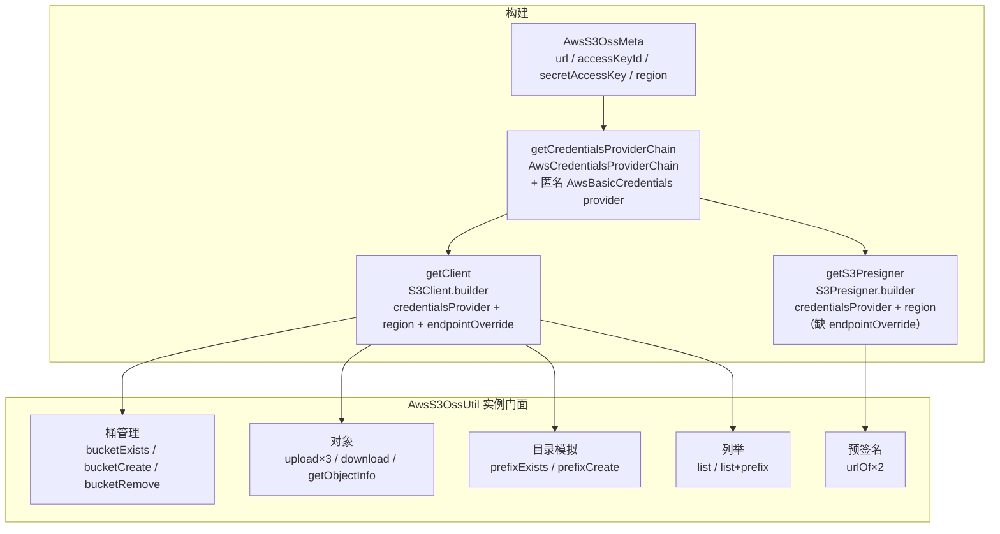

# i2f-extension-oss-aws-s3

> AWS S3 对象存储桥接扩展（AWS SDK v2 `software.amazon.awssdk` 以模块内硬编码 bom `2.17.100` 配 provided+optional 引入）：与 `i2f-extension-oss-aliyun` 平行同构的 2 类轻量适配——`AwsS3OssMeta` 承载 endpoint/AK/SK/region 配置（纯 POJO，无签名版本概念——AWS v2 走 SigV4），`AwsS3OssUtil` 以实例门面封装 S3Client/S3Presigner 构建与五组操作（桶管理 exists/create/remove、对象上传三形态/下载/元信息、prefix 模拟目录 exists/create、全量列举 list×2、presigned URL 生成），统一把 SDK 异常包装为 `IOException`。与 aliyun 版无共享契约接口；仓库内唯一源码级消费方为 `i2f-extension-filesystem-oss-aws-s3`（`AbsFileSystem` 适配层，静态复用 `AwsS3OssUtil.getClient` 并自行手写其余操作）。核心静态缺陷：`bucketExists` 误用 `getBucketPolicyStatus` 判存在性（未配 Public Access Block 的桶恒判 false → create 链放大）、presigner 构建丢 `endpointOverride`（javap 证实 Builder 有该方法而代码未调，第三方 S3 的预签名 URL 指向 amazonaws.com）、`urlOf` 999 年签名时长超 SigV4 上限 7 天、`fromInputStream(is, -1L)` 哨兵产出 `Content-Length: -1` 非法头（javap 证实无负数校验）。

## 模块路径

- `i2f-extension/i2f-extension-oss-aws-s3`
- `i2f-extension/pom.xml` `<module>` 登记（76 行）；根 `pom.xml` 依赖管理（1195 行）；`i2f-extension/i2f-extension-all` 聚合依赖（257 行）

## 依赖

| 依赖 | 版本 | 作用域 | 说明 |
| --- | --- | --- | --- |
| `org.projectlombok:lombok` | 父 POM 管理 | compile | `@Data`/`@NoArgsConstructor` 字节码增强 |
| `software.amazon.awssdk:s3` | bom 2.17.100 | provided+optional | `S3Client`/`S3Presigner`/模型类，唯一实际使用 |
| `software.amazon.awssdk:kms` | bom 2.17.100 | provided+optional | **源码零引用**（冗余依赖） |
| `software.amazon.awssdk:s3control` | bom 2.17.100 | provided+optional | **源码零引用**（冗余依赖） |

模块 `dependencyManagement` 内硬编码 `software.amazon.awssdk:bom:2.17.100`（`type=pom`/`scope=import`），不经父 POM 统一管理。

## 架构设计



## 设计目的

- 在 i2f 生态内提供 AWS S3（含 S3 兼容实现）的最小对象存储适配面：一个配置 POJO + 一个实例门面，依赖以 provided+optional 交付（使用方自带 SDK）
- 与 `i2f-extension-oss-aliyun` 保持 API 形状同构（桶/对象/目录模拟/列举/预签名五组操作），便于上层 filesystem 适配层平行实现；但不共享契约接口，二者不可互换注入
- 供 `i2f-extension-filesystem-oss-aws-s3` 把 S3 语义适配为 `AbsFileSystem` 统一文件系统视图（桶/键两级路径模型）

## 功能清单

| 方法 | 说明 | 静态备注 |
| --- | --- | --- |
| `getClient(meta)` static | 构建 S3Client（凭证链 + region + 可选 endpointOverride） | builder 链完整，无 aliyun 版配置架空问题 |
| `getCredentialsProviderChain(meta)` static | Chain 包单匿名 provider 返回静态凭证 | 等价 `StaticCredentialsProvider`，过度设计 |
| `bucketExists(bucket)` | 误用 `getBucketPolicyStatus` 判存在 | **语义错位**，未配 BPA 的桶恒 false |
| `bucketCreate(bucket)` | exists→createBucket，空 `CreateBucketConfiguration` | 缺陷链放大 + 空 LocationConstraint |
| `bucketRemove(bucket)` | deleteBucket | 未判空桶（BucketNotEmpty） |
| `upload(bucket,object,is,size,ct)` | `RequestBody.fromInputStream(is, size==null?-1:size)` | **-1 哨兵产出 Content-Length: -1** |
| `upload(bucket,object,is,ct)` | 委托上方法，固定 `-1L` | 同上，必走 -1 路径 |
| `upload(bucket,object,file,ct)` | `RequestBody.fromFile(file)` | 形态正确 |
| `download(bucket,object)` | 返回 `ResponseInputStream` | 所有权移交调用方 |
| `getObjectInfo(bucket,object)` | `getObject` 只取 `resp.response()` 元数据 | **流从未关闭 → 连接泄漏**；应 headObject |
| `list(bucket)` / `list(bucket,prefix)` | marker 分页 do-while 全量拉内存 | **NextMarker 仅 delimiter 时返回 → 死循环风险** |
| `prefixExists(bucket,prefix)` | listObjects + prefix + `hasContents()` | 真前缀语义（优于 aliyun 版） |
| `prefixCreate(bucket,prefix)` | 0 字节对象模拟目录 | 不校验结尾斜杠、覆盖写 |
| `getS3Presigner(meta)` static | 构建 S3Presigner | **缺 endpointOverride** |
| `urlOf(bucket,object)` | 预签名 GET URL，时长 999 年 | **超 SigV4 上限 7 天** |
| `urlOf(req)` | 自定义 presign 请求 | 无 try-catch 包装（不一致） |

## 用法示例

```java
// 1. 最小配置：AWS 官方 S3
AwsS3OssMeta meta = new AwsS3OssMeta();
meta.setRegion("cn-north-1");
meta.setAccessKeyId("AK");
meta.setSecretAccessKey("SK");
AwsS3OssUtil oss = new AwsS3OssUtil(meta);

oss.bucketCreate("my-bucket");
oss.upload("my-bucket", "a/b/c.txt", new FileInputStream("d:/1.txt"), 1024L, "text/plain");
InputStream is = oss.download("my-bucket", "a/b/c.txt");
```

```java
// 2. 第三方 S3 兼容端点（MinIO 等）
meta.setUrl("http://127.0.0.1:9000");
// client 走 endpointOverride 正确；但 urlOf 的 presigner 不带该端点（已知问题），
// 预签名请勿用于第三方端点
```

```java
// 3. 预签名下载 URL（注意：999 年时长超 SigV4 的 7 天上限，AWS 服务端会拒绝）
String url = oss.urlOf("my-bucket", "a/b/c.txt");

// 3'. 自定义时长（绕开默认 999 年）
GetObjectPresignRequest req = GetObjectPresignRequest.builder()
        .signatureDuration(Duration.ofMinutes(10))
        .getObjectRequest(r -> r.bucket("my-bucket").key("a/b/c.txt"))
        .build();
String url2 = oss.urlOf(req);
```

```java
// 4. 目录语义
oss.prefixCreate("my-bucket", "dir/");          // 0 字节标记对象
boolean has = oss.prefixExists("my-bucket", "dir/");
List<S3Object> objs = oss.list("my-bucket", "dir/");
```

```java
// 5. 交给 filesystem 适配层（桶/键两级路径：首段为桶）
AwsS3OssFileSystem fs = new AwsS3OssFileSystem(meta);
IFile file = fs.getFile("/my-bucket/a/b/c.txt");
fs.store("/my-bucket/a/b/c.txt", new FileInputStream("d:/1.txt"));
```

## 特性总结

- **极小适配面**：2 个源文件（`AwsS3OssMeta` 22 行 + `AwsS3OssUtil` 265 行），零测试；SDK 异常统一包装 `IOException`
- **三形态上传**：InputStream（带长度）/InputStream（未知长度哨兵 -1）/File，Content-Type 直传
- **AWS SDK v2 惯用形**：`S3Client` + `S3Presigner` 双客户端、请求构建用 lambda builder、`Region.of` 动态 region
- **与 aliyun 版同构但各有缺陷**：本版 builder 链完整（无配置架空）、`prefixExists` 为真前缀语义；但引入了 -1 哨兵、presigner 丢 endpointOverride、999 年预签名等 aliyun 版没有的缺陷
- **缺陷复制传播**：`getBucketPolicyStatus` 判存在模式与 `fromInputStream(is, -1L)`、marker 分页模式均被唯一消费方 `AwsS3OssFileSystem` 原样复制（放大器效应）

## 已知问题（静态识别，未实证）

1. **【核心】`bucketExists` 语义错位**：用 `getBucketPolicyStatus`（桶 Block Public Access 策略状态，需 `s3:GetBucketPolicyStatus` 权限）判断存在性——未配置 Public Access Block 的桶 `policyStatus()` 为 null → **恒判 false**；不存在的桶 SDK 抛 `NoSuchBucket` 被包装为 IOException 而非返回 false。存在性判定的正确 API 是 `headBucket`
2. **【缺陷链放大】`bucketCreate` 必然重复创建**：因 1，对未配 BPA 的已存在桶恒判不存在 → 重复 `createBucket` → `BucketAlreadyOwnedByYou` 异常 → IOException；且 `CreateBucketConfiguration.builder().build()` 为**空配置**（LocationConstraint 未设），AWS 要求提供 configuration 时 LocationConstraint 必填（us-east-1 应整个省略）→ 可能 `IllegalLocationConstraintException`
3. **【javap 铁证】presigner 丢 `endpointOverride`**：client 构建传了 `endpointOverride`，而 `S3Presigner.Builder` 明明有 `endpointOverride(URI)` 方法（javap 证实）却未调用 → **第三方 S3（MinIO 等）的预签名 URL 永远指向 amazonaws.com** 而非实际端点，下载必失败
4. **【javap 铁证】`upload(is, contentType)` 的 -1 哨兵产出非法 Content-Length**：`RequestBody.fromInputStream`/`fromContentProvider` 字节码无负数校验（-1 直接 `Long.valueOf` 装箱传递）→ sync 客户端发出 `Content-Length: -1` 请求头被服务端拒绝；AWS v2 sync 无 aliyun SDK 对 -1 自动转 chunked 的兜底。`upload(is,size,ct)` 传 `size==null` 同样命中
5. **【javap 佐证】`urlOf` 999 年签名时长超 SigV4 上限**：`Duration.of(999, ChronoUnit.YEARS)` ≈ 3.15e10 秒，SigV4 预签名 URL 上限 604800 秒（7 天）；SDK 2.17.100 字节码无客户端校验（grep 604800 为空），错误延迟到服务端（AWS/MinIO 均 403）——"永不过期"意图落空
6. **【连接泄漏】`getObjectInfo` 流从未关闭**：`client.getObject` 返回 `ResponseInputStream`，只取 `resp.response()` 元数据即返回，流（底层 HTTP 连接）无 close → 连接池耗尽；且 HEAD 语义误用 GET——为拿元数据**完整下载对象**
7. **【死循环风险】`list`/`list(prefix)` 的 NextMarker 假设**：S3 `ListObjects` 响应的 `NextMarker` **仅在请求带 delimiter 时返回**（AWS 文档），无 delimiter 时 `resp.nextMarker()` 为 null → `marker(null)` 从头再列 → 死循环 + 全量堆内存；正确做法是 isTruncated 时以最后一条 key 作为 next marker
8. **region 无守卫**：`Region.of(meta.getRegion())`，S3Client region 必填，meta.region 为 null 时 build 抛 `SdkClientException`（Unable to load region），meta 层未校验；presigner 同
9. **AK/SK null 校验延迟**：匿名 provider 每次 `resolveCredentials` 调 `AwsBasicCredentials.create(null, null)`——构建 chain 时不校验，首次调用时抛 IllegalArgumentException
10. **双客户端/双凭证链冗余**：`new AwsS3OssUtil(meta)` 分别走 getClient + getS3Presigner，`getCredentialsProviderChain` 被调两次（两个 chain 实例）+ presigner 独立连接池；`S3Client`/`S3Presigner` 均为 AutoCloseable 却无 shutdown/close 托管
11. **异常抹平**：统一 `new IOException(e.getMessage(), e)`，NoSuchBucket/NoSuchKey/AccessDenied 不可区分；`list`×2 不包装异常（风格不一致，同 aliyun 版）；`urlOf(req)` 无 try-catch
12. **check-then-act 竞态**：`bucketCreate` 的 exists→create、`prefixCreate` 不查存在直接覆盖写（同 aliyun 版）
13. **`prefixCreate` 不校验结尾斜杠**：传 `"dir"` 产出无斜杠标记对象，与 list/prefixExists 的 `"dir/"` 前缀约定脱节（同 aliyun 版）
14. **`bucketRemove` 未判空桶**：非空桶被 S3 拒绝（BucketNotEmpty），不先清空对象（同 aliyun 版）
15. **kms/s3control 冗余依赖**：源码零引用（grep 证实），误导使用者以为具备加密/控制面能力
16. **工程瑕疵**：`@Data` 加在纯门面 `AwsS3OssUtil` 上（setter 可替换 client/presolver 无守卫、equals/hashCode/toString 无意义）；`getCredentialsProviderChain` 用 Chain 包单匿名 provider 等价 `StaticCredentialsProvider`；`list` 的 `resp != null` 判断冗余（SDK 不返回 null）

## 生态位置

| 维度 | 说明 |
| --- | --- |
| 平行同构 | `i2f-extension-oss-aliyun`（AliyunOssMeta/AliyunOssUtil，API 形状对齐，无共享契约） |
| 下游消费方 | `i2f-extension-filesystem-oss-aws-s3`：`AwsS3OssFileSystem` 构造即 `AwsS3OssUtil.getClient(meta)`（仅静态复用getClient），`AwsS3OperateDto` 持有 `AwsS3OssMeta`；其余操作自行手写并复制了本模块的 `getBucketPolicyStatus`/`fromInputStream(-1L)`/marker 分页三类模式 |
| 聚合 | `i2f-extension-all` 依赖（257 行） |
| 登记链 | 根 `pom.xml` 依赖管理（1195 行）→ `i2f-extension/pom.xml` 模块（76 行）→ `i2f-extension-all`（257 行） |
| springboot 消费链 | 无（生态止于 filesystem 适配层） |
