# i2f-extension-qrcode

> 二维码桥接扩展（zxing `core`/`javase` `3.4.1` 双 provided 引入）：仓库内最小的扩展模块之一，2 个主源文件——`QrCodeWorker` 封装「zxing 生成 + 2D 图形库贴 Logo + zxing 解码」全流程（链式 setter 配置 codeSize/logoSize/charset），`QrCodeUtil` 提供全静态门面（生成 4 重载 + 解析 2 重载）。生成固定 `QR_CODE` 格式 + `ErrorCorrectionLevel.H` 容错（约 30% 面积，为 Logo 覆盖预留），Logo 绘制为居中正方形 + 圆角描边；解码走 `BufferedImageLuminanceSource → HybridBinarizer → MultiFormatReader` 标准链。零测试，仓库内无源码级消费方（仅 i2f-extension-all 聚合）。

## 模块路径

- `i2f-extension/i2f-extension-qrcode`
- 根 `pom.xml` 依赖管理（1200 行）；`i2f-extension/pom.xml` 模块登记（77 行）；`i2f-extension/i2f-extension-all` 聚合依赖（261 行）

## 依赖

| 依赖 | 版本 | 作用域 | 说明 |
|---|---|---|---|
| `com.google.zxing:core` | 3.4.1 | provided | 条码核心（编解码器，模块内硬编码版本） |
| `com.google.zxing:javase` | 3.4.1 | provided | JavaSE 辅助（`BufferedImageLuminanceSource`） |
| `org.projectlombok:lombok` | 父 POM 管理 | compile | **源码零 import，冗余依赖** |
| JDK | 1.8 | — | AWT 2D 图形（`Graphics2D`/`ImageIO`/`RoundRectangle2D`） |

## 架构设计

```mermaid
flowchart TB
    subgraph encode["生成线 makeQrCode(content, logoPath)"]
        hints["hints: H 容错 + charset + MARGIN=1"] --> encode1["MultiFormatWriter.encode<br/>QR_CODE codeSize×codeSize"]
        encode1 --> bitMatrix["BitMatrix"]
        bitMatrix --> paint["逐像素 setRGB O(n²)<br/>黑 0xFF000000 / 白 0xFFFFFFFF"]
        paint -->|"logoPath 为空"| out["BufferedImage TYPE_INT_RGB"]
        paint --> logo["读 Logo 文件<br/>ImageIO.read(null 坐 NPE)"]
        logo --> scale["clamp 判断(死代码)<br/>→ getScaledInstance(logoSize, logoSize)<br/>非等比拉伸正方形"]
        scale --> draw["Graphics2D 居中 drawImage<br/>+ RoundRectangle2D 圆角描边"]
        draw --> out
    end
    subgraph decode["解码线 parseQrCode(File/InputStream/BufferedImage)"]
        read["ImageIO.read(null 返 null)"] --> lum["BufferedImageLuminanceSource"]
        lum --> bin["HybridBinarizer → BinaryBitmap"]
        bin --> decode1["MultiFormatReader.decode(hints)<br/>未启用 TRY_HARDER"]
        decode1 --> text["result.getText()"]
    end
```



## 设计目的

- 把 zxing 编解码 API 的样板（hints 装配、BitMatrix 转图、Luminance/Binarizer 链）收敛为链式 worker + 静态门面两层。
- 内置 Logo 贴图与圆角描边能力：利用 `ErrorCorrectionLevel.H` 的约 30% 容错在不破坏可扫性的前提下中心覆盖 Logo。
- 保持零传递依赖：zxing 双件 provided，产物不捆绑，由使用方决定是否引入。

## 功能清单

| 方法 | 功能 | 备注 |
|---|---|---|
| `makeQrCode(content, logoPath)` | 生成二维码（可贴 Logo） | logo 为空/不存在时静默降级纯码 |
| `parseQrCode(InputStream)` / `(File)` / `(BufferedImage)` | 解析二维码内容 | 图片无法解码时返 null |
| `QrCodeUtil.toQrCode` 4 重载 | 静态生成（返回图 / 写 OutputStream，带/不带 Logo） | 输出格式硬编码 JPG |
| `QrCodeUtil.parseQrCode` 2 重载 | 静态解析（File / 文件名路径） | — |
| `setCodeSize` / `setLogoSize` / `setCharset` | 链式配置 | 默认 300 / 60 / UTF-8 |

## 用法示例

```java
// 1. 最简生成（返回 BufferedImage）
BufferedImage img = QrCodeUtil.toQrCode("https://example.com", 300);

// 2. 生成并写入输出流（JPG 格式）
QrCodeUtil.toQrCode("https://example.com", 300, outputStream);

// 3. 带 Logo 生成（Logo 固定缩放为 60×60 正方形）
BufferedImage logoImg = QrCodeUtil.toQrCode("https://example.com", 300, "logo.png", 60);

// 4. 从文件解析
String content = QrCodeUtil.parseQrCode(new File("qrcode.png"));

// 5. Worker 链式用法（自定义编码）
String text = new QrCodeWorker()
        .setCodeSize(500)
        .setCharset("UTF-8")
        .parseQrCode(inputStream);

// 6. Worker 生成（贴 Logo）
BufferedImage img2 = new QrCodeWorker()
        .setCodeSize(500)
        .setLogoSize(100)
        .makeQrCode("payload", "logo.jpg");
```

## 特性总结

- **极简双层封装**：Worker（实例链式）+ Util（静态门面），全模块 2 文件约 180 行。
- **H 级容错默认值**：`ErrorCorrectionLevel.H`（约 30% 面积）为 Logo 覆盖预留，注释完整说明四级容错语义。
- **Logo 视觉增强**：居中绘制 + `RoundRectangle2D` 圆角描边 + `BasicStroke(3f)`。
- **容错降级**：Logo 路径为空/文件不存在/图片不可读时不中断生成，静默降级为纯码。
- **零传递依赖**：zxing provided，不进产物。

## 已知问题（静态识别，未实证）

- **【核心】Logo 缩放逻辑自我矛盾（死代码 + 非等比失真）**：78-86 行先按 `if (> logoSize) clamp` 判断（意图"小图保持原尺寸"），87 行却无条件 `getScaledInstance(logoSize, logoSize)` 强制缩放到正方形——clamp 判断完全白做；且**非等比缩放**：任何宽高比的 Logo 都被拉伸为 `logoSize×logoSize` 正方形，图形失真。
- **【magic number 巧合】`getScaledInstance` 第三参**：传 `BufferedImage.TYPE_INT_RGB`（值=1），该参数语义是缩放算法 hints（应为 `Image.SCALE_DEFAULT`，值恰也为 1）——值巧合相同行为侥幸正确，语义错误且埋可读性陷阱。
- **【NPE】Logo 图片格式不受 ImageIO 支持时**：`ImageIO.read` 返 null，78 行 `logoImg.getWidth(null)` 直接 NPE（容错降级链在此断裂）。
- **【二次缩放模糊】小 Logo 场景**：原图小于 logoSize 时（如 40×40、logoSize=60），scaledInstance 先放大到 60×60，`drawImage` 再按 clamp 后的 40×40 绘制——放大后再缩小，双重插值模糊。
- **【二维码失效无提示】Logo 覆盖面积无校验**：H 级容错约 30% 面积，`logoSize/codeSize` 比例过大（如 200/300，覆盖约 44% 面积）时二维码不可扫描，且无任何警告。
- **【格式选择缺陷】JPG 有损压缩输出**：`ImageIO.write(image, "JPG", os)` 有损压缩破坏黑白模块边界、降低扫描成功率，二维码场景惯例 PNG；且 "JPG" 非标准 ImageIO 格式名（标准为 "JPEG"，"JPG" 能跑但依赖插件别名容错）。
- **【NPE】`setCharset(null)`**：`hints.put(CHARACTER_SET, null)`——`Hashtable.put` 禁止 null value，直接 NPE。
- **【识别率】解码未启用 `DecodeHintType.TRY_HARDER`**：倾斜、低对比度、污损图片识别率下降（纯增强缺失，非错误）。
- **【性能】逐像素 `setRGB`**：O(n²) 逐点绘制，300×300=9 万次方法调用；应取 `bitMatrix` 整型数组后一次 `setRGB(x, y, w, h, pixels, 0, w)` 批量写入。
- **【视觉瑕疵】Logo 边框覆盖图案**：`RoundRectangle2D.Float(posX, posY, w, h, 6, 6)` 描边画在 Logo 矩形自身上（无外侧偏移），`BasicStroke(3f)` 线宽一半侵入 Logo 边缘像素。
- **【工程】遗留 `Hashtable`**：单线程场景使用同步 Hashtable 无意义（与 null value NPE 叠加）。
- **【工程】冗余 lombok 依赖**：pom 声明 lombok 但源码零 import。
- **【工程】API 边界**：全 `throws Exception` 无受检异常细分；`toQrCode(..., OutputStream)` 不 flush；`parseQrCode(InputStream)` 不关闭流；`MARGIN=1` 像素边距在低分辨率下贴边可能影响扫描。

## 生态位置

| 维度 | 说明 |
|---|---|
| 上游依赖 | zxing core/javase 3.4.1（provided，不进产物） |
| 下游消费 | **仓库内无源码级消费方**（仅 `i2f-extension-all` 聚合，供外部使用方引入） |
| 同族模块 | 独立能力，无平行实现 |
| 复杂度定位 | 仓库最小扩展模块之一（2 文件约 180 行），能力自足 |
