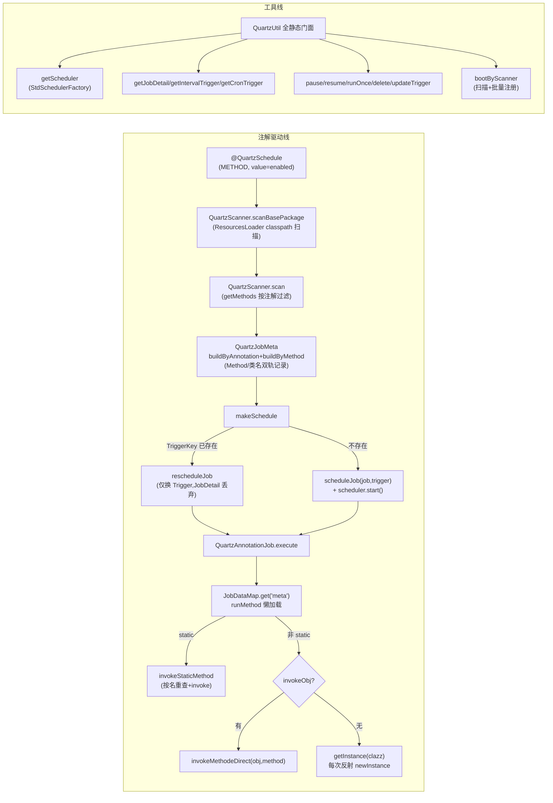

# i2f-extension-quartz

> Quartz 调度桥接扩展（quartz `2.3.2` 以 provided 引入，模块内硬编码版本）：双层结构——`QuartzUtil` 全静态门面封装 StdSchedulerFactory 调度器获取、JobDetail/Trigger（Simple 间隔 / Cron）构建与调度生命周期操作（schedule/reschedule/pause/resume/runOnce/delete）；**注解驱动线**以 `@QuartzSchedule`（METHOD 级）标注任意无参方法，`QuartzScanner` 扫描 classpath 收集注解方法生成 `QuartzJobMeta`，统一注册为固定 Job 类 `QuartzAnnotationJob` 的 JobDetail（meta 经 JobDataMap `"meta"` key 传递），执行时反射回调原方法（static 直接调、非 static 优先 `invokeObj` 否则每次反射 newInstance）。5 个主源文件（约 480 行）、零测试，仓库内唯一源码级消费方为 `i2f-springboot-quartz-starter`（Spring 容器刷新事件触发扫描并按类型注入 bean 作 `invokeObj`）。核心静态缺陷：**热更新路径仅 reschedule Trigger 而丢弃新 JobDetail**——注解方法绑定变更不生效；`QuartzJobMeta` 含 `Method/Class` 字段在 JDBC JobStore 下不可序列化。

## 模块路径

- `i2f-extension/i2f-extension-quartz`
- 根 `pom.xml` 依赖管理（1205 行）；`i2f-extension/pom.xml` 模块登记（78 行）；`i2f-extension/i2f-extension-all` 聚合依赖（265 行）

## 依赖

| 依赖 | 版本 | 作用域 | 说明 |
|------|------|--------|------|
| org.quartz-scheduler:quartz | 2.3.2 | provided | 模块内硬编码版本；quartz 自身传递依赖 c3p0/mchange-commons |
| i2f.turbo:i2f-reflect | - | compile | `ReflectResolver`：方法扫描/注解读取/反射调用/类加载 |
| i2f.turbo:i2f-resources | - | compile | `ResourcesLoader.scanClassNamesBasePackages`：classpath 全量类名扫描 |
| org.projectlombok:lombok | - | provided | `@Data`/`@SneakyThrows`（消费方 starter 亦用） |

## 架构设计



两条线在 `QuartzScanner.makeSchedule` 汇合：Job 类恒为 `QuartzAnnotationJob`，`QuartzJobMeta` 实例经 JobDataMap 传入，Trigger 按 `ScheduleType`（Interval → SimpleScheduleBuilder 毫秒间隔；Cron → CronScheduleBuilder）构建。

## 设计目的

- 把 Quartz 的 Job 类/JobDetail/Trigger 三件套样板压缩为**一个方法注解**：业务方法加 `@QuartzSchedule` 即成定时任务，无需实现 `Job` 接口
- 提供脱离 Spring 的纯 Quartz 精简门面（`QuartzUtil`），并支持 Spring 场景的自动装配（经 starter 消费：扫描包 → 从容器按类型找 bean 注入 `invokeObj` 避免重复实例化）

## 功能清单

| 入口 | 说明 |
|------|------|
| `QuartzUtil.getScheduler` | 经 `new StdSchedulerFactory().getScheduler()` 获取调度器（实际按 name 复用全局默认实例） |
| `QuartzUtil.getJobDetail` | 3 重载构建 JobDetail（class/name/group/JobDataMap） |
| `QuartzUtil.getIntervalTrigger` | 5 重载；`count >= 0` → `withRepeatCount`，`count < 0` → `repeatForever`；`startNow` |
| `QuartzUtil.getCronTrigger` | 4 重载；`startNow`；cron 表达式直传 `CronScheduleBuilder.cronSchedule` |
| `QuartzUtil.doSchedule` | `scheduleJob` + `start()`；单参版隐式获取全局 scheduler |
| `QuartzUtil.{getJobData,getTriggerData}` | 分别从 JobDetail/Trigger 的 JobDataMap 取值（**非 merged 视图**） |
| `QuartzUtil.{jobKey,triggerKey,deleteJob,updateTrigger,pauseJob,resumeJob,runOnce}` | 调度生命周期操作封装 |
| `QuartzUtil.bootByScanner` | 扫描 basePackages + 逐 meta `makeSchedule`，返回 meta 列表 |
| `QuartzScanner.{scanBasePackage,scans,scan}` | classpath 扫描 + 按注解过滤方法（`ann.value()` false 跳过） |
| `QuartzScanner.makeSchedule` | 幂等注册（getTrigger 判存 → reschedule/schedule）；JobDataMap 塞 `"meta"` |
| `@QuartzSchedule` | `value`(enabled)/`type`(Interval 默认)/`intervalTime=1000`/`intervalTimeUnit=ms`/`intervalCount=-1`(永远)/`cron="* * * * * ? *"`/`name`(必填)/`group`(默认 ""→null→DEFAULT_GROUP) |
| `QuartzJobMeta` | 注解参数快照 + `runMethod/runClass/runClassName/runMethodName` 双轨 + `invokeObj`（Spring bean 注入位） |
| `ScheduleType` | Interval/Cron 枚举；`parse` 未知字符串静默回落 Interval |

## 用法示例

```java
// 1. 注解驱动：业务方法标注即注册（starter 场景零代码装配）
public class MyJobs {
    @QuartzSchedule(name = "cleanJob", intervalTime = 5000)
    public void clean() { /* 每 5 秒 */ }

    @QuartzSchedule(name = "reportJob", type = ScheduleType.Cron, cron = "0 0 2 * * ?")
    public void report() { /* 每天 2 点 */ }
}
```

```java
// 2. 纯 Quartz 门面：手动构建与调度
Scheduler scheduler = QuartzUtil.getScheduler();
JobDetail job = QuartzUtil.getJobDetail(MyJob.class, "myJob", "grp");
Trigger trigger = QuartzUtil.getIntervalTrigger("myJob", "grp", 1000L, -1); // -1=永远
QuartzUtil.doSchedule(scheduler, job, trigger);
```

```java
// 3. Cron 触发 + 携带 JobDataMap
Trigger t = QuartzUtil.getCronTrigger("t1", "g1", "0/10 * * * * ?", datas);
```

```java
// 4. 扫描装配（bootByScanner 等价 starter 行为，但无 bean 注入）
Scheduler scheduler = QuartzUtil.getScheduler();
List<QuartzJobMeta> metas = QuartzUtil.bootByScanner(scheduler, "com.biz.jobs");
```

```java
// 5. 生命周期管理
QuartzUtil.pauseJob(scheduler, QuartzUtil.jobKey("myJob", "grp"));
QuartzUtil.resumeJob(scheduler, QuartzUtil.jobKey("myJob", "grp"));
QuartzUtil.runOnce(scheduler, QuartzUtil.jobKey("myJob", "grp"));
QuartzUtil.deleteJob(scheduler, "myJob", "grp");
Date next = QuartzUtil.updateTrigger(scheduler, QuartzUtil.triggerKey("myJob", "grp"), newTrigger);
```

```yaml
# 6. starter 配置（i2f-springboot-quartz-starter）
i2f:
  springboot:
    config:
      quartz:
        scanner:
          enable: true
          basePackages: com.biz.jobs,com.biz.jobs2   # 逗号分隔
```

## 特性总结

- **注解即任务**：`@QuartzSchedule` 标注无参方法 → 扫描注册，Job 侧反射回调，业务零侵入
- **幂等注册**：按 TriggerKey 判存，已存在则 reschedule（意图支持配置变更重放）
- **双轨元数据**：`QuartzJobMeta` 同时记录 `Method/Class`（内存态）与 `className/methodName`（字符串态），注解方法懒加载兜底
- **bean 感知**：starter 场景单 bean 类型命中即注入 `invokeObj`，避免每次反射 newInstance
- **Interval/Cron 双模**：注解参数与门面 API 双通道；`intervalCount<0` 表达永远重复

## 已知问题（静态识别，未实证）

1. **【核心·热更新断裂】`makeSchedule` 已存在 Trigger 时仅 `rescheduleJob`，新构建的 JobDetail（携带最新 `QuartzJobMeta` dataMap）被整体丢弃**——Trigger 不承载 meta（meta 只在 Job 级 dataMap），导致注解方法绑定/`invokeObj`/方法参数等变更永不生效，仅间隔/cron 数值可更新；应用重启 + JDBC JobStore 持久化场景下旧 meta 直接反序列化复活，新代码绑定丢失
2. **【JDBC JobStore 不可用】`QuartzJobMeta` 含 `Method`/`Class`/`Object invokeObj` 字段**，JobDataMap 在持久化 JobStore 下需 Java 序列化 → `NotSerializableException`；模块隐含仅支持 RAMJobStore，且 devtools 热重启下 reschedule 复用的旧 meta 引用**已关闭旧上下文的 bean**
3. **【Spring 注入歧义静默】starter `getBeansOfType` 仅在恰好 1 个 bean 时注入 `invokeObj`**，0 个或多于 1 个均静默跳过（无日志）——多 bean 场景用户以为注入了容器 bean，实际每次执行反射 newInstance（叠加缺陷 6 的 public 构造器限制）
4. **【重载解析错位】懒加载路径 `ReflectResolver.getMethod(clazz, name)` 按名解析**（无参 `getMethod` → `getDeclaredMethod` → 按名取任一），同名带参重载时解析到无参版本；`invokeStaticMethod(method)` 内部也按名重查——注解方法与实际调用方法可能不同
5. **【注册期无参数校验】`@QuartzSchedule` 方法带参数时 scan 照常收集**（谓词只查注解），执行时 `invokeMethodeDirect` 空参 invoke → 运行时 `IllegalArgumentException`，无编译期/注册期拦截
6. **【newInstance 限制】`ReflectResolver.getInstance` 仅匹配 public 构造器**——job 类无 public 无参构造器时懒加载路径抛异常
7. **【type 兜底缺失】`makeSchedule` 中 `meta.getType()` 均不匹配时（手工构建 meta、type 置 null）`trigger` 保持 null** → `scheduleJob(job, null)` NPE
8. **【cron 无校验】`meta.getCron()` 为 null 时 `CronScheduleBuilder.cronSchedule(null)` NPE**；非法表达式异常直抛
9. **【NPE】`QuartzAnnotationJob.execute` 懒加载后 `method` 未判 null**（`getMethod` 找不到返回 null）即 `Modifier.isStatic(method.getModifiers())` NPE
10. **【魔法字符串契约】JobDataMap key `"meta"` 在 `QuartzScanner`（put）与 `QuartzAnnotationJob`（get）两处硬编码**，无常量共享
11. **【check-then-act 竞态】`getTrigger` 判存 → reschedule/schedule 两步非原子**，并发注册同名 job 时后者抛 `ObjectAlreadyExistsException`
12. **【异常语义缺失】`@SneakyThrows` 直接上抛裸异常**，未包装 `JobExecutionException`——Quartz 的重试/日志语义无从表达；业务异常经反射 InvocationTargetException 多层包裹后排障失真
13. **【dataMap 语义不完整】`getJobData`/`getTriggerData` 分别只读单一来源**，未暴露 `context.getMergedJobDataMap()` 合并视图——同名 key 的 trigger 覆盖 job 惯例语义与用户预期不符
14. **【API 类型漂移】`getIntervalTrigger` 2/3 参重载为 `int milliSecond`、4/5 参为 `long`**——`getIntervalTrigger(name, group, 1000L)` 三参 long 调用无匹配重载；`count < 0` 一律 `repeatForever`（哨兵无错误区分，`withRepeatCount(-1)` 本身即 REPEAT_INDEFINITELY）
15. **【隐式全局单例】`doSchedule(job, trigger)` 每次经 `new StdSchedulerFactory().getScheduler()` 获取调度器**——实际经 `SchedulerRepository` 按 name 复用全局默认实例；用户以为得到独立 scheduler，对其 shutdown 影响全局；并发首次调用存在 instantiate 竞态窗口
16. **【生命周期无托管】`bootByScanner`/`doSchedule` 后无 shutdown 封装**——Quartz 工作线程默认非 daemon，应用无法正常退出，需用户显式 `scheduler.shutdown()`
17. **【包名拼写错误】`driven.anntation`**（annotation 错拼）——包级 API 污染，使用方 import 跟随错拼
18. **【静默回落】`ScheduleType.parse` 未知字符串静默回落 `Interval`**——配置 typo 无告警（与 ognl/oss-aliyun 同类模式）
19. **【默认值陷阱】注解默认 `cron = "* * * * * ? *"` 与 `intervalTime = 1000` 均为每秒触发**；`type=Cron` 时 interval 三参冗余、`type=Interval` 时 cron 冗余，无互斥校验
20. **【启动异常炸裂】starter `onApplicationEvent` 以 `@SneakyThrows` 包裹扫描**——任一注解方法反射异常直接炸 Spring 上下文启动；父子上下文（SpringMVC）场景 ContextRefreshedEvent 触发两次重复扫描
21. **【工程细节】`QuartzScannerConfig` 的 `applicationContext` 经 `@Autowired` 与 `ApplicationContextAware` 双通道赋值冗余，且配置类挂 `@Data` 暴露运行时 setter；`QuartzUtil` 存在 raw type `TriggerBuilder`；`TriggerBuilder.usingJobData` 在 trigger 级塞 dataMap 而 meta 消费端只读 job 级——API 允许但语义易误用；模块零测试**

## 生态位置

| 方向 | 模块 | 交互 |
|------|------|------|
| 下游消费 | `i2f-springboot-quartz-starter` | `QuartzScannerConfig`（`ApplicationListener<ContextRefreshedEvent>`）：读 `i2f.springboot.config.quartz.scanner.basePackages` 扫描注册，`getBeansOfType` 单命中注入 `invokeObj`；依赖本模块 + spring-boot-starter-quartz + quartz + c3p0（全 provided+optional） |
| 聚合 | `i2f-extension-all` | 聚合依赖（265 行） |
| 底座 | `i2f-reflect` / `i2f-resources` | 方法扫描与反射调用 / classpath 类名扫描 |
