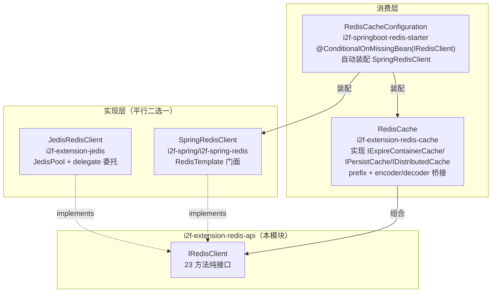

# i2f-extension-redis-api

> Redis 统一客户端契约模块：仓库内最小的扩展模块之一——**单接口 `IRedisClient`（72 行 23 方法）**，零 Redis 客户端依赖（pom 仅声明 lombok 且源码零使用，属冗余）。接口采用 Spring Data Redis 风格签名（`hasKey`/`set`/`expire`/`getExpire`/`keys` + `listXxx` + `hashXxx` 三组），覆盖 string/list/hash 三种数据结构与过期管理。它是 i2f Redis 体系的 **SPI 中枢**：向下有两个平行实现（`i2f-extension-jedis` 的 `JedisRedisClient`、`i2f-spring/i2f-spring-redis` 的 `SpringRedisClient`），向上有一个缓存适配（`i2f-extension-redis-cache` 的 `RedisCache` 桥接 `i2f-cache-std` 三契约）与一个 starter 自动装配（`i2f-springboot-redis-starter` 的 `RedisCacheConfiguration`，`@ConditionalOnMissingBean(IRedisClient.class)` 允许外部替换实现）。核心静态缺陷：**接口层零语义文档（23 方法仅 2 个有 javadoc），关键契约（SETNX 语义、负数超时哨兵、`del` 返回旧值、push 方向）全部缺位，已实际引致双实现在 6 个方法上行为分歧**——同一段业务代码切换实现会产出相反的列表顺序、不同的返回值与不同的原子性保证。

## 模块路径

- `i2f-extension/i2f-extension-redis-api`
- 根 `pom.xml` 依赖管理（1210 行）；`i2f-extension/pom.xml` 模块登记（79 行）；`i2f-extension/i2f-extension-all` 聚合依赖（269 行）

## 依赖

| 依赖 | 版本 | 作用域 | 说明 |
|---|---|---|---|
| `org.projectlombok:lombok` | 继承父 POM | compile（继承） | **冗余**——接口源码零注解零 import |
| （无任何 Redis 客户端依赖） | - | - | 纯契约模块，Jedis/Spring Data Redis 均由实现方引入 |

## 架构设计



契约三组能力：string（`set`×2/`get`/`del`/`setUnique`/`hasKey`/`expire`/`getExpire`/`keys`/`flushDb`）、list（`listPush`/`listLength`/`listAll`/`listAt`/`listSet`）、hash（`hashSet`/`hashGet`/`hashSetMap`/`hashGetAll`/`hashSize`/`hashDelete`）。所有实现均持有可选 `prefix` 做 key 空间隔离（`wrapKey`：null 不拼接）。

## 设计目的

- **解耦 Redis 客户端选型**：业务代码面向 `IRedisClient` 编程，Jedis 直连与 Spring Data Redis 托管两条路线可互换
- **统一 Spring 风格 API**：方法命名对齐 `RedisTemplate`（`hasKey`/`opsForValue` 语义），降低迁移心智
- **作为缓存体系底座**：配合 `RedisCache` 把 Redis 能力适配为 i2f-cache-std 的过期/持久/分布式三合一缓存契约

## 功能清单

| 方法 | 契约语义（接口未声明，实为两实现合成语义） | 分歧 |
|---|---|---|
| `set(key,val[,sec])` | 秒级超时，负数哨兵=永不过期（实现层约定） | Jedis set+expire 两步非原子；Spring 单条 SET EX 原子 |
| `setUnique(key,val,sec)` | SETNX 不存在才写 | Jedis setnx+expire 两步；Spring `setIfAbsent(k,v,sec)` 单条原子 |
| `del(key)` | **返回被删旧值**（非 Redis DEL 的删除个数） | 两实现均 get+del 两步非原子 |
| `listPush(key,values...)` | 推入方向**未声明** | Jedis `lpush` 左推 vs Spring `rightPushAll` 右推——**顺序相反** |
| `listAll(key)` | 全量读 | 两实现均 llen/size + range 两步竞态，非 `lrange(0,-1)` |
| `listSet(key,idx,val)` | 返回值语义未声明 | Jedis 返回 "OK" 状态串 vs Spring 返回旧值（且旧值读取键被双重包 prefix） |
| `hashSet(key,f,v)` | 返回值语义未声明 | Jedis 返回 hset 新增标记（0/1）vs Spring 返回 put 后 hash 总 size |
| `keys(patten)` | 模式匹配（KEYS 命令 O(N) 阻塞，无警示） | - |
| `flushDb()` | 清空当前 DB（毁灭性操作，无防护） | Spring 实现裸取连接不释放 |

## 用法示例

```java
// 1. Jedis 直连实现（JedisMeta 四参：host/port/password/database）
IRedisClient client = new JedisRedisClient("app:", new JedisMeta("127.0.0.1", 6379, "pwd", 0));

// 2. Spring 托管实现（RedisTemplate 由容器提供）
IRedisClient client = new SpringRedisClient("app:", redisTemplate);

// 3. 基础 KV
client.set("user:1", "{\"name\":\"tom\"}", 3600);
String val = client.get("user:1");
boolean fresh = client.setUnique("lock:order:1", "holder", 30); // SETNX 语义（实现各异）

// 4. List 与 Hash
client.listPush("queue", "a", "b", "c");
List<String> all = client.listAll("queue");
client.hashSet("user:1", "name", "tom");
Map<String, String> fields = client.hashGetAll("user:1");

// 5. 缓存适配（i2f-extension-redis-cache）
RedisCache cache = new RedisCache("biz:", client, JSON::toJSONString, JSON::parseObject);
cache.set("k", obj, 60, TimeUnit.SECONDS);

// 6. Spring Boot 自动装配（i2f-springboot-redis-starter，零代码）
// i2f.spring.redis.redis-cache.client-prefix=app:
// i2f.spring.redis.redis-cache.cache-prefix=biz:
@Autowired private IRedisClient redisClient;
```

## 特性总结

- **纯契约零依赖**：接口模块不拖入任何 Redis 客户端，选型权完全交给实现方/使用方
- **双实现生态**：Jedis 直连（自管连接池，testOnBorrow/Return/Create/WhileIdle 全开）与 Spring Data Redis（复用容器 RedisTemplate 与序列化体系）
- **prefix 隔离约定**：三层（Client prefix / Cache prefix）均可选拼接，实现逻辑同构复制
- **starter 可替换**：`@ConditionalOnMissingBean(IRedisClient.class)` 保留外部自定义实现的装配后门

## 已知问题

1. **【核心·契约缺位】23 方法仅 2 个有 javadoc**，以下关键语义全部未声明，只能靠读实现源码反推：`setUnique` 的 SETNX 语义、`timeOutSecond` 负数哨兵（-1=不过期）、`del` 返回"被删旧值"（与 Redis DEL 返回删除个数的语义错位）、`listPush` 推入方向、各返回值含义
2. **【实现分歧·listPush 方向相反】**Jedis 版 `lpush`（左推）vs Spring 版 `rightPushAll`（右推）——同一调用切实现后列表顺序完全相反，`listAt(0)` 一个是最新一个是最旧元素
3. **【实现分歧·setUnique 原子性】**Jedis 版 setnx 后再 expire 两步——**经典分布式锁缺陷**：setnx 成功而 expire 失败（网络抖动/进程崩溃）时锁永不过期；Spring 版 `setIfAbsent(k,v,sec)` 单条原子，同接口安全等级不同
4. **【实现分歧·set 原子性】**Jedis 版 set+expire 两步非原子（崩溃窗口内 key 永不过期）；Spring 版单条 SET EX
5. **【实现分歧·hashSet 返回值】**Jedis 返回 hset 新增标记（0/1）；Spring 返回 put 后 hash 总 size（且 size 单独二次往返，读到的值与本次 put 有竞态）
6. **【实现分歧·listSet 返回值】**Jedis 返回 lset 状态串（"OK"）；Spring 返回旧值——且 Spring 版取旧值时 `listAt(wrapKey(key), index)` 把已包裹的 key 再传给内部同样会 wrapKey 的 `listAt`，**prefix 双重拼接读错键**（恒读到 null，返回旧值功能实际失效）
7. **【del 非原子】**两实现均 get+del 两步——get 与 del 之间其他客户端可改值，返回值可能是过期快照；接口签名（返回 String 而非 Long）本身逼出这一结构
8. **【listAll 两步竞态】**两实现均 llen/size + range 两步而非 `lrange(0,-1)` 单条；Spring 版 size 为 null 时兜底 `Integer.MAX_VALUE` 传给 range，行为依赖底层实现容忍
9. **【Spring 版 hashGetAll 真 bug】**循环内向**遍历中的 `entries()` 返回 map** `map.put(...)`（而非新建的 `ret`）——新建 ret 恒返回空 map，且对遍历中 map put 新键可抛 `ConcurrentModificationException`
10. **【Spring 版 flushDb 连接泄漏】**`getConnectionFactory().getConnection()` 裸取连接，无 `RedisConnectionUtils.releaseConnection`/关闭——泄漏连接
11. **【毁灭性操作无防护】**`flushDb()` 暴露在通用客户端接口上无任何确认/防护；下游 `RedisCache.clean()` 直接调用——**prefix 隔离的缓存 clean 语义清空整个 DB**（同库其他应用数据一并被毁）
12. **【keys 阻塞命令无警示】**`KEYS` 是 O(N) 阻塞命令，生产大库 keys("*") 卡死 Redis；接口命名 `patten` 拼写错误（pattern）
13. **【get/del 类型扁平化分歧】**Spring 版 `String.valueOf(template...get(...))` 对非 String 值做 toString 扁平化，与 Jedis 版纯字符串存储行为分歧；序列化体系（Jackson2Json）产物往返不对称风险由下游 encoder 承担
14. **【starter 编解码字节损毁】**RedisCacheConfiguration 的 encoder 把 `serializer.serialize` 的二进制结果 `new String(bytes,"UTF-8")`、decoder `getBytes("UTF-8")` 还原——非 UTF-8 安全的字节序列（Jackson 产物含合法 UTF-8 时侥幸，其他序列化器如 JDK/Hessian 必损毁）
15. **【lombok 冗余依赖】**pom 声明 lombok 但接口源码零注解零 import
16. **【异常语义未定义】**`listAt`/`listSet` 越界、`hashSetMap` 失败、连接失败等场景的异常类型与返回值约定缺失，两实现（如 `JedisRedisClient.getJedis` 3 次重试后返回 null 再由 delegate 抛 IllegalStateException）行为各异

## 生态位置

| 角色 | 模块 | 说明 |
|---|---|---|
| 实现 | `i2f-extension-jedis`（`JedisRedisClient`） | JedisPool + delegate 委托，自管连接池 |
| 实现 | `i2f-spring/i2f-spring-redis`（`SpringRedisClient`） | RedisTemplate 门面，复用容器序列化 |
| 消费 | `i2f-extension-redis-cache`（`RedisCache`） | 桥接 i2f-cache-std 三契约（IExpireContainerCache/IPersistCache/IDistributedCache） |
| 消费 | `i2f-springboot-redis-starter`（`RedisCacheConfiguration`） | 自动装配 SpringRedisClient + RedisCache，可 MissingBean 替换 |
