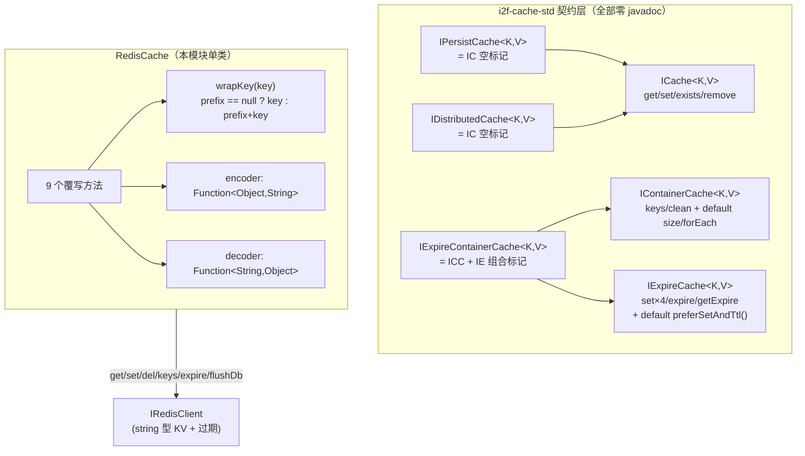
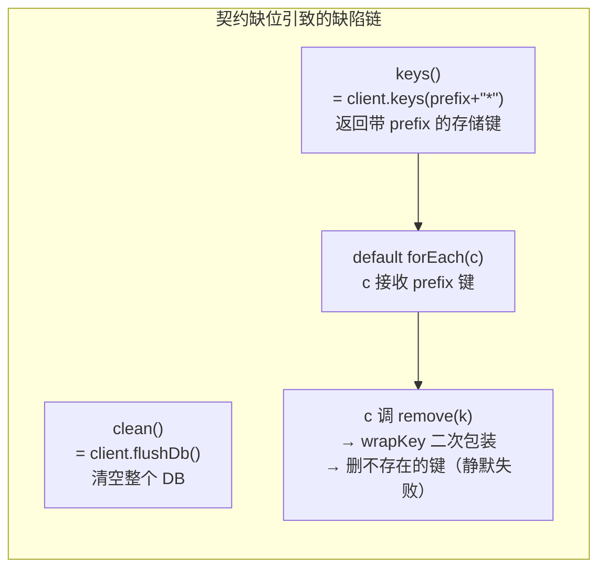

# i2f-extension-redis-cache

> Redis 缓存适配扩展：仓库内最小的扩展模块之一——**单类 `RedisCache`（92 行）**，把 `IRedisClient`（`i2f-extension-redis-api` 的 string 型 KV 契约）向上适配为 `i2f-cache-std` 的**三个缓存契约**：`IExpireContainerCache<String,Object>`（容器 + 过期组合接口）、`IPersistCache<String,Object>`、`IDistributedCache<String,Object>`（后两者为空标记接口）。核心机制是 **prefix 键空间隔离**（`wrapKey` 前缀拼接）+ **可注入编解码器**（`Function<Object,String>` / `Function<String,Object>`，由装配方注入 JSON 序列化）。它是 i2f Redis 体系的「缓存语义层」：向下桥接 `IRedisClient` 双实现（jedis / spring-redis），向上被 starter 自动装配（`i2f-springboot-redis-starter` 的 `RedisCacheConfiguration`）与两个 token 会话持有器消费（security/shiro starter，窄化为 `IExpireCache` 存 30 分钟 token）。核心静态缺陷：**`clean()` 直接 `flushDb()` 清空整个 Redis DB**（prefix 隔离语义完全失效，数据灾难级）；`keys()` 返回带 prefix 的存储键致 default `forEach`/`remove` 组合二次包装删错键。

## 模块路径

- `i2f-extension/i2f-extension-redis-cache`
- 根 `pom.xml` 依赖管理（1215 行）；`i2f-extension/pom.xml` 模块登记（80 行）；`i2f-extension/i2f-extension-all` 聚合依赖（273 行）

## 依赖

| 依赖 | 版本 | 作用域 | 说明 |
|------|------|--------|------|
| `i2f-extension-redis-api` | 继承父 POM | compile | `IRedisClient` string 型 KV 契约（本模块唯一实际使用的内部依赖） |
| `i2f-cache` | 继承父 POM | compile | **冗余依赖**：源码只用其传递依赖 `i2f-cache-std` 的契约接口，`i2f-cache` 自身的 impl 类（MapCache/ExpireCacheWrapper）零引用 |
| lombok | 继承父 POM | provided | **冗余依赖**：源码零 import，构造器手写 |

> 三契约接口（`IExpireContainerCache`/`IPersistCache`/`IDistributedCache`）均来自 `i2f.cache.std.*` 包（`i2f-cache-std` 模块），经 `i2f-cache` 的 compile 传递依赖可见——这也是 `i2f-cache` 冗余声明未被编译器暴露的原因。

## 架构设计





- **prefix 隔离**：`wrapKey` 在每个键操作前拼接 `prefix`（构造注入，可为 null = 不隔离）；`keys()` 用 `wrapKey("*")` 模式匹配圈定本容器键集
- **编解码器注入**：值序列化完全外置——`encoder` 把 `Object` 变 `String`、`decoder` 逆向；`RedisCache` 自身对格式零假设（纯 string 通道），格式兼容性责任在装配方
- **三契约一锅端**：同一实现同时声明容器/过期/持久/分布式四种角色，无差异化行为（后两者为纯标记，动机仅是让持有不同契约引用的调用方都能装下同一实例）

## 设计目的

- 在 `IRedisClient`（面向 Redis 原生操作的 string KV 契约）与 `i2f-cache-std`（面向通用缓存语义的契约族）之间架桥，使**任何面向 `ICache`/`IExpireCache`/`IContainerCache` 编程的组件**（如 token holder）都能以 Redis 为存储后端
- 以 prefix 提供**逻辑键空间隔离**，让同一 Redis DB 上多个缓存容器互不覆盖（`clean()` 除外——见已知问题）
- 把序列化决策权留给装配方：模块不绑定任何 JSON 库，starter 注入 `Jackson2JsonRedisSerializer` 即得 JSON 语义

## 功能清单

| 方法（契约来源） | 实现 | 备注 |
|------------------|------|------|
| `get(K)` | `decoder.apply(client.get(wrapKey(key)))` | 未命中时 `decoder` 收到 null，无守卫 |
| `set(K,V)` | `client.set(wrapKey(key), encoder.apply(value))` | 持久语义（IPersistCache 角色） |
| `set(K,V,time,unit)` | `client.set(wrapKey(key), encoder.apply(value), (int) unit.toSeconds(time))` | 强转 int，秒粒度 |
| `exists(K)` | `client.hasKey(wrapKey(key))` | |
| `remove(K)` | `client.del(wrapKey(key))` | |
| `expire(K,time,unit)` | `client.expire(wrapKey(key), (int) unit.toSeconds(time))` | 同样 int 强转 |
| `getExpire(K,unit)` | `unit.convert(client.getExpire(wrapKey(key)), SECONDS)` | -1/-2 哨兵透传，Long 拆箱 |
| `keys()` | `client.keys(wrapKey("*"))` | 返回**带 prefix** 的存储键，KEYS 阻塞命令 |
| `clean()` | `client.flushDb()` | **清空整个 DB**，与 prefix 隔离语义矛盾 |
| `size()`（default） | `keys().size()` | 继承 default，叠加 KEYS 成本 |
| `forEach(Consumer)`（default） | `keys().forEach(consumer)` | 继承 default，消费者拿到 prefix 键 |
| `preferSetAndTtl()`（default） | true | 未覆写，契约零文档无从校准 |

## 用法示例

```java
// 1. 直接构造（自定义 JSON 编解码）
RedisCache cache = new RedisCache("app:cache:", client,
        obj -> JsonUtil.toJsonString(obj),
        str -> JsonUtil.parseObject(str, Object.class));

// 2. 以 ICache 通用契约持有（屏蔽 Redis 细节）
ICache<String, Object> base = cache;
base.set("user:1001", userDto);
Object v = base.get("user:1001");

// 3. 以 IExpireCache 契约做会话缓存（token holder 的用法）
IExpireCache<String, Object> expire = cache;
expire.set("token:abc", userInfo, 30, TimeUnit.MINUTES);
Long ttl = expire.getExpire("token:abc", TimeUnit.SECONDS);

// 4. 容器操作（注意缺陷：keys 返回带 prefix 的键）
Collection<String> ks = ((IContainerCache<String, Object>) cache).keys();
// ks 中元素是 "app:cache:user:1001"——直接传回 get/remove 会二次包装而失配
// ⚠ clean() 会 flushDb 清空整个 DB，绝不可在共享 DB 上调用
```

```java
// 5. Spring 装配（i2f-springboot-redis-starter 的 RedisCacheConfiguration 行为）
// i2f.spring.redis.redis-cache.cache-prefix=app:cache:
// i2f.spring.redis.redis-cache.client-prefix=app:
@Bean
@ConditionalOnMissingBean(RedisCache.class)
public RedisCache redisCache(IRedisClient redisClient) {
    return new RedisCache(cachePrefix, redisClient, encoder, decoder);
}

// 6. security starter 消费（窄化为 IExpireCache，30 分钟 token 会话）
@Autowired
RedisCache redisCache;  // afterPropertiesSet 中 cache = redisCache
```

## 特性总结

- **单类极简桥接**：92 行完成 Redis → 通用缓存契约的全部适配，无额外抽象层
- **三契约一锅端**：一个实例同时满足 `IExpireContainerCache`/`IPersistCache`/`IDistributedCache` 引用持有
- **prefix 键空间隔离**（除 `clean()` 外的一贯语义）
- **编解码器外置**：零 JSON 库耦合，格式责任在装配方
- **不可变字段**：4 个 final 语义字段（虽未标 final）构造后不变，天然线程安全
- **default 方法继承**：`size()`/`forEach()` 免费获得，但踩中 `keys()` 的 prefix 缺陷（见已知问题）

## 已知问题（静态识别，未实证）

1. **【数据灾难·核心】`clean()` 直接 `client.flushDb()`**：清空**整个 Redis DB** 而非本 prefix 容器——同库其他应用数据、本应用其他 prefix 缓存一并被毁。`IContainerCache.clean()` 契约零 javadoc，但 `Map.clear()` 直觉语义应为"清空本容器"；正确实现应为删除 `wrapKey("*")` 匹配键。starter 的 `cachePrefix` 是可选配置（默认 null = 不隔离），装配方极易在共享 DB 上误触发
2. **【契约错位·keys() 返回值带 prefix】**：`keys()` 返回 `client.keys(wrapKey("*"))` 即**存储键**而非业务键——调用方把返回值传回 `get/remove` 会被 `wrapKey` 二次包装而操作不存在的键。default `forEach` 消费者拿到的同样是 prefix 键，`keys().forEach(this::remove)` 这类自然写法**全部静默失效**（del 无声失败）。正确实现应剥离 prefix
3. **【缺陷链放大】default `size()`/`forEach()`** 继承自 `IContainerCache` 且基于 `keys()`——size 的每次调用都是一次 KEYS 全库模式扫描；forEach 组合 remove 即第 2 条缺陷链
4. **【阻塞命令】**：`keys()` 底层 `KEYS prefix*` 为 O(N) 阻塞主线程命令，大库上卡死 Redis；无 SCAN 替代、无告警
5. **【溢出/精度】`(int) timeUnit.toSeconds(time)`**：超过 `Integer.MAX_VALUE` 秒（约 68 年）的过期时间静默溢出为负/错值；毫秒精度被压扁为秒；无 `Math.toIntExact` 溢出检测——应改用毫秒粒度 `PEXPIRE` 路径
6. **【哨兵语义靠巧合】**：`time=-1`（TimeUnit.SECONDS）经转换恰好等于 `IRedisClient.set` 的"-1=不过期"哨兵——但 `time=-1, TimeUnit.MINUTES` 得 -60，负数解释完全依赖实现方约定，契约未定义，设计上属巧合性通过
7. **【NPE 面·decoder】**：`get` 未命中时 `client.get` 返 null 直接进 `decoder.apply(null)`——本类无守卫；starter 的 decoder 恰好有 `str == null` 判空才未炸，自定义 decoder 不判空即 NPE
8. **【NPE 面·encoder（消费方传导）】**：starter 的 encoder `new String(serializer.serialize(obj), "UTF-8")` 无 `obj == null` 判空——`Jackson2JsonRedisSerializer.serialize(null)` 返回 null 时 `new String(null, ...)` 直接 NPE；`set(key, null)` 场景必炸（null 值语义在契约与本类双层缺位）
9. **【序列化损毁（消费方传导）】**：starter 的 `new String(bytes,"UTF-8")` / `str.getBytes("UTF-8")` 往返对**非 UTF-8 安全**的序列化器（JDK/Hessian 二进制流）必损毁数据——string 通道设计 + 字符串往返的组合缺陷，本类的"编解码器外置"未对字节型负载提供 byte[] 通道
10. **【双 prefix 可选无强制】**：`cachePrefix`（缓存层）与 `clientPrefix`（客户端层）均可不配——都不配时所有 `RedisCache` 共享无隔离键空间，与第 1 条 `clean()` 叠加成全库灾难；prefix 无分隔符校验（`"app"` 与 `"appu"` 前缀碰撞）
11. **【getExpire 哨兵透传 + 拆箱】**：`-1`（无过期）/`-2`（键不存在）原样经 `unit.convert` 透传给调用方——语义未在契约文档定义；`client.getExpire` 返回 Long 拆箱，实现若返 null 即 NPE（`IRedisClient.getExpire` 契约未定义 null 行为）
12. **【标记接口承载缺失】**：`IPersistCache`/`IDistributedCache` 为空标记接口，实现无任何差异化行为——"持久"与"分布式"语义全靠接口名承载（`IPersistCache.set` 恰为无过期版本属巧合），三契约一锅端声明的动机无从考证，契约层 6 个文件全部零语义文档
13. **【V=Object 类型承诺失真】**：string 通道 + 无类型信息 JSON 解码下，复杂泛型值解码为 `LinkedHashMap`——`IPersistCache<String,Object>` 的 V=Object 承诺与实际返回类型不符（Jackson defaultTyping 未开启时的通病）
14. **【冗余依赖×2】**：`i2f-cache`（源码只用其传递的 `i2f-cache-std` 接口，impl 类零引用）与 lombok（源码零 import）均为冗余声明
15. **【preferSetAndTtl 语义悬空】**：`IExpireCache.preferSetAndTtl()` default true 零文档，本类未覆写——该契约暗示的"实现偏好"（优先 set+ttl 两步还是原子 SET EX）无从校准，实现用单条 `SET key val EX sec`，与 default 声明的关系不明

## 生态位置

| 角色 | 模块 | 说明 |
|------|------|------|
| 上游契约 | `i2f-extension-redis-api` | 提供 `IRedisClient` |
| 平行实现 | `i2f-extension-jedis` / `i2f-spring/i2f-spring-redis` | `JedisRedisClient` / `SpringRedisClient` 均可注入本模块 |
| 装配方 | `i2f-springboot/i2f-springboot-redis-starter` | `RedisCacheConfiguration`：`@ConditionalOnMissingBean(RedisCache.class)` + `@ConditionalOnExpression` 开关，注入 `SpringRedisClient` 与 `Jackson2JsonRedisSerializer` 编解码器 |
| 消费方 | `i2f-springboot/i2f-springboot-security-starter` | `RedisTokenHolder`：`@Autowired RedisCache` 窄化为 `IExpireCache`，30 分钟 token 会话 |
| 消费方 | `i2f-springboot/i2f-springboot-shiro-starter` | `RedisShiroTokenHolder`：`@ConditionalOnBean(RedisCache.class)` 同构窄化 |

> 本模块是 i2f Redis 体系中唯一把 `IRedisClient` 提升为 `i2f-cache-std` 通用缓存契约的节点；`clean()`/`keys()` 两条缺陷经 starter 装配与 token 会话场景直接暴露给终端应用。
