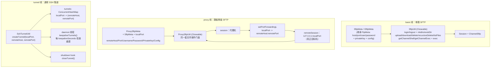

# i2f-extension-sftp

> SFTP/SSH 桥接扩展（jsch `0.1.55` 以 provided 引入，模块内硬编码版本）：三条能力线——①**basic 线** `SftpUtil`：单会话 `ChannelSftp` 门面，封装登录（密码/私钥）、递归建目录、上传/下载（流/File 双形态）、删除/递归删除/列举，附带 `ChannelShell`/`ChannelExec` 通道直取与多线程异步 `exec`（CountDownLatch 超时控制）；②**proxy 线** `ProxySftpUtil`：经代理机 `setPortForwardingL` 本地端口转发后二次会话到真正目标机的两级 SFTP（跳板场景）；③**隧道线** `SshTunnelUtil`：通用 SSH 本地端口正向隧道（`localHost:localPort -> sshHost -> remoteHost:remotePort`），daemon 线程周期 keepalive 重连 + shutdown hook 清理，典型用途是给 MySQL/Redis 等 TCP 服务套跳板。配置契约 `ISftpMeta`/`SftpMeta` 继承自 `i2f-extension-ftp` 的 `IFtpMeta`/`FtpMeta`（仅为元数据继承，Commons Net 为 provided 不传递，SFTP 传输层是 jsch）。7 个主源文件（约 960 行）、零测试；仓库内源码级消费方为 `i2f-springboot-ops-starter`（ssh 文件管理/命令控制台）与 `i2f-springboot-ssh-tunnel-starter`（环境准备期自动建隧道）；注意 `i2f-extension-filesystem-sftp` 是**平行独立实现**（自带同名 Meta，不消费本模块）。

## 模块路径

- `i2f-extension/i2f-extension-sftp`
- 根 `pom.xml` 依赖管理（1225 行）；`i2f-extension/pom.xml` 模块登记（82 行）；`i2f-extension/i2f-extension-all` 聚合依赖（281 行）

## 依赖

| 依赖 | 版本 | 作用域 | 说明 |
| --- | --- | --- | --- |
| `com.jcraft:jsch` | 0.1.55 | provided | SFTP/SSH 传输层；模块内硬编码版本，上游 2018 年后停更（社区维护版为 `com.github.mwiede:jsch`） |
| `i2f.turbo:i2f-extension-ftp` | - | compile | 仅继承 `IFtpMeta`/`FtpMeta` 配置契约；其 Commons Net 为 provided 非传递，不引入 FTP 运行时 |
| `i2f.turbo:i2f-io-file` | - | compile | `FileUtil.useDir`/`useParentDir` 本地目录保障 |
| `org.projectlombok:lombok` | - | compile | 仅 `SshTunnelUtil` 使用 `@Data`/`@NoArgsConstructor` |

## 架构设计



**隧道流量路径**（SshTunnelUtil javadoc 自述）：`localHost:localPort -> sshHost:sshPort -> remoteHost:remotePort`，基于 TCP 层正向代理，可代理数据库/Redis/HTTP 等任意 TCP 协议。**proxy 线的两级会话**：先连代理机建 `localPort→remoteHost:remotePort` 转发，再对 `127.0.0.1:localPort` 发起第二次 SSH 会话并开 sftp 通道。

## 设计目的

- **统一 SFTP 门面**：把 jsch 的 `Session/ChannelSftp` 生命周期与文件操作封装为可 Closeable 管理的工具类，调用方 `try-with-resources` 即用即弃。
- **跳板机场景**：目标 SFTP 不可直连时，经代理机端口转发完成两级会话（proxy 线）；或仅为任意 TCP 服务打洞（tunnel 线）。
- **ops 运维底座**：为 ops-starter 的 ssh 文件管理/命令执行控制台提供服务器端操作原语。

## 功能清单

| 类 | 功能 | 备注 |
| --- | --- | --- |
| `SftpUtil` | `login`/`logout`/`close` | 密码 + 私钥（`jsch.addIdentity`）；自定义 `Properties` 透传 jsch config |
| | `mkdirs`/`existDir` | 逐级建目录；`cd` 探测存在性 |
| | `upload`×2 / `download`×3 | 流与 File 双形态；`download2Dir` 落本地目录 |
| | `delete`/`deleteDir`/`recursiveDelete`/`listFiles` | 递归删除走 `ls` + 递归 |
| | `pwd`/`cd`/`realpath` | 透传 |
| | `getChannelShell`/`getChannelExec`/`exec`×2 | 交互终端、有序命令、异步 exec（超时可配、可要求输出、可指定 dir/charset） |
| `ProxySftpUtil` | 同 basic 文件操作 + `exec` | 经两级会话；`exec` 用 ChannelShell 实现 |
| `SshTunnelUtil` | `createTunnel`/`closeTunnel`/`setup`/`keepaliveTunnels` | 多隧道注册表 + 自动重连 + JVM 钩子清理 |
| `SftpMeta`/`ProxySftpMeta` | 配置元数据 | 链式 setter（部分）；config 默认空 `Properties` |

## 用法示例

```java
// 1. basic 线：单跳 SFTP 上传下载（try-with-resources 自动 logout）
try (SftpUtil sftp = new SftpUtil(
        new SftpMeta().setHost("10.0.0.1").setPort(22)
                .setUsername("web").setPassword("pwd")) .login()) {
    sftp.mkdirs("/data/files");
    sftp.upload("/data/files", new File("local.zip"));
    File out = sftp.download("/data/files", "local.zip", new File("d:/out/local.zip"));
    for (ChannelSftp.LsEntry e : sftp.listFiles("/data/files")) { /* ... */ }
}

// 2. 递归删除远程目录（含子树；注意：对普通文件会静默无操作，见已知问题）
try (SftpUtil sftp = new SftpUtil(meta).login()) {
    sftp.recursiveDelete("/data/old-dir");
}

// 3. exec：异步执行远程命令（超时毫秒、工作目录、字符集）
try (SftpUtil sftp = new SftpUtil(meta).login()) {
    String out = sftp.exec(true, 10_000, "ls -l /data", "/data", "UTF-8");
    // exec(String) 等价 exec(true, -1, cmd, null, null) —— 无超时永久等待
}

// 4. proxy 线：经代理机两级会话
try (ProxySftpUtil sftp = new ProxySftpUtil(
        new ProxySftpMeta()/* proxyHost/Port + localPort + remoteHost/Port/... */).login()) {
    sftp.upload("/data", new File("local.zip"));
}

// 5. tunnel 线：给 MySQL/Redis 打洞（须在数据源创建之前完成）
SshTunnelUtil tunnel = new SshTunnelUtil("10.12.x.1", 22, "web", "123xxxx")
        .createTunnel(3306, "10.4.x.7", 3306)
        .createTunnel(16379, "10.8.x.3", 6379)
        .setup();
// 此后 localhost:3306 即 10.4.x.7:3306

// 6. starter 场景：ops-starter 控制台按请求新建 SftpUtil 会话；
//    ssh-tunnel-starter 在 ApplicationEnvironmentPreparedEvent 早期
//    按 i2f.springboot.ssh.tunnel 配置批量 createTunnel + setup()
```

## 特性总结

- **双 SFTP 形态 + 通用隧道**三线互不依赖，可单独取用；配置元数据与 ftp 模块共享契约（`FtpMeta` 继承）。
- **私钥/密码/自定义 config** 三通道认证；jsch `Properties` 完整透传。
- **proxy 线两级会话**天然支持跳板 SFTP；**tunnel 线** daemon keepalive + shutdown hook 全自动托管。
- 通道级直取（`ChannelShell`/`ChannelExec`）为上层控制台场景留了逃生门。

## 已知问题（静态识别，未实证）

**SftpUtil / ProxySftpUtil（文件操作线）**

- **【核心·私钥认证失效】`login` 硬编码 `PreferredAuthentications=password`**：jsch 该配置语义是"限定尝试的认证方法列表"而非优先级排序——仅配 `privateKey`（无密码）时 publickey 根本不在列表内，**私钥认证必然失败**；javadoc 注释"优先使用 password 验证"与实际"仅使用"语义错位。唯一自救是经 `config` 自定义属性覆盖，但无任何文档提示。
- **【核心·静默无操作】`recursiveDelete` 对普通文件完全失效**：`ls(file)` 返回文件自身 entry → 拼接出 `path + "/" + filename` 双重路径（如 `/a/b.txt` → `/a/b.txt/b.txt`）→ `rm` 抛 `SSH_FX_NO_SUCH_FILE` 恰好被吞 → 打印 `path not exists` 后**正常返回，文件实际未删**（javadoc 却声称"递归删除目录/文件"）；目录路径因 child 拼接正确而幸存。
- **`recursiveDelete` 的 `isDir` 判定污染**：循环内对每个 entry 无条件置 `true`，与文件/目录类型无关——变量语义完全失效，实际删除分支由上述路径拼接错误间接形成。
- **【危险 API 无守卫】`recursiveDelete` 无路径防护**：传 `/` 即递归删除整站；配合上层拼接参数即是远程任意删除面。
- **【相对路径漂移】`mkdirs` 强制绝对化**：逐级拼接以 `/` 开头，`serverPath="a/b"` 会被创建为 `/a/b` 并 cd 进去——相对路径语义整体丢失。
- **【会话级副作用】`upload`/`download`/`delete` 均先 `cd(serverPath)`**：改变会话当前目录且不恢复，后续相对路径操作漂移；`existDir` 的 `cd(bak)` 失败被吞且返回 false → `mkdir` 已存在目录 → `SSH_FX_FAILURE` 误报。
- **`existDir` 语义三重偏**：cd 探测实为"存在且是目录"（文件路径误判不存在）；`e.printStackTrace()` 直写 stderr 非日志；每层 3 次 pwd/cd 往返，深路径 O(3n) 慢。
- **【流泄漏】异常路径不关流**：`upload(File)`/`download(File)` 的 `is/os` 无 try-finally，中途抛异常即泄漏；`upload(is)` 不关流且契约未声明所有权。
- **【exec 超时半挂】**：`latch.await` 超时后后台线程继续读流/占 channel，无取消无中断——线程泄漏；且后台是**非 daemon 线程**，远程挂死时 JVM 退出被拖住；`waitForMillsSeconds=0` 表示"完全不等待"（立即返回空结果 + `exit status: -1`），语义陷阱。
- **【exec stderr 死锁面】**：只读 `getInputStream` 从不消费 `getErr`——远程 stderr 大量输出撑满 SSH 窗口即挂死（经典 jsch 陷阱）。
- **`exec` 的 exit status 不可靠**：channel 未完全关闭时 `getExitStatus()` 可能 -1 仍输出 `exit status: -1` 误导排查；`StringBuffer` 同步冗余（latch 已提供 happens-before）。
- **【无连接超时】**：`session.connect()`/`channel.connect()` 均无超时参数——网络故障时调用线程无限挂起。
- **【线程安全】**：单 `Session/ChannelSftp` 无任何同步，cd 会话状态 + 并发操作相互干扰；`login` 不检查已有会话，重复调用丢弃旧 `Session/Channel` 不 disconnect（泄漏）。
- **【未 login NPE 面】**：`getChannelShell`/`getChannelExec`/`pwd` 等直接解引用 `session`/`channelSftp` 无状态守卫。
- **【安全】`StrictHostKeyChecking=no`**：主机密钥校验关闭（MITM 面），basic/proxy 两线同。
- **Proxy 线【接线缺失】**：`IProxySftpMeta.getRemotePrivateKey()` 接口已声明但 `login` **从未使用**——remoteSession 仅支持密码认证，remote 私钥配置整体被忽略。
- **【exec 语义分裂】**：basic 版 `ChannelExec`+exitStatus+charset+超时 vs proxy 版 `ChannelShell`（命令回显/prompt/banner 全部混入输出）+平台默认 charset+无 exit status+无超时永久阻塞——同名方法两套行为。
- **【泛型丢失】**：`ProxySftpUtil.listFiles` 返回 `Vector<?>`（basic 版是 `Vector<ChannelSftp.LsEntry>`）——复制粘贴泛型擦除。
- **Meta 族**：`SftpMeta.setConfig(null)` → `login` 遍历 NPE（Proxy 的 remoteConfig 同）；链式 setter 不一致（`setPrivateKey` 返回 this、`setConfig` void，Proxy 版全手写 void 未用 lombok）。

**SshTunnelUtil（隧道线）**

- **【JVM 无法退出】shutdown hook 与 keepalive 锁竞争**：hook 调 `closeTunnel()`（synchronized）；若 keepalive 线程正持锁在 `getSession()` 重连（connect 无超时、无限阻塞），hook 永久等锁——**进程退出被挂死**。
- **【脏状态半提交】`createTunnel`**：`tunnels.put` 成功后 `setPortForwardingL` 才执行，后者抛异常则注册表残留死条目，keepalive 会周期性重试坏隧道。
- **【keepalive 盲区】**：仅当 `isInvalidSession()`（session 级断链）才重建全部隧道；session 有效但个别本地监听失效时不修复。
- **【hook 泄漏】**：每实例 `addShutdownHook` 一个且无法注销，多实例场景钩子累积。
- **【JMM】**：`session` 非 volatile 的双重检查锁——未同步路径读 `session` 的可见性无保证。
- **【@Data 误用】**：`toString` 打印 `sshPassword`（凭据泄漏日志面）；`equals/hashCode` 纳入 `tunnels`(CHM)/`setup`/`keepaliveSeconds` 可变状态。
- **【吞异常】**：keepalive 循环、`delPortForwardingL`、hook 内异常全部空 catch 无日志；`closeTunnel` 后 `tunnels` 不清空，与 keepalive 存在重建竞态。

**工程与生态**

- **【starter 消费缺陷】**：`i2f-springboot-ssh-tunnel-starter` 的 `TunnelSetupConfiguration` 创建的 `SshTunnelUtil` **从未加入 `SshTunnelManager.servers`**（manager 恒为空列表，配置的隧道实例失去统一管理入口）；`createTunnel` 失败仅 `log.info` 级别。
- **【ops-starter 放大】**：`SshOpsController.upload` 用 `new FileInputStream(tmpFile)` 不关流；`exec` 拼接 `"sh -c " + fileName` 无引号（注入/空格路径面）；`waitForSeconds=0` 时 exec 立即返回空结果。
- **【版本绝版】**：jsch `0.1.55` 上游 2018 年后停更，已知安全问题不再修复（社区迁移 `com.github.mwiede:jsch`）。
- **零测试**；`System.out.println`/`printStackTrace` 直写副作用。

## 生态位置

| 方向 | 模块 | 说明 |
| --- | --- | --- |
| 被依赖 | `i2f-extension-ftp` | 本模块继承其 `IFtpMeta`/`FtpMeta` 配置契约（反向依赖：本模块 → ftp） |
| 消费方 | `i2f-springboot-ops-starter` | `SshOpsController` 9 处 try-with-resources 使用 `SftpUtil`（文件管理/exec 控制台），`SshOperateDto.meta` 承载 `SftpMeta` |
| 消费方 | `i2f-springboot-ssh-tunnel-starter` | `TunnelSetupConfiguration` 环境准备期按配置批量建隧道，`SshTunnelManager` 持有（但见已知问题：实例未实际入列） |
| 平行实现 | `i2f-extension-filesystem-sftp` | `AbsFileSystem` 适配层的独立 jsch 实现，**自带同名 `SftpMeta`/`ProxySftpMeta`，不消费本模块**；两套实现缺陷谱系各自独立 |
| 聚合 | `i2f-extension-all` | 依赖聚合登记 |
