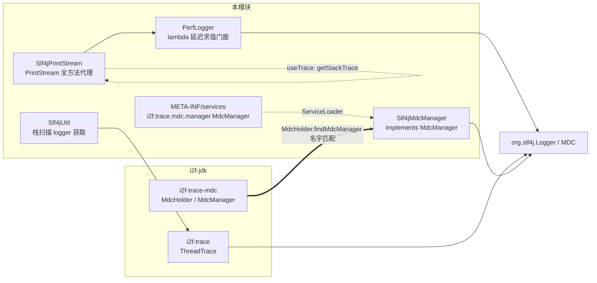
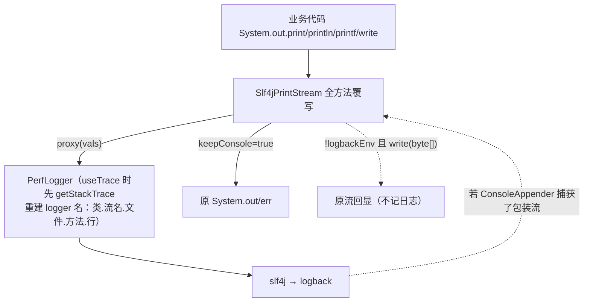

# i2f-extension-slf4j

> SLF4J 桥接增强扩展（slf4j-api `1.7.36` 以 provided 引入，版本由根 POM 属性 `${slf4j.version}` 统一供给）：4 个主源文件组成三件工具——①`PerfLogger`：以 lambda `Supplier` 延迟求值 + `isXxxEnabled` 预检查减少日志禁用时的拼接/计算开销（5 级 × 5 类重载 60+ 方法，含异常版/1~3 参泛型版/varargs 版）；②`Slf4jPrintStream`：把 `System.out`/`System.err` 重定向到 SLF4J 的 `PrintStream` 代理（全方法覆写 + 可选堆栈定位 logger 名 + 线程级日志消费钩子）；③`Slf4jUtil`：基于 `i2f-trace` 栈扫描的调用点感知 logger 获取。另含 `Slf4jMdcManager`——`i2f-trace-mdc` 的 `MdcManager` SPI 实现（直通 slf4j `MDC`），经 `META-INF/services` 注册后被 `MdcHolder` 的 ServiceLoader 扫描自动选中，是 **trace-mdc 全链路（web/feign/gateway/xxljob/powerjob/线程池装饰器）的 MDC 运行时底座**。零测试，仓库内源码级消费方为 `i2f-springboot-spring-starter`（启动时重定向控制台）与 `i2f-springboot-trace-mdc-starter`（依赖装配）。

## 模块路径

- `i2f-extension/i2f-extension-slf4j`
- 根 `pom.xml` 依赖管理（1230 行，`slf4j.version=1.7.36` 属性定义于 54 行）；`i2f-extension/pom.xml` 模块登记（83 行）；`i2f-extension/i2f-extension-all` 聚合依赖（285 行）

## 依赖

| 依赖 | 版本 | 作用域 | 说明 |
| --- | --- | --- | --- |
| org.slf4j:slf4j-api | 1.7.36 | provided | 唯一第三方 API；根 POM 54 行定义版本，本模块 dependencyManagement 重复声明（冗余） |
| i2f.turbo:i2f-trace | — | compile | `ThreadTrace` 栈扫描，供 `Slf4jUtil` 调用点感知 |
| i2f.turbo:i2f-trace-mdc | — | compile | `MdcManager` SPI 契约（零 javadoc），供 `Slf4jMdcManager` 实现 |
| org.projectlombok:lombok | — | compile | **冗余**：4 个源文件零 import |

## 架构设计



`Slf4jPrintStream` 的重定向与输出流：



## 设计目的

- **性能日志**：SLF4J 自身会判级别，但 `logger.info("a"+b)` 在禁用级别仍付出字符串拼接代价；`PerfLogger` 以 `() -> ...` 让拼接仅在级别启用时发生（构造 lambda 与实参数组仍有微开销）。
- **控制台接管**：遗留代码大量 `System.out` 时，统一进日志体系以获得级别/格式/文件输出；可选保留控制台回显与打印位置追踪。
- **MDC 解耦**：`i2f-trace-mdc` 的链路追踪需要可替换的 MDC 后端；本模块以 SPI 桥接到 slf4j 实现，使 trace-mdc-starter 无需感知具体日志门面。

## 功能清单

| 类 | 功能 | 关键点 |
| --- | --- | --- |
| `PerfLogger` | 延迟求值日志门面 | `of(Logger)` 构造；`info/warn/error/debug/trace` × `Supplier`/异常版/1~3 参版/varargs 版/`xxEx` 异常 varargs 版；`PerfSupplier`/`PerfOneSupplier`/`PerfTwoSupplier`/`PerfThreeSupplier`/`PerfExceptionSupplier` 五个函数式接口 |
| `Slf4jPrintStream` | 控制台重定向 | `redirectSysoutSyserr(keepConsole, useTrace)` 幂等包装（instanceof 防重入，sys.out→INFO、sys.err→ERROR）；覆写 print/println/printf/format/append/write 全家；`stringify` byte[] 转串；`THREAD_CONSUMER` 线程级日志消费钩子 |
| `Slf4jUtil` | 调用点感知 logger | `getLogger`（调用类名）/`getMethodLogger`（类->方法）/`getDebugLogger`（类->方法+文件+行） |
| `Slf4jMdcManager` | MDC SPI 实现 | put/get/remove/clear/copyOf/replaceAs 六方法直通 slf4j MDC |

## 用法示例

```java
// 1. PerfLogger：禁用级别时跳过拼接
PerfLogger log = PerfLogger.of(LoggerFactory.getLogger(Biz.class));
log.info(() -> "heavy: " + expensiveCompute());
log.error((e) -> "错误信息：" + e.getMessage(), ex);        // 异常版
log.warnOne((val) -> "val=" + val, 2);                      // 单参版
log.errorArgs((args) -> "w" + args[0], 1, 2);               // varargs
log.errorEx((e, args) -> "msg", ex, 1);                     // 异常 + varargs

// 2. 控制台重定向（幂等，重复调用自动跳过）
Slf4jPrintStream.redirectSysoutSyserr();                    // keepConsole=false, useTrace=true
Slf4jPrintStream.redirectSysoutSyserr(true, false);         // 保留原控制台输出、关闭栈定位

// 3. 线程级日志拦截（挂在打印发生前，打印后自行 remove）
Slf4jPrintStream.THREAD_CONSUMER.set((lg, level, content) -> { /* 采集 */ });

// 4. 调用点感知 logger
Logger l1 = Slf4jUtil.getLogger();        // 调用类名
Logger l2 = Slf4jUtil.getMethodLogger();  // 调用类->方法
Logger l3 = Slf4jUtil.getDebugLogger();   // 类->方法+文件+行（logger 名按行唯一）

// 5. MDC SPI：classpath 同时存在 i2f-trace-mdc 与本模块时自动生效
MdcHolder.put("traceId", "abc");          // MdcHolder.manager() 经 ServiceLoader 选中 Slf4jMdcManager
```

## 特性总结

- 零外部依赖膨胀：仅 slf4j-api（provided），trace 两件为仓库内部模块。
- `PerfLogger` 覆盖 5 级 × 5 形态 60+ 重载，异常版自动携带堆栈。
- `Slf4jPrintStream` 幂等重定向 + 全方法覆写 + 可选堆栈定位（logger 名精确到行号）+ `THREAD_CONSUMER` 钩子扩展点。
- `Slf4jMdcManager` 以 `META-INF/services` 无侵入接入 trace-mdc 体系，`MdcHolder` 按"slf4j 名字优先"自动选中。
- 消费链闭环：spring-starter 启动期重定向、trace-mdc-starter 装配 SPI——两条链共同构成 i2f 的"控制台入日志 + 链路追踪 MDC"基础设施。

## 已知问题（静态识别，未实证）

- **【核心·递归风险】重定向先于日志系统初始化时可能无限递归**：`BaseBootApplication.startup()` 在 `SpringApplicationBuilder.run()` **之前**调用 `redirectSysoutSyserr()`（消费方 55 行），logback 的 ConsoleAppender 在其后的日志系统初始化中捕获**已包装的 Slf4jPrintStream**——此后 `print → proxy → log → appender → write(byte[],int,int) → proxy` 形成递归链；类内唯一防线 `logbackEnv` 探测的是 `logging.config`（Spring Boot 专有属性，非 logback 原生 `logback.configurationFile`），未设置该属性时防线失效。疑似 StackOverflowError，未实证。
- **【数据黑洞】`write(byte[])` 在 `logbackEnv=true` 时既不回显也不 proxy**——直接字节写入被静默吞掉；而在 `logbackEnv=false` 时它无条件回显**且无视 `keepConsole`**（print 族则受 keepConsole 控制）——同类两路径回显语义不一致。
- **【日志丢失】`write(byte[])` 覆写内无 `proxy` 调用**：与 `write(byte[],int,int)` 行为不一致，`out.write(bytes)` 路径不产生任何日志。
- **【logger 名爆炸/内存泄漏】**`useTrace=true`（默认）时每次 `proxy` 都 `getStackTrace` + `LoggerFactory.getLogger(类.流名.文件.方法.行号)` + `new PerfLogger`——LoggerContext 按名缓存 logger，**行级唯一名导致 logger 注册表随打印位置无限增长**；`getLineNumber()` 可为 -1；每条日志的堆栈采集本身与"性能优化"主旨相悖。`Slf4jUtil.getDebugLogger` 同病。
- **【重载歧义/异常堆栈丢失】`PerfLogger` 异常版与值版重载仅类型边界不同**（`<T extends Throwable>` vs `<T>`，擦除不同可编译），但 javadoc 示例 `logger.error((e)->..., e)` 这类调用点在重载决议上有歧义或落选异常版的风险——**Throwable 实参可能被无界 T 值版接收，只记消息、堆栈静默丢失**；未实证。
- **【char[] 打印失真】`print(char[])`/`println(char[])` → `proxy(char[])` → `serializeVals` 以 `String.valueOf(Object)` 处理 → 输出 `[C@hash` 而非字符内容**（编译期静态类型 Object 选中 Object 重载）。
- **【字符集探测死代码】`stringify` 的 byte[] 三连 try（默认/UTF-8/GBK）**：`new String(byte[])` 对非法序列用替换字符而非抛异常，后两个分支不可达；实际永远以平台默认字符集解码——跨平台日志乱码隐患。
- **【多字节字符拆分】`write(byte[],int,int)` 每次调用独立转 String**——多字节 UTF-8 字符跨调用边界被拆成乱码（无连续解码缓冲）。
- **【线程安全】`proxy` 中重新赋值实例字段 `log`/`logger`**——并发打印时 logger 名错乱；`LoggerFactory.getLogger` 与字段写非原子；`THREAD_CONSUMER` ThreadLocal 无自动清理（线程池挂引用）。
- **【错误状态失真】`checkError()` 忽略 target 结果恒 false，`setError()`/`clearError()` 空实现**——PrintStream 错误标志体系整体失效。
- **【次要】**`println()` 无参代理出独立 `"\n"` 日志条目；`write(int)` 逐字节走完整日志路径（useTrace 时含 getStackTrace，二进制输出场景灾难级放大）；`printf`/`format` 的 `Formatter` 未 close；`write(byte[],int,int)` 手写拷贝循环（应 `System.arraycopy`）；构造器对字段 `log` 先初始化再覆盖；`super((OutputStream) new ByteArrayOutputStream())` 冗余强转 + 永不使用的底层缓冲；`LOGBACK_CONFIG_PROPERTY_NAME` 常量名叫 logback 配置项实为 Spring Boot 属性（命名误导）；`redirectSysoutSyserr` 的 `synchronized(System.class)` 不防外部并发 `System.setOut`。
- **【MDC 契约缺位】`MdcManager` 接口（i2f-trace-mdc）零 javadoc**：`copyOf()` 直通 `MDC.getCopyOfContextMap()` **空上下文时返回 null**，`replaceAs(null)` → `MDC.setContextMap(null)` 行为依日志实现（logback 疑似 NPE/异常）——`copyOf/replaceAs` 往返在空上下文场景（trace-mdc-starter 的 `MdcTaskDecorator` 线程池装饰正是该组合的消费者）存在未定义行为路径。
- **【SPI 选择脆弱】`MdcHolder.findMdcManager` 按"类名含 slf4j/log4j"优先且 `slf4j = manager` 逐个覆盖（后者胜）**——多个含 slf4j 名的实现时选中者由 ServiceLoader 顺序决定；系统属性 `-Dmdc.manager` 加载失败静默回落无任何告警。
- **【冗余依赖】lombok 声明但 4 个源文件零 import**；本模块 dependencyManagement 对 slf4j-api 的声明与根 POM 重复。
- **【三份分叉】`Slf4jPrintStream` 存在三份同构副本**（本模块 `i2f.extension.slf4j` / `i2f-springboot-maven-project` 的 `com.springboot.maven.slf4j` / `i2f-tools-ops` 的 `i2f.tools.slf4j`，各 471 行、hash 相异）——本模块缺陷修复需三处同步，另两份独立演化不受本模块修复影响。
- **【消费方叠加冗余】`BaseBootApplication` 在 `startup()` 与 `ApplicationStartedEvent` 两处调用 `redirectSysoutSyserr()`**——幂等跳过但第二次调用无意义；若日志系统在两次调用间重新初始化，第二次的 instanceof 防重入会跳过对已被捕获流的重包装，但不会修复第一条递归疑点。

## 生态位置

| 关系方 | 关系 |
| --- | --- |
| `i2f-jdk/i2f-trace` | 依赖：`ThreadTrace` 栈扫描（`Slf4jUtil` 的调用点感知底座） |
| `i2f-jdk/i2f-trace-mdc` | 依赖 + 实现：实现其 `MdcManager` SPI，`MdcHolder` 经 ServiceLoader 自动选中本模块实现 |
| `i2f-springboot/i2f-springboot-spring-starter` | 源码级消费方：`BaseBootApplication`/`WarBootApplication`/`SpringBootPrintBannerAutoConfiguration` 启动期调用 `redirectSysoutSyserr()` |
| `i2f-springboot/i2f-springboot-trace-mdc-starter` | 装配消费方：POM 同时依赖 i2f-trace-mdc 与本模块，使 MDC SPI 生效（web/feign/gateway/xxljob/powerjob/线程池 MDC 传播） |
| `i2f-springboot/i2f-springboot-maven-project`、`i2f-tools/i2f-tools-ops` | 平行分叉：各自持有包名不同的 `Slf4jPrintStream` 副本，不依赖本模块 |
| `i2f-extension/i2f-extension-slf4j-log` | 兄弟模块（方向相反）：把 SLF4J API 反向绑定到 i2f-log 实现（`org.slf4j.impl.StaticLoggerBinder` 等），与本模块"正向增强 slf4j"互补 |
| `i2f-extension/i2f-extension-all` | 聚合依赖 |
