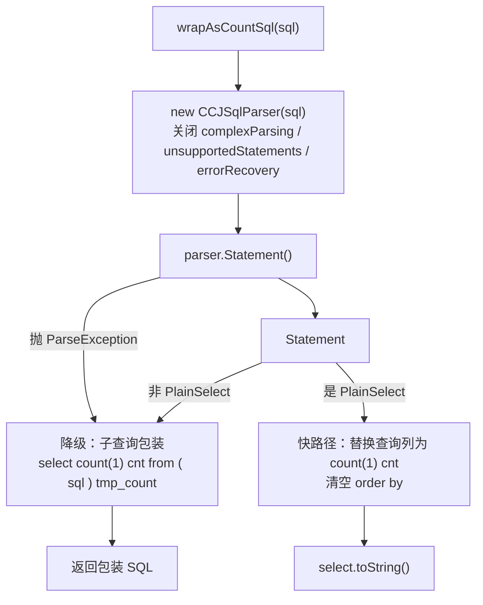

# i2f-extension-sqlparser

> SQL 解析桥接扩展（JSqlParser `4.9` 以 provided + optional 引入，版本模块内硬编码）：仓库内最小的扩展模块之一，单主源文件、单静态方法 `SqlParserUtil.wrapAsCountSql(String)`，用于把任意查询 SQL 改写为 `count(1)` 计数 SQL。核心策略是「快路径 + 降级路径」双分支：优先用 JSqlParser 把 `PlainSelect` 的查询列直接替换为 `count(1) cnt` 并剥离 `order by`（保持单层结构、计数效率更高）；一旦解析失败或语句不是简单 `PlainSelect`，则降级为子查询包装 `select count(1) cnt from ( 原SQL ) tmp_count`（通用但效率一般）。零测试、仓库内无源码级消费方（仅 i2f-extension-all 聚合）。

## 模块路径

- `i2f-extension/i2f-extension-sqlparser`
- 根 `pom.xml` 依赖管理（1240 行）；`i2f-extension/pom.xml` 模块登记（85 行）；`i2f-extension/i2f-extension-all` 聚合依赖（293 行）

## 模块依赖

| 依赖 | Maven 坐标 | 版本 | scope | optional | 说明 |
|---|---|---|---|---|---|
| JSqlParser | `com.github.jsqlparser:jsqlparser` | 4.9（模块内硬编码，未走根 DM） | provided | true | SQL 解析引擎；注释说明「4.9 是适用于 JDK8 的最后一个版本」 |
| Lombok | `org.projectlombok:lombok` | 父 POM 管理 | compile | — | **源码零 import，冗余依赖** |
| JDK | 1.8 | — | — | — | 仅 `java.util.List/ArrayList` |

> 无 i2f 内部模块依赖，是纯粹的第三方 SDK 薄封装壳。

## 模块设计

### 包结构

| 包 | 类 | 规模 | 职责 |
|---|---|---|---|
| `i2f.extension.sqlparser` | `SqlParserUtil` | 约 53 行 | 全模块唯一类，暴露单静态方法 `wrapAsCountSql` |

### 计数 SQL 改写决策



### 设计要点

- **双分支取舍**：快路径直接改写列与排序，产物仍是原语句结构（少一层子查询，DB 计数更 efficient）；降级路径牺牲结构换取通用性，任何 SQL（含无法解析的 MyBatis `#{}` 占位符 SQL）都能兜底产出可用计数语句。
- **解析器保守配置**：`withAllowComplexParsing(false)`、`withUnsupportedStatements(false)`、`setErrorRecovery(false)` 三关齐下，主动收窄可解析范围以避免复杂语句带来的歧义/性能问题，代价是复杂 SELECT（UNION、CTE、含子查询等）走不进快路径而落到降级分支。
- **占位符兼容边界**：JSqlParser 原生支持 JDBC 的 `?` 占位符，故带 `?` 的预编译 SQL 可走快路径；但不识别 MyBatis 风格的 `#{}`，此类 SQL 解析失败并触发降级（源码注释明确记录了这一取舍）。
- **SDK 隔离**：`jsqlparser` 以 provided + optional 引入，产物不捆绑，由使用方自行决定是否上_classpath_。

## 模块目的

- 为分页/计数场景提供一个「一条静态方法」即可得到的 count-SQL 生成器，免去手写方言化的计数包装样板。
- 在「计数效率」与「语句通用性」之间以自动降级取得平衡：能改写则改写（快），不能则包装（稳）。
- 以最小面积封装 JSqlParser，作为 i2f 持久化族可选的 SQL 语义处理入口。

## 模块功能

| 方法 | 功能 | 出参 |
|---|---|---|
| `static String wrapAsCountSql(String sql)` | 将查询 SQL 改写为 `count(1)` 计数 SQL | 快路径：改写后的单层 select；降级路径：`select count(1) cnt from ( sql ) tmp_count` |

## 模块主要使用方法

```java
// 1. 简单查询：走快路径，列被替换为 count(1) cnt，order by 被剥离
String countSql = SqlParserUtil.wrapAsCountSql(
        "select id, name from t_user order by id desc");
// => select count(1) cnt from t_user

// 2. 带 ? 占位符：JSqlParser 原生支持，仍可走快路径
SqlParserUtil.wrapAsCountSql("select * from t_order where status = ?");

// 3. MyBatis #{} 风格：解析失败，自动降级为子查询包装
SqlParserUtil.wrapAsCountSql("select * from t_order where id = #{id}");
// => select count(1) cnt from (
//      select * from t_order where id = #{id}
//    ) tmp_count

// 4. 非 PlainSelect 语句（如 union / with / 甚至非查询语句）：同样落到降级分支
```

注意事项：

- 运行期必须在应用侧提供 `com.github.jsqlparser:jsqlparser`（provided 不传递），否则快路径的 `new CCJSqlParser(...)` 会抛 `NoClassDefFoundError`。
- 快路径以「查询列 → `count(1)`」为前提，隐含假定传入的是纯查询语句；对非查询语句不报错，但产物语义无意义。

## 模块特性总结

- **极简**：单类单方法约 53 行，零 i2f 内部依赖，纯 SDK 薄封装。
- **快慢双路径**：优先结构性改写（保效率），失败/不适用时子查询包装（保通用）。
- **降级无感**：任意入参 SQL 都能返回一条语法可用的计数语句，不抛异常给调用方。
- **占位符边界清晰**：支持 `?`、不支持 `#{}`，并在源码注释中标注降级诱因。
- **零传递依赖**：JSqlParser provided + optional，不进产物。

## 模块瑕疵或错误

> 仅静态识别问题/潜在问题，未做运行期实证。

- **【核心·静默吞异常】** `catch (ParseException e) {}` 空捕获，无任何日志/标志位：解析失败被完全隐藏，快路径为何未命中不可观测，线上排查困难。
- **【核心·Error 不被捕获】** 降级兜底只捕获 `ParseException`。若 JSqlParser 缺失（provided 未上 classpath）或版本升级后抛 `JSQLParserException`/`RuntimeException`/`NoClassDefFoundError`，异常将穿透方法向外抛出，「总能返回可用 SQL」的降级承诺失效。
- **【非查询语句产出非法 SQL】** 快路径仅在 `statement instanceof PlainSelect` 时生效；`INSERT/UPDATE/DELETE` 等能解析成功但不是 `PlainSelect`，会落入降级分支被包装成 `select count(1) from ( update ... )`——产物语法/语义均错误，且无告警。
- **【DISTINCT/GROUP BY 语义风险】** 快路径替换查询列会连带丢弃 `distinct`，对 `select distinct col ...` 计数结果偏大；`group by`/`having` 被原样保留时，`select count(1) ... group by x` 返回的是**每组一行**的多结果而非总数。
- **【快路径覆盖窄】** `withAllowComplexParsing(false)` 使含子查询、UNION、CTE 等的合法查询普遍解析失败而降级，快路径实际只对最简单表查询生效，与「提升 count 效率」的设计初衷存在落差。
- **【count(1) 以 Column 表达】** `new SelectItem<>(new Column("count(1)"), new Alias("cnt"))` 把函数调用塞进 `Column`（列语义）承载，依赖 4.9 的 `toString` 恰好原样输出；一旦版本对标识符做引用/转义处理，可能产出被引号包裹的 `"count(1)"` 而失效，属脆弱用法。
- **【无入参守卫】** 未对 `sql` 做 null/空白校验，null 直接进入 `new CCJSqlParser(...)` 行为不确定。
- **【降级字符串硬拼】** 降级模板以 `\n` 直接拼接、表别名固定 `tmp_count`，若原 SQL 已含同名别名/列或在特定方言下保留字冲突，未做规避。
- **【工程·废弃构造器】** 直接使用 `new CCJSqlParser(String)`（该版本已倾向 `CCJSqlParserUtil.parse`），存在 API 演进兼容隐患。
- **【工程·冗余依赖】** pom 声明 lombok 但源码零 import；`jsqlparser` 版本硬编码 `4.9` 未纳入根 `dependencyManagement`，与其它扩展模块统一托管风格不一致。

## 消费方与生态位置

| 维度 | 说明 |
|---|---|
| 上游依赖 | JSqlParser 4.9（provided + optional，不进产物） |
| 下游消费 | **仓库内无源码级消费方**：`SqlParserUtil` 仅被 `i2f-extension-all` 聚合引入，供外部使用方按需依赖。注意 `i2f-springboot-ops-starter` 引用的是 JSqlParser 自身的 `CCJSqlParserUtil`，并非本模块的 `SqlParserUtil`，属同名易混点，二者无依赖关系 |
| 分发产物 | `bash/` 四份分发 jar（backup/deploy × jdk8/jdk17）均含本模块 |
| 同族模块 | 与 `i2f-bindsql-page`（方言化 count/分页包装）在「count SQL 生成」能力上语义相邻，但本模块走通用 SQL 解析改写、bindsql-page 走方言适配器，实现路径不同 |
| 复杂度定位 | 仓库最小扩展模块之一（单类单方法），能力自足 |
