# i2f-extension-swl

> SWL（Secure Wire Layer）安全传输协议的密码学引擎扩展：为 `i2f-swl-std` 三大 SPI 接口（`ISwlAsymmetricEncryptor`/`ISwlSymmetricEncryptor`/`ISwlMessageDigester`）提供 **BouncyCastle 六件套**（RSA2048/AES256/SHA512/SM2/SM3/SM4）与 **Antherd 国密三件套**（SM2/SM3/SM4）两套可互换实现，含 9 个对等 Supplier 工厂类供 `SwlTransfer` 对象池化。BC 路线以 Base64（RSA/AES）或 Hex（SM 系列）编码密钥与密文，统一以 `SwlException` + `SwlCode` 错误码包装底层异常；Antherd 路线直接委托 `i2f-extension-jce-sm-antherd` 的 String-in-String-out 实现。18 主源文件约 900 行，4 个 main 方法测试演示完整握手流程。下游 `springboot-swl-starter` 与 `gateway-swl-starter` 以 POM compile 依赖引入本模块，运行时通过 Spring 配置切换引擎。

## 模块路径

- `i2f-extension/i2f-extension-swl`
- 根 `pom.xml` 依赖管理（1245 行）；`i2f-extension/pom.xml` 模块登记（86 行）；`i2f-extension/i2f-extension-all` 聚合依赖（297 行）

## 模块依赖

| 依赖 | 版本 | 作用域 | optional | 说明 |
|---|---|---|---|---|
| `i2f.turbo:i2f-swl-std` | 父 POM 管理 | compile | 否 | SPI 契约（3 接口 + 3 Supplier 接口 + SwlCode + SwlException） |
| `i2f.turbo:i2f-code` | 父 POM 管理 | compile | 否 | `CodeUtil.makeCheckCode(32)` 生成 AES-256 密钥字符 |
| `i2f.turbo:i2f-extension-jce-bc` | 父 POM 管理 | compile | 否 | BouncyCastle 加解密/摘要底层实现（`BcSymmetricEncryptor`/`BcAsymmetricEncryptor`/`BcSm2Encryptor`/`BcMessageDigester`） |
| `i2f.turbo:i2f-extension-jce-sm-antherd` | 父 POM 管理 | compile | 否 | Antherd SM-Crypto 底层实现（`Sm2Encryptor`/`Sm4Encryptor`/`Sm3Digester`） |
| `org.bouncycastle:bcprov-jdk15to18` | 1.74（硬编码） | provided | 否 | BouncyCastle JCE Provider |
| `com.antherd:sm-crypto` | 0.3.2.1-RELEASE（硬编码） | provided | 否 | Antherd 国密 JS 引擎（nashorn） |
| `org.projectlombok:lombok` | 父 POM 管理 | compile | 否 | 源码零 import，冗余依赖 |

> 传递依赖（经 `i2f-extension-jce-bc`/`i2f-extension-jce-sm-antherd`/`i2f-swl-std`）：`i2f-crypto-std`、`i2f-crypto-impl`、`i2f-codec-impl`（`CharsetStringByteCodec`/`Base64StringByteCodec`/`HexStringByteCodec`）。

## 模块设计

### 包结构

| 包 | 文件数 | 职责 |
|---|---|---|
| `i2f.extension.swl.impl.bc` | 6 | BC 引擎实现：RSA2048/AES256/SHA512/SM2/SM3/SM4 |
| `i2f.extension.swl.impl.bc.supplier` | 6 | BC 对应 Supplier 工厂（供 SwlTransfer ObjectPool） |
| `i2f.extension.swl.impl.sm.antherd` | 3 | Antherd 国密引擎实现：SM2/SM3/SM4 |
| `i2f.extension.swl.impl.sm.antherd.supplier` | 3 | Antherd 对应 Supplier 工厂 |

### 分层架构

```mermaid
flowchart TD
    subgraph std["i2f-swl-std 契约层"]
        ASYM["ISwlAsymmetricEncryptor"]
        SYM["ISwlSymmetricEncryptor"]
        DIG["ISwlMessageDigester"]
        SUP_A["ISwlAsymmetricEncryptorSupplier"]
        SUP_S["ISwlSymmetricEncryptorSupplier"]
        SUP_D["ISwlMessageDigesterSupplier"]
    end
    subgraph bc["i2f-extension-swl BC 路线"]
        BC_RSA["SwlBcRsa2048AsymmetricEncryptor"]
        BC_AES["SwlBcAes256SymmetricEncryptor"]
        BC_SHA["SwlBcSha512MessageDigester"]
        BC_SM2["SwlBcSm2AsymmetricEncryptor"]
        BC_SM4["SwlBcSm4SymmetricEncryptor"]
        BC_SM3["SwlBcSm3MessageDigester"]
    end
    subgraph antherd["i2f-extension-swl Antherd 路线"]
        AN_SM2["SwlAntherdSm2AsymmetricEncryptor"]
        AN_SM4["SwlAntherdSm4SymmetricEncryptor"]
        AN_SM3["SwlAntherdSm3MessageDigester"]
    end
    subgraph jce["底层 JCE 封装"]
        JCE_BC["i2f-extension-jce-bc"]
        JCE_AN["i2f-extension-jce-sm-antherd"]
    end
    BC_RSA -->|"implements"| ASYM
    BC_AES -->|"implements"| SYM
    BC_SHA -->|"implements"| DIG
    BC_SM2 -->|"implements"| ASYM
    BC_SM4 -->|"implements"| SYM
    BC_SM3 -->|"implements"| DIG
    AN_SM2 -->|"implements"| ASYM
    AN_SM4 -->|"implements"| SYM
    AN_SM3 -->|"implements"| DIG
    BC_RSA -->|"delegates"| JCE_BC
    BC_AES -->|"delegates"| JCE_BC
    BC_SM2 -->|"delegates"| JCE_BC
    BC_SM4 -->|"delegates"| JCE_BC
    AN_SM2 -->|"delegates"| JCE_AN
    AN_SM4 -->|"delegates"| JCE_AN
    AN_SM3 -->|"delegates"| JCE_AN
```



### 编码策略

| 算法对 | 密钥/密文编码 | 原因 |
|---|---|---|
| RSA2048 + AES256 + SHA512 | Base64（密钥/密文）/ Hex（摘要） | BC 路线国际算法标准惯例 |
| SM2 + SM4 + SM3（BC） | Hex（密钥/密文/摘要） | 国密生态以 hex 字符串为主要交换格式 |
| SM2 + SM4 + SM3（Antherd） | String 原样透传 | Antherd 库自身内部处理编码，对外已是 hex String |

### Supplier 设计

每个实现配一个无状态 Supplier（`implements ISwl*Supplier`），`get()` 返回新实例——供 `SwlTransfer` 内部 `ObjectPool` 池化取用，避免加密引擎状态共享。Supplier 接口定义在 `i2f-swl-std` 中，本质是 `java.util.function.Supplier<T>` 的类型化子接口。

## 模块目的

- 为 SWL 安全传输协议引擎提供**可插拔的密码学后端**：上层 `SwlTransfer` 通过切换 Supplier 即可在 JDK 原生 / BouncyCastle / Antherd 三套引擎间无缝迁移。
- 补齐 **国密算法**（SM2/SM3/SM4）的 SWL 适配：同时提供 BC 路线（纯 Java、不依赖 nashorn）和 Antherd 路线（轻量、依赖 nashorn JS 引擎），适配不同 JDK 版本环境。
- 以**统一异常契约**（`SwlException` + `SwlCode`）屏蔽底层 JCE 异常差异，消费方无需处理 `NoSuchProviderException`/`InvalidKeyException` 等碎片。

## 模块功能

| 能力 | BC 实现 | Antherd 实现 | 接口方法 |
|---|---|---|---|
| 非对称加解密+签名验签 | RSA2048（Base64）/ SM2（Hex） | SM2（String 透传） | `generateKeyPair`/`encrypt`/`decrypt`/`sign`/`verify` |
| 对称加解密 | AES256-ECB-ISO10126（Base64）/ SM4-ECB（Hex） | SM4-ECB（String 透传） | `generateKey`/`encrypt`/`decrypt` |
| 摘要+校验 | SHA512（Hex）/ SM3（Hex） | SM3（String 透传） | `digest`/`verify` |
| 对象池化工厂 | 6 个 Supplier | 3 个 Supplier | `ISwl*Supplier.get()` |

## 模块主要使用方法

```java
// 1. BC 路线：RSA2048 + AES256 + SHA512 全栈
SwlTransfer transfer = new SwlTransfer();
transfer.setAsymmetricEncryptorSupplier(SwlBcRsa2048AsymmetricEncryptorSupplier::new);
transfer.setSymmetricEncryptorSupplier(SwlBcAes256SymmetricEncryptorSupplier::new);
transfer.setMessageDigester(new SwlBcSha512MessageDigester());
transfer.setObfuscator(new SwlBase64Obfuscator());

// 2. BC 国密路线：SM2 + SM4 + SM3
transfer.setAsymmetricEncryptorSupplier(() -> new SwlBcSm2AsymmetricEncryptor());
transfer.setSymmetricEncryptorSupplier(() -> new SwlBcSm4SymmetricEncryptor());
transfer.setMessageDigester(new SwlBcSm3MessageDigester());

// 3. Antherd 国密路线：SM2 + SM4 + SM3
transfer.setAsymmetricEncryptorSupplier(() -> new SwlAntherdSm2AsymmetricEncryptor());
transfer.setSymmetricEncryptorSupplier(() -> new SwlAntherdSm4SymmetricEncryptor());
transfer.setMessageDigester(new SwlAntherdSm3MessageDigester());

// 4. 混合路线（测试用例演示）：Antherd SM2 + BC AES256 + JDK SHA256
transfer.setAsymmetricEncryptorSupplier(() -> new SwlAntherdSm2AsymmetricEncryptor());
transfer.setSymmetricEncryptorSupplier(() -> new SwlBcAes256SymmetricEncryptor());
transfer.setMessageDigester(new SwlSha256MessageDigester());

// 5. 独立使用单个加密器
ISwlSymmetricEncryptor aes = new SwlBcAes256SymmetricEncryptor();
String key = aes.generateKey();
aes.setKey(key);
String cipher = aes.encrypt("hello world");
String plain = aes.decrypt(cipher);
```

> **注意**：下游 `springboot-swl-starter`/`gateway-swl-starter` 通过 Spring 配置（如 `swl.engine=bc|antherd|jdk`）在运行时选择引擎，不需要手动 new——但需确保对应 provided 依赖在应用 classpath 中。

## 模块特性总结

- **三路线可互换**：与 `i2f-swl`（JDK 原生）和 `i2f-sm-crypto-swl`（纯 Java 国密）共同构成 SWL 协议的三套密码学实现，通过统一 SPI 接口热切换。
- **全栈覆盖**：BC 六件套覆盖国际（RSA/AES/SHA-512）与国密（SM2/SM3/SM4），Antherd 三件套专注国密算法。
- **Supplier + ObjectPool 模式**：每个实现配 Supplier，`SwlTransfer` 内 ObjectPool 按需创建/回收加密引擎实例，避免状态共享。
- **统一异常契约**：所有 BC 实现将底层异常包装为 `SwlException(SwlCode)`，消费方 catch 单一异常即可分流处理。
- **Provided 隔离**：BouncyCastle 与 sm-crypto 以 provided 引入不进产物，由部署环境按需提供。
- **编码格式分化**：国际算法用 Base64、国密用 Hex，契合各生态惯例。

## 模块瑕疵或错误

- **【错误码复制粘贴】BC 对称加密器使用非对称错误码**：`SwlBcAes256SymmetricEncryptor.encrypt()`/`decrypt()` 与 `SwlBcSm4SymmetricEncryptor.encrypt()`/`decrypt()` 的 catch 块抛出 `SwlCode.ASYMMETRIC_ENCRYPT_EXCEPTION`(1100) 而非已有的 `SYMMETRIC_ENCRYPT_EXCEPTION`(2100)/`SYMMETRIC_DECRYPT_EXCEPTION`(2200)——6 处方法全部用错，错误码与操作类型不匹配。
- **【密钥安全性】AES-256 密钥生成熵不足**：`SwlBcAes256SymmetricEncryptor.generateKey()` 使用 `CodeUtil.makeCheckCode(32)` 生成 32 位 `[0-9a-zA-Z]` 字符（62^32 ≈ 2^190），随后以 `CharsetStringByteCodec.UTF8.decode(key)` 转为字节——实际密钥空间约 190 bit 低于 AES-256 名义 256 bit；且 `getKey()` 用 `CharsetStringByteCodec.UTF8.encode(encoded)` 将任意字节转 String，非 UTF-8 有效字节序列将产生乱码密钥，与 `setKey()` 的 `UTF8.decode` 不对称导致密钥丢失。
- **【异常处理缺失】Antherd 三件套无异常包装**：`SwlAntherdSm3MessageDigester` 的 `digest()`/`verify()` 直接透传底层异常无 try-catch，`SwlAntherdSm4SymmetricEncryptor.encrypt()`/`decrypt()` 同样裸调——破坏统一 `SwlException` 契约，消费方 catch SwlException 无法兜住。
- **【SM4 引擎选择】SwlBcSm4SymmetricEncryptor 未走 BC Provider**：内部使用 `new SymmetricEncryptor(symmetricType)`（i2f-crypto-impl 的 JDK 默认 Provider）而非 `BcSymmetricEncryptor`——SM4 算法只在 BC Provider 中注册，若 JVM 默认 Provider 不含 SM4 则 `genKey`/`encrypt`/`decrypt` 将抛 `NoSuchAlgorithmException`。
- **【测试失效】4 个 main 方法测试引用已废弃 API**：`setMessageDigester(ISwlMessageDigester)`/`resetSelfKeyPair()`/`SwlHeader.getRemoteAsymSign()` 在当前 `SwlTransfer`/`SwlExchanger` 中已重构移除，测试代码无法编译（i2f-swl-std 文档已标记此问题）。
- **【冗余依赖】lombok 声明未使用**：pom 声明 `org.projectlombok:lombok`，但全部 18 个源文件无任何 lombok 注解或 import。
- **【SPI 未注册】无 META-INF/services**：模块无 `src/main/resources` 目录，Supplier 实现未通过 Java SPI 注册——消费方须手动指定 lambda/类引用，无法自动发现。
- **【设计】BC RSA/AES 与 SM 系列编码不统一**：RSA/AES 密文 Base64、SM2/SM4 密文 Hex——`SwlTransfer` 的 Obfuscator 需额外感知所选引擎类型选择正确编解码，否则交叉使用会解密失败。

## 消费方与生态位置

| 维度 | 说明 |
|---|---|
| 上游依赖 | `i2f-swl-std`（契约）+ `i2f-extension-jce-bc`（BC 引擎）+ `i2f-extension-jce-sm-antherd`（Antherd 引擎）+ `i2f-code`（密钥字符生成）+ `i2f-codec-impl`（传递，编解码工具） |
| 下游消费 | `i2f-springboot-swl-starter`（POM compile + provided 双件，Spring 配置切换引擎）、`i2f-springcloud-gateway-swl-starter`（同上）、`test-swl-starter`/`test-gateway-swl`（测试工程 POM 依赖） |
| 仓库内源码级引用 | 仅本模块 test 目录（4 个 main 类），无其他模块 import `i2f.extension.swl.*` |
| 同族模块 | `i2f-swl`（JDK 原生三件套）、`i2f-sm-crypto-swl`（纯 Java 国密三件套）——三套引擎通过同一 SPI 可互换 |
| 分发产物 | bash 四目录均含 `i2f-extension-swl-1.0-{jdk8,jdk17}.jar` |
| 聚合发布 | `i2f-extension-all`（L297）传递到使用方 |
