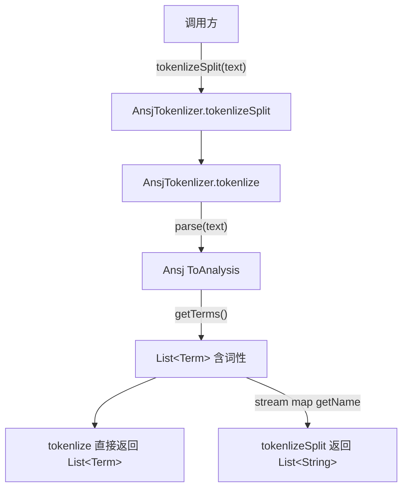

# i2f-extension-tokenlization-ansj

> 中文分词扩展（Ansj `ansj_seg:5.1.6` 以 provided + optional 引入，版本模块内硬编码）：仓库四个并列分词桥接模块（ansj/hanlp/jcseg/jieba）之一，单主源文件 `AnsjTokenlizer`（24 行）、两个静态方法，把 Ansj 的 `ToAnalysis` 简分词结果原样透出——`tokenlize(String)` 返回携带词性的 `List<Term>`，`tokenlizeSplit(String)` 在此基础上取 `Term.getName()` 展平为 `List<String>` 词序列。全仓库唯一的分词算法封装路径，零 i2f 内部依赖，不与兄弟模块共享任何接口（各写各的、引擎不可热切换）。仅 `i2f-extension-all` 聚合，无源码级消费方，测试为 `main` 方法跑地址分词样例。

## 模块路径

- `i2f-extension/i2f-extension-tokenlization-ansj`
- 根 `pom.xml` 依赖管理（1250 行）；`i2f-extension/pom.xml` 模块登记（87 行）；`i2f-extension/i2f-extension-all` 聚合依赖（301 行）
- 分发 jar：`bash/deploy-jdk8`、`bash/deploy-jdk17`、`bash/backup-jdk8`、`bash/backup-jdk17` 四份均在册

## 模块依赖

| 依赖 | Maven 坐标 | Scope | Optional | 说明 |
| --- | --- | --- | --- | --- |
| Ansj 分词 | `org.ansj:ansj_seg:5.1.6` | provided | true | 版本模块内硬编码，未走根 DM；提供 `ToAnalysis`/`Term` |
| Lombok | `org.projectlombok:lombok` | compile（继承父） | - | 源码零引用，冗余依赖 |

> 无任何 i2f 内部模块依赖，是最纯粹的第三方 SDK 单点桥接。

## 模块设计

- **单类双方法薄封装**：`AnsjTokenlizer` 不持状态、不建对象，仅把 Ansj 静态入口 `ToAnalysis.parse(text)` 包装成两个语义分层的方法——底层 `tokenlize` 保留 `Term`（含词性 `nature`），上层 `tokenlizeSplit` 用 `stream().map(Term::getName)` 展平为纯词串。
- **算法选型固定**：只用 Ansj 的 `ToAnalysis`（标准/简分词，基于双向最大匹配 + 词性），未暴露 `NatureAnalysis`（词性标注）、`DiyAnalysis`（自定义）、`UserDefineDict`（用户词典）等其它 Ansj 分析器，桥接面刻意收窄到「分词取词」这一最小用例。
- **与兄弟模块同构但无契约**：ansj/hanlp/jcseg/jieba 四模块都各自实现 `tokenlize` + `tokenlizeSplit` 两个同名静态方法，返回类型却分别是 `org.ansj.domain.Term`/`com.hankcs.hanlp.seg.common.Term`/`IWord`/`SegToken`——命名对齐、类型不对齐，没有公共接口或多态，引擎选择由调用方 import 哪个包静态决定。



## 模块目的

- 以最小成本把 Ansj 中文分词能力接入 i2f 扩展体系，供需要分词的下游按 `GroupID` 直引，而无需自行处理 `ansj_seg` 的坐标与版本。
- 用 `provided + optional` 将 5MB 级分词引擎及其内置词典的引入权、版本选择权完全下放给最终应用，即使被 `i2f-extension-all` 聚合也不会把 Ansj 传递给无关消费者。

## 模块功能

| 方法 | 签名 | 行为 |
| --- | --- | --- |
| `tokenlize` | `static List<Term> tokenlize(String text)` | 委托 `ToAnalysis.parse(text).getTerms()`，返回带词性的原始词元列表 |
| `tokenlizeSplit` | `static List<String> tokenlizeSplit(String text)` | 在 `tokenlize` 结果上取 `Term::getName`，返回纯词字符串列表 |

## 模块主要使用方法

```java
// 引入 i2f-extension-tokenlization-ansj，并由应用自行提供 org.ansj:ansj_seg:5.1.6
// 1) 只要词序列
List<String> words = AnsjTokenlizer.tokenlizeSplit("福建省福州市马尾区");
// 2) 要词性信息，用底层方法
List<Term> terms = AnsjTokenlizer.tokenlize("福建厦门翔安区");
for (Term t : terms) {
    System.out.println(t.getName() + "/" + t.getNature());
}
```

- 两方法均声明 `throws Exception`，调用方须显式处理（尽管 Ansj 分词实际不抛受检异常）。
- 首次调用会触发 Ansj 基础词典的静态加载，有一定冷启动开销；扩展本身不做缓存。

## 模块特性总结

- 仓库最小扩展模块之一：单类、单文件、两静态方法、约 24 行。
- 零 i2f 内部依赖，纯第三方 SDK 桥接。
- 与另外三个分词模块构成「同命名不同契约」的并列桥接矩阵，覆盖 Ansj/HanLP/JCseg/Jieba 四大主流中文分词器。
- 不封装、不改写分词结果，透传 Ansj 原生 `Term`，保留全部词性信息。

## 模块瑕疵或错误

- **模块/包/类命名拼写错误**：`tokenlization`（应为 `tokenization`）为全组四个模块共有的系统性拼写错误，`Tokenlizer` 同理，已固化进 artifactId、包名、类名与方法名，纠正成本高。
- **`throws Exception` 过宽**：`ToAnalysis.parse` 不抛受检异常，两方法却一律声明 `throws Exception`，强迫无谓的 try-catch/继续上抛，掩盖真实异常语义。
- **无空值/空串防护**：`text` 为 `null` 时直接在 Ansj 内部抛 NPE，扩展未做前置校验或友好降级。
- **`tokenlizeSplit` 不过滤停用词与标点**：`ToAnalysis` 结果含标点、数字等非词元，展平后原样保留，下游若要「干净词列表」需二次过滤，易踩坑。
- **引擎间无统一接口**：四个兄弟模块方法同名但返回类型互异，无公共 `ITokenlizer` 抽象，无法运行时切换或面向接口编程，「可插拔」名不副实。
- **lombok 冗余依赖**：`pom.xml` 引入 lombok 但源码零使用（无注解、无生成代码）。
- **版本硬编码未纳管**：`5.1.6` 写死在模块 pom，未进根 `dependencyManagement`，与仓库统一版本治理策略不一致。
- **无单元测试框架**：`TestAnsjTokenlizer` 是 `main` 方法脚本，非 JUnit 断言测试，不参与 CI 验证、无回归保障。

## 生态位置

- 处于 i2f 扩展层「中文 NLP」分支，与 `i2f-extension-tokenlization-hanlp`、`-jcseg`、`-jieba` 平行，各桥接一种分词引擎。
- 仅被 `i2f-extension-all` 以普通 compile 依赖聚合（本模块对 `ansj_seg` 是 provided+optional，故不会经聚合传递强塞 Ansj 给无关消费者），仓库内无任何源码级 import 消费方；Ansj 相关引用集中在本模块自身。
- 定位为「按需直引的可选 SDK 桥接」：需要 Ansj 分词的应用单独引入本模块 + 自备 `ansj_seg`，对仓库其余部分零侵入。
