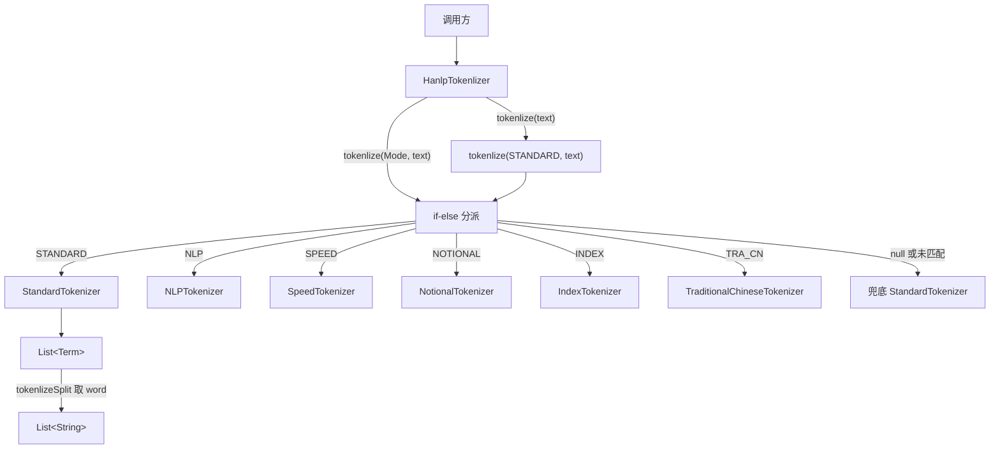

# i2f-extension-tokenlization-hanlp

> 中文分词扩展（HanLP `hanlp:portable-1.8.2` 以 provided + optional 引入，版本模块内硬编码）：仓库四个并列分词桥接模块（ansj/hanlp/jcseg/jieba）中功能最全的一个，单主源文件 `HanlpTokenlizer`（59 行）以内联 `Mode` 枚举（STANDARD/NLP/SPEED/NOTIONAL/INDEX/TRA_CN）驱动 if-else 分派，把 HanLP 六套静态分词器（`StandardTokenizer`/`NLPTokenizer`/`SpeedTokenizer`/`NotionalTokenizer`/`IndexTokenizer`/`TraditionalChineseTokenizer`）统一收拢到 `tokenlize`/`tokenlizeSplit` 两组重载之下，返回 HanLP 原生 `Term` 或展平词串。零 i2f 内部依赖，不与兄弟模块共享接口。仅 `i2f-extension-all` 聚合，无源码级消费方，测试为 `main` 方法跑地址分词样例。

## 模块路径

- `i2f-extension/i2f-extension-tokenlization-hanlp`
- 根 `pom.xml` 依赖管理（1255 行）；`i2f-extension/pom.xml` 模块登记（88 行）；`i2f-extension/i2f-extension-all` 聚合依赖（305 行）
- 分发 jar：`bash/deploy-jdk8`、`bash/deploy-jdk17`、`bash/backup-jdk8`、`bash/backup-jdk17` 四份均在册

## 模块依赖

| 依赖 | Maven 坐标 | Scope | Optional | 说明 |
| --- | --- | --- | --- | --- |
| HanLP 分词 | `com.hankcs:hanlp:portable-1.8.2` | provided | true | portable 版，版本模块内硬编码，未走根 DM；提供六套 `*Tokenizer` 与 `Term` |
| Lombok | `org.projectlombok:lombok` | compile（继承父） | - | 源码零引用，冗余依赖 |

> 无任何 i2f 内部模块依赖，是最纯粹的第三方 SDK 单点桥接。

## 模块设计

- **枚举驱动的多算法分派**：类内 `public static enum Mode` 列出 6 种分词模式，`tokenlize(Mode, text)` 用一长串 `if-else if (Mode.X == mode)` 映射到对应 HanLP 静态分词器；末尾兜底 `return StandardTokenizer.segment(text)`，即 `mode` 为 `null` 或匹配不到时静默降级为 STANDARD。
- **两级重载 + 默认模式**：无 `Mode` 参数的 `tokenlize(text)`/`tokenlizeSplit(text)` 固定委托 `Mode.STANDARD`，`tokenlizeSplit(Mode, text)` 在带模式结果上取 `Term::word` 展平为纯词串——把「选算法」与「要否词性」两个维度拆成正交重载。
- **透传原生 Term**：不对 HanLP 的 `Term`（`word`/`pos`/`offset`）做适配或改写，返回类型即 `com.hankcs.hanlp.seg.common.Term`。
- **与兄弟模块同构但无契约**：与 ansj/jcseg/jieba 一样提供同名 `tokenlize`+`tokenlizeSplit`，但 hanlp 独有 `Mode` 枚举维度，且返回类型互异，四者无公共 `ITokenlizer` 抽象。



## 模块目的

- 以单一入口聚合 HanLP 的六种分词/检索/繁体等静态分词器，让下游用一个 `Mode` 参数即可切换算法，无需记忆六个不同的 `*Tokenizer` 类名。
- 用 `provided + optional` 把 HanLP（含其内置核心词典）的引入权与版本选择权下放给最终应用，即使被 `i2f-extension-all` 聚合也不会把 HanLP 传递给无关消费者。

## 模块功能

| 方法 | 签名 | 行为 |
| --- | --- | --- |
| `tokenlize` | `static List<Term> tokenlize(String text)` | 以 `Mode.STANDARD` 分词 |
| `tokenlize` | `static List<Term> tokenlize(Mode mode, String text)` | 按 `mode` 分派到对应 HanLP 分词器，null/未匹配降级 STANDARD |
| `tokenlizeSplit` | `static List<String> tokenlizeSplit(String text)` | STANDARD 分词后取 `Term::word` 展平 |
| `tokenlizeSplit` | `static List<String> tokenlizeSplit(Mode mode, String text)` | 按 `mode` 分词后取 `Term::word` 展平 |
| `Mode` | `enum`（类内静态嵌套） | 6 种分词算法枚举，使用须写 `HanlpTokenlizer.Mode.X` |

## 模块主要使用方法

```java
// 引入 i2f-extension-tokenlization-hanlp，并由应用自行提供 com.hankcs:hanlp:portable-1.8.2
// 1) 默认标准分词，只要词串
List<String> words = HanlpTokenlizer.tokenlizeSplit("福建省福州市马尾区");
// 2) 指定算法模式，取带词性的 Term
List<Term> terms = HanlpTokenlizer.tokenlize(HanlpTokenlizer.Mode.INDEX, "福建厦门翔安区");
for (Term t : terms) {
    System.out.println(t.word + "/" + t.pos);
}
```

- 四方法均声明 `throws Exception`，调用方须显式处理（HanLP 分词实际不抛受检异常）。
- `Mode.NOTIONAL`（不切分语义单元）等在 portable 版依赖额外数据模型，运行前需确认 HanLP 配置与词典数据可用，否则可能运行期失败。

## 模块特性总结

- 四兄弟分词模块中功能最全：唯一支持多算法（6 种 `Mode`）切换。
- 仓库最小扩展模块之一：单类、单文件、约 59 行。
- 零 i2f 内部依赖，纯第三方 SDK 桥接。
- 「选算法」与「要否词性」两维度以正交重载表达，默认路径（无 Mode）最简。

## 模块瑕疵或错误

- **模块/包/类命名拼写错误**：`tokenlization`（应为 `tokenization`）、`Tokenlizer` 系全组共有的系统性拼写错误，已固化进坐标、包名、类名与方法名。
- **`throws Exception` 过宽**：HanLP 各 `segment` 不抛受检异常，四方法却一律声明 `throws Exception`，强迫无谓 try-catch，掩盖真实异常语义。
- **未知/ null 模式静默降级 STANDARD**：兜底 `return StandardTokenizer.segment(text)` 使 `mode=null` 或未来新增枚举漏分支时，不报错、不告警地按标准分词处理，调用方难以察觉模式选择失效。
- **if-else 链分派脆弱**：以长串 `== mode` 判断替代 `switch`/策略映射，新增 `Mode` 须同步追加分支且无编译期穷尽检查，易漏。
- **部分 Mode 在 portable 版数据缺失**：`NOTIONAL`（语义检索需依赖名词库/停用词模型）等在 `portable` 精简包下可能因缺数据运行期异常，桥接层未做能力探测或降级。
- **无空值/空串防护**：`text` 为 `null` 时直接进入 HanLP 抛 NPE，扩展未做前置校验。
- **`tokenlizeSplit` 不过滤停用词与标点**：STANDARD 结果含标点、非词元，展平后原样保留，需下游二次过滤。
- **lombok 冗余依赖**：`pom.xml` 引入 lombok 但源码零使用。
- **版本硬编码未纳管**：`portable-1.8.2` 写死在模块 pom，未进根 `dependencyManagement`。
- **引擎间无统一接口**：与 ansj/jcseg/jieba 无公共抽象，无法运行时跨引擎切换，且本模块特有的 `Mode` 维度使其无法与其它三者对齐到同一签名契约。
- **无单元测试框架**：`TestHanlpTokenlizer` 是 `main` 方法脚本，非 JUnit 断言测试，不参与 CI、无回归保障，且 6 种 `Mode` 中测试仅覆盖默认 STANDARD。

## 生态位置

- 处于 i2f 扩展层「中文 NLP」分支，与 `i2f-extension-tokenlization-ansj`、`-jcseg`、`-jieba` 平行，各桥接一种分词引擎；本模块是四者中算法覆盖面最广的实现。
- 仅被 `i2f-extension-all` 以普通 compile 依赖聚合（本模块对 `hanlp` 是 provided+optional，不会经聚合传递强塞 HanLP 给无关消费者），仓库内无任何源码级 import 消费方。
- 定位为「按需直引的可选 SDK 桥接」：需要 HanLP 分词的应用单独引入本模块 + 自备 `hanlp`，对仓库其余部分零侵入。
