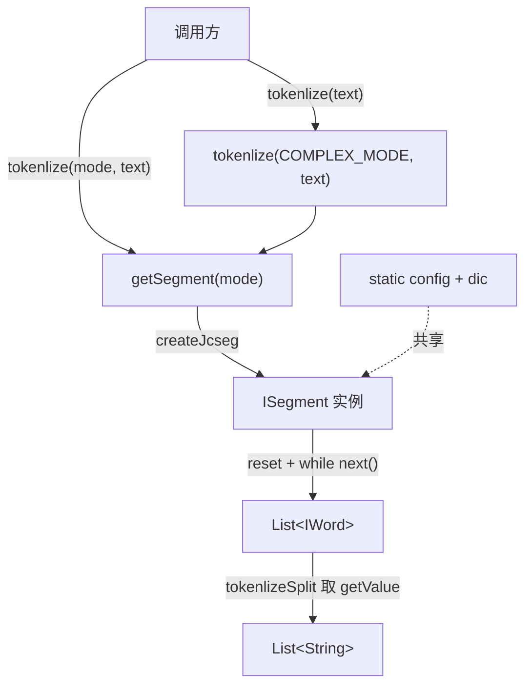

# i2f-extension-tokenlization-jcseg

> 中文分词扩展（JCseg `jcseg-core:2.5.0` 以 provided + optional 引入，版本模块内硬编码）：仓库四个并列分词桥接模块（ansj/hanlp/jcseg/jieba）之一，单主源文件 `JcsegTokenlizer`（47 行）以两个 `public static` 共享字段（`JcsegTaskConfig config` + `ADictionary dic`）承载 JCseg 词典与配置，`tokenlize(int mode, text)` 每次经 `SegmentFactory.createJcseg` 新建 `ISegment`、用 `while(next())` 手动收集 `IWord` 列表，默认模式为 `COMPLEX_MODE`（复杂/检索模式，输出基本词 + 复合词）；`tokenlizeSplit` 取 `IWord::getValue` 展平为词串。零 i2f 内部依赖，不与兄弟模块共享接口。仅 `i2f-extension-all` 聚合，无源码级消费方，测试为 `main` 方法跑地址分词样例。

## 模块路径

- `i2f-extension/i2f-extension-tokenlization-jcseg`
- 根 `pom.xml` 依赖管理（1260 行）；`i2f-extension/pom.xml` 模块登记（89 行）；`i2f-extension/i2f-extension-all` 聚合依赖（309 行）
- 分发 jar：`bash/deploy-jdk8`、`bash/deploy-jdk17`、`bash/backup-jdk8`、`bash/backup-jdk17` 四份均在册

## 模块依赖

| 依赖 | Maven 坐标 | Scope | Optional | 说明 |
| --- | --- | --- | --- | --- |
| JCseg 分词 | `org.lionsoul:jcseg-core:2.5.0` | provided | true | 版本模块内硬编码，未走根 DM；提供 `SegmentFactory`/`ISegment`/`IWord`/`JcsegTaskConfig`/`ADictionary` |
| Lombok | `org.projectlombok:lombok` | compile（继承父） | - | 源码零引用，冗余依赖 |

> 无任何 i2f 内部模块依赖，是最纯粹的第三方 SDK 单点桥接。

## 模块设计

- **静态共享 config/dic**：类级 `public static JcsegTaskConfig config` 与 `public static ADictionary dic`（`createDefaultDictionary(config)` 于类初始化时加载 JCseg 默认词典），作为所有分词调用的共享配置与词典底座，避免每次重复装典。
- **按模式建段 + 手动迭代**：`tokenlize(mode, text)` 每次 `getSegment(mode)`→`SegmentFactory.createJcseg(mode, {config, dic})` 新建 `ISegment`，`reset(new StringReader(text))` 后用 `while ((word = segment.next()) != null)` 逐词收集进 `new ArrayList<>(text.length())`。
- **默认 COMPLEX_MODE**：无 mode 参重载固定委托 `JcsegTaskConfig.COMPLEX_MODE`（复杂模式，输出单字/基本词之外的复合词，适合检索），`SIMPLE_MODE`/`DETECT_MODE` 需自行传参。
- **两级重载 + 展平**：`tokenlize(text)`/`tokenlizeSplit(text)` 走默认复杂模式，`tokenlizeSplit(mode, text)` 在带模式结果上取 `IWord::getValue` 展平为纯词串。
- **与兄弟模块同构但无契约**：与 ansj/hanlp/jieba 提供同名 `tokenlize`+`tokenlizeSplit`，但返回 `IWord`、以 `int mode` 常量而非枚举选模式，四者无公共 `ITokenlizer` 抽象。



## 模块目的

- 以最小成本把 JCseg 中文分词能力接入 i2f 扩展体系，并用静态共享 `config`/`dic` 复用词典，降低单次分词的词典装载开销。
- 用 `provided + optional` 把 JCseg 及其词典资源的引入权、版本选择权下放给最终应用，即使被 `i2f-extension-all` 聚合也不会把 JCseg 传递给无关消费者。

## 模块功能

| 方法 | 签名 | 行为 |
| --- | --- | --- |
| `tokenlize` | `static List<IWord> tokenlize(String text)` | 以 `COMPLEX_MODE` 分词 |
| `tokenlize` | `static List<IWord> tokenlize(int mode, String text)` | 按 `mode` 建段并 `while(next())` 收集 `IWord` |
| `tokenlizeSplit` | `static List<String> tokenlizeSplit(String text)` | COMPLEX_MODE 分词后取 `getValue` 展平 |
| `tokenlizeSplit` | `static List<String> tokenlizeSplit(int mode, String text)` | 按 `mode` 分词后取 `getValue` 展平 |
| `getSegment` | `static ISegment getSegment(int mode)` | 以共享 `config`/`dic` 创建 `ISegment` |

## 模块主要使用方法

```java
// 引入 i2f-extension-tokenlization-jcseg，并由应用自行提供 org.lionsoul:jcseg-core:2.5.0
// 1) 默认复杂模式，只要词串
List<String> words = JcsegTokenlizer.tokenlizeSplit("福建省福州市马尾区");
// 2) 指定 JCseg 模式，取带词性的 IWord
List<IWord> list = JcsegTokenlizer.tokenlize(JcsegTaskConfig.SIMPLE_MODE, "福建厦门翔安区");
for (IWord w : list) {
    System.out.println(w.getValue() + "/" + w.getType());
}
```

- 四方法均声明 `throws Exception`，调用方须显式处理（JCseg 分词实际只抛 `JcsegException` 这一受检异常）。
- `config`/`dic` 是 `public static` 可变字段，类加载即构建默认词典；如需自定义词典/用户词，理论可改写这两个字段，但会影响全 JVM 共享实例。

## 模块特性总结

- 四兄弟中唯一显式缓存共享 `config`+`dic`，避免每次分词重装词典。
- 默认 `COMPLEX_MODE`（检索友好，输出复合词），是四者中默认切分粒度最粗/最全的。
- 仓库最小扩展模块之一：单类、单文件、约 47 行。
- 零 i2f 内部依赖，纯第三方 SDK 桥接。

## 模块瑕疵或错误

- **`public static` 可变共享字段**：`config`/`dic` 既非 `final` 又对外公开，任意方可整体重 assignment，破坏封装；且 JCseg 的 `ISegment` 明确非线程安全，多线程并发读取同一可变 `config`/运行期改词典存在数据竞争与可见性风险。
- **每次新建 ISegment 的对象抖动**：`tokenlize` 每调用一次即 `createJcseg` 建段，高频分词下产生大量短命 `ISegment`，未复用/池化。
- **`throws Exception` 过宽**：底层 `getSegment` 只声明 `JcsegException`，公开方法却一律上抛 `Exception`，强迫无谓 try-catch。
- **`text.length()` 作初始容量 + 无 null 防护**：`new ArrayList<>(text.length())` 以字符数估计词数容量（粗且对长文本过度预分配），`text` 为 `null` 时在 `text.length()` 处直接 NPE，未做前置校验。
- **COMPLEX_MODE 结果含复合/冗余词**：复杂模式会同时输出基本词与复合词，`tokenlizeSplit` 不过滤，下游若按「切一次得独立词元」使用会得到重复/包含关系的词，易踩坑。
- **模块/包/类命名拼写错误**：`tokenlization`（应为 `tokenization`）、`Tokenlizer` 系全组共有的系统性拼写错误，已固化进坐标、包名、类名与方法名。
- **无空串/停用词处理**：不清洗标点、停用词，展平结果原样保留。
- **lombok 冗余依赖**：`pom.xml` 引入 lombok 但源码零使用。
- **版本硬编码未纳管**：`2.5.0` 写死在模块 pom，未进根 `dependencyManagement`。
- **引擎间无统一接口**：与 ansj/hanlp/jieba 无公共抽象，无法运行时跨引擎切换；本模块用 `int mode` 常量选模式，与 hanlp 的 `Mode` 枚举风格也不一致。
- **无单元测试框架**：`TestJcsegTokenlizer` 是 `main` 方法脚本，非 JUnit 断言测试，不参与 CI、无回归保障，且仅测默认 COMPLEX_MODE。

## 生态位置

- 处于 i2f 扩展层「中文 NLP」分支，与 `i2f-extension-tokenlization-ansj`、`-hanlp`、`-jieba` 平行，各桥接一种分词引擎。
- 仅被 `i2f-extension-all` 以普通 compile 依赖聚合（本模块对 `jcseg-core` 是 provided+optional，不会经聚合传递强塞 JCseg 给无关消费者），仓库内无任何源码级 import 消费方。
- 定位为「按需直引的可选 SDK 桥接」：需要 JCseg 分词的应用单独引入本模块 + 自备 `jcseg-core`，对仓库其余部分零侵入。
