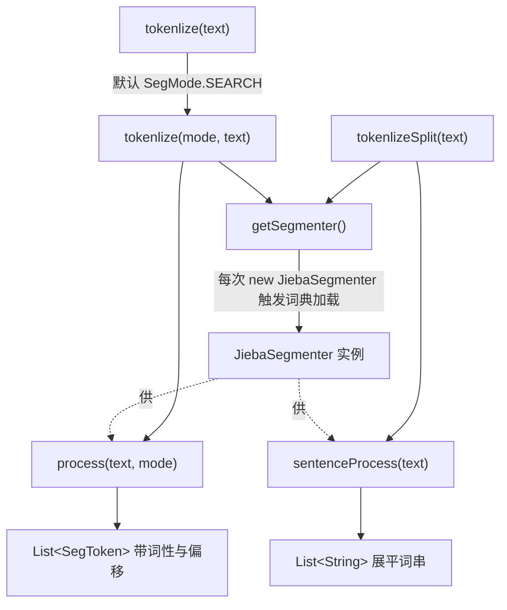

# i2f-extension-tokenlization-jieba

> 中文分词扩展（Jieba `jieba-analysis:1.0.2` 以 provided + optional 引入，版本模块内硬编码）：仓库四个并列分词桥接模块（ansj/hanlp/jcseg/jieba）中的最后一个，单主源文件 `JiebaTokenlizer`（34 行）、三个静态方法，把 Jieba 分词结果透出——`tokenlize(String)` 以默认 `SegMode.SEARCH` 委托 `tokenlize(mode, text)` 调 `JiebaSegmenter.process` 返回携带词性与字偏移的 `List<SegToken>`，`tokenlizeSplit(String)` 则走另一套 `sentenceProcess` 按句简单切分直接返回 `List<String>` 词串。零 i2f 内部依赖，不与兄弟模块共享任何接口（各写各的、引擎不可运行时切换）。仅 `i2f-extension-all` 以普通 compile 依赖聚合，仓库内无源码级消费方，测试为 `main` 方法跑地址分词样例。本模块最突出的问题是 `getSegmenter()` 每次调用都 `new JiebaSegmenter()`，触发全量词典重复加载，是四兄弟中最严重的性能缺陷。

## 模块路径

- `i2f-extension/i2f-extension-tokenlization-jieba`
- 根 `pom.xml` 依赖管理（1265 行）；`i2f-extension/pom.xml` 模块登记（90 行）；`i2f-extension/i2f-extension-all` 聚合依赖（313 行）

## 模块依赖

| 依赖 | Maven 坐标 | scope | optional | 说明 |
| --- | --- | --- | --- | --- |
| 内部依赖 | — | — | — | **无任何 i2f 内部模块依赖** |
| Jieba 分词引擎 | `com.huaban:jieba-analysis:1.0.2` | provided | true | 唯一的分词算法来源；版本在模块 pom 内硬编码，未走根 dependencyManagement |
| Lombok | `org.projectlombok:lombok` | provided | — | 源码零使用，冗余依赖 |

> 依赖面与 ansj/hanlp/jcseg 三兄弟完全同构：一个 provided+optional 的三方分词器 + 一个零使用的 lombok，无任何 i2f 内部依赖。

## 模块设计

`JiebaTokenlizer` 是一个无状态的静态工具类，全部方法 `public static`，不提供实例化入口。设计上有三条主线：

1. **默认模式包装**：`tokenlize(String)` 硬编码以 `JiebaSegmenter.SegMode.SEARCH`（搜索引擎模式，长词短词全切）转发到 `tokenlize(SegMode, String)`，把「是否指定模式」的两副面孔收敛为一个默认重载。
2. **两条不对称的分词路径**：`tokenlize` 走 `JiebaSegmenter.process(text, mode)` 返回 `List<SegToken>`（含 `word`/`offset`/`type`），而 `tokenlizeSplit` 走 `sentenceProcess(text)`——这是 Jieba 内部另一套按句切分逻辑，直接返回 `List<String>`。二者算法路径不同、结果不可直接对照，但方法命名却呈对称的 `tokenlize`/`tokenlizeSplit`，易被误读为「同一结果的两种包装」。
3. **每次新建分词器**：`getSegmenter()` 无缓存、无单例，直接 `new JiebaSegmenter()`。Jieba `1.0.2` 的构造函数会加载主词典并构建词典树，因此每一次 `tokenlize`/`tokenlizeSplit` 调用都会重复触发词典加载。



## 模块目的

- 以最小桥接面（三个静态方法）把 Jieba 分词能力接入 i2f 扩展体系，与 ansj/hanlp/jcseg 形成同一接口形状（同名 `tokenlize`/`tokenlizeSplit`）的多引擎并列实现，便于按需引入某一引擎。
- 用 `provided + optional` 将数 MB 级分词引擎及其内置词典的引入权、版本选择权完全下放给最终应用，即使被 `i2f-extension-all` 聚合也不会把 Jieba 传递给无关消费者。
- 提供「带词性的结构化结果（`SegToken`）」与「纯词串（`String`）」两档输出，分别服务检索/索引与简单关键词提取场景。

## 模块功能

| 方法 | 签名 | 行为 |
| --- | --- | --- |
| 结构化分词（默认模式） | `List<SegToken> tokenlize(String text)` | 以 `SegMode.SEARCH` 委托下面的重载 |
| 结构化分词（指定模式） | `List<SegToken> tokenlize(SegMode mode, String text)` | `new JiebaSegmenter().process(text, mode)`，返回带词性/偏移的 token 列表 |
| 词串分词 | `List<String> tokenlizeSplit(String text)` | `new JiebaSegmenter().sentenceProcess(text)`，直接返回词串列表 |
| 分词器工厂 | `JiebaSegmenter getSegmenter()` | 每次 `new JiebaSegmenter()`，无缓存 |

## 模块主要使用方法

```java
// 结构化分词：返回带词性与字符偏移的 SegToken 列表
List<SegToken> tokens = JiebaTokenlizer.tokenlize("福建省福州市马尾区");

// 指定分词模式（如 INDEX 索引模式）
List<SegToken> idx = JiebaTokenlizer.tokenlize(JiebaSegmenter.SegMode.INDEX, "福建省福州市马尾区");

// 只要词串
List<String> words = JiebaTokenlizer.tokenlizeSplit("福建省福州市马尾区");
```

注意事项：
- 所有方法声明 `throws Exception`，调用方需处理，但底层 Jieba 实际不抛受检异常。
- 高频调用场景务必警惕：每次调用都会重建 `JiebaSegmenter` 并加载词典，性能开销显著，当前 API 无法复用分词器实例。
- `SegToken` 是 Jieba 原生类型，会随方法签名泄漏到调用方，需引入 `jieba-analysis` 才能编译。

## 模块特性总结

- **零内部依赖**：只依赖一个三方分词器，与 i2f 其它模块完全解耦。
- **多引擎同形并列**：与 ansj/hanlp/jcseg 方法同名，返回类型各异（`SegToken`/`Term`/`IWord`）。
- **双输出档位**：结构化 `SegToken` 与展平 `String` 两条路径。
- **默认搜索引擎模式**：`tokenlize` 缺省走 `SegMode.SEARCH`，切分粒度细。
- **provided+optional 隔离**：引擎与词典引入权下放给应用。

## 模块瑕疵或错误

> 项目已完整编译通过，以下仅为静态识别的问题/潜在问题，不作实证。

1. **每次调用新建分词器、重复加载词典（最严重）**：`getSegmenter()` 无缓存直接 `new JiebaSegmenter()`，Jieba `1.0.2` 构造会加载主词典并构建词典树，导致每次分词都重复全量加载，是四兄弟中最突出的性能缺陷（jcseg 至少以 static `dic` 复用词典）。
2. **两条路径算法不对称却命名对称**：`tokenlize`→`process(mode)`，`tokenlizeSplit`→`sentenceProcess`，分词结果不可对照，`tokenlize`/`tokenlizeSplit` 的对称命名易误导使用者以为只是包装差异。
3. **`throws Exception` 过宽**：`JiebaSegmenter.process/sentenceProcess` 不抛受检异常，方法级 `throws Exception` 迫使调用方做无谓的宽异常处理。
4. **无 null 防护**：`text` 为 null 时直穿底层，抛 NPE 而非明确参数校验异常。
5. **`SEARCH` 模式输出冗余短词**：`tokenlize` 默认搜索引擎模式会把长词进一步切成子词，用作「结果列表」时含大量重叠细粒度 token，直接展示需自行去重。
6. **无公共接口、引擎不可运行时切换**：与 ansj/hanlp/jcseg 无共享接口，方法同名但返回类型互异（`SegToken`/`Term`/`IWord`），换引擎需改调用方代码与 import。
7. **`SegToken` 类型泄漏**：原生返回类型进入公共 API，调用方被迫依赖 `jieba-analysis`。
8. **系统性拼写错误**：`tokenlization`/`Tokenlizer`（正确应为 `tokenization`/`Tokenizer`）已固化进 Maven 坐标与包名。
9. **版本未纳根 dependencyManagement**：`jieba-analysis:1.0.2` 在模块 pom 内硬编码，与仓库根 DM 集中管理版本的约定不一致（四兄弟通病）。
10. **lombok 零使用冗余依赖**：源码未使用任何 lombok 注解。
11. **无单元断言测试**：仅 `main` 方法 `System.out` 打印地址分词样例，非 JUnit，纳入 CI 无断言价值。

## 模块生态位置

- 位于 `i2f-extension` 组，是四个并列中文分词桥接模块（ansj/hanlp/jcseg/jieba）中的最后一个；四者同形不同实现、互不引用。
- 仅被 `i2f-extension-all` 以普通 compile 依赖聚合（本模块对 `jieba-analysis` 是 provided+optional，故不会经聚合传递强塞 Jieba 给无关消费者），仓库内无任何源码级 import 消费方。
- 分发 jar 已随构建产出，存在于 `bash/backup-jdk8`、`bash/backup-jdk17`、`bash/deploy-jdk8`、`bash/deploy-jdk17` 四目录。
- 定位为「可选引擎适配层」：功能与 ansj/hanlp/jcseg 重叠，价值在于提供 Jieba 这一特定分词实现供上层按需选型。
