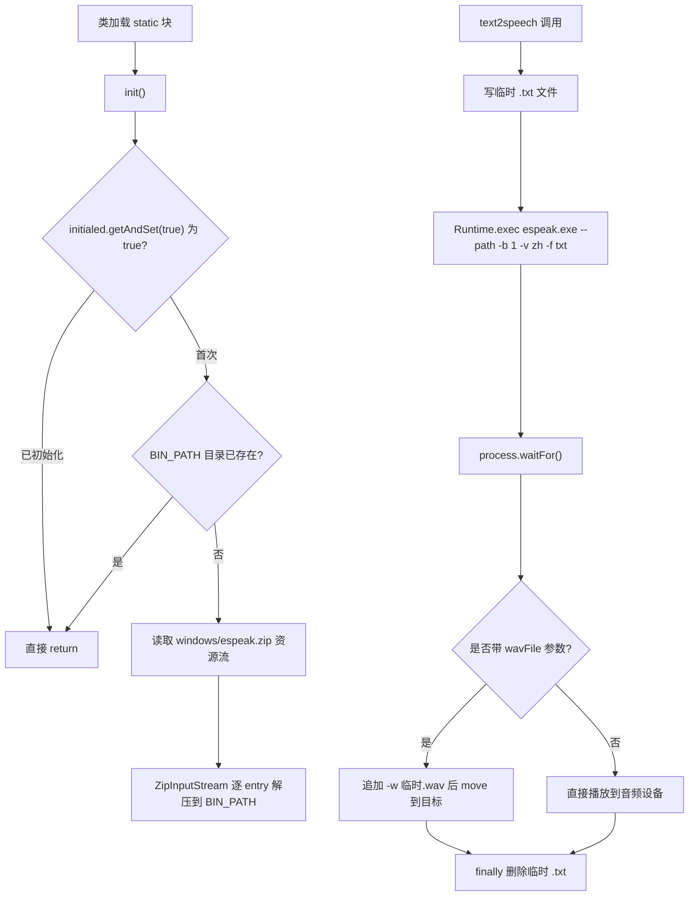

# i2f-extension-tts-espeak

> 文本转语音（TTS）扩展：与四个分词桥接模块「封装一个 Maven 三方库」的范式不同，本模块走的是**原生二进制内嵌 + 类加载自解压 + 外部进程调用**路线——把 espeak 命令行 TTS 引擎（`windows/espeak.zip`，含 `espeak.exe` 与 `espeak-data` 词典）作为 classpath 资源打进 jar，`TtsEspeakProvider` 在 static 块触发 `init()` 把 zip 解压到运行时目录 `{RUNTIME_PERSIST_DIR}/espeak/windows`，再由 `text2speech(String)` / `text2speech(String, File)` 写临时 `.txt` 后 `Runtime.exec` 调 `espeak.exe --path=… -b 1 -v zh -f …`（可选 `-w` 产出 wav）完成合成。**仅支持 Windows、语音硬编码中文 `-v zh`、引擎不走 Maven 依赖而是随 jar 打包的二进制**。内部仅依赖 `i2f-std-const`（运行时目录常量）与 `i2f-io-file`（文件工具，并借其传递获得 `i2f-io-stream` 的 `StreamUtil`）。仅 `i2f-extension-all` 聚合，仓库内无源码级消费方，测试为 `main` 方法。

## 模块路径

- `i2f-extension/i2f-extension-tts-espeak`
- 根 `pom.xml` 依赖管理（1270 行）；`i2f-extension/pom.xml` 模块登记（91 行）；`i2f-extension/i2f-extension-all` 聚合依赖（317 行）

## 模块依赖

| 依赖 | Maven 坐标 | scope | optional | 说明 |
| --- | --- | --- | --- | --- |
| 运行时常量 | `i2f.turbo:i2f-std-const` | compile | — | 取 `StdConst.RUNTIME_PERSIST_DIR` 作为 espeak 解压落地目录 |
| 文件工具 | `i2f.turbo:i2f-io-file` | compile | — | 用 `FileUtil`（`useParentDir`/`save`/`getTempFileName`/`move`） |
| 流工具 | `i2f.turbo:i2f-io-stream`（未直接声明） | 传递 | — | `StreamUtil.streamCopy` 被 import 使用，但 pom 未声明，经 `i2f-io-file → i2f-io-stream` 传递获得 |
| espeak 引擎 | `windows/espeak.zip`（classpath 资源，非 Maven 依赖） | — | — | 原生 `espeak.exe` + `espeak-data` 词典，随 jar 的 `windows/**/*` 打包；**当前仓库源码树未包含该资源**（需外部投放） |
| Lombok | `org.projectlombok:lombok` | provided | — | 源码零使用，冗余依赖 |

> 与分词四兄弟的最大差异：TTS 引擎不是 Maven 坐标可管理的库，而是以二进制资源形式内嵌、运行时解压、通过操作系统进程调用的外部可执行程序。

## 模块设计

`TtsEspeakProvider` 是无状态静态工具类，围绕「原生二进制的生命周期」设计三段逻辑：

1. **类加载自解压（`init()`）**：`static` 块调用 `init()`。`init()` 以 `AtomicBoolean initialed` 的 `getAndSet(true)` 做单次闸门，再以 `BIN_PATH` 目录 `exists()` 做幂等短路；两者都通过后，用线程上下文类加载器读取 `windows/espeak.zip`，`ZipInputStream` 逐 entry 解压（跳过目录项）到 `./{RUNTIME_PERSIST_DIR}/espeak/windows`，文件落地前 `FileUtil.useParentDir` 建父目录、`StreamUtil.streamCopy` 拷流。
2. **合成执行（`text2speech`）**：把待读文本写成临时 `.txt`，拼接 `espeak.exe --path=<data目录> -b 1 -v zh -f <txt>` 命令行 `Runtime.exec` 执行，`process.waitFor()` 等待，`finally` 删除临时 `.txt`。
3. **wav 产出重载**：带 `File wavFile` 的重载在命令尾部追加 `-w <临时.wav>`，让 espeak 落盘音频而非直放，再 `FileUtil.move` 到目标路径。



## 模块目的

- 以零 Maven 引擎依赖的方式，为上层提供一个开箱即用的中文 TTS 能力：调用方引入本 jar 即自带 espeak 可执行程序与词典，无需单独安装引擎。
- 用「资源内嵌 + 首次运行解压」把原生二进制的部署复杂度收敛到库内部，对外只暴露两个 `text2speech` 静态方法。
- 同时支持「直接播放」与「导出 wav 文件」两种输出形态，兼顾试听与音频文件生成场景。

## 模块功能

| 成员 | 签名 | 行为 |
| --- | --- | --- |
| 初始化 | `void init()` | 类加载时解压内嵌 zip 到运行时目录；幂等 |
| 文本播报 | `void text2speech(String str)` | 写临时 txt → 调 espeak 直接播放到音频设备 |
| 导出 wav | `void text2speech(String str, File wavFile)` | 同上但加 `-w` 产出临时 wav 并 move 到目标 |
| 常量 | `CLASS_PATH` / `BIN_PATH` / `BIN_FILE` / `RESOURCE_PATH` | zip 资源路径、解压目录、exe、data 目录 |

## 模块主要使用方法

```java
// 直接播报（依赖本机音频输出设备，硬编码中文语音 -v zh）
TtsEspeakProvider.text2speech("大家好，这里是文本转语音测试");

// 合成为 wav 文件
TtsEspeakProvider.text2speech("hello world", new File("./out.wav"));
```

注意事项：
- **仅 Windows 可用**：路径与 `espeak.exe` 硬编码，非 Windows 平台解压出的仍是 exe、命令也跑不起来。
- 首次调用前 `init()` 会在类加载时触发，将二进制解压到当前工作目录下的 `{RUNTIME_PERSIST_DIR}/espeak/windows`，需对该路径有写权限。
- 需确保 `windows/espeak.zip` 已随 jar 打包（该资源不在仓库源码树内，缺失时运行会异常，详见瑕疵）。
- 方法声明 `throws Exception`，调用方需处理。

## 模块特性总结

- **原生二进制内嵌**：引擎以 classpath zip 随 jar 分发，非 Maven 依赖。
- **类加载自解压**：static 块 + `AtomicBoolean` + 目录 `exists()` 双重幂等。
- **外部进程合成**：`Runtime.exec` 调 espeak 命令行，非 JNI/JNA 库内调用。
- **双输出形态**：直接播放 与 `-w` 导出 wav。
- **中文语音硬编码**：固定 `-v zh`、`-b 1`。
- **平台锁定**：仅 Windows。

## 模块瑕疵或错误

> 项目已完整编译通过，以下仅为静态识别的问题/潜在问题，不作实证。

1. **内嵌资源缺失风险**：代码与 jar-plugin 都引用 `windows/espeak.zip`，但当前仓库源码树无 `src/main/resources`、无该 zip 文件；一旦未按约定外部投放，`getResourceAsStream` 返回 null，`new ZipInputStream(null)` 迭代时抛 NPE，被 static 块 catch 打印后 `initialed` 已置 true，后续 `text2speech` 调用不存在的 exe 静默失败。
2. **`maven-jar-plugin` 仅 include `windows/**/*`**：`<includes>` 覆盖了默认打包内容，普通 jar 可能只打入原生资源而**排除编译出的 `.class`**，依赖 assembly 插件补全，配置意图易出错。
3. **`initialed` 语义偏差致不可重试**：`getAndSet(true)` 一旦置位，即便本次解压因异常未完成，也永不重试；`exists()` 短路同样无法修复「目录存在但解压不完整」的半成品状态。
4. **`Runtime.exec(String)` 单串分词隐患**：命令行按空格切分，若 `RUNTIME_PERSIST_DIR`/工作目录含空格会破坏命令解析（文本走 `-f` 文件不受影响，但路径敏感），宜用 `String[]` 形式。
5. **进程结果未校验**：`waitFor()` 不取 `exitValue`、不消费 stdout/stderr，espeak 失败无感知，输出缓冲区满还可能阻塞进程。
6. **临时 wav 清理不完整**：带 wav 的重载中，临时 `.wav` 仅在成功 `move` 后消失，若 exec 失败则残留；且临时 wav 无 `finally` 兜底（仅 `.txt` 有）。
7. **平台/语音硬编码不可配置**：`windows` 路径、`espeak.exe`、`-v zh`、`-b 1` 全部写死，无法跨平台或选其它声音/参数。
8. **`text2speech(String)` 强依赖音频设备**：无输出设备的服务端环境下直接播放必然失败，缺乏降级或错误提示。
9. **`StreamUtil` 依赖传递未声明**：import 了 `i2f-io-stream` 的 `StreamUtil`，但 pom 只声明 `i2f-io-file`，靠传递依赖获得，属未声明直接依赖。
10. **`throws Exception` 过宽**、**无 null 防护**（`str`/`wavFile` 为 null 直穿底层）。
11. **无 JUnit 断言测试**：`main` 方法直接播放，纳入 CI 无断言价值且依赖音频设备。

## 模块生态位置

- 位于 `i2f-extension` 组，与 `i2f-extension-tts-jacob` 同属 TTS 类扩展；espeak 走「跨平台引擎的 Windows 二进制 + 命令行进程」路线，jacob 走「Windows SAPI COM 组件桥接」路线，二者是 TTS 的两种不同实现选型。
- 仅被 `i2f-extension-all` 聚合，仓库内无任何源码级 import 消费方。
- **未出现在 `bash/` 分发 jar 中**（backup/deploy 四目录均无本模块 jar），与已文档化的分词/sqlparser/swl 等模块「四目录 jar 均在册」不同——推测因其含大体积原生二进制而由分发脚本排除。
- 定位为「自带引擎的可选能力层」：把 espeak 部署细节封装在库内，向应用提供最简 TTS 静态调用入口。
