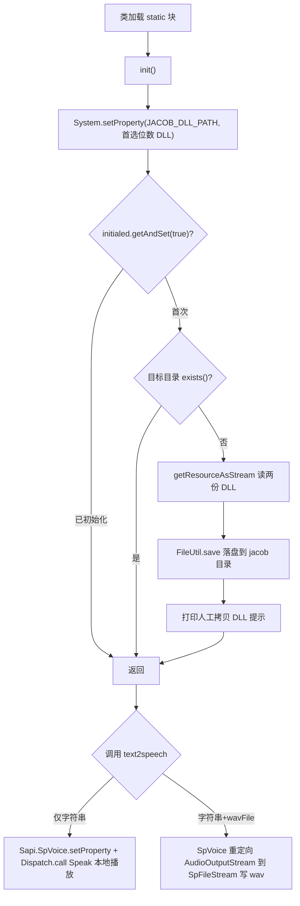

# i2f-extension-tts-jacob

> 文本转语音（TTS）扩展：与 `i2f-extension-tts-espeak` 的「外置 espeak 引擎 + 命令行进程」路线并列，本模块走的是 **JACOB（Java-COM Bridge）+ Windows SAPI（`Sapi.SpVoice`）COM 组件** 路线——把 JACOB 的 Java 桥接 jar（`lib/jacob.jar`，`system` scope 且随资源打包）与本地库 `jacob-1.21-x64.dll`/`jacob-1.21-x86.dll` 一起内置进 jar，`TtsJacobProvider` 在 `static` 块触发 `init()` 把对应位数的 DLL 解压到 `{RUNTIME_PERSIST_DIR}/jacob` 并写入 `LibraryLoader.JACOB_DLL_PATH` 系统属性，随后 `text2speech(String)` 直接实例化 COM 对象 `Sapi.SpVoice` 调用 `Speak` 本地播放，`text2speech(String, File)` 再接 `Sapi.SpFileStream` 把合成结果落盘为 wav。**仅支持 Windows（依赖 SAPI COM + JACOB 本地库）、音量/语速硬编码**。内部仅依赖 `i2f-std-const`（运行时目录常量）与 `i2f-io-file`（`FileUtil.save` 落 DLL）。仅 `i2f-extension-all` 聚合，仓库内无源码级消费方，测试为 `main` 方法直调。

## 模块路径

- `i2f-extension/i2f-extension-tts-jacob`
- 根 `pom.xml` 依赖管理（1275 行）；`i2f-extension/pom.xml` 模块登记（92 行）；`i2f-extension/i2f-extension-all` 聚合依赖（321 行）

## 模块依赖

| 依赖 | Maven 坐标 | scope | optional | 说明 |
| --- | --- | --- | --- | --- |
| i2f 内部 | `i2f.turbo:i2f-std-const` | compile | 否 | 提供 `RUNTIME_PERSIST_DIR` 运行时目录常量 |
| i2f 内部 | `i2f.turbo:i2f-io-file` | compile | 否 | `FileUtil.save(InputStream, File)` 落 DLL；并借其传递获得 `i2f-io-stream` 的 `StreamUtil` |
| 三方 | `com.jacob:jacob:1.21` | **system** | 否 | `systemPath` 指向 `src/main/resources/lib/jacob.jar`（模块内硬编码版本，不走根 DM） |
| 三方 | `org.projectlombok:lombok` | provided | - | 源码零引用，冗余依赖 |

> 注意 `com.jacob:jacob` 使用 `system` scope：编译期由 `systemPath` 解析，但 **`system` scope 不随 Maven 传递**，下游依赖本模块者不会自动获得 `com.jacob.*` 类；资源目录内的 `lib/jacob.jar` 虽被打进本模块 jar，但嵌套 jar 不会自动进入运行时 classpath。运行时 `com.jacob.*` 类实际由本地库 + 显式声明的 jacob 依赖提供，桥接可靠性依赖最终应用自行补齐。

## 模块设计

- **单类静态工具**：唯一类 `TtsJacobProvider`（118 行），全部 `public static`，无实例状态，仅一个 `AtomicBoolean initialed` 守护初始化幂等。
- **引擎内置 + 类加载自解压**：`CLASS_PATHS` 声明 `lib/jacob-1.21-{x64,x86}.dll`，`init()` 先无条件写 `JACOB_DLL_PATH` 系统属性（按 `getPreferredDLLName()` 选位数），再以 `AtomicBoolean getAndSet(true)` 保证只初始化一次；若目标目录已存在则直接返回，否则用 `getContextClassLoader().getResourceAsStream` 读出两份 DLL 交 `FileUtil.save` 落盘。
- **两条合成路径**：
  - `text2speech(String)`：`new ActiveXComponent("Sapi.SpVoice")` → `setProperty("Volume"/"Rate")` → `Dispatch.call(..., "Speak", ...)` → `safeRelease`，直接本地播放。
  - `text2speech(String, File)`：再建 `Sapi.SpFileStream` + `Sapi.SpAudioFormat`，`put(fileFormat,"Type",22)` 设格式、`putRef(sfFileStream,"Format",...)`、`call(sfFileStream,"Open",路径,3,true)` 建文件流，把 `SpVoice.AudioOutputStream` 指向文件流后 `Speak` 写盘，最后 `Close` + 逐个 `safeRelease`。
- **常量占位**：`OFFICIAL_URL` 记录 JACOB 上游仓库地址，仅作注释性常量，代码未使用。



## 模块目的

- 在不引入命令行外部进程的前提下，用 Windows 原生 SAPI COM 语音引擎提供「进程内」TTS 能力，作为 espeak 命令行路线的 Windows 平台替代实现。
- 将 JACOB 桥接 jar 与本地 DLL 内置进 jar，尽量做到「依赖随模块走」，减少使用者手动配置 `java.library.path` 的负担。
- 以统一静态门面 `text2speech` 屏蔽 COM 组件创建、属性设置、流重定向与资源释放细节。

## 模块功能

- `init()`：设置 `JACOB_DLL_PATH` 并自解压两份 JACOB 本地库到运行时目录（幂等）。
- `text2speech(String)`：用系统 SAPI 语音即时朗读字符串（默认音量 80、语速 2）。
- `text2speech(String, File)`：将朗读结果输出为指定 wav 文件。
- 兼容 32/64 位：打包 `x64` 与 `x86` 两套 DLL，由 `LibraryLoader.getPreferredDLLName()` 按当前 JVM 位数择一。

## 模块主要使用方法

```java
// 直接本地播放（需 Windows + 已安装语音，如 Microsoft Huihui 中文语音）
TtsJacobProvider.text2speech("大家好，这里是 JACOB 文本转语音测试");

// 落盘为 wav 文件
TtsJacobProvider.text2speech("hello world", new File("./out.wav"));
```

- 依赖 `static` 块自动完成初始化，业务侧一般无需显式调 `init()`。
- **必须运行在 Windows**：JACOB 需 `jacob.dll` 本地库、`Sapi.SpVoice` 为 Windows 语音 COM 组件；在非 Windows 平台会抛 `UnsatisfiedLinkError`/`ComFailException`。
- 作为 `system` scope 依赖的消费方，需在自身 POM 显式补充 `com.jacob:jacob`（或保证 `com.jacob.*` 类可加载），否则运行时 `NoClassDefFoundError`。

## 模块特性总结

- **进程内 COM 桥接**：不同于 espeak 外置引擎 + `Runtime.exec`，本模块通过 JACOB 直接调用 Windows SAPI COM，无独立子进程。
- **引擎完全内置**：`jacob.jar` 与两份平台 DLL 均随 `src/main/resources` 打包，缺库自解压，区别于 espeak 需外部投放 `espeak.zip`。
- **双位数兼容**：x64/x86 双 DLL 择一加载。
- **零 i2f 业务耦合**：仅用 `i2f-std-const` 目录常量与 `i2f-io-file` 落盘工具，无接口/SPI 契约约束，独立静态门面。
- **无分发 jar**：`bash/` 四目录未见本模块 jar（与 espeak 同因——含大体积原生二进制被分发脚本排除）。

## 模块瑕疵或错误

- **`system` scope 破坏依赖传递**：`com.jacob:jacob:1.21` 用 `system` scope，Maven 不随模块传递，下游 `i2f-extension-all` 聚合也无法带入 `com.jacob.*` 类；内嵌的 `lib/jacob.jar` 作为嵌套资源又不会自动上运行时 classpath，桥接极易在应用侧 `NoClassDefFoundError`。
- **`src/main/resources/lib/jacob.jar` 双重身份隐患**：同一个 jar 既是 `systemPath` 编译目标、又被当资源打进模块 jar，语义混乱且徒增产物体积（嵌套 jar 无法被常规 ClassLoader 加载）。
- **DLL 抽取存在 NPE 与流泄漏**：`init()` 中 `getResourceAsStream(path)` 若返回 null，`FileUtil.save` 静默返回后下一行 `is.close()` 立即 NPE；未用 try-with-resources，`save` 中途抛异常即泄漏 `InputStream`。
- **初始化幂等但无完整性校验**：`initialed` 一旦 `getAndSet(true)` 即视为成功，`static` 块 `catch` 打印堆栈后不再重试；若 `jacob` 目录已存在但 DLL 缺失/损坏（上次中断），`exists()` 直接跳过解压，`JACOB_DLL_PATH` 指向无效文件。
- **先设属性后判存在**：`System.setProperty(JACOB_DLL_PATH, ...)` 在幂等/存在性判断之前无条件执行，指向的 DLL 可能尚未解压或根本不存在。
- **COM 资源释放脆弱**：`text2speech(String, File)` 复用同一 `ax` 变量依次指向 `SpVoice`/`SpFileStream`/`SpAudioFormat` 三个 ActiveXComponent，释放阶段 `dispatch`/`sfFileStream`/`fileFormat`/`ax` 归属易混淆，且**无 try-finally**，任一步抛异常即泄漏已获取的 COM 句柄与文件流。
- **仅 Windows、语音/参数硬编码**：`Volume=80`、`Rate=2`、音频格式 `Type=22`、文件模式 `Variant(3)` 均为魔法数且不可配置；平台不支持时无优雅降级。
- **`throws Exception` 过宽**：JACOB 实际抛 `ComFailException`（`RuntimeException` 子类）与 IO 异常，签名用 `throws Exception` 掩盖真实异常类型。
- **日志与死代码**：`init()` 用 `System.out.println` 而非项目日志组件；`OFFICIAL_URL` 常量定义但全程未用。
- **测试疑似复制粘贴**：`TestJacobTts` 文案写「这里是 e-speak 文本转语音测试」，实为本模块 JACOB 路径，字符串从 espeak 测试拷贝未改；且非 JUnit，`main` 方法直调依赖真实音频设备/SAPI。
- **`pom.basedir` 已废弃**：`systemPath` 使用 Maven 2 惯用的 `${pom.basedir}`，Maven 3+ 推荐 `${project.basedir}`，部分构建会告警。

## 生态位置

- 属 `i2f-extension` 扩展组的第二个 TTS 实现，与 `i2f-extension-tts-espeak`（外置 espeak 引擎命令行路线）互补：本模块为 Windows SAPI COM 进程内桥接。
- 仅被 `i2f-extension-all` 以普通 compile 依赖聚合（但 `system` scope 的 jacob 不随之传递），仓库内无任何源码级 import 消费方。
- 未纳入 `bash/` 分发 jar 清单。
- 相关引用：`i2f-std-const` 文档记录本模块 `TtsJacobProvider:27` 使用 `RUNTIME_PERSIST_DIR` 常量。
