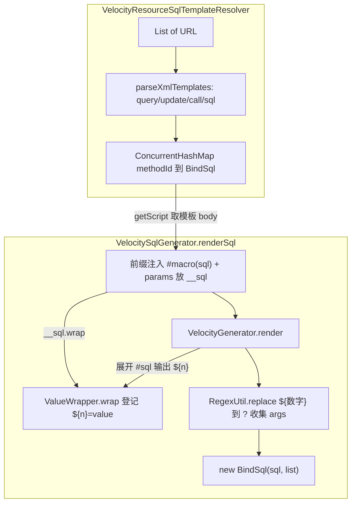

# i2f-extension-velocity-bindsql

> Velocity 模板 + BindSql 桥接扩展（`velocity-engine-core:2.3` 以 provided 引入、版本模块内硬编码、未走根 DM）：把上一级 `i2f-extension-velocity` 的模板渲染能力与 `i2f-bindsql` 的「SQL + 参数分离」模型对接起来，实现 **MyBatis 风格 XML Mapper → 参数化 `BindSql`（`?` 占位 + args 列表）** 的动态 SQL 引擎。核心是三块：`VelocitySqlGenerator.renderSql(template, params)` 向模板注入 `#macro(sql $value)` 自定义宏，宏内调用 `ValueWrapper.wrap(value)` 把实参登记为 `${n}` 占位符并回填，渲染完成后再用 `RegexUtil.replace` 将 `${数字}` 统一改写为 JDBC `?` 并按序收集参数值，产出 `BindSql`；`VelocityResourceSqlTemplateResolver` 解析 `<mapper class>` 下 `<query>/<update>/<call>/<sql method>` 节点，按 `class.method` 或全限定 method 归建 `ConcurrentHashMap<String, BindSql>` 模板缓存并支持 `refreshResources` 热重载；`ValueWrapper` 是单次渲染内的占位符登记表。3 主源文件约 239 行、`main` 测试 + MyBatis 样例模板。**仓库内有真实 Spring Boot 消费方**（`i2f-springboot-jdbc-bql-starter` 以 `@ConditionalOnClass` 自动装配为 `VelocityProxyRenderSqlProvider`），是扩展组中少数带运行期生态集成的模块。

## 模块路径

- `i2f-extension/i2f-extension-velocity-bindsql`
- 根 `pom.xml` 依赖管理（1285 行）；`i2f-extension/pom.xml` 模块登记（94 行）；`i2f-extension/i2f-extension-all` 聚合依赖（329 行）
- `bash/` 四目录分发 jar 均在册（backup/deploy × jdk8/jdk17）

## 模块依赖

| 依赖坐标 | scope | optional | 说明 |
|----------|-------|----------|------|
| `i2f.turbo:i2f-extension-velocity` | compile | false | `VelocityGenerator.render` 渲染门面；本模块的模板求值底座，依赖其注册的 `#trim`/`#sqlWhere`/`#sqlSet` 等自定义指令 |
| `i2f.turbo:i2f-bindsql` | compile | false | `BindSql`（`Type.QUERY/UPDATE/CALL/UNSET`）产物模型与 `BindSql.of` 构造 |
| `i2f.turbo:i2f-match` | compile | false | `RegexUtil.replace(str, regex, BiFunction)`，把 `${n}` 占位符回填为 `?` 并收集参数 |
| `i2f.turbo:i2f-io-stream` | compile | false | `StreamUtil.readBytes(URL)`，读取 mapper XML 资源字节 |
| `i2f.turbo:i2f-xml` | compile | false | `XmlUtil.parseXml/getRootNode/getAttribute/getNodesByTagName/getNodeContent`，解析 MyBatis 风格 mapper XML |
| `org.apache.velocity:velocity-engine-core:2.3` | provided | 否（未标 optional） | Velocity 引擎；版本硬编码于模块 pom，未走根 `dependencyManagement`（与 `i2f-extension-velocity` 重复声明同一版本） |
| `org.projectlombok` | compile | false | 仅 `VelocityResourceSqlTemplateResolver` 的 `@Data`/`@NoArgsConstructor` 用到，其余类零使用 |

## 模块设计

### 分层结构

- **渲染桥接层**（`VelocitySqlGenerator`，35 行）：单静态方法 `renderSql`，负责「注入宏 → 委托渲染 → 正则回填 → 组装 BindSql」四步流水，是本模块对外的主 API。
- **占位登记层**（`ValueWrapper`，23 行）：一次渲染一个实例，`Map<String,Object>` 以 `${size()}` 自增键暂存实参，`wrap(value)` 返回占位字面量字符串。
- **资源解析层**（`VelocityResourceSqlTemplateResolver`，181 行）：面向 mapper XML 的发现/解析/缓存/热重载，内含 `getDemoXmlVmContent()` 内联的规范样例文本。
- **模板语法层**（复用 `i2f-extension-velocity` 指令 + 本模块注入的 `#sql` 宏）：`#sqlWhere`/`#sqlSet`/`#trim` 来自 velocity 模块，`#sql($val)` 由 `renderSql` 运行时以 `#macro` 前缀注入。



### 参数化核心：`#sql` 宏 + 占位符回填

1. `renderSql` 在模板头部拼 `#macro(sql $value)$__sql.wrap($value)#end\n`，并把 `ValueWrapper` 实例以 `__sql` 键塞入 `params`。
2. 模板内写 `#sql($post.username)` 即调用宏 → `wrapper.wrap(username)`，把值存入 `map["${0}"]=值` 并让宏向输出流回吐 `${0}` 字面量。
3. Velocity 渲染得到形如 `... where a = ${0} and b = ${1}` 的字符串后，`RegexUtil.replace(rs, "\\$\\{\\d+\\}", ...)` 逐个匹配 `${n}`，从 `wrapper.getMap()` 取值追加到 `list` 并把占位符替换为 `?`。
4. 最终 `new BindSql(sql, list)` 即得到标准 JDBC 预编译形态。

### Mapper XML 解析（`VelocityResourceSqlTemplateResolver`）

- 根节点 `<mapper class="...">` 的 `class` 作为方法 ID 前缀；子节点 `query/update/call/sql` 的 `method` 属性若不含 `.` 则拼成 `class.method`，若已是全限定名则原样使用。
- 节点类型映射 `BindSql.Type`：`query→QUERY`、`update→UPDATE`、`call→CALL`、`sql→UNSET`（其余分支兜底 `UNSET`）。
- 解析产物 `Map<String, BindSql>` 合入 `templateMap`；`refreshResources()` 先 `clear()` 再逐 URL 重解析，单个 URL 解析异常仅 `printStackTrace` 跳过。
- 消费方 `VelocityProxyRenderSqlProvider` 用 `getScript(methodId)` 取模板 body，再交 `renderSql` 渲染。

## 模块目的

在 `i2f-extension-velocity` 的通用模板能力之上，专门解决「动态 SQL 构建需同时得到**参数化语句**与**参数序列**」这一 JDBC 预编译刚需：通过自定义 `#sql` 宏让模板作者只写 `#sql($value)` 即可自动完成占位与取值登记，作者无需手工管理 `?` 与 args 顺序；再以 MyBatis 风格 XML mapper 提供 SQL 外置、方法绑定与热重载能力，从而在不引入 MyBatis 的前提下，为 `jdbc-bql-starter` 的 JDK 动态代理 Mapper 提供一套轻量、可编程的动态 SQL 引擎。

## 模块功能

1. **模板 → BindSql**：`VelocitySqlGenerator.renderSql(template, params)` 一步产出 `?` 占位 SQL + 参数列表。
2. **`#sql` 参数化宏**：模板内 `#sql($val)` 自动登记实参并输出占位符，与 `#sqlWhere`/`#sqlSet`/`#trim` 协作完成条件拼接。
3. **XML Mapper 解析**：`parseXmlTemplates(URL)` 将 `<mapper>/<query>/<update>/<call>/<sql>` 解析为 `method → BindSql` 映射。
4. **资源缓存与热重载**：`VelocityResourceSqlTemplateResolver` 以 `ConcurrentHashMap` 缓存多 URL 解析结果，`refreshResources()` 支持清空重建。
5. **类型标注**：按标签名给 `BindSql` 赋 `QUERY/UPDATE/CALL/UNSET` 类型（供下游区分 executeQuery/executeUpdate/call）。
6. **规范样例内置**：`getDemoXmlVmContent()` 返回一份带注释的 mapper 模板示例，可作为文档/脚手架。

## 模块主要使用方法

### 1. 引入依赖

```xml
<dependency>
    <groupId>i2f.turbo</groupId>
    <artifactId>i2f-extension-velocity-bindsql</artifactId>
    <version>1.0-jdk8</version>
</dependency>
<!-- 运行期需自备 Velocity 引擎（本模块与 velocity 均 provided 声明 2.3） -->
```

### 2. 直接渲染一段模板

```java
Map<String, Object> params = new HashMap<>();
params.put("table", "sys_user");
params.put("map", Collections.singletonMap("id", 1));

String template = "select * from $table #sqlWhere() and id = #sql($map.id) #end";
BindSql bql = VelocitySqlGenerator.renderSql(template, params);
// bql.getSql() == "select * from sys_user where id = ?"
// bql.getArgs() == [1]
```

### 3. 基于 XML Mapper（Spring Boot 场景由 starter 自动装配）

```java
VelocityResourceSqlTemplateResolver resolver =
        new VelocityResourceSqlTemplateResolver(resources); // List<URL>
resolver.refreshResources();
BindSql tpl = resolver.getScript("com.test.mapper.TestMapper.list");
BindSql bql = VelocitySqlGenerator.renderSql(tpl.getSql(), params);
```

### 4. 注意事项

- 模板里的表名/列名（`$table`、`a.$column`）是**直接字符串插值**、不走 `#sql` 参数化，只应对可信来源使用；只有值才用 `#sql(...)` 生成 `?`。
- 依赖 `i2f-extension-velocity` 在 `settingEngine` 时注册的 `#sqlWhere`/`#sqlSet`/`#trim` 指令，脱离该引擎装配单独使用本模块的 `renderSql` 会因指令缺失而失败。
- 一个 SQL 模板中的 `#sql` 出现顺序即最终 args 顺序；同一值多次 `#sql` 会产生多个 `?` 与多份参数。

## 模块特性总结

1. **Velocity 之上的 SQL 专用桥**：把通用模板引擎收敛为「动态 SQL → 参数化语句」的领域工具。
2. **`?` 与 args 自动对齐**：`#sql` 宏 + 正则回填免除手工占位管理，天然防值注入。
3. **MyBatis 风格 XML mapper**：`class`+`method` 绑定、`query/update/call/sql` 分型、`ConcurrentHashMap` 缓存 + 热重载。
4. **真实运行期集成**：被 `i2f-springboot-jdbc-bql-starter` 以 `@ConditionalOnClass({VelocitySqlGenerator, VelocityGenerator, VelocityEngine})` 条件装配为代理 Mapper 的 SQL 提供者。
5. **零引擎自持**：自身不含模板引擎实现，完全复用 `i2f-extension-velocity`。

## 模块瑕疵或错误

> 依 `project-docs` 约定，以下仅静态识别问题 / 潜在风险，不实证。

1. **`renderSql` 就地修改入参 Map**（`VelocitySqlGenerator.java:20-21`）：`params.put("__sql", wrapper)` 直接写入调用方传入的 Map，产生副作用；若调用方复用同一 Map（如循环渲染多条 SQL），残留的 `__sql` 键会跨次污染，且违反「不改动入参」的洁癖契约（velocity 兄弟的 `render` 反而明确不改 params）。
2. **`BindSql.Type` 在渲染后丢失**：resolver 辛苦从 `<query>/<update>/<call>` 解析出的 `Type` 只存在于**模板 BindSql**，而 `renderSql` 产出的是 `new BindSql(sql, list)`（默认 `UNSET`）——下游拿到的最终可执行 SQL 已无类型信息，executeQuery/executeUpdate 分派需另行获取，类型解析价值被削弱。
3. **占位符回填正则过宽**（`VelocitySqlGenerator.java:27`）：`\$\{\d+\}` 会匹配渲染结果中**任意** `${数字}` 文本，若模板正文本身含有形如 `${123}` 的字面量（如注释、字符串常量、Velocity 未转义输出），会被误当作占位符替换为 `?` 并从 map 取到 `null` 塞入 args，造成 SQL 错位。
4. **测试样例路径陈旧且静态调用 default 方法**（`TestVelocitySql.java:17`、`SqlProxy.java:32`）：读取路径写作 `..\i2f-extension\i2f-velocity-bindsql\src\main\java\i2f\velocity\bindsql\test\test.sql.vm`——模块目录名 `i2f-velocity-bindsql`、包名 `i2f.velocity.bindsql` 均为历史旧值（现应为 `i2f-extension-velocity-bindsql` / `i2f.extension.velocity.bindsql`），且文件实际位于 `src/test` 而非 `src/main`，按字面路径必然找不到；同时 `TestVelocitySql` 以 `GeneratorTool.readFile(...)` 静态方式调用 `AllMixins` 的 default 实例方法（与 velocity 兄弟同款不编译问题），测试实为失效样例。
5. **`SqlProxy.executeSql` 空指针骨架**（`SqlProxy.java:94-95`）：`Connection conn = null;` 后直接 `conn.prepareStatement(...)` 必 NPE；虽 `main` 中该调用被注释、仅作思路演示，但方法本身不可运行，且资源（`stat`/`rs`）在异常路径下不关闭，无 try-with-resources。
6. **resolver 的 `@Data` 暴露可变内部态**：`@Data` 为 `resourceList`、`templateMap` 生成 public setter 与 getter，外部可 `setTemplateMap(null)` 或直接改写缓存 Map，破坏 `ConcurrentHashMap` 并发假设与封装；`getScript` 与 `refreshResources` 之间的 clear+putAll 非原子，热重载瞬间存在读到空缓存的窗口。
7. **`refreshResources` 吞异常静默降级**（`VelocityResourceSqlTemplateResolver.java:36-38`）：单个 mapper URL 解析失败仅 `printStackTrace` 后继续，导致部分 SQL 模板缺失而调用方无感知，运行到对应 `getScript` 返回 `null` 才由下游抛 `missing @SqlScript`，错误定位滞后且分散。
8. **`sql` 标签类型自动探测缺失**（`VelocityResourceSqlTemplateResolver.java:85-89` 对比 demo 注释）：内联 demo 注释声称 `sql` 节点会「auto detect type by keywords」，但实现一律置 `UNSET`，无任何关键词探测逻辑，文档/示例与实现不一致。
9. **表名/列名裸插值无防护**：`$table`、`a.$column`、`$map.keySet()` 展开的列名直接拼进 SQL 字符串（仅 `#sql(...)` 的值走参数化），若 `params` 中这些标识符来源不可信即构成 SQL 注入面；模块未提供任何标识符白名单/转义。
10. **`velocity-engine-core:2.3` 版本再次硬编码**：与 `i2f-extension-velocity` 各自在模块 pom 内重复声明同一 provided 版本（未提取到根 `dependencyManagement`），两处版本一旦漂移，运行期易出现 Velocity 指令/引擎类不兼容。
11. **依赖 `#sql` 宏名与占位约定脆弱**：`renderSql` 以字符串前缀注入名为 `sql` 的 `#macro`，若用户模板自带同名 `#macro sql` 或 velocity 侧未来新增 `#sql` 指令将发生冲突/覆盖；占位符方案依赖 `${n}` 不与 Velocity 自身 `${...}` 变量语法在渲染后残留碰撞，属隐式契约。

## 模块在生态中的位置

- **上游承接**：`i2f-extension-velocity`（模板渲染底座 + `#trim`/`#sqlWhere`/`#sqlSet` 指令）、`i2f-bindsql`（参数化 SQL 产物模型）、`i2f-match`（正则回填）、`i2f-xml`（mapper 解析）、`i2f-io-stream`（资源读取）。
- **下游消费**：`i2f-springboot-jdbc-bql-starter`（`JdbcProxyAutoConfiguration` 条件装配 `VelocityResourceSqlTemplateResolver`，`VelocityProxyRenderSqlProvider` 将模板渲染接入 JDK 动态代理 Mapper），`test-springboot` 集成样例——扩展组中少见的、真正接入 Spring Boot 运行期生态的 SQL 引擎模块。
- **定位**：介于「通用模板引擎」与「JDBC 预编译执行」之间的领域适配层，用 Velocity 表达动态 SQL、用 `#sql` 宏换取参数化安全，替代轻量场景下的 MyBatis。