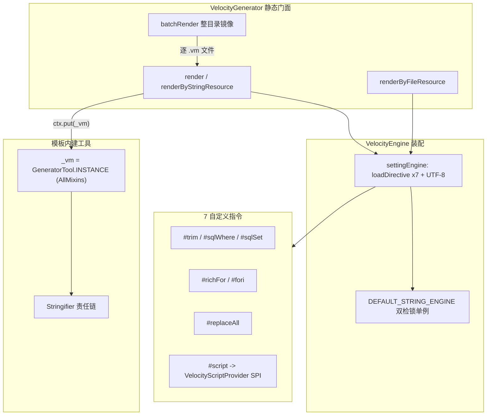

# i2f-extension-velocity

> Velocity 模板渲染与代码生成扩展（`velocity-engine-core:2.3` 以 provided 引入、版本模块内硬编码、未走根 DM）：与 `i2f-extension-freemarker` 为同一设计在两种模板引擎上的**同构兄弟模块**，但本模块显著更重——除共有的 `VelocityGenerator` 三源渲染门面（字符串 / 文件 / classpath）+ `batchRender` 整目录镜像生成（`#filename` 动态输出名）+ `_vm` 工具对象（`GeneratorTool implements AllMixins`）+ `Stringifier` 字符串化 SPI 外，**独有 7 个自定义 Velocity 指令**：通用块指令 `#trim`（前后缀剥离 + 条件附加）、`#sqlWhere`/`#sqlSet`（`#trim` 的 SQL 特例）、`#richFor`（Iterable/Iterator/Enumeration/Map/Array 五型迭代 + `$index` + 嵌套堆栈保护）、`#fori`（带方向判定的整数区间迭代）、`#replaceAll`（正则整体替换）、`#script`（内嵌 OGNL 等脚本，经 `VelocityScriptProvider` SPI 分派）。12 主源文件约 1400 行、1 个 `main` 测试 + SQL 样例模板。内部依赖 6 个 i2f 模块，**且仓库内有真实源码级消费方**（document / reverse-engineer-generator / xproc4j / velocity-bindsql 均 compile 引入），是扩展组中少见的被广泛复用的模板引擎底座。

## 模块路径

- `i2f-extension/i2f-extension-velocity`
- 根 `pom.xml` 依赖管理（1280 行）；`i2f-extension/pom.xml` 模块登记（93 行）；`i2f-extension/i2f-extension-all` 聚合依赖（325 行）
- `bash/` 四目录分发 jar 均在册（backup/deploy × jdk8/jdk17）

## 模块依赖

| 依赖坐标 | scope | optional | 说明 |
|----------|-------|----------|------|
| `i2f.turbo:i2f-io-stream` | compile | false | `StreamUtil.readString/writeString`，`batchRender` 读写模板与产物文件 |
| `i2f.turbo:i2f-text` | compile | false | 文本处理；在已读主源文件中未见直接 `import i2f.text.*`，疑似冗余或仅为传递装配 |
| `i2f.turbo:i2f-typeof` | compile | false | `TypeOf.typeOfAny`，`GeneratorTool.isInTypes`/`instanceOf` 类型判定 |
| `i2f.turbo:i2f-os` | compile | false | `OsUtil.runCmd`，`GeneratorTool.cmdResult` 执行命令取输出 |
| `i2f.turbo:i2f-serialize-impl` | compile | false | `Json2.toJson` / `Xml2.toXmlString`，`GeneratorTool` 的 JSON/XML 输出 |
| `i2f.turbo:i2f-mixins` | compile | false | `AllMixins` 聚合混入接口，`GeneratorTool` 继承后向模板开放全量混入函数（含 `readFile` 等 default 方法） |
| `org.apache.velocity:velocity-engine-core:2.3` | provided | 否（未标 optional） | Velocity 引擎本体；版本硬编码在模块 pom，未走根 `dependencyManagement` |
| `org.projectlombok` | compile | false | 仅 `ListableStringifier` 的 `@Data` 用到，其余类零使用 |

- 未声明但被直接引用：`DefaultStringifier` import `i2f.convert.obj.ObjectConvertor`（属 `i2f-convert`），依赖经其他内部模块**传递**获得，模块 pom 未显式登记该直接依赖。

## 模块设计

### 分层结构

- **渲染门面层**（`VelocityGenerator`，274 行）：全部 `public static`，收敛引擎装配、资源装载、上下文注入样板，提供 `render` / `renderByFileResource` / `renderByStringResource` / `batchRender` 四类入口。
- **指令扩展层**（`directives.common` + `directives.sql`，7 个 `Directive` 子类）：本模块区别于 freemarker 兄弟的核心，向模板语言注入自定义块指令，`settingEngine` 在建引擎时统一 `loadDirective` 注册。
- **工具对象层**（`GeneratorTool`，219 行）：`implements AllMixins`，渲染时以 `_vm` 键注入 `VelocityContext`，向模板暴露 `str/join/fori/list/instanceOf/split/toJsonString/toXmlString/cmd/cmdResult/isInTypes` 及全部混入函数。
- **字符串化 SPI 层**（`stringify` 包）：`Stringifier` 接口 + `DefaultStringifier`（恒支持兜底）+ `ListableStringifier`（实例列表 → ServiceLoader 静态列表 → 兜底 的责任链聚合）。



### 三种渲染来源

1. **字符串模板**（`render` / `renderByStringResource`）：走 `StringResourceLoader`，为每段模板生成 `UUID` 键 `putStringResource`，渲染后在 `finally` 中 `removeStringResource` 回收。`config` 为空时复用 `DEFAULT_STRING_ENGINE` 双检锁单例；`config` 非空时每次新建引擎（不缓存）。
2. **文件模板**（`renderByFileResource`，`isInClassPath=false`）：以 `FILE_RESOURCE_LOADER_PATH` 指向文件父目录，模板名取 `file.getName()`。
3. **classpath 模板**（`renderByFileResource`，`isInClassPath=true`）：切 `ClasspathResourceLoader`。

### 指令算法要点

- `#trim(prefixes, suffixes, appendPrefix, appendSuffix)`：变长参数重载（0~4 参），支持 `String` 或 `String[]`（`ASTObjectArray`）；先 `trim()` 再逐位匹配剥离**一个**前缀 / 后缀（`break`），body 非空时才附加前后缀——面向 SQL 片段拼接（去除多余 `and`/`or`/`,`）。
- `#sqlWhere` / `#sqlSet`：`#trim` 的硬编码特例（前缀分别 `["and","or","AND","OR"]`+`where`、`,`+`set`），代码与 `#trim` 主体重复实现而非委托。
- `#richFor(item, collection, sep, open, close)`：按 `Iterable`/`Iterator`/`Enumeration`/`Map`(按 keySet)/数组 分型迭代，暴露 `$index`；进入前备份 `item`/`index` 旧值、退出后还原，实现嵌套堆栈保护。
- `#fori(item, begin, end, step, sep, open, close)`：`initState = begin < end`，循环条件 `(item < end) == initState` 从而支持正反向迭代。
- `#replaceAll(regex, replace)`：块内容渲染后整体 `String.replaceAll`。
- `#script(root, lang)`：把 body 原文 `literal()` 交给 `VelocityScriptProvider`（按 `THREAD_PROVIDERS` → 静态 `PROVIDERS` → `ServiceLoader` 三级查找）求值，无匹配 provider 抛 `IllegalArgumentException`。

### 批量生成流程（`#filename` 动态输出名）

`batchRender` 递归遍历模板目录，仅处理 `.vm` 结尾文件：读模板 → `render` → 若渲染结果首行以 `#filename ` 开头则取该行值作输出文件名主体并保留原后缀，否则去掉 `.vm` 作为输出名；子目录镜像递归，输出父目录自动 `mkdirs()`。

## 模块目的

将 Apache Velocity 引擎的装配样板（引擎初始化、`loadDirective`、编码设定、三类资源 loader 切换、字符串资源仓库管理、`_vm` 上下文注入）收敛为一组静态门面方法，并通过自定义指令把「SQL 条件拼接的 `and/or/逗号` 剥离」「带索引与嵌套保护的增强迭代」「内嵌脚本求值」等模板语言原生不具备的能力补齐，使「数据模型 + 模板目录 → 代码 / SQL / 文本产物」的生成只需一次 `batchRender` / `render` 调用，作为仓库内文档导出、逆向工程代码生成、xproc4j 等模块的统一模板底座。

## 模块功能

1. **字符串模板渲染**：`render(template, params)` 一行完成内存模板求值（借助字符串资源仓库 + UUID 键）。
2. **文件 / classpath 模板渲染**：`renderByFileResource(config, isInClassPath, fileName, params)` 双来源切换。
3. **整目录批量生成**：`batchRender(templatePath, params, outputPath, charset)` 递归镜像 + `#filename` 动态输出名。
4. **7 个自定义指令**：`#trim`、`#sqlWhere`、`#sqlSet`、`#richFor`、`#fori`、`#replaceAll`、`#script`。
5. **模板内建工具对象**：`_vm`（`GeneratorTool`）提供字符串化、集合加工、JSON/XML、类型判定、命令执行等函数，并继承 `AllMixins` 全量混入函数。
6. **字符串化 SPI**：`Stringifier` + `DefaultStringifier` + `ListableStringifier`，支持 ServiceLoader 与实例列表双通道扩展。
7. **脚本引擎 SPI**：`ScriptDirective.VelocityScriptProvider` 允许注入 OGNL 等语言求值器。

## 模块主要使用方法

### 1. 引入依赖

```xml
<dependency>
    <groupId>i2f.turbo</groupId>
    <artifactId>i2f-extension-velocity</artifactId>
    <version>1.0-jdk8</version>
</dependency>
<!-- 运行期需自备 Velocity 引擎（本模块 provided 声明 2.3） -->
<dependency>
    <groupId>org.apache.velocity</groupId>
    <artifactId>velocity-engine-core</artifactId>
    <version>2.3</version>
</dependency>
```

### 2. 字符串渲染

```java
Map<String, Object> params = new HashMap<>();
params.put("table", "sys_user");
params.put("map", Collections.singletonMap("id", 1));

String rs = VelocityGenerator.render("select * from ${table}", params);
```

### 3. SQL 条件拼接（利用自定义指令）

```vm
select a.* from $table a
#sqlWhere()
#foreach($col in $map.keySet())
    and a.$col = $map.get($col)
#end
#end
```

`#sqlWhere` 自动剥离首个悬空 `and`/`or` 并在 body 非空时补 `where` 前缀。

### 4. 整目录批量代码生成

```java
VelocityGenerator.batchRender("D:/gen/tpl", params, "D:/gen/out", "UTF-8");
```

模板首行 `#filename ${tableName}Controller` + 文件名 `Controller.java.vm` → 输出 `UserController.java`。

### 5. 增强迭代与脚本

```vm
#richFor($item, $list, ",", "[", "]")
    $index -> $item
#end

#fori($i, 0, 10, 2)
    line-$i
#end

#script($root, "ognl")
1 + count
#end
```

`#script` 需先注册匹配的 `VelocityScriptProvider`（静态列表 / ThreadLocal / ServiceLoader 任一）。

### 6. 注意事项

- 渲染向新建的 `VelocityContext` 注入并移除 `_vm`，**不改动传入的 `params` Map**（相较 freemarker 兄弟直接改 `params` 更干净）；但仍不建议在 `params` 中预置 `_vm` 键。
- `renderByFileResource` 的 `isInClassPath=false` 需传带父目录的路径，否则 `getParentFile()` 为 `null`。
- 引擎默认 `ENCODING_DEFAULT`/`INPUT_ENCODING` 为 UTF-8，但 `OUTPUT_ENCODING` 被注释未设。

## 模块特性总结

1. **Velocity 版同构兄弟**：与 `i2f-extension-freemarker` 共享「门面 + `_vm` 工具 + Stringifier SPI + batchRender」骨架；
2. **独有 7 指令扩展**：把 SQL 剥离、增强迭代、内嵌脚本等能力补进模板语言，是超越 freemarker 兄弟的差异化部分；
3. **真实被复用的底座**：仓库内 document / reverse-engineer-generator / xproc4j / velocity-bindsql 多模块 compile 依赖，非零消费方；
4. **字符串引擎单例缓存**：默认字符串渲染走双检锁复用 `DEFAULT_STRING_ENGINE`；
5. **两级 SPI**：`Stringifier` 与 `VelocityScriptProvider` 均可经 ServiceLoader 扩展；
6. **脚本执行能力**：`#script` + `GeneratorTool.cmd/cmdResult` 使模板可触发外部计算与系统命令。

## 模块瑕疵或错误

> 依 `project-docs` 约定，以下仅静态识别问题 / 潜在风险，不实证。

1. **测试无法编译 + 路径失配**（`TestVelocity.java:16`）：`GeneratorTool.readFile(...)` 以静态方式调用，而 `readFile` 是 `AllMixins`（`FileMixins`）的 default 实例方法，静态调用不成立；且路径写 `i2f-extension\i2f-velocity\...`（缺 `-extension` 后缀、目录名陈旧），与实际模块 `i2f-extension-velocity` 不符，测试实为失效样例。
2. **未声明直接依赖**：`DefaultStringifier` import `i2f.convert.obj.ObjectConvertor` 但 pom 无 `i2f-convert`，靠传递依赖编译，一旦上游移除该传递即断裂。
3. **疑似冗余依赖 i2f-text**：pom 声明 `i2f-text` 但在已读主源文件中未见 `i2f.text` 的直接 import，可能为零使用冗余（类似其他模块的空 lombok）。
4. **`sqlWhere`/`sqlSet` 与 `trim` 逻辑重复**：三者的前缀/后缀剥离 + 条件附加代码几乎逐行拷贝，未抽取公共方法，维护需三处同步；且 `#trim` 前/后缀各只剥离**第一个**命中项（`break`），多层 `and and` 需多次嵌套才清得干净，易被误用为「全部剥离」。
5. **引擎缓存策略不一致**（`getDefaultStringEngine`）：`config` 为空复用静态单例、`config` 非空则每次 `new VelocityEngine()` 不缓存——同一门面两条路径缓存语义不同；且文件渲染 `renderByFileResource` 每次也新建引擎无缓存，批量文件渲染下引擎装配（含 7 次 `loadDirective`）开销线性放大。
6. **共享字符串资源仓库的跨引擎可见性**：`StringResourceLoader.getRepository("stringRepo")` 按名字返回全局静态仓库，缓存单例与临时新建引擎共用同一 repo；虽以 UUID 键 + `finally` 删除规避冲突，但任一渲染异常逃逸删除前的窗口内资源仍短暂留存于全局 repo。
7. **`GeneratorTool.fori` 死循环风险**（`GeneratorTool.java:92`）：工具方法 `fori` 终止条件为 `i != end`，当 `step` 为 0 或步长方向与区间方向相反（如 `fori(10,0,1)`）时永不终止；注意指令 `#fori`（`ForiDirective`）已用 `(item<end)==initState` 修正，两者语义不一致，模板作者易混淆。
8. **`cmd` 吞异常、契约不一致**（`GeneratorTool.java:98-107`）：`Runtime.exec` 与 `waitFor` 异常仅 `printStackTrace`，无返回值、不校验 `exitValue`、不消费进程 stdout/stderr（输出缓冲填满可致子进程阻塞）；而 `cmdResult` 抛受检异常，二者错误契约割裂。
9. **`instanceOf`/`isInTypes` 吞异常 + 类型表局限**（`GeneratorTool.java:147-178`）：`Class.forName` 失败仅 `printStackTrace` 返回 false；简名映射仅 9 项，`date` 只对应 `java.util.Date` 不含 JSR-310；传原始类型名会走失败路径。
10. **`#script` provider 三级查找含死路径**（`ScriptDirective.java:61-93`）：`THREAD_PROVIDERS` 在本模块无任何写入入口，仅依赖外部反射/手动 set，实际几乎恒为 null；无匹配 provider 直接抛 `IllegalArgumentException` 中断渲染。
11. **`#replaceAll` 正则与类型无防护**（`ReplaceAllDirective.java:38-46`）：`regex`/`replace` 直接 `(String)` 强转 child 值，非字符串入参抛 `ClassCastException`；用户提供的非法正则抛 `PatternSyntaxException`、灾难性回溯正则可致 ReDoS。
12. **`RichForDirective` 参数扫描边界**（`RichForDirective.java:81-108`）：可选参数循环上界为 `i<=5`，依赖 body 恰为 `ASTBlock` 落入该窗口才被 `break` 捕获；参数数量接近上界时对 body 节点的定位敏感，边界脆弱。
13. **安全面**：`#script`（OGNL 等）与 `_vm.cmd/cmdResult` 使模板具备执行任意表达式与系统命令的能力，若模板来源不可信（如用户可控内容）等同远程代码执行，仅应在受信模板场景使用。
14. **`OUTPUT_ENCODING` 注释未启用**（`VelocityGenerator.java:260`）：仅设输入与默认编码，输出编码依赖调用方 `StreamUtil`/Writer 兜底，多字符集混用场景存在编码漂移隐患。

## 模块在生态中的位置

- **上游依赖**：绑定 `velocity-engine-core:2.3`（provided），内部复用 i2f 的流处理、类型判定、OS 命令、序列化、混入工具等基础模块。
- **下游消费方（真实源码级引用）**：
  - `i2f-extension-document`：Word XML 模板渲染（`VelocityGenerator.render`）；
  - `i2f-extension-reverse-engineer-generator`：数据库逆向代码生成模板引擎；
  - `i2f-extension-xproc4j`：XML 处理流程模板渲染；
  - `i2f-extension-velocity-bindsql`：基于本模块的 SQL 绑定渲染兄弟扩展；
  - `test-springboot`：集成测试引入。
- **平行设计**：与 `i2f-extension-freemarker` 为同一「模板引擎 + 代码生成」设计在两种引擎上的落地；本模块因 7 自定义指令与更广下游而更重。freemarker 兄弟仅出现在 bash 的 jdk8 分发目录，而本模块在 jdk8/jdk17 四目录均有分发 jar。
