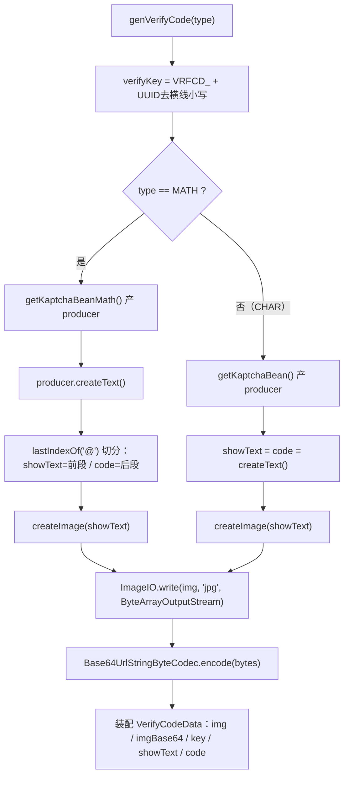

# i2f-extension-verifycode

## 模块路径

`i2f-extension/i2f-extension-verifycode`（artifactId `i2f-extension-verifycode`，groupId 继承 `i2f.turbo`，版本 `1.0-jdk8`）。

本模块是对第三方 **Kaptcha 2.3.2**（`com.github.penggle:kaptcha`，Google Code 图形验证码库的 penggle 维护分支）的极薄封装：把 Kaptcha 的 `DefaultKaptcha`  producer 配置、字符型/算术型验证码生成、图片转 Base64、结果承载 POJO 收敛为两处静态方法，对外只暴露一个入口 `VerifyCodeUtil.genVerifyCode(VerifyCodeType)` 与一个数据体 `VerifyCodeData`。全模块仅 **2 个主源文件、约 167 行**（`VerifyCodeUtil` 135 行、`VerifyCodeData` 32 行），无测试、无 SPI、无资源文件。

> 说明：本仓库内另有 **平行模块** `i2f-jdk/i2f-verifycode`（自绘「看图答题」验证码），与本模块**互不依赖**——本模块走 Kaptcha 传统字符/算术型路线，两者为并存的独立方案。

## 模块依赖

`pom.xml` 声明三个依赖：

- `org.projectlombok:lombok`（`@Data` 用于 `VerifyCodeData`）
- `i2f.turbo:i2f-codec-impl`（真实消费：`VerifyCodeUtil` 用 `Base64UrlStringByteCodec.INSTANCE.encode(byte[])` 把 jpg 字节转 base64url 字符串）
- `com.github.penggle:kaptcha:2.3.2`（`<scope>provided</scope>`，**硬编码版本号未走根 pom `dependencyManagement`**，与同组多个 extension 模块一致的既有现象）

编译期可见 `com.google.code.kaptcha.*`（`Producer`/`DefaultKaptcha`/`Config`/`Constants.*`）；运行期因 `provided` 由消费方自带，聚合方需自行引入 Kaptcha，否则 `NoClassDefFoundError`。

生态登记（全部核对到位）：

| 位置 | 行号 | 内容 |
| --- | --- | --- |
| `i2f-extension/pom.xml` | :95 | `<module>i2f-extension-verifycode</module>` |
| 根 `pom.xml` DM | :1288-1292 | `dependencyManagement` 版本条目 |
| `i2f-extension-all/pom.xml` | :331-334 | 聚合依赖 |
| `bash/{backup,deploy}-{jdk8,jdk17}` | — | 四目录 jar 齐全（已用 `Get-ChildItem` 核实 `i2f-extension-verifycode-1.0-{jdk8,jdk17}.jar`） |

构建：`maven-assembly-plugin`（`addMavenDescriptor=true`），与本组标准 fat-jar 打包一致。

## 模块设计

单门面 `VerifyCodeUtil` + 单数据体 `VerifyCodeData`，无接口/抽象、无注册表。核心是 `genVerifyCode` 的分型生成管线：



两套 `DefaultKaptcha` 配置方法 `getKaptchaBean()`（字符型）与 `getKaptchaBeanMath()`（算术型）各自 `new Properties()` 逐项 `setProperty` 后 `new Config(properties)` → `defaultKaptcha.setConfig`，产出一个已配置的 `DefaultKaptcha`。数据体 `VerifyCodeData` 提供两个便捷视图方法：`getCacheEntry()` 返回 `key → code`（服务端存校验答案），`getWebShowEntry()` 返回 `key → imgBase64`（前端展示）。

## 模块目的

- 屏蔽 Kaptcha 的 `Properties` + `Config` + `Producer` 繁琐装配，给业务一个「选类型 → 拿验证码」的一次性 API。
- 同时覆盖**字符型**（用户照抄图中文本）与**算术型**（用户填算式结果）两类主流图形验证码。
- 输出可直接落缓存/前端的结构：一次性 `key`（`VRFCD_` 前缀）、可显示图片、`code` 校验答案、`imgBase64`，便于「存 code、展示 imgBase64、按 key 比对」的经典验证码闭环。

## 模块功能

- `VerifyCodeUtil.getKaptchaBean()`：字符型 `DefaultKaptcha`（边框 yes、黑字、160×60、字号 38、字长 4、Arial/Courier、ShadowGimpy 样式）。
- `VerifyCodeUtil.getKaptchaBeanMath()`：算术型 `DefaultKaptcha`（边框色 105,179,90、蓝字、字号 35、字长 6、无噪点 NoNoise、字间距 3，`KAPTCHA_TEXTPRODUCER_IMPL` 指向外部类）。
- `VerifyCodeUtil.genVerifyCode(VerifyCodeType)`：按型生成 `VerifyCodeData`，`throws IOException`。
- `VerifyCodeType` 枚举：`MATH("math")` / `CHAR("char")`。
- `VerifyCodeData`（`@Data`）：`img`/`code`/`showText`/`key`/`imgBase64` 五字段 + `getCacheEntry()` / `getWebShowEntry()` 两视图方法。

## 模块主要使用方法

```java
// 生成一张字符型验证码
VerifyCodeData data = VerifyCodeUtil.genVerifyCode(VerifyCodeType.CHAR);

// 前端展示：把 key -> imgBase64 存进会话缓存/返回页面
Entry<String, String> web = data.getWebShowEntry(); // key -> base64url(jpg)
// 服务端校验：把 key -> code 存进服务端缓存（如 Redis，带过期）
Entry<String, String> cache = data.getCacheEntry(); // key -> 用户应填答案

// 用户回传 (key, input) 后，由调用方自行比对 cache.get(key) equalsIgnoreCase(input)
```

`imgBase64` 为**裸 base64url 字符串**（不含 `data:image/jpeg;base64,` 前缀），前端用于 `` 时需自行补 data URI 方案头（可用 `i2f-codec-impl` 的 `DataProtocolUtil`）。

## 模块特性总结

- **极薄封装**：167 行、2 文件，不含任何自研验证码算法，全部图形绘制/干扰/扭曲交给 Kaptcha。
- **双路线合一**：一个方法用枚举分派字符型与算术型两套 Kaptcha 配置。
- **输出面向闭环**：`VerifyCodeData` 的 `getCacheEntry`/`getWebShowEntry` 显式对齐「服务端存答案 / 前端拿图」双通道。
- **一次性 key**：`VRFCD_` + UUID（去 `-`、小写），避免 key 碰撞与语义泄露。
- **Base64 复用**：借 `i2f-codec-impl` 的 `Base64UrlStringByteCodec` 完成图片编码，不重复造轮子。

## 模块瑕疵或错误

以下均为**静态阅读源码**发现，未运行实证：

1. **跨项目复制粘贴残留（最严重）**：`getKaptchaBeanMath()` 的 `KAPTCHA_TEXTPRODUCER_IMPL` 被硬编码为 `com.ruoyi.framework.config.KaptchaTextCreator`（见 `VerifyCodeUtil.java:79`）——这是开源脚手架 **RuoYi** 框架里的类，本仓库根本不存在该类。算术型验证码依赖 Kaptcha 反射实例化此 TextProducer，运行时必然 `ClassNotFoundException`/配置失败，**MATH 模式整体不可用**。
2. **`@` 分隔契约脆弱**：`genVerifyCode` MATH 分支用 `math.lastIndexOf("@")` 切分算式与答案（`VerifyCodeUtil.java:107-109`）。Kaptcha **默认** `SimpleTextProducer` 输出并不含 `@`；即使换掉第 1 条的外部类，只要生产者文本不含 `@`，`spIdx` 为 -1 → `substring(0, -1)` 抛 `StringIndexOutOfBoundsException`。该 `expr@answer` 格式完全依赖那个不存在的外部类，属隐式脆弱契约。
3. **无默认/空值兜底 → NPE**：`genVerifyCode` 只有 `if MATH / else if CHAR`，无 `else`（`VerifyCodeUtil.java:104-116`）。当 `type == null`（或未来新增枚举值未加分支）时，`img` 保持 `null`，随后 `ImageIO.write(null, "jpg", os)` 抛异常，且 `showText`/`code` 亦为 null。
4. **枚举 `type` 字段是死代码**：`VerifyCodeType` 持有 `private String type`（"math"/"char"）但**无 getter、内部从不读取**，分派用的是 `== MATH` 枚举比较（`VerifyCodeUtil.java:26-33`）。该字符串描述符完全未被使用。
5. **每次调用重建引擎、配置全硬编码**：`genVerifyCode` 每次内部 `getKaptchaBean*()` 都 `new DefaultKaptcha()` + 全新 `Properties`/`Config`，无缓存复用；尺寸、颜色、字体、字长、样式等全部写死，调用方无法按业务定制，批量生成时重复装配开销放大。
6. **不提供校验方法**：模块只「生成」，比对逻辑（忽略大小写、算式求值、过期、一次性销毁）全交给调用方，`getCacheEntry` 也只存 `code` 原值，易被误用为区分大小写或直接字符串比较。
7. **`imgBase64` 命名易误导**：字段存的是裸 base64url，无 data URI 前缀（`VerifyCodeUtil.java:123`），直接塞进 `` 无法渲染，需调用方补方案头。
8. **固定 JPEG 有损编码**：`ImageIO.write(img, "jpg", os)`（:120）对含文字/线条的验证码用有损 JPEG，边缘出现压缩噪点影响可读性，文本类图片更宜 PNG。
9. **`provided` + 未走根 DM**：`kaptcha` 为 `provided`（消费方自带，否则 NoClassDefFoundError），且版本号 `2.3.2` 直接写死在本模块 pom（:28），脱离根 `dependencyManagement` 统一版本治理，与本组多处同类既有瑕疵一致。
10. **零测试**：无 `src/test`，两条生成路径与 MATH 切分逻辑均无用例，第 1、2 条缺陷因此长期未被暴露。
11. **异常裸抛、无日志**：`genVerifyCode` 直接 `throws IOException`，类无 `@Slf4j`，图片写出失败无上下文记录。

## 其他扩展章节

### 模块在生态中的位置

- **角色**：Kaptcha 的业务友好门面，属「已发布、供外部工程即用」的叶子扩展——仓库内**无源码级消费方**（全仓 `i2f.extension.verifycode` 仅命中自身两文件的 import），仅通过 `i2f-extension-all` 聚合、`bash` 四目录分发对外提供。
- **下游依赖**：编译/运行依赖 `i2f-codec-impl`（`Base64UrlStringByteCodec`），后者文档亦将本模块列为其外部典型消费方之一。
- **平行关系**：与 `i2f-jdk/i2f-verifycode`（自绘「看图答题」验证码）并存互补、互不依赖；一为传统 Kaptcha 字符/算术型，一为自绘图算型，可按业务场景择用。
- **可改进方向（仅记录，不代改）**：修正/移除第 79 行对 RuoYi 外部类的硬编码引用，改为随本模块附带一个内置 `MathTextProducer`（产 `expr@answer`）或以参数注入 TextProducer；补 `genVerifyCode` 的 null/默认兜底与枚举 `type` 语义；缓存 producer 实例并开放配置；提供配套的 `verify`/`check` 工具；补测试。
