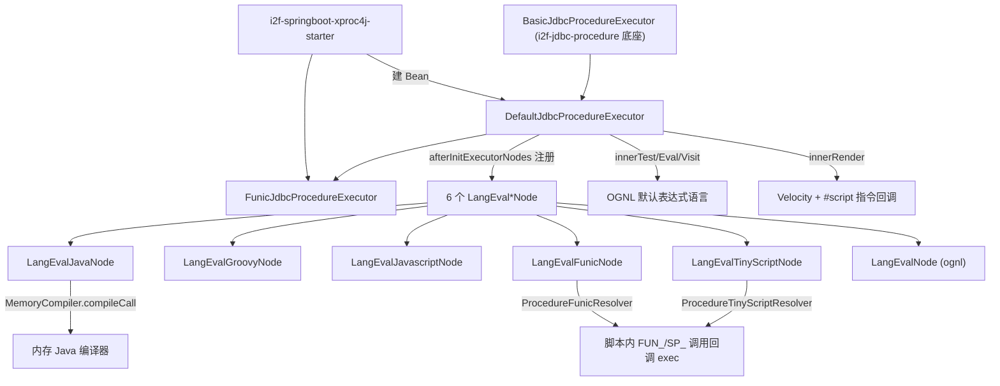

# i2f-extension-xproc4j

> **XProc4J 多语言脚本执行扩展**（18 主源约 2900 行 + 2 测试 + 1 XML，包名直接落在 `i2f.jdbc.procedure.*` 与 JDK 底座共享命名空间）：以 `DefaultJdbcProcedureExecutor extends BasicJdbcProcedureExecutor` 为核心，向 `i2f-jdbc-procedure` 引擎补齐 **Java / Groovy / JavaScript(Nashorn) / Funic / TinyScript / OGNL** 六种语言的 `<lang:eval-*>` 节点与 `EVAL_*` 特性通道，并以 OGNL 为默认表达式语言、Velocity 为模板渲染、`ScriptPreloadEventListener`/`ProcedureMetaMapGrammarReporterListener` 做启动预编译与语法体检，是「去数据库存储过程」引擎的**运行期语言扩展层**。有真实且深度的 SpringBoot 消费方 `i2f-springboot-xproc4j-starter`。

## 模块路径

`i2f-extension/i2f-extension-xproc4j`（artifactId `i2f-extension-xproc4j`，groupId 继承 `i2f.turbo`，版本 `1.0-jdk8`）。

本模块**不是**对某个第三方库的桥接，而是本仓库自研存储过程引擎 `i2f-jdk/i2f-jdbc-procedure`（已文档化，`BasicJdbcProcedureExecutor` 2611 行 / 77 内置节点）的**多语言求值扩展包**：所有类都写在 `i2f.jdbc.procedure.*` 包下（`executor.impl` / `node.impl` / `reportor` / `context.event` / `context.impl`），通过继承底座类并覆写 `afterInitExecutorNodes` / `afterInitFeatureMap` / `innerTest` / `innerEval` / `innerVisit` / `innerRender` 等钩子，把六种脚本语言挂载进引擎。全模块 18 个主源文件约 2900 行，其中 `LangEvalJavaNode`（435）、`MetaDependencyResolver`（468）、`ProcedureFunicResolver`（222）、`ScriptPreloadEventListener`（206）为体量最大的四个类。

## 模块依赖

`pom.xml` 声明的内部依赖：`i2f-jdbc-procedure`（引擎契约与底座）、`i2f-mutator`、`i2f-extension-groovy`、`i2f-extension-ognl`、`i2f-extension-velocity`、`i2f-extension-antlr4`（Funic / TinyScript 语法）。

第三方依赖**全部 `provided` + `optional`（velocity 仅 provided 未 optional）**，且**版本一律硬编码、未走根 `dependencyManagement`**：`org.apache.groovy:groovy:4.0.18`、`org.openjdk.nashorn:nashorn-core:15.4`、`ognl:ognl:3.4.11`、`org.apache.velocity:velocity-engine-core:2.3`、`org.antlr:antlr4-runtime:4.13.2`。另声明了三只**仅用于运行期驱动加载的 DB 驱动**（`com.oracle.database.jdbc:ojdbc8:19.8.0.0`、`com.oracle.database.nls:orai18n:19.8.0.0`、`com.mysql:mysql-connector-j:8.3.0`，均 provided+optional），以及一段被整块注释掉的 `system` scope GBase 驱动。`nashorn-core` 上方有注释说明「JDK>15 才需要，因 Nashorn 在 Java15 被移除」。build 用 `maven-assembly-plugin`。

## 模块设计

核心是「一个 executor 子类 + 六个语言节点 + 两个脚本解析器 + 事件监听器 + 依赖分析器」的分层结构。`DefaultJdbcProcedureExecutor` 在 `afterInitExecutorNodes` 里 `ret.add(...)` 六个 `LangEval*Node`，在 `afterInitFeatureMap` 里 `registryFeatureFunction` 注册 `EVAL_JAVA/EVAL_JS/EVAL_TINYSCRIPT/EVAL_TS/EVAL_GROOVY/EVAL_FUNIC`；`innerTest/innerEval/innerVisit` 一律走 `OgnlUtil.evaluateExpression`，`innerRender` 走 `VelocityGenerator.render` 并把每个 `EvalScriptProvider` 适配成 `ScriptDirective.VelocityScriptProvider` 塞进 `ScriptDirective.THREAD_PROVIDERS`（ThreadLocal），从而让 Velocity 模板里的 `#script(lang)` 指令回调到对应语言。`FunicJdbcProcedureExecutor` 进一步把 `innerTest/innerEval/innerVisit` 从 OGNL 改写成 Funic。



六个语言节点同时实现 `ExecutorNode`（对应一个 XML 标签 `tag()`）与 `EvalScriptProvider`（`support(lang)` + `eval(...)`），因此既能作 XML 节点执行、也能被其它语言的 resolver 反查调用。`LangEvalJavaNode` 把用户 body 包成 `public Object exec(JdbcProcedureExecutor, Map)` 并前置一整块 `EVAL_JAVA_IMPORTS`（约 50 个 `包名.*`），无 `return` 时自动给末行补 `return`，用正则把 body/member 里的 `import` 抽出上提，SHA-1 生成 `RC<hash>` 类名，`FULL_JAVA_SOURCE_MAP`（`LruMap(2048)`）缓存源码。`ProcedureFunicResolver`/`ProcedureTinyScriptResolver` 覆写 `beforeInvokeGlobalMethod`/`beforeFunctionCall`：先 `executor.getMeta(naming)`，命中则以 `executor.exec(naming, callParams, false, false)` 递归执行嵌套过程，并把 `ExecutorMethodProvider`（env/bean/trace/log）与 `ExecContextMethodProvider`（`sql_query_*`/`visit`/`render`/`eval_script`）以反射暴露为脚本内建函数。`MetaDependencyResolver` 静态扫描 XML/脚本/编译后的 `.class` 常量池，构建 `naming→dependencies/usages` 依赖图并输出 ASCII 树或 Echarts JSON。

## 模块目的

把「存储过程」XML 里需要的**通用编程能力**（而非只有 OGNL 表达式）补齐：让过程定义能内嵌 Java、Groovy、JS、Funic、TinyScript 片段做复杂计算与流程控制，并在脚本中以函数调用语法直接调起其它过程（`SP_XYY(...)`）。它使 `i2f-jdbc-procedure` 从「XML 节点 + OGNL」升级为「XML 节点 + 六种图灵完备/半完备语言」的可编程引擎，是「去数据库存储过程」路线的关键一环。

## 模块功能

- `DefaultJdbcProcedureExecutor`：注册 6 语言节点、`EVAL_*` 特性、OGNL 测试/求值、Velocity 渲染 + `#script` 回调、双检锁 `MybatisMapperInflater`。
- `FunicJdbcProcedureExecutor`：以 Funic 取代 OGNL 作为默认 `test/eval/visit` 语言。
- `LangEvalJavaNode` / `LangEvalGroovyNode` / `LangEvalJavascriptNode` / `LangEvalFunicNode` / `LangEvalTinyScriptNode` / `LangEvalNode`：六语言求值节点，各自 `main` 自带片段冒烟。
- `ProcedureFunicResolver` / `ProcedureTinyScriptResolver` + 两个 `*FunctionCallContext`：脚本内函数调用→嵌套过程执行 / 内建方法暴露。
- `ExecutorMethodProvider` / `ExecContextMethodProvider`：脚本可见的 env/bean/trace/log 与 SQL/上下文操作内建函数集。
- `ScriptPreloadEventListener`：meta 刷新时对全部节点脚本预解析/预编译，提前暴露语法错误。
- `ProcedureMetaMapGrammarReporterListener`：刷新时做语法体检（启动同步、其后经 1~3 线程 `DiscardOldestPolicy` 池异步）。
- `DefaultGrammarReporter`：在底座 `BasicGrammarReporter` 之上，按 `feature` 分别用 OGNL 解析 / GroovyShell.parse / MemoryCompiler.findCompileClass / TinyScript+Funic 带 `ERROR_LISTENER` 做静态语法检查。
- `MetaDependencyResolver`：过程依赖图分析与可视化输出。

## 模块主要使用方法

```java
// 1) SpringBoot：由 starter 自动装配，enable-funic 决定默认语言
//    xproc4j.executor.enable=true / xproc4j.executor.enable-funic=false
JdbcProcedureExecutor executor; // = DefaultJdbcProcedureExecutor 或 FunicJdbcProcedureExecutor

// 2) XML 过程里内嵌各语言片段
//    <lang:eval-java result="sum">return (int)params.get("a") + (int)params.get("b");</lang:eval-java>
//    <lang:eval-groovy result="r">params.a + params.b</lang:eval-groovy>
//    <lang:eval-funic result="r">a + b</lang:eval-funic>
//    <lang:eval result="r">a+b</lang:eval>            <!-- 默认 OGNL -->

// 3) 脚本中以函数调用语法嵌套调用其它过程（由 resolver 拦截）
//    FUNIC:  let v = SP_ORDER_TOTAL(202401);
```

裸用也可：`new DefaultJdbcProcedureExecutor().eval("a+b", map)`（见 `LangEvalNode.main`），或 `LangEvalJavaNode.evalJava(map, null, "(int)params.get(\"a\")+(int)params.get(\"b\")")`。

## 模块特性总结

- **深度 SpringBoot 集成**：`SpringContextJdbcProcedureExecutorAutoConfiguration` 按 `isEnableFunic()` 在两种 executor 间选择，并条件化装配两个监听器（`@ConditionalOnExpression` + `@ConditionalOnMissingBean`），是本模块存在的实际落地场景。
- **语言可插拔**：六语言节点统一 `ExecutorNode`+`EvalScriptProvider` 双身份，新增语言只需再加一个节点并在 `afterInitExecutorNodes` 注册。
- **脚本↔过程双向调用**：resolver 把脚本里的命名函数调用回落到 `executor.exec`，内建方法经反射 Provider 暴露，形成闭环。
- **编译期前移**：`ScriptPreloadEventListener` + `DefaultGrammarReporter` 把「运行才报的语法/编译错误」提前到刷新阶段，Java 节点还借 `MemoryCompiler.findCompileClass` 做纯编译校验。
- **重量级依赖全 provided+optional**：把 groovy/nashorn/ognl/velocity/antlr4 与三只 DB 驱动都交给消费方按需引入，jar 本体极薄。

## 模块瑕疵或错误

> 以下均为静态阅读发现，未运行验证。

1. **`LangEvalJavaNode` 的 `LANG_JAVA_BODY` 处理错置**（`reportGrammar` L343-345 与 `execInner` L393-395）：命中 `<java:body>` 子节点时写的是 `bodyNode = node`（父节点）而非 `bodyNode = item`（body 子节点），与相邻 `importNode = item` / `memberNode = item` 不一致，属复制粘贴错误；导致 body 段实际取的是整个 `lang:eval-java` 父节点文本。
2. **`MetaDependencyResolver.getSqlStringDependencyMapNext` 越界裁剪**（L328-338）：正则 `[a-zA-Z0-9_]{3,}` 命中的是无引号标识符，却无条件执行 `naming.substring(1, naming.length()-1)`，把每个 SQL 函数名的首尾字符削掉，依赖名被系统性破坏。
3. **`getMybatisMapperInflater` 双检锁形同虚设**（L171-179）：进入 `synchronized` 后未再次判空即 `mybatisMapperInflater = createNewMybatisMapperInflater()`，多线程排队时会重复创建 inflater。
4. **`createNewMybatisMapperInflater().runScript` 吞异常**（L196-235）：`eval/ognl/visit/test/render` 五个分支的 `catch(Exception e){}` 全为空实现，脚本执行错误被静默丢弃后继续向下匹配 provider，掩盖真实失败原因。
5. **JavaScript 链路不完整**：`LangEvalJavascriptNode` 未覆写 `reportGrammar`，`DefaultGrammarReporter` 的 `EVAL_JS` 分支（L43-44）为空，`ScriptPreloadEventListener` 也不处理 JS 标签——三处一致地跳过 JS 静态检查；且 `ScriptProvider.getJavaScriptInstance()` 依赖 Nashorn，JDK>15 若未随附 `nashorn-core`（本模块 provided+optional）则运行期取引擎失败。
6. **测试命名与覆盖错位**：`TestDefaultProcedureExecutor` 实际 new 的是底座 `BasicJdbcProcedureExecutor`（L32/L81），从未构造本模块的 `DefaultJdbcProcedureExecutor`，六个 `LangEval*Node` 与 `EVAL_*` 特性通道**没有任何单测覆盖**；其 `testProcedure` 需真实 Oracle/GBase 连接且整段被注释，本质是压测 main 而非断言测试。
7. **`MetaDependencyResolver` 对动态编译类失效**（L201-224）：`getDependencyMapNext(JdbcProcedureJavaCaller,...)` 用 TCCL 读 `.class` 资源，而 Java 节点产出的 `RC<hash>` 类不落磁盘/不在 classpath，`getResourceAsStream` 返回 null，`readBytes` 抛异常又被空 catch 吞掉，Java 过程的依赖边静默丢失。
8. **`FULL_JAVA_SOURCE_MAP` 缓存与类加载泄漏**（L171、L314-319）：LRU(2048) 只缓存「源码文本→类名」映射，`MemoryCompiler` 编译出的类不受该 LRU 驱逐，高频变动的 Java 片段会使已加载 Class 持续累积。
9. **`EVAL_JAVA_IMPORTS` 强绑定全部可选依赖**（L85-170）：预烘焙 import 里含 groovy/ognl/velocity/antlr4-tinyscript 等包；一旦消费方未引入其中某个 `provided` 依赖，内嵌 Java 片段 `import xxx.*` 即编译失败，语言节点被隐式互相牵连。
10. **bash 分发缺 jdk17 jar**：`bash/**` 下仅 `backup-jdk8`、`deploy-jdk8` 有 `i2f-extension-xproc4j-1.0-jdk8.jar`，无 jdk17 变体（与本组多数模块四目录齐全不一致），对一个依赖内存编译/Nashorn 的 JDK 敏感模块而言分发不对称。
11. **`MetaDependencyResolver`、`FunicJdbcProcedureExecutor` 之外**：`MetaDependencyResolver` 在本仓库内除自身外无 Java 调用方（依赖分析结果消费在外部工具/插件），`isDependencyNaming` 的前缀集合（`SP_`/`FUN_`/`F_`/…）为硬编码约定，改过程命名规范需同步改此处。

## 其他扩展章节

### 模块在生态中的位置

`i2f-extension-xproc4j` 位于「引擎底座」与「SpringBoot 应用」之间的**语言扩展层**：向下依赖 `i2f-jdbc-procedure`（XML 解析 + 77 内置节点 + 连接/事务/信号）与五个脚本/模板扩展（groovy/ognl/velocity/antlr4(+tinyscript/funic)/match），向上被 `i2f-springboot-xproc4j-starter`（22 类，负责数据源路由、日志、代理 Mapper、AI 函数、监听器装配等 Spring 化封装）唯一深度消费。它与已文档化的 `i2f-extension-velocity-bindsql`（Velocity→BindSql 回填）互补：后者解决「模板生成参数化 SQL」，本模块解决「过程体内嵌多语言逻辑与嵌套过程调用」。登记核对：`i2f-extension/pom.xml:99`、根 `dependencyManagement:1295`、`i2f-extension-all:337`。
