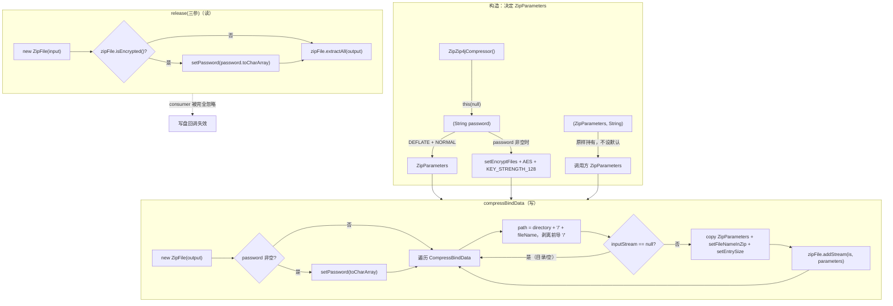

# i2f-extension-zip4j

> **Zip4J 2.9.1 的 `ICompressor` 契约适配器**（1 主源 `ZipZip4jCompressor` 约 90 行 + 1 测试，`net.lingala.zip4j:zip4j:2.9.1` provided 硬编码版本未走根 DM，内部依赖 `i2f-compress-std`）：继承 `AbsCompressor` 骨架，以 `ZipFile.addStream`/`extractAll` 实现 ZIP 压缩与解压，并支持 AES-128 加密——与本族基于 Commons Compress 的 `i2f-extension-compress`（ZIP/JAR/TAR/CPIO/7Z 五格式但无强加密）构成互补双轨。

## 模块路径

`i2f-extension/i2f-extension-zip4j`（artifactId `i2f-extension-zip4j`，groupId 继承 `i2f.turbo`，版本 `1.0-jdk8`）。

本模块是 Zip4J（`net.lingala.zip4j`，专注加密 ZIP 的第三方库）到本仓库统一压缩契约 `i2f-compress-std` 的**单类桥接**：整个 `i2f.extension.zip4j` 包只有一个类 `ZipZip4jCompressor`（90 行），对外不提供任何静态门面或枚举，仅通过 `ICompressor` 契约被上层使用。全模块 1 主源 + 1 测试，无 SPI 注册、无资源文件。

## 模块依赖

| Maven 坐标 | scope | 说明 |
|-----------|-------|------|
| `i2f.turbo:i2f-compress-std` | compile | 压缩标准契约：`ICompressor` 接口 + `AbsCompressor` 抽象骨架 + `CompressBindData`/`CompressBindFile` 数据模型 |
| `net.lingala.zip4j:zip4j` | provided | **2.9.1 版本硬编码于本模块 pom，未走根 `dependencyManagement`**；提供 `ZipFile`/`ZipParameters` 及 AES 加密枚举 |
| `org.projectlombok:lombok` | provided | 本类实际未使用 Lombok 注解（继承自父契约的 `@Data` 数据体），声明冗余 |

构建用 `maven-assembly-plugin`（`addMavenDescriptor=true`）。登记面：`i2f-extension/pom.xml:96`（模块）、根 `pom.xml:1298-1302`（DM）、`i2f-extension-all/pom.xml:339-342`（聚合）、`bash/{backup,deploy}-{jdk8,jdk17}` 四目录 jar 齐全。

## 模块设计

`ZipZip4jCompressor extends AbsCompressor implements ICompressor`。`AbsCompressor` 骨架已实现 `compressBindFile`/`compressFile`/`release(二参)`，本类只需补写两个抽象叶子方法 `compressBindData`（写）与 `release(三参)`（读）。三个构造器分别对应「无密码 / 字符密码 / 完全自定义 ZipParameters」。



关键点：`release(三参)` 直接 `extractAll` 落盘，**丢弃了 `AbsCompressor` 契约约定的 `BiConsumer<CompressBindData, File>` 逐条目回调**——父类 `release(二参)` 精心构造的「拆 directory/fileName → mkdirs → 拷贝流」写盘 consumer 在本实现里成为死代码。

## 模块目的

为统一压缩契约补齐一条「**支持 AES 加密的 ZIP**」实现路线。Commons Compress 对加密 ZIP（尤其是 WinZip AES）支持薄弱，Zip4J 正是以加密见长；本模块让上层在需要「带密码的 zip 归档」时可无缝替换 `ICompressor` 实现，而无需改动调用代码。

## 模块功能

1. **ZIP 压缩** — `compressBindData` 把 `CompressBindData` 集合逐条以 `addStream` 写入输出 zip，`size>=0` 时预置 `setEntrySize`
2. **ZIP 解压** — `release(三参)` 经 `extractAll` 全量解压到目标目录
3. **AES 加密** — 密码非空时构造 `EncryptionMethod.AES` + `AesKeyStrength.KEY_STRENGTH_128` 的写入参数，读取时按 `isEncrypted()` 自动 `setPassword`
4. **路径规范化** — `directory/fileName` 拼接后剥离前导 `/`，与 `AbsCompressor.fetchFilesNext` 的目录约定对齐
5. **骨架复用** — 通过 `AbsCompressor` 免费获得 `compressBindFile`/`compressFile(带 filter 递归采集)`/`release(二参)`

## 模块主要使用方法

```java
// 1. 加密压缩整个目录（走 AbsCompressor.compressFile → compressBindFile → compressBindData）
ICompressor compressor = new ZipZip4jCompressor("123456");
compressor.compress(new File("./output/src.pass.zip"),
        new File("./i2f-jdk/i2f-compress"));

// 2. 解压（注意 release 走 extractAll，忽略自定义 consumer）
compressor.release(new File("./output/src.pass.zip"),
        new File("./output/release/pass.zip"));

// 3. 完全自定义压缩参数
ZipParameters params = new ZipParameters();
params.setCompressionMethod(CompressionMethod.BZIP2);
new ZipZip4jCompressor(params, null);
```

测试 `TestCompress.main` 即为「密码 123456 → 压缩 `./i2f-jdk/i2f-compress` → 解压」的最小闭环（zip4j 为 provided，直接 `main` 需运行期补 zip4j jar）。

## 模块特性总结

- **极简单类桥接**：无任何多余抽象，一个 `ZipZip4jCompressor` 承接全部写读逻辑，风格与 `i2f-extension-compress` 的 `ZipApacheCompressor` 同构。
- **加密是核心差异化**：整族压缩实现里唯一开箱提供 AES-128 的一个，弥补 Commons Compress 短处。
- **provided 硬编码版本**：`zip4j:2.9.1` 写死在本 pom、且未声明 `optional`，版本升级需直接改此文件（与根 DM 脱钩）。
- **契约不一致**：写通道符合 `AbsCompressor` 语义，读通道以 `extractAll` 短路掉了逐条目回调契约。

## 模块瑕疵或错误

以下为静态阅读识别，不代表已实证运行：

1. **`release(三参)` 违背契约**：接口签名承诺对每个条目回调 `BiConsumer<CompressBindData, File>`，本实现完全忽略 `consumer`，直接 `extractAll`。调用 `AbsCompressor.release(二参)` 时尚可正常落盘（extractAll 代劳），但任何直接调用三参版本、期望拿到逐条目 `InputStream` 自行处理的调用方都会静默失效。
2. **加密解压 NPE 风险**：`release` 中 `zipFile.isEncrypted()` 为真即执行 `password.toCharArray()`，未判空。若解压一个加密 zip 而构造器未传密码（或走 `ZipZip4jCompressor()` 无参构造），直接 NPE。
3. **资源未在 finally 释放**：`compressBindData` 中 `is.close()`、`zipFile.close()` 均裸写在循环/方法体，`addStream` 抛异常时输入流与 `ZipFile` 句柄泄露（未用 try-with-resources）。
4. **输出 zip 追加而非覆盖**：`new ZipFile(output)` 指向已存在文件时，Zip4J 表现为向其追加条目，本类未做「先清空/删除」，多次压缩到同一路径会得到叠加的重复条目。
5. **三参构造器语义割裂**：`ZipZip4jCompressor(ZipParameters, String)` 只把 password 用于 `setPassword`，不会据此调用 `setEncryptFiles(true)`；若调用方传入的 `ZipParameters` 未自行开启加密，则设了密码也不会真正加密，与 `(String password)` 构造器行为不一致。
6. **不保留空目录/目录条目**：`compressBindData` 对 `inputStream == null`（目录）直接 `continue`，zip 内不生成目录项；空目录结构在压缩后丢失。
7. **仅支持 zip 读**：`release` 假定输入必为 zip，对传入 tar/7z 等只会抛 Zip4J 异常，无格式探测或友好提示。
8. **版本双轨脱钩**：`zip4j` 硬编码于子 pom，根 `dependencyManagement` 无法统一管控其版本，易与其他引入点产生版本漂移。
9. **无源码级消费方**：全仓库除 `TestCompress` 外无任何 `new ZipZip4jCompressor(...)` 调用，仅经 `extension-all` 聚合与 `bash` 四目录 jar 对外分发。
10. **lombok 依赖冗余**：类中未使用任何 lombok 注解，pom 仍声明之。

## 模块在生态中的位置

- **契约族**：本模块是 `i2f-compress-std` 的 `ICompressor` 实现之一。同族还有 `i2f-extension-compress`（Commons Compress，ZIP/JAR/TAR/CPIO/7Z 五格式）、`i2f-extension-7zip`（SevenZip-JBinding）等，可按需替换。
- **与 sibling 的分工**：需要多格式归档选 `i2f-extension-compress`；需要带密码的 zip 选本模块（AES-128）。二者对 `AbsCompressor` 的读契约实现度不同（本模块 `extractAll` 短路，compress 逐条目回调）。
- **分发方式**：编译期接口 + `provided` 三方库，运行期由消费工程自备 zip4j jar；本仓库不内置，仅通过聚合 pom 与 `bash` jar 清单对外提供。
