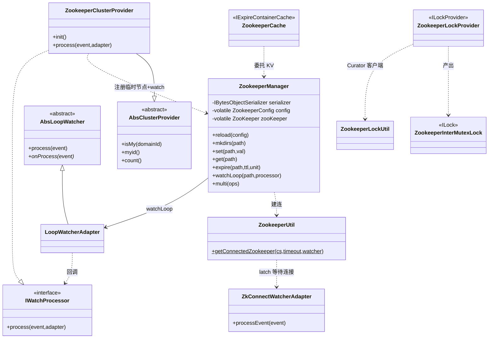

# i2f-extension-zookeeper

> **Apache ZooKeeper 3.6.3 + Apache Curator 4.0.0 的分布式协调适配器套件**（17 主源文件约 1200 行、无测试；zookeeper/curator-framework/curator-recipes 三者 provided 且版本硬编码未走根 DM；内部依赖 `i2f-cache`/`i2f-lock`/`i2f-serialize-impl`）：以 `ZookeeperManager` 为连接与 CRUD 核心，向外派生**缓存**（`ZookeeperCache` 实现 `IExpireContainerCache`/`IPersistCache`/`IDistributedCache`）、**分布式锁**（`ZookeeperLockProvider`+`ZookeeperInterMutexLock` 适配 `ILockProvider`/`ILock`，走 Curator `InterProcessMutex`）、**集群成员分配**（`AbsClusterProvider`/`ZookeeperClusterProvider` 以临时节点 + 递归 watch 实现一致性哈希式任务分片）三大能力，并有 `i2f-springboot-zookeeper-starter` 真实装配消费。

## 模块路径

`i2f-extension/i2f-extension-zookeeper`（artifactId `i2f-extension-zookeeper`，groupId 继承 `i2f.turbo`，版本 `1.0-jdk8`）。

本模块把 ZooKeeper 原生客户端与 Curator 框架收敛为 i2f 生态的三个标准契约实现（缓存 / 锁 / 集群），核心是 `ZookeeperManager`（312 行，封装连接、会话过期重连、层级 `mkdirs`、KV 读写、TTL、`addWatch`/递归 watch、`multi` 事务）。包结构分 7 个子域：根（Manager/Util/Config）、`cache`、`lock`、`cluster`(+`impl`)、`watcher`、`listener`、`exception`。全模块**无单元测试、无 SPI 注册**（对外靠 SpringBoot starter 显式 `@Bean` 装配）。

## 模块依赖

| Maven 坐标 | scope | 说明 |
|-----------|-------|------|
| `i2f.turbo:i2f-cache` | compile | 缓存契约：`IExpireContainerCache`/`IPersistCache`/`IDistributedCache`（`ZookeeperCache` 实现之） |
| `i2f.turbo:i2f-lock` | compile | 锁契约：`ILock`/`ILockProvider`（`ZookeeperInterMutexLock`/`ZookeeperLockProvider` 实现之） |
| `i2f.turbo:i2f-serialize-impl` | compile | 序列化：提供 `IBytesObjectSerializer`（`ZookeeperManager` 存值依赖，但见瑕疵——从未被注入） |
| `org.apache.zookeeper:zookeeper` | provided | **3.6.3 硬编码**，原生 `ZooKeeper`/`Watcher`/`CreateMode`/`AddWatchMode`/`Op` |
| `org.apache.curator:curator-framework` | provided | **4.0.0 硬编码**，`CuratorFramework` 客户端 |
| `org.apache.curator:curator-recipes` | provided | **4.0.0 硬编码**，`InterProcessMutex` 分布式锁配方 |
| `org.projectlombok:lombok` | provided | `@Data`/`@Slf4j`/`@Getter`/`@Setter` 若干 |

构建用 `maven-assembly-plugin`（`addMavenDescriptor=true`）。登记面：`i2f-extension/pom.xml:97`（模块）、根 `pom.xml:1303-1307`（DM）、`i2f-extension-all/pom.xml:345`（聚合）、`bash/{backup,deploy}-{jdk8,jdk17}` 四目录 jar 齐全。**真实消费方**：`i2f-springboot/i2f-springboot-zookeeper-starter` 的 `ZookeeperAutoConfiguration` 将 Manager/Cache/ClusterProvider/CuratorFramework/LockProvider 装配为 Spring Bean。

## 模块设计

分两层：**连接核心层**（`ZookeeperManager` + `ZookeeperUtil` + `ZookeeperConfig` + `watcher` 族 + `listener`）负责会话与低阶 ZK 操作；**能力适配层**（`cache`/`lock`/`cluster` 三包）把核心层桥接为 i2f 契约。



**连接与会话**：`ZookeeperUtil.getConnectedZookeeper` 用 `CountDownLatch` + `ZkConnectWatcherAdapter` 把异步 `new ZooKeeper(...)` 转为「阻塞直到 `SyncConnected`」；`ZookeeperManager` 注入的 `Watcher` 在 `Expired` 时递归 `reload(config)` 自动重连。

**循环 watch**：`watchLoop` 注册 `LoopWatcherAdapter`（`AbsLoopWatcher` 子类），每次事件回调 `IWatchProcessor.process` 返回 `true` 则用 `addWatch(PERSISTENT_RECURSIVE)` 自我续挂，实现持久递归监听。

**集群分片**：`ZookeeperClusterProvider` 启动即 `mkdirs(listenPath)` + `watchLoop(recursive)` + 注册自身 `guid()` 临时节点；成员变更（Created/Deleted/ChildrenChanged）时刷新 `currentGuidList`；`AbsClusterProvider` 以排序后成员表计算 `myid`/`count`，`isMy(domainId)=|domainId|%count==myid` 做任务归属判定（10 秒本地缓存 `refreshCache`）。

## 模块目的

将 ZooKeeper 这一分布式协调中间件按 i2f 的**统一契约**（缓存 `IExpireContainerCache`、锁 `ILockProvider`、集群 `ClusterProvider`）暴露，使上层业务可在本地实现（`i2f-cache`/`i2f-lock` 的内存版）与 ZooKeeper 分布式实现之间无感切换，为多节点部署提供共享缓存、跨进程互斥锁与「同一时刻仅一个实例执行某域任务」的集群分工能力。

## 模块功能

1. **ZK 连接管理** — 阻塞式建连、会话过期自动重连、监听器 `onBefore/onEvent/onAfter` 生命周期回调
2. **层级 KV 读写** — `mkdirs` 逐级建目录、`set`/`get`/`exists`/`remove`/`keys`/`clean`、对象经序列化存值
3. **TTL 节点** — `set(path,expire,unit,val)`/`expire` 以 `PERSISTENT_WITH_TTL` 实现带过期 znode
4. **持久递归监听** — `watch`/`watchLoop` + `LoopWatcherAdapter` 自续挂
5. **事务** — `multi(ops)` 批量原子操作直通
6. **分布式缓存契约** — `ZookeeperCache` 以 `/cache` 前缀实现三类缓存接口
7. **分布式锁契约** — `ZookeeperLockProvider`+`ZookeeperInterMutexLock` 基于 Curator `InterProcessMutex`
8. **集群成员与任务分片** — `ZookeeperClusterProvider` 临时节点注册 + watch 感知成员 + `isMy` 一致性取模分派

## 模块主要使用方法

```java
// 连接核心 + 缓存
ZookeeperConfig cfg = new ZookeeperConfig();
cfg.setConnectString("127.0.0.1:2181");
ZookeeperManager manager = new ZookeeperManager(cfg);
IExpireContainerCache<String, Object> cache = new ZookeeperCache(manager);
cache.set("user:1", someObj, 30, TimeUnit.MINUTES);

// 分布式锁（Curator）
CuratorFramework curator = ZookeeperLockUtil.getClient("127.0.0.1:2181", 60000);
ILock lock = new ZookeeperLockProvider(curator).getLock("order:123");
lock.lock();
try { /* 临界区 */ } finally { lock.unlock(); }

// 集群任务分片：仅本实例负责属于它的 domainId
ClusterProvider cp = new ZookeeperClusterProvider("/apps/myapp/cluster", manager);
if (cp.isMy(domainId)) { /* 处理该域任务 */ }
```

SpringBoot 下由 `i2f-springboot-zookeeper-starter` 依 `i2f.zookeeper.*` 配置自动装配上述 Bean（`i2f.zookeeper.enable` 默认 true）。

## 模块特性总结

- **厚适配模块**：不同于本组多数「薄桥接」，本模块自带连接管理、重连、监听续挂、集群分片算法等实质逻辑，17 文件约 1200 行。
- **契约三合一**：单模块同时落地缓存 / 锁 / 集群三个 i2f 标准接口，且原生 ZK 与 Curator 双客户端并存（KV 走原生 `ZooKeeper`，锁走 Curator）。
- **ZK 与 Redis 的同类替代**：与 `i2f-extension-redis-cache`、`i2f-extension-hazelcast` 同属 `IExpireContainerCache` 远程实现族，额外提供集群分片语义。
- **provided 全硬编码**：zookeeper/curator 三个坐标版本写死子 pom，未纳入根 `dependencyManagement`。

## 模块瑕疵或错误

以下为静态阅读识别，未实证运行：

1. **`serializer` 永不赋值（最严重）**：`ZookeeperManager` 的 `private IBytesObjectSerializer serializer;` 无 setter、无构造赋值、无默认，且全仓库无任何 `setSerializer` 调用；因此凡经 `obj2ZkData`/`zkData2Obj` 的操作——`set(path,val)`、`get(path)`、`expire`、带数据 `mkdirs`、以及集群注册 `mkdirs(path,true)`（内部 `obj2ZkData("")`）——**必然 NPE**。SpringBoot starter 的 `clusterProvider` Bean 在 `init()` 阶段即触发。数据读写通道整体不可用（仅 `mkdirs(String)`、`exists`、`keys`、`remove`、`watch`、`multi` 不经序列化）。
2. **`ZookeeperCache.exists` 传错参数**：第 54 行 `return manager.exists(key);` 应为 `manager.exists(path)`，漏拼 `/cache` 前缀，存在性判断走的是错误路径，与 `set`/`get` 不一致。
3. **TTL 时间单位不一致**：`set(path,expire,unit,val)` 用 `timeUnit.toMillis` 传 `create(...,ttl)`，而 `expire(path,expire,unit)` 用 `timeUnit.toSeconds`——ZK 的 TTL 语义为毫秒，二者相差 1000 倍，`expire` 实际过期时间被严重缩短。
4. **`ZookeeperCache.clean` 误删自身**：`manager.remove(prefix)` 删除 `/cache` 节点本身；该节点有子节点时 ZK 抛 `NotEmpty`，应逐子清理（本可用 `manager.clean`）。清理功能不可用。
5. **`AbsClusterProvider.GUID` 为 static**：整 JVM 共享一个 `GUID`，同进程内多个 `ClusterProvider` 实例会注册同名临时节点、彼此覆盖成员身份。
6. **`myid` 与 `count` 口径不一致**：`cacheMyId` 取自**未排序** `guidList.indexOf(GUID)`，而 `cacheGuidList` 经排序后供 `count` 使用；`isMy` 的 `|domainId|%count==myid` 假定型成员按稳定排序映射，混用有序/无序索引会使分片归属漂移。
7. **`getExpire` 恒返回 null**：缓存契约的 TTL 查询方法未实现，永远拿不到剩余过期时间。
8. **`count()`/`myid()` 非原子**：`isMy` 先 `count()` 后 `myid()`，各触发一次 `refreshCache` 并分别读缓存，成员恰在两次调用间变化时会拿到不一致快照（可能无人认领或重复认领任务）。
9. **重连无退避**：`Expired` 时 watcher 内直接递归 `reload`，服务端持续不可用时可能形成重连风暴。
10. **TTL 节点服务端依赖**：`PERSISTENT_WITH_TTL` 需 ZK 服务端 3.6+ 且开启 `extendedTypesEnabled`/清理机制，低版本或默认配置下 `set(...,expire,...)` 会失败。
11. **版本三处硬编码脱离 DM**：`zookeeper:3.6.3`、`curator-*:4.0.0` 写死子 pom，根 DM 无法统一管控，易与其他引入点漂移。

## 模块在生态中的位置

- **契约族**：`ZookeeperCache` 与 `i2f-extension-redis-cache`、`i2f-extension-hazelcast` 同为 `IExpireContainerCache` 分布式实现；`ZookeeperLockProvider`/`ZookeeperInterMutexLock` 是 `i2f-lock` 的跨进程实现（相对本地内存锁）。
- **集群分工底座**：`ClusterProvider.isMy` 供定时任务 / 事件消费等多实例场景区分「该不该我执行」，与 `i2f-extension-quartz`、activity/job 调度的分布式化诉求配套。
- **装配入口**：能力通过 `i2f-springboot-zookeeper-starter` 落地，本模块自身不含自动配置类，属「纯能力库 + 外部 starter 装配」分层。
- **分发方式**：编译期接口 + `provided` 三方库，运行期由消费工程自备 zookeeper/curator jar；本仓库经聚合 pom 与 `bash` 四目录 jar 对外提供。
