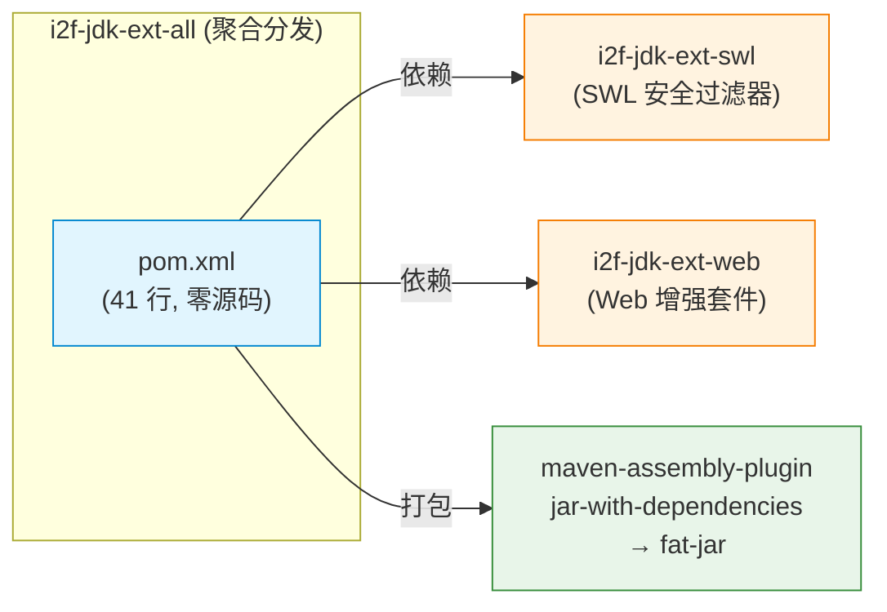
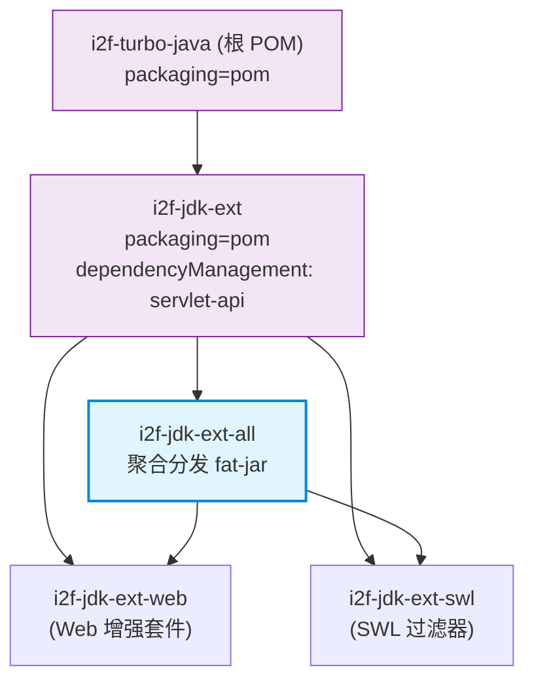

# i2f-jdk-ext-all

> **i2f-jdk-ext 子模块的 Maven 聚合分发包 / 将 i2f-jdk-ext-swl + i2f-jdk-ext-web 打包为单体 fat-jar 的构建入口**（仅 1 个 pom.xml 共 41 行、无 Java 源码、零测试零资源，依赖 2 个内部模块：`i2f-jdk-ext-swl` + `i2f-jdk-ext-web`，使用 `maven-assembly-plugin:3.1.0` 以 `jar-with-dependencies` 目标打包）。

## 模块路径

- `i2f-jdk-ext/i2f-jdk-ext-all/pom.xml`
- 相对于仓库根目录：`i2f-jdk-ext/i2f-jdk-ext-all`

## 模块依赖

### 内部模块（compile 依赖）

| Maven 坐标 | scope | optional | 说明 |
|-----------|-------|----------|------|
| `i2f.turbo:i2f-jdk-ext-swl:1.0-jdk8` | compile | false | SWL 安全传输协议的 Servlet 过滤器接入层 |
| `i2f.turbo:i2f-jdk-ext-web:1.0-jdk8` | compile | false | Servlet 层 Web 增强套件（安全过滤 + 防火墙 + 守卫 + 上下文与包装器） |

### 构建插件

| 插件坐标 | 版本 | 用途 |
|---------|------|------|
| `org.apache.maven.plugins:maven-assembly-plugin` | 3.1.0 | 将模块及其传递依赖打包为单体 fat-jar |

构建配置继承自根 POM（`pom.xml:1811-1857`）的 `pluginManagement`，使用 `jar-with-dependencies` 预定义描述符，输出文件命名为 `${project.artifactId}-${project.version}.jar`（`appendAssemblyId=false` 不附加描述符后缀），绑定到 `package` 阶段的 `single` 目标。JAR 包 Manifest 包含以下元信息条目：

- `Class-Path: . ./resources/`
- `Maven-Group` / `Maven-Artifact` / `Maven-Version`
- `Build-Time`（Maven 构建时间戳）
- `Root-Maven-Group` / `Root-Maven-Artifact` / `Root-Maven-Version`
- `Root-Project-Author` / `Root-Project-Nature`
- `Root-Link-Email` / `Root-Link-Github` / `Root-Link-Gitee`
- `Java-Source-Version` / `Java-Target-Version`（均为 1.8）

## 模块设计

### 架构定位

`i2f-jdk-ext-all` 是一个 **零源码的 Maven 聚合分发模块**，在项目中承担双重角色：

1. **聚合入口** — 将 `i2f-jdk-ext` 域下的 `i2f-jdk-ext-swl` 和 `i2f-jdk-ext-web` 两个功能模块聚合为一个统一的构建单元，供依赖方一步引入整个 i2f-jdk-ext 功能集。
2. **Fat-jar 分发** — 通过 `maven-assembly-plugin` 的 `jar-with-dependencies` 描述符，将模块自身（无源码）及两个子模块的代码、资源配置及其传递依赖全部解压合并为一个独立的、可脱离父 POM 的发布 JAR。

### 模块结构示意



### Maven 模块层级



### 设计要点

1. **零源码聚合** — 模块不含任何 Java 类、资源配置或测试文件，仅通过 POM 描述构建行为，是典型的 Maven 「bom/aggregator」模式。
2. **胖 JAR 分发策略** — 使用 `jar-with-dependencies` 而非自行编写 assembly XML 描述符，简化配置；`appendAssemblyId=false` 确保输出文件名不包含 `-jar-with-dependencies` 后缀，与普通 JAR 命名风格一致。
3. **Manifest 元信息埋点** — 根 POM 统一管理的 Manifest 条目记录了项目根信息（作者、许可证、仓库链接、编译版本），使 fat-jar 可通过 `java -jar` 的 `Class-Path` 引用同级 `resources/` 目录。
4. **统一版本管理** — 依赖项 `i2f-jdk-ext-swl` 和 `i2f-jdk-ext-web` 的版本由父 POM `i2f-jdk-ext` 继承自根 POM 的 `dependencyManagement`，聚合模块自身不声明版本号，避免版本漂移。
5. **无 Main-Class** — Manifest 中 `Main-Class` 被注释，表明本 fat-jar 设计为库依赖而非可执行应用，使用方通过 `-cp` 或容器部署引用。

## 模块目的

- **简化依赖引入** — 消费方只需声明一个 `i2f-jdk-ext-all` 依赖即可获得 `i2f-jdk-ext` 域下所有子模块的功能（SWL 安全传输 + Web 增强套件），避免逐个列举子模块。
- **提供预打包分发件** — 通过 fat-jar 产出让不便于使用 Maven 依赖管理的场景（如直接 `-cp` 部署、Lib 目录手动管理）也能使用完整的 i2f-jdk-ext 功能集。
- **保持模块边界清晰** — 聚合模块不引入任何额外逻辑，子模块的职责边界、依赖关系和构建配置完全由各子模块自身 POM 定义。

## 模块功能

- **Maven 聚合构建** — 将 `i2f-jdk-ext-swl` 和 `i2f-jdk-ext-web` 作为子构建单元，一条命令（`mvn package -pl i2f-jdk-ext/i2f-jdk-ext-all`）即可触发两个子模块的编译、测试和打包。
- **Fat-jar 产出** — 执行 `mvn package` 后生成 `i2f-jdk-ext-all-1.0-jdk8.jar`，内含：
  - `i2f-jdk-ext-swl` 的类文件及资源
  - `i2f-jdk-ext-web` 的类文件及资源
  - 两个模块的传递依赖（如 `i2f-swl`、`i2f-network`、`i2f-io-stream`、`i2f-io-file`、`i2f-serialize-impl`、`i2f-cache`、`i2f-firewall`、`i2f-form-url-encoded`、`i2f-jdk-ext-web` 的传递链、`javax.servlet-api` 等）
- **Manifest 元信息注入** — 产出 JAR 的 `META-INF/MANIFEST.MF` 中包含项目标识、构建时间、仓库链接等元数据。

## 模块主要使用方法

### 1. 作为 Maven 依赖引入

在其他模块的 `pom.xml` 中声明依赖即可获得 i2f-jdk-ext 的全部功能：

```xml
<dependency>
    <groupId>i2f.turbo</groupId>
    <artifactId>i2f-jdk-ext-all</artifactId>
    <version>1.0-jdk8</version>
</dependency>
```

相当于同时引入以下两个依赖的等价效果：

```xml
<dependency>
    <groupId>i2f.turbo</groupId>
    <artifactId>i2f-jdk-ext-swl</artifactId>
    <version>1.0-jdk8</version>
</dependency>
<dependency>
    <groupId>i2f.turbo</groupId>
    <artifactId>i2f-jdk-ext-web</artifactId>
    <version>1.0-jdk8</version>
</dependency>
```

### 2. 构建 fat-jar

在项目根目录执行 Maven 命令构建：

```bash
mvn package -pl i2f-jdk-ext/i2f-jdk-ext-all -am
```

产出物位于 `i2f-jdk-ext/i2f-jdk-ext-all/target/i2f-jdk-ext-all-1.0-jdk8.jar`。

### 3. 部署使用

该 fat-jar 可作为 classpath 依赖直接放置于应用的 lib 目录，或通过 `-cp` 参数引用：

```bash
java -cp i2f-jdk-ext-all-1.0-jdk8.jar;./resources/ com.example.Application
```

### 4. 扩展子模块

若未来 `i2f-jdk-ext` 目录下新增其他子模块（如 `i2f-jdk-ext-xxx`），仅需在 `i2f-jdk-ext-all/pom.xml` 中添加相应的 `<dependency>` 即可自动纳入 fat-jar：

```xml
<dependency>
    <groupId>i2f.turbo</groupId>
    <artifactId>i2f-jdk-ext-xxx</artifactId>
</dependency>
```

## 模块特性总结

- **零源码纯 POM 模块** — 不包含任何 Java 代码或资源，职责单一清晰。
- **Fat-jar 聚合分发** — 通过 `maven-assembly-plugin` 将子模块及其传递依赖打包为独立单体 JAR。
- **统一版本门面** — 消费方以单模块方式引入整个功能集，无需感知子模块划分。
- **Maven 构建协同** — `-am` 参数自动触发依赖子模块的构建，确保聚合包始终与最新子模块同步。
- **可扩展** — 新增子模块仅需添加 dependency，无额外配置。

## 模块瑕疵或错误

- **暂未发现** — 该模块为纯构建配置聚合包，不含业务逻辑代码，POM 配置简洁清晰，`assembly-plugin` 使用标准的 `jar-with-dependencies` 描述符，其行为由 Maven 官方插件保障。POM 中注释掉的自身循环依赖（`i2f-jdk-ext-all` 依赖自身）未生效，无实际影响。