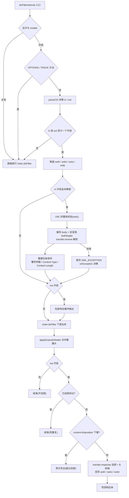
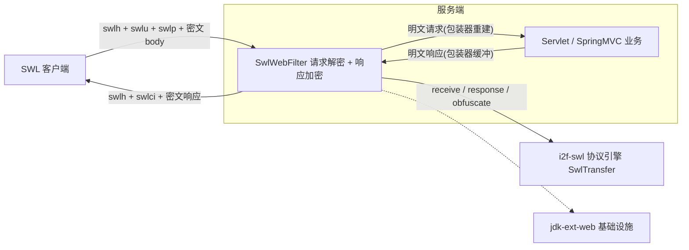

# i2f-jdk-ext-swl

> **SWL（Secure Wire Layer）安全传输协议的 Servlet 接入层——把 `i2f-swl` 协议引擎的「请求解密 / 响应加密」装配成对业务透明的过滤器**（4 源文件 562 行、单包 `i2f.web.swl.filter`、零测试零资源、5 依赖 = 3 内部（i2f-swl 协议引擎 / i2f-form-url-encoded 表单编解码 / i2f-jdk-ext-web 过滤器与包装器基础设施）+ lombok + javax.servlet-api（均 provided+optional））：核心 `SwlWebFilter`（488 行，extends `OncePerHttpServletFilter`）以 in/out 双开关驱动「swlh / swlci / swlu / swlp 四头取值 → URL 防篡改校验 → `transfer.receive` 解密 → 请求包装器重建 → 下游业务 → 响应体缓冲 → `transfer.response` 加密 → `$.` 前缀密文 + swlh / swlci 响应头回写」全流程；`SwlWebConfig`（15 项配置）+ `SwlWebCtrl`（单请求 in/out 决策）+ `SwlWebConsts`（8 个协议常量与属性键）构成配置与契约面。
>
> ⚠ **重点瑕疵**：`SwlWebFilter.java:369` 的 `"$." + responseBody` 为 **byte[] 拼接笔误**（对照同作者 `SwlGatewayFilter.java:479` 的正确写法 `"$." + responseText` 应为加密文本拼接，现状响应体变为 `$.[B@hash` 垃圾文本且加密计算白费——所有 out 加密响应损坏）；未声明字符编码的带 body 请求在 `new String(body, request.getCharacterEncoding())`（L169 / L235）处 NPE，被吞为「解密失败」；`catch (Throwable)`（L259）连 Error 级异常也吞掉放行；响应加密段（L363-383）无异常兜底，失败直接 500；`SWL_REQUIRE_ENCRYPT_RESPONSE` 契约断裂（消费方 `SwlSpringAop.java:93` 设置但本模块从不读取）——详见「模块瑕疵或错误」。

## 模块路径

- `i2f-jdk-ext/i2f-jdk-ext-swl`

## 模块依赖

| 依赖（maven 坐标） | scope | optional | 用途 |
| --- | --- | --- | --- |
| `i2f.turbo:i2f-swl:1.0-jdk8` | compile | 否 | SWL 协议引擎——`SwlTransfer.receive` / `response` / `resetCertExpire` / `obfuscateEncode` / `obfuscateDecode` / `isEnableEncrypt`、报文模型 `SwlData` / `SwlHeader`、`SwlCode` / `SwlException` |
| `i2f.turbo:i2f-form-url-encoded:1.0-jdk8` | compile | 否 | `FormUrlEncodedEncoder`——SwlHeader 的 `toForm` / `ofFormBean` 编解码与 swlp 参数串的 `toMap` 解析 |
| `i2f.turbo:i2f-jdk-ext-web:1.0-jdk8` | compile | 否 | 基础设施——`OncePerHttpServletFilter`（过滤器骨架 + 每请求一次防重）、`ServletContextUtil.getIp`（客户端 IP 用于 nonce 隔离）、`HttpServletRequestProxyWrapper` / `HttpServletResponseProxyWrapper`（请求体缓存重建 / 响应体缓冲） |
| `org.projectlombok:lombok` | provided（继承根 POM `dependencyManagement`） | true（继承） | `@Data` / `@NoArgsConstructor`——4 类中 3 类使用 |
| `javax.servlet:javax.servlet-api:4.0.1` | provided（继承 i2f-jdk-ext 父 POM `dependencyManagement`） | true（继承） | Servlet API——`Filter` / `FilterChain` / `HttpServletRequest` / 包装器基类 |

- **隐式传递依赖**（源码直接 import、未在 POM 声明）：

| 传递依赖 | 传递路径 | 用途 |
| --- | --- | --- |
| `i2f-codec-impl` | i2f-swl → i2f-codec-impl | `Base64StringByteCodec`（swlu 解码、SwlHeader Base64 编解码）、`CharsetStringByteCodec.UTF8` |
| `i2f-serialize-std` | i2f-jdk-ext-web → i2f-serialize-impl → i2f-serialize-std | `IJsonSerializer`（srcText 的 JSON 字符串反转义、`SWL_STRING_RESPONSE` 的 JSON 序列化） |
| `i2f-text` | i2f-io-file（两条链路共同传递） | `StringUtils.isEmpty`（`getTrimContextPathRequestUri` 中 contextPath 判空） |

- 构建插件：仅 `maven-assembly-plugin`（裸声明，版本由父 POM 统一管理）。
- 无 `src/test` 测试目录、无 `resources` 目录（4 个源文件全部位于 `src/main/java/i2f/web/swl/filter/`）。

## 模块设计

1. **4 个类的职责与规模**（单包 `i2f.web.swl.filter`）：

| 类 | 行数 | 职责 |
| --- | --- | --- |
| `SwlWebFilter` | 488 | 过滤器主体——`doFilterInternal` 完整收发流水线、`parseCtrl` / `onException` 可重写钩子、头部编解码（`deserializeHeader` / `serializeHeader`）、URL 校验（`getTrimContextPathRequestUri`）、CORS 暴露头（`applyExposeHeader`）等工具方法 |
| `SwlWebConfig` | 32 | 过滤器配置——总开关、默认 in/out、5 个头/参数名、响应字符集、URL 校验开关与剥离层数、urlPatterns / whiteListIn / whiteListOut / attachedHeaderNames 等 15 字段 |
| `SwlWebCtrl` | 22 | 单请求的 in/out 决策对象（每次请求从 `defaultCtrl` 克隆，避免污染配置） |
| `SwlWebConsts` | 20 | 契约常量——`Access-Control-Expose-Headers` 头名 + 5 个 request attribute 键 + 2 个预留标记 |

2. **协议字段（头/参数双通道读取，默认名可配）**：

| 名称 | 配置字段 | 内容 |
| --- | --- | --- |
| `swlh` | `headerName` | 混淆编码的 `SwlHeader`（timestamp / nonce / randomKey / sign / digital / certId——六字段经 `transfer.obfuscateEncode` 保护） |
| `swlci` | `certIdName` | 会话证书 ID（请求：定位服务端证书；响应：回传本次响应视角的 certId） |
| `swlct` | `realContentTypeHeaderName` | 真实 Content-Type（请求：解密后覆盖包装请求类型；响应：回传服务端原始类型） |
| `swlu` | `urlPathName` | `Base64(客户端原始请求 URL)`——URL 防篡改校验用（`enableUrlPathCheck=true` 时必带） |
| `swlp` | `parameterName` | 加密后的表单参数串（FormUrlEncoded 文本，解密后重建 parameterMap） |

3. **收发流水线**：



4. **模块在 SWL 接入体系中的位置**（本模块是四类接入面中的 Servlet 过滤器版）：



5. **设计要点**：

   - **两层模板方法骨架**：`SwlWebFilter` 继承 `OncePerHttpServletFilter`（jdk-ext-web）——父类 `doFilter` 负责「HTTP 请求判定 + 以 `getClass().getName()` 为 attribute 键的每请求一次防重」，子类只实现 `doFilterInternal`；`SwlWebFilter` 自身再把「请求决策」与「异常策略」抽成 `parseCtrl`（L441-456）与 `onException`（L386-389）两个 public 钩子——springboot 消费方正是重写 `parseCtrl` 实现「URL 模式 + 注解 + 白名单」的完整决策。
   - **in/out 双开关模型**：`SwlWebCtrl.in` 管入站解密、`out` 管出站加密；每次请求从 `config.defaultCtrl` 克隆新实例（默认 `(true, true)`）；若请求携带非空 `swlh` 头/参数则强制 `in=true`（L80-82）；`parseCtrl` 对 multipart/form-data 请求强制 `in=false`（L451-453，无法整型缓存 multipart 流）；`in`/`out` 双 false 时提前跳过（L85-88）。
   - **请求体「先缓存、后重建」两段式包装**：第一个 `HttpServletRequestProxyWrapper` 构造即读空原始流、缓存全量 body（L158）；解密后用解密文本字节构造第二个包装器（L236），实现「可重复读 + 参数/头/类型/长度覆写」；下游业务只接触明文包装器，对解密过程无感。
   - **URL 防篡改滑窗校验**（L116-156）：客户端将原始 URL Base64 编码放 `swlu`；服务端取「剥离 contextPath 后的请求 URI」，先全等、再在最多 `maxStripUrlPathCount`（默认 2）次「剥离服务端 URL 首段」的容差内做 `endsWith` 尾部匹配，不匹配抛 `SwlException("request url has been changed!")`——容忍网关重写导致的层级差异。
   - **`$.` 前缀协议**：响应侧加密文本以 `$.` 开头（标记「加密载荷」）；请求侧 srcText 若以 `$.` 开头则剥除（L176-178）、若以 `"` 开头则按 JSON 字符串反序列化反转义（L179-181）——兼容被二次转义为 JSON 字符串的请求体。
   - **六个 request attribute 属性契约**：`SWL_RAW_HEADER`（客户端原始 SwlHeader）/ `SWL_HEADER`（receive 后的 SwlHeader）/ `SWL_DECRYPTED`（是否已解密）/ `SWL_EXCEPTION`（暂存的解密异常）/ `SWL_ENCRYPTED`（响应是否已加密）/ `SWL_STRING_RESPONSE`（响应为纯字符串标记）——过滤器与下游框架（AOP / 拦截器 / 业务）以属性解耦协作。
   - **异常「暂存后放行」策略**：解密流程整体 `catch (Throwable)`（L259-266），异常存入 `SWL_EXCEPTION` 属性后由 `onException` 决策是否中断；默认不中断（`filterResponseException=false`），下游（如消费方 `SwlSpringAop.java:71-74`）读取属性后重新抛出交由统一异常处理器——「过滤器不打断、框架层决定」的设计闭环。
   - **响应下载白名单防 OOM**：加密响应需全量缓冲响应体，对文件下载类接口（响应头存在非空 `content-disposition`）跳过加密、原文直出（L317-341），避免大文件内存包装。
   - **CORS 暴露头合并**：`applyExposeHeader`（L406-423）将既有 `Access-Control-Expose-Headers` 拆分为集合去重后，追加 swlh / swlci / swlct 三个协议头名，保证浏览器端能读取加密协议的响应头。
   - **证书 TTL 续期**：请求处理完成后若 certId 非空，调用 `transfer.resetCertExpire(certId)`（L273-275）延长会话证书有效期，与 `i2f-swl` 引擎「receive 不自动续期」的契约互补。

## 模块目的

- **把 SWL 安全传输协议落地到 Servlet 容器**：以单个过滤器完成「协议头解析 → 报文解密 → 明文请求重建 → 响应加密 → 协议头回写」，业务代码零改造即可获得传输加密能力。
- **作为 SWL 四类接入面的参考实现与扩展骨架**：与 `i2f-spring-swl`（AOP 接口版）、`i2f-springboot-swl-starter`（Servlet starter 版）、`i2f-springcloud-gateway-swl-starter`（WebFlux 网关版）共享同一套协议字段、`$.` 前缀与属性契约；本模块是其中唯一的「容器无关 Servlet 过滤器」底座。
- **用可重写钩子换取框架适配空间**：`parseCtrl` 一个方法承载「哪些请求需解密 / 哪些响应需加密」的全部决策逻辑，SpringBoot 消费方据此实现 `@SwlCtrl` 注解驱动、URL 白名单与返回 String 标记。
- **用属性契约打通过滤器与框架层**：解密结果与异常不直接抛给容器，而是暂存为 request 属性，让 AOP / `@ExceptionHandler` 等下游机制按框架惯例处理错误。

## 模块功能

- **请求解密**：取 `swlh`（SwlHeader）与 `swlp`（参数串）、body（业务负载），经 `transfer.receive(clientId, data)` 完成签名校验 / 数字签名校验 / 非对称解密 / 对称解密，输出明文 body 与参数。
- **响应加密**：经 `transfer.response(certId, parts)` 加密响应文本，以 `$.` 前缀输出，回写 `swlh`（混淆响应头）与 `swlci`（响应 certId）响应头。
- **URL 防篡改校验**：`swlu` Base64 原始 URL 与服务端 URL 的滑窗匹配。
- **请求重建**：body 可重复读、queryString / parameterMap / Content-Type / Content-Length 覆写。
- **下载白名单**：`content-disposition` 探测自动跳过加密。
- **CORS 暴露头**：合并输出 `Access-Control-Expose-Headers`。
- **字符串响应标记**：`SWL_STRING_RESPONSE` 属性触发 JSON 字符串化，保证 String 返回值与 JSON 响应在加密协议中形态一致。
- **异常钩子**：解密异常暂存 + `onException` 决策（默认放行 / 可重写为拦截或自定义响应）。
- **证书续期**：请求结束后 `resetCertExpire`。
- **multipart 自动跳过**：`parseCtrl` 对 multipart 请求强制关闭入站解密。
- **协议头双向编解码**：`deserializeHeader` / `serializeHeader`（混淆 → Base64 → Form 文本的对称链路）。
- **客户端 IP 提取**：复用 `ServletContextUtil.getIp` 并做 IPv6 冒号替换，作为 nonce 防重放的 clientId。

## 模块主要使用方法

### 1. 服务端装配（纯 Servlet / SpringBoot）

```java
// 1) 协议引擎：直接 new（或复用 Spring 容器中的 SwlTransfer bean，装配细节见 i2f-swl 文档）
SwlTransfer transfer = new SwlTransfer();

// 2) 过滤器配置：15 项字段均有默认值，按需覆盖
SwlWebConfig config = new SwlWebConfig();
config.setEnable(true);                 // 总开关（默认 true）
config.setEnableUrlPathCheck(true);     // URL 防篡改校验（默认 true）
config.setMaxStripUrlPathCount(2);      // URL 容差剥离层数（默认 2）
config.setResponseCharset("UTF-8");
// 默认协议名：swlh / swlci / swlct / swlu / swlp（可整体改名）

// 3) JSON 序列化器：任意 IJsonSerializer 实现（用于 $. 引号反转义与字符串响应标记）
SwlWebFilter filter = new SwlWebFilter(transfer, config, jsonSerializer);
```

```java
// 4) SpringBoot 注册（参考消费方 SwlSpringAutoConfiguration 的装配方式）
FilterRegistrationBean<SwlWebFilter> reg = new FilterRegistrationBean<>();
reg.setFilter(filter);
reg.addUrlPatterns("/*");
reg.setOrder(-10);                      // 需先于业务过滤器执行
reg.setDispatcherTypes(DispatcherType.REQUEST, DispatcherType.FORWARD);
// 纯 Servlet 环境：web.xml 或 @WebFilter + 通过构造器自建实例即可，无容器依赖
```

注意：默认 `defaultCtrl=(true, true)` 且 `enableUrlPathCheck=true` 时，**所有未携带 swlh/swlu 的请求都会走一遍解密并失败（异常被吞、静默放行）**——生产部署应通过 `parseCtrl` 重写（urlPatterns / 白名单）或 `defaultCtrl=(false, false)` 明确圈定加密范围。

### 2. 客户端请求 / 响应协议格式

| 部位 | 名称 | 内容 |
| --- | --- | --- |
| 请求头/参数 | `swlh` | `transfer.obfuscateEncode(Base64(UTF-8(FormUrlEncodedEncoder.toForm(SwlHeader))))` |
| 请求头/参数 | `swlci` | 会话 certId（握手后由服务端颁发） |
| 请求头/参数 | `swlu` | `Base64(客户端原始请求 URL)`（URL 校验开启时必带） |
| 请求参数 | `swlp` | 加密后的表单参数串（FormUrlEncoded 文本） |
| 请求体 | body | 加密后的业务负载文本（`transfer.send` 的 parts[0]；可带 `$.` 前缀或引号包裹形态） |
| 响应头 | `swlh` / `swlci` / `swlct` | 响应 SwlHeader / 响应 certId / 服务端原始 Content-Type |
| 响应体 | body | `$.` + 加密响应文本 |

```java
// 客户端侧头部编解码可直接复用过滤器实例的公开方法（不依赖 request/response）：
String swlh = swlWebFilter.serializeHeader(swlHeader);
SwlHeader header = swlWebFilter.deserializeHeader(swlh);
// 响应解密：剥离 $. 前缀后交给引擎
SwlData resp = new SwlData();
resp.setHeader(header);
resp.setParts(Arrays.asList(responseBodyText.substring(2)));
SwlData data = transfer.receive("server", resp);
```

### 3. 自定义扩展（重写 parseCtrl / onException）

```java
public class MySwlWebFilter extends SwlWebFilter {
    @Override
    public SwlWebCtrl parseCtrl(HttpServletRequest request, HttpServletResponse response) {
        SwlWebCtrl ctrl = super.parseCtrl(request, response);   // 保留 multipart 跳过
        if (request.getRequestURI().startsWith("/open/")) {
            ctrl.setIn(false);                                  // 开放接口不要求解密
        }
        return ctrl;
    }

    @Override
    public boolean onException(HttpServletRequest request, HttpServletResponse response, Throwable e) {
        // 返回 false：暂存异常后放行，交由下游 AOP / ExceptionHandler 处理（消费方做法）
        // 返回 true：中断请求（注意：不会自动写状态码/响应体）
        return false;
    }
}
```

注意：`urlPatterns` / `whiteListIn` / `whiteListOut` 三个配置字段**在核心 `SwlWebFilter.parseCtrl` 中并不生效**，只有子类重写后才使用（详见瑕疵章节）。

### 4. 下游读取属性（业务 / AOP / 拦截器）

```java
// 解密后的协议头（timestamp / certId / sign / digital 等）
SwlHeader header = (SwlHeader) request.getAttribute(SwlWebConsts.SWL_REQUEST_HEADER_ATTR_KEY);
// 解密异常：过滤器已吞掉，下游可重新抛出交由统一异常处理（消费方 SwlSpringAop 即如此）
Throwable ex = (Throwable) request.getAttribute(SwlWebConsts.SWL_REQUEST_DECRYPT_EXCEPTION_ATTR_KEY);
if (ex != null) throw ex;
// 是否已完成解密 / 响应是否已加密
Object decrypted = request.getAttribute(SwlWebConsts.SWL_REQUEST_DECRYPT_ATTR_KEY);
Object encrypted = request.getAttribute(SwlWebConsts.SWL_RESPONSE_ENCRYPT_ATTR_KEY);
```

## 模块特性总结

- **纯适配层、零密码学**：RSA/AES/摘要/混淆全部在 `i2f-swl` 引擎内，本模块只做「协议字段 ↔ Servlet 请求响应」的搬运与容器集成，换算法族不影响本模块一行代码；
- **对业务透明**：请求侧以两段式包装器交付明文请求，响应侧全量缓冲后加密回写，业务代码零感知；
- **钩子驱动的可扩展性**：`parseCtrl` / `onException` 两个重写点覆盖「范围决策」与「异常策略」，SpringBoot / SpringCloud 两个消费方均由此接入；
- **多维安全**：URL 防篡改（swlu 滑窗校验）+ 防重放（引擎时间戳/nonce）+ 证书 TTL 续期 + 头字段混淆，叠加在 i2f-swl 引擎的签名/数字签名/双加密流水线之上；
- **防 OOM 设计**：下载类响应（content-disposition）跳过加密直出，避免大文件全量内存包装；
- **契约完备**：6 个 request attribute + 8 个常量构成过滤器与框架层的解耦接口（消费方 AOP 正是属性契约的实践者）；
- **跨框架一致**：协议字段、`$.` 前缀、属性键在 Servlet / SpringBoot / Gateway 三套接入实现中完全一致，同一客户端可无差别对接；
- **零测试零资源**：4 个源文件 562 行，正确性依赖使用方集成验证。

## 模块瑕疵或错误

1. **`SwlWebFilter.java:369` 响应体 byte[] 拼接笔误（响应损坏级）**：`responseText = "$." + responseBody;`——L368 刚从 `transfer.response` 取出**加密文本**（赋给 `responseText`），L369 却把**原始响应 byte[]** 拼进字符串（`"$." + byte[]` 得到 `$.[B@1a2b3c` 形式的哈希码文本），L370 再将其写回响应体；后果：① 加密结果被完全丢弃；② 所有 `out=true` 的响应体变为垃圾文本。对照同一作者 `SwlGatewayFilter.java:479` 的正确写法 `responseText = "$." + responseText;` 可判定为笔误（`i2f-swl` 模块文档「消费方实证」节亦已记录）。
2. **未声明字符编码的请求直接 NPE（L169 / L235）**：`new String(body, request.getCharacterEncoding())` 与 `srcText.getBytes(request.getCharacterEncoding())`——Servlet 规范中 `getCharacterEncoding()` 在请求未指定 charset 时返回 **null**，`new String(byte[], (String) null)` 抛 `NullPointerException`；该异常被 L259 的 catch 吞为「解密失败」，排障信息具有误导性。应回退默认编码（如 UTF-8）。
3. **`catch (Throwable)` 捕获范围过大（L259）**：解密块以 `Throwable` 为捕获类型，`OutOfMemoryError`、`StackOverflowError` 等系统级错误同样被当作「解密失败」暂存并放行，可能掩盖严重运行时问题（响应加密段则相反，见第 4 条），两段异常策略不对称。
4. **响应加密段无异常兜底（L363-383）**：`transfer.response` / `serializeHeader` / `getContext().getCertId()` 均无 try/catch——certId 无效或引擎异常时直接冒泡为容器 500，且此时响应头可能已部分写入；请求侧「捕获 + 钩子决策」的策略未在响应侧对齐。
5. **`onException` 契约模糊 + 未接入日志（L386-389 / L262-265）**：默认实现 `e.printStackTrace()` 输出到标准错误（未接 slf4j 体系）；且返回 `true` 时调用方直接 `return`——既不设置状态码也不写响应体，客户端收到空 200 响应，钩子语义（「已拦截」还是「已写好响应」）未文档化。
6. **`SWL_REQUIRE_ENCRYPT_RESPONSE` 契约断裂**：常量定义于 `SwlWebConsts.java:17`，消费方 `SwlSpringAop.java:93` 在 `ctrl.isOut()` 时设置该属性以请求响应加密，但**本模块核心过滤器从不读取它**——该标记当前不产生任何效果（响应是否加密仅取决于 `parseCtrl` 返回的 ctrl.out）。
7. **`urlPatterns` / `whiteListIn` / `whiteListOut` 核心类空转**：三个字段定义于 `SwlWebConfig`（L27-29）却只在子类 `SwlSpringWebFilter.parseCtrl` / `SwlGatewayFilter.parseCtrl` 中被读取；直接使用核心 `SwlWebFilter` 时配置这三项**完全无效**（默认 `parseCtrl` 仅做 defaultCtrl 克隆与 multipart 判断），易造成「配了白名单却未生效」的误用。
8. **Content-Type 双设置、charset 冗余（L375 / L379-380 及 L311）**：L375 `response.setContentType("text/plain")` 在 L379 立即被 `response.setContentType(responseWrapper.getContentType())` 覆盖（当初意图「密文以 text/plain 返回」被抵消）；L380 `setCharacterEncoding(responseWrapper.getCharacterEncoding())` 是读取 L311 刚设置过的值再原样写回（no-op）；网关版对等实现（`SwlGatewayFilter.java:492-493`）则正确保留 text/plain——两版行为不一致。
9. **注释与代码错位（L207-208）**：注释「此时还没有进行receive，因此local还是客户端的值，remote是服务端的值」位于 L209 `certId = receiveData.getHeader().getCertId();` 之上，而 `transfer.receive` 已在 L205 执行完毕——注释描述的时序与代码相反，属误导性注释。
10. **非加密模式下 swlp 双重 URL 解码风险（L219-223 + L230）**：`transfer.isEnableEncrypt()==false` 时先手动 `URLDecoder.decode(swlp, "UTF-8")`，随后 `FormUrlEncodedEncoder.toMap` 内部对每个键值**再次解码**——字面 `%xx` / `+` 会被二次还原替换（如字面加号变空格）；默认 `enableEncrypt=true` 路径不受影响，属非默认配置下的边界缺陷。

## 消费方情况

| 消费方模块 | 消费方式 | 消费内容 |
|-----------|---------|---------|
| `i2f-springboot-swl-starter`（POM 显式依赖） | 继承扩展 + 自动装配 | `SwlSpringWebFilter extends SwlWebFilter`（重写 `parseCtrl` 实现 urlPatterns 拦截 + `@SwlCtrl` 注解 + whiteListIn/Out + 返回 String 标记，重写 `onException` 恒返回 false）；`SwlWebConfigProperties extends SwlWebConfig`（`@ConfigurationProperties("i2f.swl.web")` + 4 个算法 Class）；`SwlSpringAop` 消费 `SwlWebConsts` / `SwlWebCtrl`（读取解密异常属性重抛、`ctrl.isIn()` 校验「不安全的请求」）；`SwlSpringAutoConfiguration` 以 `FilterRegistrationBean` 注册（order 默认 -10、`i2f.swl.filter.*` 配置） |
| `i2f-springcloud-gateway-swl-starter`（POM 显式依赖） | WebFlux 同构复制 | `SwlGatewayFilter`（668 行 `GlobalFilter`）——复制了 `deserializeHeader` / `serializeHeader` / `applyExposeHeader` / `parseCtrl` / `getTrimContextPathRequestUri` / `getIp` 整套逻辑（响应侧保留正确写法 `"$." + responseText`，`SWL_STRING_RESPONSE` 处理被注释掉）；`SwlWebConfigProperties extends SwlWebConfig` |
| `i2f-jdk-ext-all` / 根 POM | POM 聚合与依赖管理 | 打包聚合（`i2f-jdk-ext-all/pom.xml:19-22`）、根 POM `dependencyManagement` 统一版本（`pom.xml:881-885`） |

- 消费概览：全仓 `import i2f.web.swl.filter` 共 **11 处**，全部集中于上述两个 starter（springboot-starter 7 处、springcloud-gateway-swl-starter 4 处）；无其他 Java 模块引用。
- 双向印证：`i2f-swl` 模块文档「消费现状」将本模块列为 6 个消费方之一（引用 `SwlTransfer` / `SwlData` / `SwlHeader` / `SwlCode` / `SwlException`），并已在其瑕疵章节记录本模块 L369 笔误——本模块是 `i2f-swl` 引擎在 Servlet 体系的唯一落地载体。
