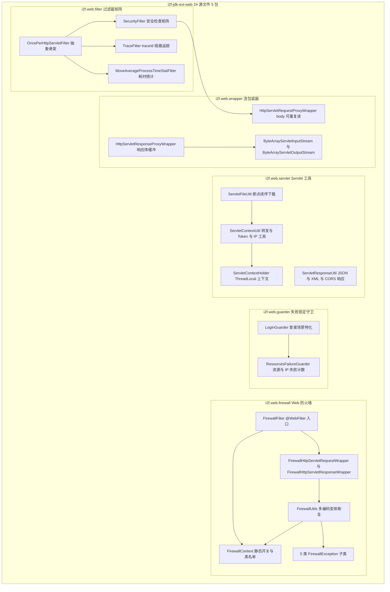
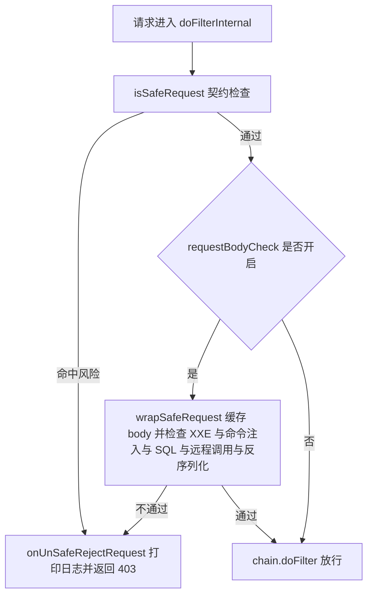

# i2f-jdk-ext-web

> **Servlet 层 Web 增强工具集**——过滤器矩阵(SQL 注入 / XXE / XSS / 反序列化 / 远程调用检测、traceId 链路追踪、耗时滑动窗口统计)、Web 防火墙、失败锁定守卫、Servlet 上下文与文件下载 / 响应工具、请求响应代理包装器,为基于 javax.servlet 的 Web 应用提供「开箱即用」的横切能力层。

## 模块路径

- `i2f-jdk-ext/i2f-jdk-ext-web`

## 模块依赖

| 依赖 | Maven 坐标 | scope | optional | 用途 |
|------|-----------|-------|----------|------|
| i2f-network | `i2f.turbo:i2f-network` | compile | 否 | `HttpStatusConstants`(防火墙异常时响应 400) |
| i2f-io-stream | `i2f.turbo:i2f-io-stream` | compile | 否 | `StreamUtil`(下载流拷贝与范围拷贝 `streamCopyRange`) |
| i2f-io-file | `i2f.turbo:i2f-io-file` | compile | 否 | `FileUtil` / `FileMime`(目录创建、文件保存、MIME 推断) |
| i2f-serialize-impl | `i2f.turbo:i2f-serialize-impl` | compile | 否 | `Json2Serializer` / `Xml2Serializer`(响应默认序列化器) |
| i2f-cache | `i2f.turbo:i2f-cache` | compile | 否 | `IExpireCache`(守卫失败计数与锁定时间缓存,接口位于 i2f-cache-std) |
| i2f-firewall | `i2f.turbo:i2f-firewall` | compile | 否 | `FirewallException`(防火墙异常基类,extends `IllegalArgumentException`) |
| lombok | `org.projectlombok:lombok` | provided | 是 | `@Data` 等编译期注解 |
| javax.servlet-api | `javax.servlet:javax.servlet-api` | provided | 是 | Servlet 4.0.1 API(运行期由 Servlet 容器提供,版本与 scope 由父 POM `i2f-jdk-ext` 统一管理) |

隐式传递依赖(未在本模块 POM 声明,经依赖链传递获得):

| 传递依赖 | 传递链 | 用途 |
|---------|--------|------|
| i2f-clock-impl | i2f-firewall → i2f-reflect → i2f-lru-map → i2f-clock-impl | `SystemClock.currentTimeMillis()`(TraceFilter / MoveAverageProcessTimeStatFilter) |
| i2f-text | i2f-io-file → i2f-text | `StringUtils.isEmpty`(ServletFileUtil) |
| i2f-serialize-std | i2f-serialize-impl → i2f-serialize-std | `IJsonSerializer` / `IXmlSerializer` 接口 |
| i2f-cache-std | i2f-cache → i2f-cache-std | `IExpireCache` 接口 |

## 模块设计

### 包结构

| 包 | 职责 | 关键类 |
|----|------|--------|
| `i2f.web.filter` | 过滤器矩阵:安全检测 / 链路追踪 / 耗时统计 | `OncePerHttpServletFilter`、`SecurityFilter`、`TraceFilter`、`MoveAverageProcessTimeStatFilter` |
| `i2f.web.firewall` | Web 防火墙:请求预检查 + 响应侧注入防护 | `FirewallFilter`、`FirewallContext`、`FirewallUtils`、`FirewallHttpServletRequestWrapper`、`FirewallHttpServletResponseWrapper`、5 类 `FirewallException` 子类 |
| `i2f.web.guarder` | 失败锁定守卫:资源 / IP 双维度计数锁定 | `ResourcesFailureGuarder`、`LoginGuarder` |
| `i2f.web.servlet` | Servlet 上下文与请求 / 响应工具 | `ServletContextHolder`、`ServletContextUtil`、`ServletFileUtil`、`ServletResponseUtil` |
| `i2f.web.wrapper` | 请求 / 响应 / 字节数组流包装器 | `HttpServletRequestProxyWrapper`、`HttpServletResponseProxyWrapper`、`ByteArrayServletInputStream`、`ByteArrayServletOutputStream` |

### 包结构与依赖关系图



### 设计要点

1. **模板方法骨架**:`OncePerHttpServletFilter` 定义 `doFilter` 总流程(非 HTTP 请求直接放行、以「类全名」为 request attribute 标记防同一请求内二次执行),子类仅实现 `doFilterInternal`;`TraceFilter` 在其上再开放 `findTraceId` / `onBefore` / `onAfter` 三个钩子。
2. **Servlet 装饰器体系**:`wrapper` 包与 `firewall.wrapper` 包均继承 `HttpServletRequestWrapper` / `HttpServletResponseWrapper`,实现对请求体、header、queryString、parameterMap 的读写接管;`firewall` 的请求包装器在**构造时即执行六项预检查**(URL / 方法 / multipart / 参数 / queryString / header),响应包装器在 `addCookie` / `sendRedirect` / `setHeader` / `addHeader` / `setContentType` 五个出口做 CRLF / XSS / 注入防护。
3. **双层安全配置模型**:`FirewallContext` 为**静态全局配置**(6 个 enable 开关 + 默认黑名单常量 + add/remove 差量集合);`SecurityFilter` 为**实例级配置**(`CopyOnWriteArrayList` + `AtomicBoolean` 字段,支持运行期动态增删),二者常量大段重叠但互不引用。
4. **多编码变体交叉检测算法**:`SecurityFilter.BAD_INVISIBLE_URL_ENCODED_ASCII_CHARS`(ASCII 0~31 的 `%xx` 变体,静态块生成)与 `FirewallUtils` 的断言方法均把「危险字符」展开为 **7 种编码形式**(原字符、`%x`、`%02x`、`0x%x`、`0x%02x`、`\uhex`、`\u%04x`)× **4 种字符集**(原生、UTF-8、GBK、ISO-8859-1)的笛卡尔积逐一匹配,专门对抗 URL 双重编码绕行;`assertBadChars` 另对不可见控制字符(0x00~0x1F、0x7F)做逐字符扫描。
5. **分段锁并发统计**:`MoveAverageProcessTimeStatFilter` 以 `requestURI.hashCode() % 1024` 分 1024 段(`ConcurrentHashMap<String, ReentrantLock>`),段内再对 `statMap.compute` 加锁,实现高并发下按 URI 的滑动窗口耗时统计(`windowCount=100`,`LinkedBlockingDeque` 存时长,`AtomicLong` 累计),降低热点 URI 之外的锁竞争。
6. **断点续传算法**:`ServletFileUtil.downloadFileRangeSupport` 解析 `Range: bytes=起-止` 请求头,规范化边界后响应 `206` + `Content-Range` / `Content-Length`,流复制交由 `StreamUtil.streamCopyRange(is, os, rangeBegin, responseLen, false)` 跳过前缀字节。
7. **失败锁定算法**:`ResourcesFailureGuarder` 对「资源」与「IP」两个维度分别计数,任一维度的计数在 `IExpireCache` 中过期前达到阈值(资源默认 5 次 / IP 默认 30 次)即判定锁定(`LockType.RESOURCES` / `LockType.IP`),每次失败刷新 `lockedSeconds`(默认 30 分钟)过期时间;`success` 清除计数。



## 模块目的

为 J2EE / SpringMVC / SpringBoot 等基于 `javax.servlet` 规范的 Web 应用提供一处集中、可组合的「横切关注点」实现层:

- **安全防护**:将 SQL 注入、XXE、XSS、Java 反序列化、远程调用(rmi / ldap / jndi / jdbc)、CRLF 注入、路径穿越、文件后缀 / 文件名黑名单、命令注入、不可见字符等常见攻击面检测统一为声明式开关,免去每个项目重复造轮子;
- **请求治理**:traceId 链路追踪(可桥接 MDC)、按 URI 的耗时统计,为可观测性提供基础数据;
- **业务守卫**:登录等敏感操作的失败次数锁定,抵御暴力破解;
- **请求响应增强**:请求体可重复读、响应体缓冲、上下文 ThreadLocal 持有、断点续传下载、JSON / XML / CORS 响应等常用工具。

## 模块功能

### `i2f.web.filter` 过滤器矩阵

- **`OncePerHttpServletFilter`**(抽象):`doFilter` 校验 ServletRequest/Response 均为 HTTP 类型,以类全名为 attribute key 防止同一请求链内重复执行(如 FORWARD / INCLUDE 时);
- **`SecurityFilter`**(1428 行,模块最大类):请求安全检查矩阵,检查项覆盖——
  - 拒绝 HTTP 方法(`BAD_METHODS = {"TRACE", "BATCH"}`,可增删)、Content-Type 白名单(默认 JSON / 表单 / multipart / text / xml / js 等);
  - requestURL / requestURI / servletPath 三段路径的不可见字符、危险字符(含 URL 编码变体)、坏后缀、严格路径(`//`、`/../`、`/~/` 等)、非法文件路径与文件名检查;
  - IP 黑名单正则、路径级 IP 白名单(`servletPathRegexAllowIpRegexMap`)、必填 header/parameter 校验(带路径豁免白名单);
  - Origin / Referer 检查(允许空值开关、正则白名单、路径级白名单,Referer 自动截去 `?` / `#` 之后部分);
  - header / parameter / cookie 三个维度的不可见字符、SQL 注入(内置 6 条默认正则 + 用户自定义)、远程调用检测;parameter 与 multipart(Part 提交文件名)另做非法文件访问与命令注入检查;
  - 请求体检查(可选开启 `requestBodyCheck`):对 JSON / 表单 / XML body 走 `wrapSafeRequest` 缓存后检查 XXE、Java 反序列化类名特征(30+ 条 `Pattern`,如 `java.lang.Runtime`、`java.rmi.*`)、SQL 注入、远程调用、命令注入;
  - 任一命中即 `onUnSafeRejectRequest` 输出 403 + reason;
- **`TraceFilter`**:traceId 解析优先级为 request attribute → `trace-id` 请求头 → `traceId` 参数 → `findTraceId` 钩子(默认返回 null)→ 自动生成「时间戳-UUID」;写入静态 `ThreadLocal`(`TRACE_ID` / `TRACE_SOURCE`)与 request attribute,`finally` 中清理;
- **`MoveAverageProcessTimeStatFilter`**:按 URI 的滑动窗口耗时统计(见设计要点 5),`sourcePathFilter` 谓词可过滤只统计部分路径。

### `i2f.web.firewall` Web 防火墙

- **`FirewallFilter`**:`@WebFilter(urlPatterns = "/**")` 注解声明;捕获 `FirewallException` 后响应 400 + 异常消息;以 attribute 标记保证一次请求只过滤一次,内部将请求 / 响应替换为防火墙包装器后继续链;
- **`FirewallContext`**:静态全局配置——6 个开关(`enableUrl` / `enableMethod` / `enableMultipart` / `enableParameter` / `enableQueryString` / `enableRequestHeader`)、默认黑名单(坏后缀 30 项、坏文件名 60+ 项、坏字符 / 坏字符串常量)与 add/remove 差量集合;
- **`FirewallUtils`**:断言工具族——
  - `assertCrLfXssInject` / `assertCrLfXss`:CRLF 与 XSS 注入(字符 × 多编码 × 4 字符集);
  - `assertUrlInject` / `assertUrlBadChars` / `assertUrlBadStrs` / `assertBadChars`:URL 注入(先剔除 `://` 之前部分再匹配 `../`、`./`、`//` 等,可切文件路径模式);
  - `assertFileName` / `assertFileSuffix` / `assertMatchedFilename`:文件名与后缀黑名单(URL decode 多字符集后判定);
  - `assertHttpMethod`:仅拦截 TRACE;`assertPossiblePathParameter`:参数中疑似路径(含 `/`、`\` 及其编码变体)时才做注入检查;
  - `assertRequestHeader` / `assertHost`:对 host / x-forwarded-for / X-Real-IP / Origin / Referer 等敏感头做专门校验;`assertContentDispositionHeader` + `parseContentDispositionFileName`:解析响应 `Content-Disposition` 中的文件名并检查;
- **`FirewallHttpServletRequestWrapper`**:构造时六项预检查(requestURI / pathInfo / servletPath / contextPath / URL path / dispatcher 路径均做 URL 注入断言);覆写 `getRequestDispatcher` 使转发路径也过检;
- **`FirewallHttpServletResponseWrapper`**:`addCookie` / `sendRedirect` / `setHeader` / `addHeader` / `setContentType` 出口做 CRLF 与坏字符断言;
- **异常族**:`CrLfXssFirewallException`、`FileNameFirewallException`、`FileSuffixFirewallException`、`HttpMethodFirewallException`、`UrlInjectFirewallException`,均 extends `i2f.firewall.exception.FirewallException`。

### `i2f.web.guarder` 失败锁定守卫

- **`ResourcesFailureGuarder`**:构造注入 `IExpireCache<String, Object>`;`resourcesType` 默认 `default`(缓存 key 前缀 `guarder:lock:resources:` / `guarder:lock:ip:`);`check` 返回 `LockType.{NONE, RESOURCES, IP}`,`failure` 双维度计数 +1 并按 `resourcesLockedSeconds` / `ipLockedSeconds`(默认均 30×60 秒)刷新过期,`success` 清除;`lockedResourcesTime` / `lockedIpTime` 查询剩余锁定时间;IP 经 `ServletContextUtil.getIp` 提取并替换 `:` 为 `-`;
- **`LoginGuarder`**:`resourcesType` 特化为 `login` 的子类,提供 4 个构造器。

### `i2f.web.servlet` Servlet 工具

- **`ServletContextHolder`**:`Filter` + 静态 `ThreadLocal<HttpServletRequest/HttpServletResponse>`,`doFilter` 中 `setContext` 后 `finally` `removeContext`;设计上要求注册为最优先过滤器;
- **`ServletContextUtil`**:请求上下文工具——forward data / exception attribute 存取(`forward-data` / `forward-exception`)、`getToken`(header → parameter → session → request attribute 四级回退)、`forward` / `include` / `redirect`、`getUserAgent`、`getPossibleValue`(header → parameter → attribute)、`getIp`(x-forwarded-for → Proxy-Client-IP → WL-Proxy-Client-IP → X-Real-IP → remoteAddr,多级代理取第一个)、`getContextBaseUrl`(拼出 `协议://主机:端口/上下文`)、`getContextPath`(ServletContext realPath 拼相对路径);
- **`ServletFileUtil`**:下载工具族——
  - `downloadFileRangeSupport`(5 重载):断点续传下载,设置 `Accept-Ranges` / `Content-Disposition`(attachment / inline) / 缓存头,解析 Range 后 206 / 200 响应;
  - `responseAsFileAttachment`(4 重载 + `IOConsumer<OutputStream>` 回调版):流式附件 / 内联响应;
  - `responseFileAttachment`(4 重载):File 版附件响应;
  - `responseNotFileFound`:404 提示;`saveAsFile2ContextPath`:按上下文路径保存上传流;
- **`ServletResponseUtil`**:`respJson` / `respJsonString` / `respXml` / `respXmlString` / `respString` 统一响应(默认 `Json2Serializer` / `Xml2Serializer` 可替换);`supportCors` 输出 CORS 头(`*` + 常用请求头白名单 + `Allow-Credentials=true`)。

### `i2f.web.wrapper` 请求响应包装器

- **`HttpServletRequestProxyWrapper`**:构造时将请求体全部读入 `ByteArrayOutputStream`;`getInputStream` / `getReader` 可重复读取;支持覆写 / 附加 header(`setAttachHeader`)、queryString、parameterMap、contentType、contentLength(为 null / -1 时回退 super);
- **`HttpServletResponseProxyWrapper`**:响应体写入内部 `ByteArrayOutputStream`,`getBodyBytes` 前先 `flushBuffer`;`reset` / `resetBuffer` 清空缓冲;
- **`ByteArrayServletInputStream` / `ByteArrayServletOutputStream`**:字节数组流对 Servlet 流的适配(`isReady` 恒 true,`isFinished` 恒 false)。

## 模块主要使用方法

### 1. 过滤器注册(以 SpringBoot 为例)

```java
// TraceFilter —— 从 MDC 取/写 traceId 的子类
@Bean
public FilterRegistrationBean<TraceFilter> traceFilter() {
    FilterRegistrationBean<TraceFilter> bean = new FilterRegistrationBean<>(new SpringTraceFilter());
    bean.addUrlPatterns("/*");
    bean.setOrder(-100);
    return bean;
}

// SecurityFilter —— 也可直接使用 i2f-springboot-spring-starter 的自动装配
// 配置前缀 i2f.security.filter.*(enable 默认 true,order 默认 -1)
```

业务侧读取 traceId:`TraceFilter.TRACE_ID.get()`,或 request attribute `traceId` / `traceSource`。

### 2. 安全检查(`SecurityFilter`)

```java
SecurityFilter filter = new SecurityFilter(); // 构造即加载默认配置
filter.getStrictPath().set(true);             // 严格路径(禁相对路径)
filter.getDenySuffixes().add(".secret");      // 按需增删各项黑名单
filter.getRequestBodyCheck().set(true);       // 开启请求体检查(会缓存 body)
```

注意:开启 `requestBodyCheck` 后请求体被 `HttpServletRequestProxyWrapper` 缓存为字节数组,大文件上传(非 JSON / 表单 / XML 类型不受影响)需评估内存;被拒绝的请求固定响应 403。

### 3. Web 防火墙

```java
// 注册(或依赖 @WebFilter 自动发现)
FilterRegistrationBean<FirewallFilter> bean = new FilterRegistrationBean<>(new FirewallFilter());
// 全局开关与差量黑名单(静态配置,全局生效)
FirewallContext.enableMultipart = true;
FirewallContext.addBadSuffixes.add(".jsp");
```

注意:防火墙包装器在**构造时**执行预检查,异常为 `FirewallException` 系,由 `FirewallFilter` 统一转为 400;详单见「模块瑕疵或错误」中 `FirewallContext` 差量集合语义问题。

### 4. 登录失败锁定

```java
LoginGuarder guarder = new LoginGuarder();
guarder.setCache(expireCache); // 注入 IExpireCache 实现(如 Redis / LruMap 缓存)
ResourcesFailureGuarder.LockType type = guarder.check(request, username);
if (type != ResourcesFailureGuarder.LockType.NONE) { /* 已锁定,提示稍后再试 */ }
guarder.failure(request, username); // 校验失败时调用
guarder.success(request, username); // 校验成功时调用(清零)
Long leftSeconds = guarder.lockedResourcesTime(username, TimeUnit.SECONDS); // 剩余锁定时间
```

### 5. Servlet 上下文与工具

```java
// ServletContextHolder:注册为最优先过滤器后,业务代码任意位置取请求/响应
HttpServletRequest req = ServletContextHolder.getRequest();

// ServletContextUtil:转发携带数据
ServletContextUtil.forward(request, response, "/target", dataObj);

// ServletFileUtil:断点续传下载与附件响应
ServletFileUtil.downloadFileRangeSupport(request, response, file, "报告.pdf");
ServletFileUtil.responseFileAttachment(file, response);

// ServletResponseUtil:JSON 响应与 CORS
ServletResponseUtil.respJson(response, result);
ServletResponseUtil.supportCors(response);
```

### 6. 请求包装器(可重复读 body)

```java
HttpServletRequestProxyWrapper wrapper = new HttpServletRequestProxyWrapper(request); // 构造即缓存 body
byte[] body = wrapper.getBodyBytes();          // 可多次读取
wrapper.setAttachHeader("x-token", "abc");     // 覆写/附加 header
wrapper.setParameterMap(paramMap);             // 覆写参数
chain.doFilter(wrapper, response);
```

注意:构造后原 request 的 `getInputStream` 已消费,应使用 wrapper 传入后续链;`getReader` 按 `getCharacterEncoding` 解码,编码为 null 时不符规范,建议先 `setCharacterEncoding`。

### 7. 耗时统计

```java
MoveAverageProcessTimeStatFilter filter = new MoveAverageProcessTimeStatFilter();
filter.setSourcePathFilter(uri -> uri.startsWith("/api/")); // 只统计部分路径
// 注册后从 statMap 读取:每个 URI 的窗口大小、平均耗时(avgTime)
```

注意:窗口淘汰逻辑存在累加缺陷(见瑕疵章节),`avgTime` 会随时间失真。

## 模块特性总结

- **零第三方运行时依赖(除容器 API)**:全部基于 JDK + i2f 内部模块实现,`javax.servlet-api` 以 provided + optional 引入,不污染使用方依赖树;
- **安全能力最全的集中入口**:`SecurityFilter` 单类覆盖 10+ 类攻击面与 3 个数据维度(header / parameter / cookie)+ 请求体,提供约 70 项配置属性由 SpringBoot starter 自动装配;
- **多编码绕行对抗**:危险字符 × 7 编码形式 × 4 字符集交叉匹配,覆盖 URL 编码 / 双重编码 / Unicode 转义等常见绕行手法;
- **模板方法 + 装饰器 + 钩子**:`OncePerHttpServletFilter`(防重复执行)、Servlet 包装器(读写接管)、`TraceFilter` 三钩子(可扩展链路上报)三类扩展点清晰;
- **上下游贯通**:既有 JDK 侧使用方式(直接 new + 静态配置),也有 Spring 侧自动装配支持(spring / security / shiro / ops 等 starter),同一套类服务多框架;
- **断点续传开箱即用**:`downloadFileRangeSupport` 一行完成 206 分段下载,配合 CORS / Content-Disposition 头输出;
- **零测试**:模块无 src/test 与 resources 目录,行为正确性依赖使用方集成验证。

## 模块瑕疵或错误

1. **`MoveAverageProcessTimeStatFilter` 滑动窗口淘汰用加法**:`MoveAverageProcessTimeStatFilter.java:73` 淘汰最老时长时执行 `old.getSumTime().addAndGet(lastTime)`(注释明确写「从窗口中时长中扣除最老的一个时长」),应为 `addAndGet(-lastTime)`;`sumTime` 只增不减,`avgTime` 随时间单调偏大直至完全失真。
2. **`SecurityFilter` 的 `REMOTE_INVOKE_PATTERNS` 误用 SQL 正则编译**:`SecurityFilter.java:199` 的静态块中 `for (String item : SQL_INJECT_REGEXES)` 编译 `REMOTE_INVOKE_PATTERNS`(应为 `REMOTE_INVOKE_REGEXES`),导致默认远程调用模式下 `rmi://` / `ldap://` / `jndi:` 等永远不命中,而 SQL 注入正则会以 `matcher.find()` 参与远程调用判定,造成误报与漏报并存。
3. **`SecurityFilter.matchRemoteInvoke` 全匹配语义混乱**:`SecurityFilter.java:1356` 对用户自定义列表使用 `str.matches(item)`(要求整串全匹配,`rmi://` 这类「包含」型模式几乎不可能命中),而默认模式列表使用的是 `find()`;两段逻辑语义不一致。
4. **`SecurityFilter.isExceedRootPath` 的 `..` 分支 pop 后又 push**:`SecurityFilter.java:1125-1132` 中 `..` 命中时先 `stack.pop()` 抵消上一段路径,但随后循环尾部无条件 `stack.push(item)` 又把 `..` 本身压栈,pop 语义被完全抵消,路径穿越归一化结果错误(仅当 `..` 为首段时能正确拦截,其余组合均失效)。
5. **`SecurityFilter.matchIllegalFileAccessFileName` 取到的是目录而非文件名**:`SecurityFilter.java:1311` 对路径取 `substring(0, idx)`(最后一个分隔符**之前**的部分,即目录部分)再与非法文件名比较,应为 `substring(idx + 1)`;导致非法文件名检测(如 `id_rsa`、`passwd`)在带目录的路径中几乎恒不命中。
6. **`SecurityFilter.isMissingHeadersParameters` 豁免列表为空即跳过全部必填检查**:`SecurityFilter.java:1376-1378` 中 `globalAllowMissingHeadersParametersNameServletPathRegexList` 为空时直接 `return null`,即「未配置豁免路径」反而使「必填 header/parameter」功能完全不生效,与预期(无豁免时应全量检查)相反。
7. **`FirewallContext` 的 add / remove 差量集合语义颠倒**:`FirewallContext.java:62-64` / `72-74` 中,`getBadSuffixes()` / `getBadFilenames()` 对 `addBadSuffixes` 集合执行 `ret.remove(...)`、对 `removeBadSuffixes` 集合执行 `ret.addAll(...)`——「添加」实为移除、「移除」实为添加,配置时需反着理解。
8. **`HttpServletRequestProxyWrapper` 第二构造器自赋值**:`HttpServletRequestProxyWrapper.java:34-37` 的 `(HttpServletRequest, ByteArrayServletOutputStream)` 构造器中 `this.body = body;` 是字段自赋值(参数 `bos` 完全未使用),该重载意图未实现,调用后请求体为空。
9. **`ByteArrayServletInputStream.isFinished()` 恒返回 false**:`ByteArrayServletInputStream.java:22-24` 未根据 `bis.available()` 判断,流已读完仍返回 false,不符合 ServletInputStream 语义(同步读取场景影响有限,但会误导依赖该判定的框架代码)。
10. **双重实现多处重复**:`SecurityFilter.getIp`(1395-1426 行)与 `ServletContextUtil.getIp`(155-186 行)逐行重复;`SecurityFilter` 的 `BAD_URL_CHARS` / `BAD_SUFFIXES` / `BAD_FILE_NAMES` 等常量大段复制自 `FirewallContext` 默认值并各自维护,存在同步漂移风险。
11. **`ServletContextHolder.doFilter` 未做类型判断**:直接强转 `(HttpServletRequest)` / `(HttpServletResponse)`,非 HTTP 请求场景抛 `ClassCastException`(同模块其他过滤器均先 `instanceof` 校验)。
12. **`ServletFileUtil.downloadFileRangeSupport` 的 Range 解析不健壮**:后缀式 Range(`bytes=-500`)会执行 `Long.parseLong("")` 抛 `NumberFormatException`;`Content-Range` 头中「总大小」误用本次响应长度 `responseLen` 而非文件总长;`Accept-Ranges` 在 206 分支被写为范围格式(`bytes 0-99/100`)而非固定值 `bytes`,均不符 HTTP 规范。
13. **`FirewallHttpServletRequestWrapper.assertHttpServletMultipart` 吞非防火墙异常**:`FirewallHttpServletRequestWrapper.java:122-126` 的 `catch (Exception e)` 仅重抛 `FirewallException`,其余异常(如容器解析 multipart 失败)被静默丢弃,预检查可能被静默跳过。
14. **日志输出未接入日志体系**:`SecurityFilter.onUnSafeRejectRequest` 使用 `System.err.println`(420-427 行),`ServletContextUtil.getIp` 使用 `printStackTrace`(173-174 行),与仓库统一的 slf4j 日志体系脱节。

## 消费方情况

| 消费方模块 | 消费方式 | 消费内容 |
|-----------|---------|---------|
| `i2f-jdk-ext-swl`(POM 显式依赖) | `SwlWebFilter` 继承与调用 | `OncePerHttpServletFilter`、`ServletContextUtil`、`HttpServletRequestProxyWrapper`、`HttpServletResponseProxyWrapper` |
| `i2f-springboot-spring-starter` | 自动装配 | `SecurityFilterAutoConfiguration`(`i2f.security.filter.*` 配置 + `FilterRegistrationBean`,order 默认 -1);`SpringTraceFilter extends TraceFilter`(findTraceId 读 MDC,onBefore / onAfter 写清 MDC) |
| `i2f-springboot-security-starter` | 自动装配与处理器 | `LoginGuarderAutoConfiguration`、`LoginLockBeforeLoginChecker`、`DefaultAuthenticationFailureHandler` / `DefaultAuthenticationSuccessHandler` 用 `LoginGuarder`;7 个类用 `ServletContextUtil` |
| `i2f-springboot-shiro-starter` | 处理器工具 | `DefaultLoginFailureHandler` / `DefaultLoginSuccessHandler` / `DefaultLogoutHandler` / `ShiroCoreFilter` 用 `ServletContextUtil` |
| `i2f-springboot-ops-starter` | 控制器下载 | 6 个 Ops 控制器(Ssh / Host / Datasource / Minio / AwsS3 / OpenAi)用 `ServletFileUtil` |
| `i2f-spring-web` | 工具包装 | `HttpFileUtil` 用 `ServletFileUtil`;`SpringMvcUtil` 用 `ServletContextUtil` / `ServletResponseUtil` |
| `i2f-spring-authentication` | 转发控制器 | `SecurityForwardController` 用 `ServletContextUtil` |
| `i2f-jdk-ext-all` / `test-secure` | POM 聚合 | 打包聚合(`test-secure` 无源码) |
