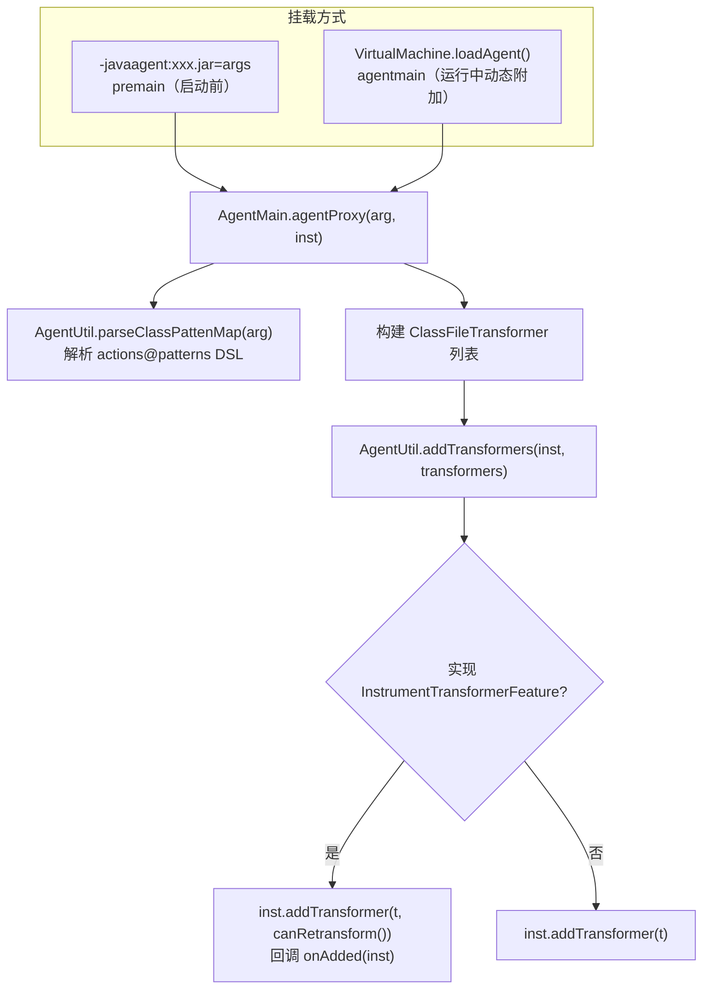

# i2f-agent

> 基于 JDK `java.lang.instrument` 的 Java Agent 模块，同时支持启动期静态挂载（`premain`）与运行期动态附加（`agentmain` + Attach API），提供 Instrumentation 装配、Bootstrap 类搜索扩展、按 Ant 表达式匹配类的字节码转换骨架，以及可交互附加到目标 JVM 的命令行工具。

## 模块路径

- `i2f-jdk/i2f-agent`

## 模块依赖

| GroupId | ArtifactId | Scope | Optional | 说明 |
|---------|-----------|-------|----------|------|
| i2f.turbo | i2f-jvm | compile | false | JVM 工具，提供 `JvmUtil.getPid()` 用于自我附加 |
| i2f.turbo | i2f-match | compile | false | 提供 `StringMatcher.antClass()`，按 Ant 风格匹配类全名 |
| com.sun | tools | system | false | JDK `tools.jar`（`${java.home}/lib/tools.jar`），提供 `com.sun.tools.attach.VirtualMachine` 动态附加 API |
| org.projectlombok | lombok | compile | false | 编译期代码生成（`@Data`、`@NoArgsConstructor`） |

> 打包为可执行 Agent jar：`META-INF/MANIFEST.MF` 声明 `Premain-Class`/`Agent-Class=i2f.agent.AgentMain`、`Main-Class=i2f.agent.AppMain`、`Can-Redefine-Classes=true`、`Can-Retransform-Classes=true`。`tools.jar` 仅在 JDK8 桌面/开发环境以 system scope 提供，运行依赖 JDK 而非 JRE。

## 模块设计

### Agent 双入口模型

同一 `AgentMain` 既作为启动期 `premain` 又作为运行期 `agentmain` 入口，二者统一委托到 `agentProxy`：



### 包结构

| 包 / 类 | 角色 | 说明 |
|---------|------|------|
| `i2f.agent.AgentMain` | Agent 入口 | `premain`/`agentmain`/`agentProxy`，注册转换器 |
| `i2f.agent.AgentUtil` | 工具门面 | 参数 DSL 解析、Bootstrap 搜索扩展、retransform、动态 attach 等静态能力 |
| `i2f.agent.AppMain` | 命令行附加工具 | 交互式列出 JVM、选择进程、输入 agent jar 与参数后 attach |
| `i2f.agent.transformer.InstrumentTransformerFeature` | 生命周期特性接口 | `canRetransform()`、`onAdded()`、`onRemoved()` |
| `i2f.agent.transformer.BasicClassPatternClassFileTransformer` | 抽象转换器基类 | 按动作→Ant 类模式匹配，命中后委派 `transformActions`（模板方法） |
| `i2f.agent.transformer.SystemLoadedClassesPrintTransformer` | 示例转换器 | 演示特性接口实现，当前直接回传原始字节码 |

### 关键设计点

1. **参数 DSL（`actions@class-ant-patterns`）**：`parseClassPattenMap` 以 `&` 分隔多组规则，每组 `actions@patterns`（以首个 `@` 切分，`split("@", 2)`），`actions` 逗号分隔并统一转小写、`patterns` 逗号分隔去空白，最终产出 `Map<action, Set<pattern>>`。示例：`args,stat,ret@com.i2f.**,i2f.core.**&args@org.**`。`makeActionPattenArg` 为该格式的逆向组装器。

2. **模板方法式类匹配转换**：`BasicClassPatternClassFileTransformer` 在 `transform` 中把 `/` 类名转为 `.`，遍历各 action 的模式集，用 `StringMatcher.antClass().match` 收集命中的 action 集合；无命中直接返回原始 `classfileBuffer`，命中则委派给抽象 `transformActions`，把「是否匹配」与「如何改字节码」解耦。

3. **转换器特性驱动注册**：`addTransformers` 对实现了 `InstrumentTransformerFeature` 的转换器按 `canRetransform()` 决定 `inst.addTransformer(t, boolean)` 重载，并在全部注册后统一回调 `onAdded(inst)`，为「注册即触发的批量重定义」提供扩展点。

4. **Bootstrap 搜索注入**：`appendAgentJarToBootstrapClassLoaderSearch` 从 `RuntimeMXBean` 输入参数解析 `-javaagent:` 路径（`getAgentJarFile`），把 agent jar 及其同级 `lib/*.jar` 追加到 Bootstrap 类加载器搜索路径，解决被增强类看不到 agent 类的类加载可见性问题。

5. **动态附加封装**：`agentByPid`/`agentByName`/`agentCurrent` 基于 `com.sun.tools.attach.VirtualMachine` 完成 attach → `loadAgent` → detach；`agentCurrent` 借 `i2f-jvm` 的 `getPid()` 实现「自我附加」。

6. **已加载类重定义**：`retransformLoadedClasses` 支持按 `Predicate<Class<?>>` 或按模式映射筛选，跳过含 `$` 的匿名/内部类，逐个 `inst.retransformClasses` 并对单个失败打印堆栈不中断整体。

## 模块目的

- 提供一套可复用的 Java Agent 基础设施：入口装配、参数解析、类模式匹配转换骨架、Bootstrap 注入与动态 attach，降低编写监控/埋点/增强类 agent 的样板成本。
- 通过 Ant 模式 + action DSL，把「观察哪些类、做哪些动作」外置为启动/附加参数，无需改代码即可调整增强范围。

## 模块功能

- 启动期挂载：`-javaagent:i2f-agent.jar=<DSL 参数>` 触发 `premain`。
- 运行期附加：`AppMain` 交互选择目标 JVM 并 `loadAgent`，或以 `AgentUtil.agentByPid/agentByName` 编程式附加。
- 类字节码转换框架：注册 `ClassFileTransformer`，按 action→类模式匹配决定是否转换。
- Instrumentation 能力：Bootstrap 类搜索扩展、已加载类枚举、按条件批量 retransform。
- 示例：`SystemLoadedClassesPrintTransformer` 演示转换器 + 特性接口接入。

## 模块主要使用方法

### 1. 启动期挂载

```bash
java -javaagent:target/i2f-agent.jar="args,ret,stat@com.i2f.**&stat@java.util.**" -jar your-app.jar
```

### 2. 运行期交互附加（可执行 jar，Main-Class=AppMain）

```bash
java -jar target/i2f-agent.jar
# 列出 JVM 进程 → 输入序号选择 → 输入 agent jar 路径（默认自身）→ 输入 DSL 参数 → attach
```

### 3. 编程式使用

```java
// 附加到指定 pid
AgentUtil.agentByPid("12345", "i2f-agent.jar", "args@com.i2f.**");
// 附加到当前进程
AgentUtil.agentCurrent(agentJarFile, "stat@com.i2f.**");
// 解析参数 DSL
Map<String, Set<String>> m = AgentUtil.parseClassPattenMap("args,ret@com.i2f.**");
```

### 4. 自定义增强转换器

```java
public class MyTransformer extends BasicClassPatternClassFileTransformer
        implements InstrumentTransformerFeature {
    @Override
    public byte[] transformActions(Set<String> actions, ClassLoader loader, String className,
            Class<?> beingRedefined, ProtectionDomain pd, byte[] buf) {
        // 依据 actions（args/stat/ret...）用 ASM/Javassist 改写 buf
        return buf;
    }
}
```

注意事项：

- 需以 **JDK**（含 `lib/tools.jar`）运行，纯 JRE 环境无 Attach API；JDK9+ 模块化后 `tools.jar` 已并入 JDK，system 依赖路径需相应调整。
- 动态 `attach` 自身或同机进程可能受 `jdk.attach.allowAttachSelf`（JDK9+）限制。
- `AgentMain.agentProxy` 当前仅注册 `SystemLoadedClassesPrintTransformer` 这一演示转换器；`args/stat/ret` 等 action 的实际字节码增强需自行实现 `transformActions` 并加入 `transformers` 列表。
- `retransform` 要求目标类可重定义（`inst.isModifiableClass`），且转换器须以 `canRetransform=true` 注册方能对已加载类生效。

## 模块特性总结

- 静态 `premain` 与动态 `agentmain` 双入口，共用 `agentProxy` 装配逻辑。
- `actions@ant-patterns&...` 参数 DSL，运行期灵活划定增强范围与动作。
- 模板方法式 `BasicClassPatternClassFileTransformer` 解耦类匹配与字节码改写。
- `InstrumentTransformerFeature` 生命周期特性（`canRetransform`/`onAdded`/`onRemoved`）驱动注册与批量重定义。
- 封装 Bootstrap 类搜索注入、已加载类枚举与按条件 retransform。
- 自带交互式 `AppMain` attach 工具，可直接对运行中的 JVM 挂载 agent。
