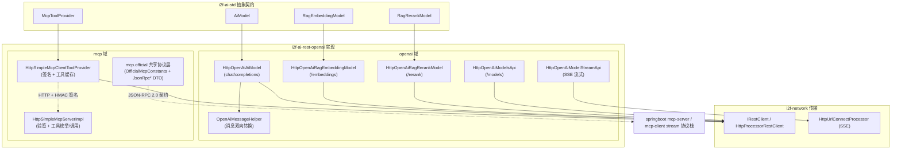
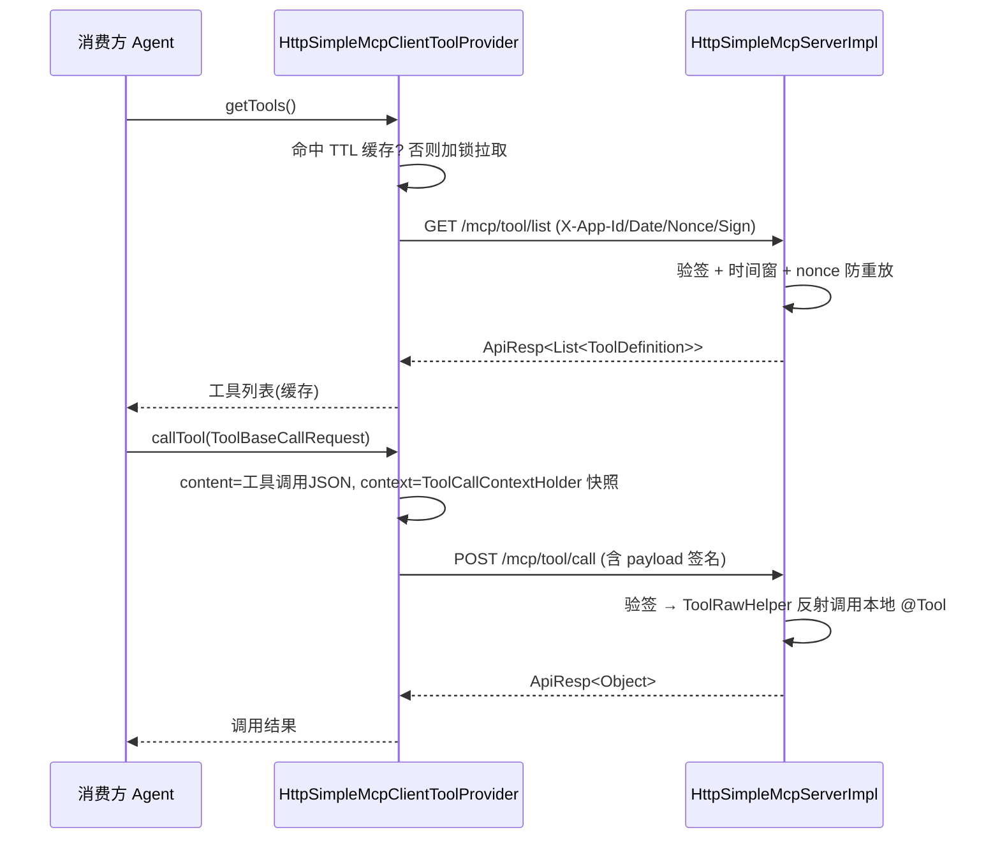

# i2f-ai-rest-openai

> `i2f-ai-std` 抽象契约的 OpenAI 兼容 HTTP 实现模块，基于 `i2f-network` 的 REST/HTTP 客户端，将标准对话、Embedding、Rerank、模型列表等接口对接到任何遵循 OpenAI `/v1` 协议的服务端（OpenAI、Ollama、One-API、SiliconFlow 等），并提供一套自研的、基于 HMAC-SHA256 签名的「Simple MCP」工具网关（含客户端与服务端契约），实现跨进程的远程工具（function-calling）暴露与调用，并额外对外提供官方 MCP（Streamable HTTP / JSON-RPC 2.0）协议栈的共享 DTO 与协议常量，供服务端/客户端 starter 的 stream 协议栈共同消费。

## 模块路径

- `i2f-jdk/i2f-ai-rest-openai`

## 模块依赖

| GroupId | ArtifactId | Scope | Optional | 说明 |
|---------|-----------|-------|----------|------|
| i2f.turbo | i2f-ai-std | compile | false | 待实现的抽象契约：`AiModel`、`RagEmbeddingModel`、`RagRerankModel`、`McpToolProvider`、消息模型与工具定义 |
| i2f.turbo | i2f-network | compile | false | HTTP/REST 传输层，`IRestClient`/`HttpProcessorRestClient`/`HttpUrlConnectProcessor`、`HttpRequest`/`HttpHeaders` |
| i2f.turbo | i2f-reflect | compile | false | `ReflectResolver.bean2map`，请求体转 Map 以便剔除空字段 |
| i2f.turbo | i2f-mutator | compile | false | `BaseMutator` 流式（fluent）构建基类，各实现与 DTO 普遍 `implements BaseMutator` |
| i2f.turbo | i2f-resp | compile | false | 统一响应体 `ApiResp`/`ApiCode`，MCP 网关请求/响应封装 |
| org.projectlombok | lombok | compile | false | 编译期代码生成（`@Data`、`@NoArgsConstructor`） |

> 传输与序列化全部构建在 `i2f-network` + `i2f-serialize`（`Json2Serializer`）之上，**不引入任何第三方 OpenAI SDK**；MCP 签名使用 JDK 标准 `javax.crypto.Mac`（`HmacSHA256`）。本模块是 `i2f-ai-std` 的一个具体落地实现（模型无关抽象 → OpenAI 协议）。

## 模块设计

### 分层结构

模块分为两大能力域：`openai`（对接 OpenAI 兼容协议的模型/向量实现）与 `mcp`（工具网关双协议栈：`simple` 自研 Simple MCP 客户端+服务端实现，`official` 官方 MCP 协议的纯共享模型层）。



### 包结构

| 包 | 职责 | 关键类 |
|----|------|--------|
| `i2f.ai.rest.openai.model` | 对话模型实现与消息转换 | `HttpOpenAiAiModel`、`HttpOpenAiModelStreamApi`、`OpenAiMessageHelper` |
| `i2f.ai.rest.openai.model.data` | OpenAI 请求/响应体 DTO | `OpenAiCompletionReqDto`/`RespDto`、`OpenAi*Message`、`OpenAiToolCall`、`OpenAiConsts` |
| `i2f.ai.rest.openai.model.data.chunk` | 流式分片 DTO | `OpenAiCompletionChunkRespDto`、`OpenAiCompletionChoiceChunk` |
| `i2f.ai.rest.openai.metadata.model` | 模型元数据接口 | `HttpOpenAiModelsApi` + `OpenAiModelsRespDto`/`Item` |
| `i2f.ai.rest.openai.rag` | 向量化实现 | `HttpOpenAiRagEmbeddingModel` + `HttpOpenAiEmbeddingReqDto`/`RespDto` |
| `i2f.ai.rest.openai.rag.rerank` | 重排序实现 | `HttpOpenAiRagRerankModel` + `HttpOpenAiRerankReqDto`/`RespDto` |
| `i2f.ai.rest.mcp.simple` | Simple MCP 协议常量与载荷 | `HttpSimpleMcpConstants`、`McpCallPayloadDto` |
| `i2f.ai.rest.mcp.simple.client` | MCP 客户端（工具消费方） | `HttpSimpleMcpClientToolProvider` + `SimpleMcpToolListRespDto` |
| `i2f.ai.rest.mcp.simple.server` | MCP 服务端（工具提供方） | `HttpSimpleMcpServer`、`HttpSimpleMcpServerImpl`、`HttpSimpleMcpRequest`/`AppItem` |
| `i2f.ai.rest.mcp.official.consts` | 官方 MCP 协议常量 | `OfficialMcpConstants`（`/mcp`、protocolVersion、方法名、JSON-RPC 预定义错误码） |
| `i2f.ai.rest.mcp.official.data` | JSON-RPC 2.0 信封 | `JsonRpcRequest`/`JsonRpcResponse`/`JsonRpcError` |
| `i2f.ai.rest.mcp.official.data.result` | 官方工具协议结果模型 | `JsonRpcInitialResult`、`JsonRpcToolListResult`/`Item`、`JsonRpcToolCallParam`/`Result` |

### 核心设计点

**1. 抽象契约的协议适配（Adapter）**
每个实现都 `implements` `i2f-ai-std` 的契约接口，把标准模型对象翻译为 OpenAI 协议请求。`HttpOpenAiAiModel.generate(AiRequest)` 是标准入口：读取 `AiRequest` 的 `toolMap` → 转 `OpenAiToolsDefinition`，`messageList` → 经 `OpenAiMessageHelper.toOpenAiMessages` 转换，POST 到 `{baseUrl}/chat/completions`，再取 `choices[0].message` 反向映射为 `AssistantMessage`。`baseUrl` 可指向任意 OpenAI 兼容端点，实现「一份接口，多后端」。

**2. 空字段剥离以适配 OpenAI 严格校验**
`completion`/`completionSse` 在序列化前用 `ReflectResolver.bean2map` 把请求转 Map，再遍历剔除 `null` 值、空 `Collection`、空 `Map` 的键。这是因为 OpenAI 标准协议对字段有强制校验（如 `stream`、`tools`、`stream_options` 为空时不能出现），从而在「对象模型统一填充」与「协议要求字段可选」之间取得平衡。

**3. 消息模型的双向多态映射**
`OpenAiMessageHelper` 在 `i2f-ai-std` 消息体系（`UserMessage`/`SystemMessage`/`AssistantMessage`/`ToolMessage`）与 OpenAI DTO（`OpenAiUserMessage`/`OpenAiSystemMessage`/`OpenAiAssistantMessage`/`OpenAiToolMessage`）之间做 `instanceof` 分派转换，并处理：
- `AssistantMessage.toolCallRequestList` ↔ `OpenAiToolCall`（含 `function.name/arguments`、`id`）
- 响应侧 `reasoning_content`（深度思考内容）→ `AssistantMessage.thinking`
- 依据是否存在 `tool_calls` 回填 `FinishReason`（`TOOL_CALL` / `STOP`），并把原始 DTO 存入 `rawMessage`/`rawRequest` 便于回溯
- `fromOpenAiAssistantMessage` 对 `OpenAiAssistantMessage`（发送态）与 `OpenAiAssistantMessageRespDto`（响应态）两种入参做了重载

**4. SSE 流式分片重组算法**
`HttpOpenAiModelStreamApi` 不走 REST 客户端，而用 `HttpUrlConnectProcessor` 直接读输入流：强制 `stream=true` + `stream_options.include_usage=true`，逐行解析 `data:` 前缀（`[DONE]` 终止），把每个分片增量合并回一个完整的 `OpenAiCompletionRespDto`：
- 文本/思考内容按字符串拼接（`merge`）
- `choices` 按 `index` 定位、`tool_calls` 按 `index` 定位并拼接 `arguments`
- `usage` 各 token 计数累加
- 通过 `Consumer<Reference<...>>` 回调下发，`Reference.finish()` 表示流结束

**5. Simple MCP —— HMAC 签名的跨进程工具网关**
自研一套轻量 MCP（区别于标准 JSON-RPC MCP），仅用两个 HTTP 端点（`/mcp/tool/list`、`/mcp/tool/call`）暴露/消费 `@Tool` 工具：



签名载荷格式为 `appId#timestamp(16进制秒)#nonce[#content[#context]]`，`timestamp` 用 `Long.toString(now/1000, 16)`，签名头为 `X-App-Id / X-App-Date / X-App-Nonce / X-App-Sign`（`HmacSHA256`，Base64）。客户端 `getTools` 有默认 15s TTL 缓存 + `AtomicBoolean/AtomicLong/ReentrantLock` 双检；服务端默认允许 30 分钟时间窗，`expireCache` 可选开启 nonce 防重放（验签通过后才写入，避免误杀重传的正常请求）。服务端与 Web 框架解耦：只接收由 `HttpHeaders` + `McpCallPayloadDto` 组装的 `HttpSimpleMcpRequest`，宿主控制器负责把 HTTP 请求转成该对象。

**6. Mutator 流式构建**
所有实现类与多数 DTO 都 `implements BaseMutator<T>` 并提供 `builder()`，配置项（`baseUrl`/`apiKey`/`model`/`restClient`/签名密钥等）既可用 `@Data` setter，也可 `builder().xxx().build()` 链式装配。

**7. 官方 MCP（Streamable HTTP）共享协议模型层（`mcp.official`）**
面向官方 MCP 规范（protocolVersion `2024-11-05`，底层 JSON-RPC 2.0）的**纯契约包**：仅含常量与 DTO，不含传输/运行期逻辑，与 Simple MCP 双栈并列：
- `OfficialMcpConstants`：单端点 `/mcp`（按请求体 `method` 路由 `initialize`/`tools/list`/`tools/call`）、信封版本 `2.0`、会话头 `Mcp-Session-Id`，以及严格沿用 JSON-RPC 2.0 预定义码的 `-32600/-32601/-32602/-32603`（不得替换为 HTTP 状态码）。
- 信封：`JsonRpcRequest<T>`/`JsonRpcResponse<T>`（`success`/`error` 静态工厂）/`JsonRpcError`。
- 结果模型：`JsonRpcInitialResult`（protocolVersion/capabilities/serverInfo）、`JsonRpcToolListResult`/`Item`（name/description/inputSchema）、`JsonRpcToolCallParam`（name/arguments）与 `JsonRpcToolCallResult`（content + `isError`：工具执行失败属业务结果，不上升为 JSON-RPC error）。
- 消费方：`i2f-springboot-ai-mcp-server` 的 stream 协议栈（`SpringHttpStreamMcpController`，其 `ServerJsonRpcRequest` 继承信封并把 params 放宽为原始 Map 以规避 Jackson 泛型擦除）与 `i2f-springboot-ai-mcp-client` 的 `StreamJsonRpcMcpClientToolProvider`；官方协议栈不复用带 HMAC 语义的 `HttpSimpleMcpServer`。

## 模块目的

- 为模型无关的 `i2f-ai-std` 抽象提供一个**零第三方 SDK**、可直接对接 OpenAI 兼容生态的运行期实现。
- 用 HTTP + 签名协议打通跨进程/跨服务的工具（function-calling）共享，让一个进程里的 Agent 能发现并调用另一进程暴露的 `@Tool`。
- 屏蔽 OpenAI 协议的细节坑（严格字段校验、SSE 分片、tool_calls 增量、深度思考 `reasoning_content`），对上层保持稳定的对象模型。
- 以共享协议模型层统一官方 MCP 服务端/客户端两端的 JSON-RPC 信封、结果与预定义错误码语义，避免双端各自平行定义发散。

## 模块功能

| 分类 | 入口类 / 方法 | 对接端点 | 说明 |
|------|--------------|----------|------|
| 对话补全 | `HttpOpenAiAiModel.generate(AiRequest)` | `POST {base}/chat/completions` | 非流式，返回 `AssistantMessage`（含 tool_calls/thinking） |
| 对话补全（底层） | `HttpOpenAiAiModel.completion(OpenAiCompletionReqDto)` | 同上 | 直接收发 OpenAI 原生 DTO |
| 流式对话 | `HttpOpenAiModelStreamApi.completion(...)` / `completionSse(...)` | `POST {base}/chat/completions` (`stream=true`) | SSE 分片增量合并 |
| 向量化 | `HttpOpenAiRagEmbeddingModel.embedAsVector / embedAllAsVector` | `POST {base}/embeddings` | 按 `index` 排序回填，缺失抛异常 |
| 重排序 | `HttpOpenAiRagRerankModel.rerank(question, contents, topN)` | `POST {base}/rerank` | 兼容 SiliconFlow/类 Cohere rerank |
| 模型列表 | `HttpOpenAiModelsApi.models()` | `GET {base}/models` | 列举可用模型 |
| MCP 客户端 | `HttpSimpleMcpClientToolProvider.getTools / support / callTool` | `GET /mcp/tool/list`、`POST /mcp/tool/call` | 签名 + TTL 缓存 + 上下文透传 |
| MCP 服务端 | `HttpSimpleMcpServerImpl.getTools / callTool` | — | 验签 + 枚举/反射调用本地工具 |
| 官方 MCP 协议模型 | `OfficialMcpConstants` + `JsonRpc*` DTO | `POST {base}/mcp`（由上层 starter 装配） | JSON-RPC 2.0 信封、initialize/tools/list/tools/call 结果模型与预定义错误码 |

## 模块主要使用方法

**1. 配置对话模型并接入 Agent（`i2f-ai-std`）**

```java
HttpOpenAiAiModel model = HttpOpenAiAiModel.builder()
        .baseUrl("https://api.openai.com/v1")   // 也可以是 http://localhost:11434/v1 (Ollama)
        .apiKey("sk-xxxx")
        .model("gpt-4o-mini")
        .build();
// model 即 i2f.ai.std.model.AiModel，可交给 AiAgent / @AiService 使用
```

**2. 流式对话**

```java
HttpOpenAiModelStreamApi stream = HttpOpenAiModelStreamApi.builder()
        .baseUrl("https://api.openai.com/v1").apiKey("sk-xxxx").model("gpt-4o-mini")
        .build();
OpenAiCompletionReqDto req = new OpenAiCompletionReqDto();
req.setModel("gpt-4o-mini");
req.setMessages(OpenAiMessageHelper.toOpenAiMessages(Collections.singletonList(new UserMessage("你好"))));
// 方式一：拿合并后的完整响应
OpenAiCompletionRespDto full = stream.completion(req);
// 方式二：边收边处理
stream.completionSse(req, ref -> {
    if (ref.isValue()) { /* 处理 OpenAiCompletionChunkRespDto */ }
});
```

**3. Embedding / Rerank**

```java
RagEmbeddingModel embedding = HttpOpenAiRagEmbeddingModel.builder()
        .baseUrl("http://localhost:11434/v1").model("qwen3-embedding:0.6b").apiKey("xxx")
        .build();
List<RagVector> vectors = embedding.embedAllAsVector(Arrays.asList("我喜欢吃", "你喜欢玩"));

List<RagRerankDocument> ranked = HttpOpenAiRagRerankModel.builder()
        .baseUrl(baseUrl).model("rerank-model").apiKey("xxx")
        .build().rerank("问题", candidateTexts, 3);
```

**4. Simple MCP —— 提供方（被远程调用的服务）**

```java
HttpSimpleMcpServerImpl server = new HttpSimpleMcpServerImpl().toMutator()
        .set(s -> s::setContext, myApplicationContext)          // i2f context，含 @Tool Bean
        .set(s -> s::setInvocationHandler, myProxyHandler)
        .set(s -> s::setAppList, new CopyOnWriteArrayList<>(
                Collections.singletonList(appItem("app-1", "secret-key"))))
        .set(s -> s::setExpireCache, optionalNonceCache)         // 可选：开启 nonce 防重放
        .done();
// 宿主控制器接收 HTTP，组装 HttpSimpleMcpRequest(headers, payloadDto) 后：
ApiResp<List<ToolDefinition>> list = server.getTools(mcpRequest);
ApiResp<?> result = server.callTool(toolCallRequest, mcpRequest);
```

**5. Simple MCP —— 消费方（把远程工具挂进本地 Agent）**

```java
McpToolProvider remote = HttpSimpleMcpClientToolProvider.builder()
        .baseUrl("http://remote-host")   // 最终访问 http://remote-host/mcp/tool/list
        .appId("app-1").appKey("secret-key")
        .name("remote-tools").description("远端工具集")
        .expireTtl(TimeUnit.SECONDS.toMillis(15))
        .build();
// remote 即 i2f.ai.std.mcp.McpToolProvider，注册进 Agent 后可被 function-calling 调用
```

**注意事项**
- 各实现**不做**连接池、重试、限流；生产环境可在 `restClient`/`httpProcessor` 层替换底层实现。
- `getChatCompletionsUrl` 等直接拼接 `/chat/completions`、`/embeddings`、`/rerank`、`/models`，`baseUrl` 需包含版本前缀（通常以 `/v1` 结尾），末尾斜杠会被自动去除。
- `apiKey` 为空时不下发 `Authorization` 头（适配无需鉴权的本地服务如 Ollama）。
- 流式 `completion` 通过字符串拼接与按 `index` 合并重组，若服务端乱序/缺 `index` 的分片可能导致合并偏差。
- MCP 客户端与服务端必须使用**相同的 `hmacName`（默认 HmacSHA256）与 `appKey`**；服务端默认时间窗 30 分钟，客户端与服务器需时钟基本同步；`expireCache` 未配置时不校验 nonce 重放。
- MCP 的 `context` 字段透传 `ToolCallContextHolder.copyOf()` 快照（序列化后参与签名），用于跨进程传递调用上下文。

## 模块特性总结

- **OpenAI 协议兼容**：对话、Embedding、Rerank、Models 四类端点，`baseUrl` 可切换到 OpenAI/Ollama/One-API/SiliconFlow 等任意兼容服务。
- **零第三方 SDK**：完全基于 `i2f-network`（`HttpURLConnection`/REST）+ `i2f-serialize`（`Json2Serializer`），无官方 SDK 依赖。
- **实现 `i2f-ai-std` 契约**：`AiModel`/`RagEmbeddingModel`/`RagRerankModel`/`McpToolProvider`，可无缝注入 `AiAgent` 与 `@AiService`。
- **消息双向多态映射**：统一处理 4 类角色、`tool_calls`、深度思考 `reasoning_content`、原始报文回填。
- **协议坑规避**：反射剥离空字段满足 OpenAI 严格校验；SSE 分片按 index 增量合并含 usage 累加。
- **自研 Simple MCP 网关**：HMAC-SHA256 签名 + 时间窗 + nonce 防重放 + 工具列表 TTL 缓存 + 上下文透传，客户端/服务端成对提供，跨 Web 框架解耦。
- **官方 MCP 协议栈共享契约**：`mcp.official` 对外提供 Streamable HTTP（`/mcp`、2024-11-05、JSON-RPC 2.0 信封与 -32600~-32603 预定义码）的常量与 DTO，供 mcp-server/mcp-client 两端 stream 协议栈共同消费，与 Simple MCP 双栈并列。
- **流式可组合**：`BaseMutator` 链式构建，底层传输组件（`IRestClient`/`IHttpProcessor`/`IJsonSerializer`）均可替换。

## 模块瑕疵或错误

> 以下为静态识别的潜在问题，未作运行期实证。

1. `JsonRpcToolCallResult` 的 `isError` 为 `boolean` + `@Data`，按 JavaBean 命名推断属性名为 `error`，序列化键名是否保留 `isError` 取决于序列化器字段策略，存在与官方协议 `isError` 键名错位的可能；且该字段声明为 `private`，同类其余字段均为 `protected`，风格不一致。
2. `JsonRpcResponse` 未剥离空字段：失败响应会同时输出 `result=null` 与 `error`，与 JSON-RPC 2.0 「result 与 error 二者必居其一」的信封约束不符（openai 域有 `bean2map` 剥空处理，此处无对应机制），严格客户端可能拒收。
3. `JsonRpcError` 未实现规范可选的 `data` 字段，无法携带附加错误信息。
4. `JsonRpcRequest.id`/`JsonRpcResponse.id` 固定为 `Long`，而 JSON-RPC 2.0 允许字符串 id；对端（尤其官方 SDK 客户端）使用字符串 id 时信封反序列化会失败。
5. `protocolVersion` 仅单一常量 `2024-11-05`，无多版本协商矩阵；对更高版本规范客户端的降级回退完全依赖上层实现。
6. 定义了 `HEADER_MCP_SESSION_ID` 但本层无会话建立/校验/回收的模型与约束，会话生命周期完全交由上层 starter 自行发挥。
7. `capabilities`/`serverInfo`/`inputSchema`/`arguments` 均为裸 `Map<String,Object>`，无结构校验，键名拼写错误只能在运行期由对端暴露。
8. 官方协议包无任何单测（全模块仅 `TestEmbedding` 一个测试类），信封语义与错误码常量无回归锁定。
