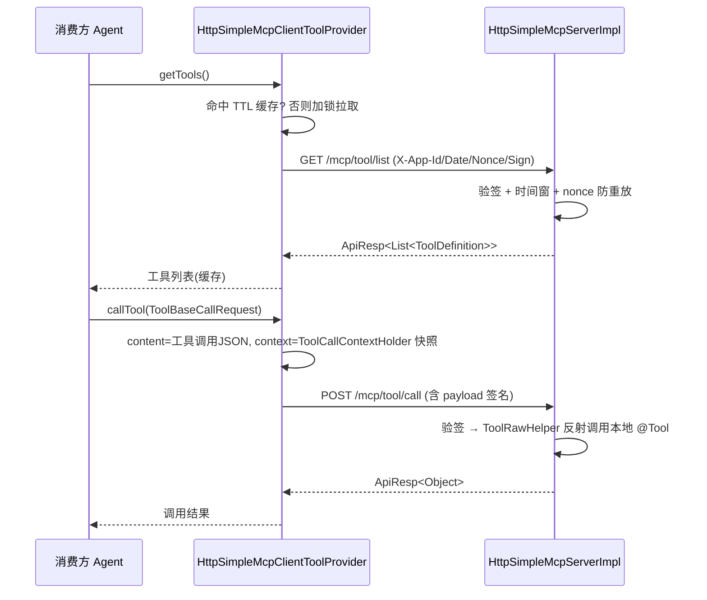

# i2f-ai-rest-openai

> `i2f-ai-std` 抽象契约的 OpenAI 兼容 HTTP 实现模块，基于 `i2f-network` 的 REST/HTTP 客户端，将标准对话、Embedding、Rerank、模型列表等接口对接到任何遵循 OpenAI `/v1` 协议的服务端（OpenAI、Ollama、One-API、SiliconFlow 等），并提供一套自研的、基于 HMAC-SHA256 签名的「Simple MCP」工具网关（含客户端与服务端契约），实现跨进程的远程工具（function-calling）暴露与调用；另以纯共享模型层对外提供**双版本**官方 MCP（JSON-RPC 2.0）协议契约——`official.v2024`（2024-11-05 有状态：`/v2024/mcp`、initialize 握手 + `Mcp-Session-Id`）与 `official.v2026`（2026-07-28 无状态：`/v2026/mcp`、server/discover + 镜像请求头 + `_meta`/`resultType`/`ttlMs`），供 mcp-server / mcp-client 的 stream 协议栈共同消费。

## 模块路径

- `i2f-jdk/i2f-ai-rest-openai`

## 模块依赖

| GroupId | ArtifactId | Scope | Optional | 说明 |
|---------|-----------|-------|----------|------|
| i2f.turbo | i2f-ai-std | compile | false | 待实现的抽象契约：`AiModel`、`RagEmbeddingModel`、`RagRerankModel`、`McpToolProvider`、消息模型与工具定义 |
| i2f.turbo | i2f-network | compile | false | HTTP/REST 传输层，`IRestClient`/`HttpProcessorRestClient`/`HttpUrlConnectProcessor`、`HttpRequest`/`HttpHeaders` |
| i2f.turbo | i2f-reflect | compile | false | `ReflectResolver.bean2map`，请求体转 Map 以便剔除空字段 |
| i2f.turbo | i2f-mutator | compile | false | `BaseMutator` 流式（fluent）构建基类，各实现与 DTO 普遍 `implements BaseMutator` |
| i2f.turbo | i2f-resp | compile | false | 统一响应体 `ApiResp`/`ApiCode`，MCP 网关请求/响应封装 |
| org.projectlombok | lombok | compile | false | 编译期代码生成（`@Data`、`@NoArgsConstructor`） |

> 传输与序列化全部构建在 `i2f-network` + `i2f-serialize`（`Json2Serializer`）之上，**不引入任何第三方 OpenAI SDK**；MCP 签名使用 JDK 标准 `javax.crypto.Mac`（`HmacSHA256`）。本模块是 `i2f-ai-std` 的一个具体落地实现（模型无关抽象 → OpenAI 协议）。

## 模块设计

### 分层结构

模块分为两大能力域：`openai`（对接 OpenAI 兼容协议的模型/向量实现）与 `mcp`（工具网关双协议栈：`simple` 自研 Simple MCP 客户端+服务端实现，`official` 官方 MCP 协议的纯共享模型层，按协议版本再拆为 `official.v2024`（有状态）与 `official.v2026`（无状态）两套，`official` 根仅留 `IJsonRpcDto` 供两版信封与结果模型统一实现 `toMap`）。


```mermaid
flowchart TD
    subgraph std["i2f-ai-std 抽象契约"]
        C1["AiModel"]
        C2["RagEmbeddingModel"]
        C3["RagRerankModel"]
        C4["McpToolProvider"]
    end
    subgraph impl["i2f-ai-rest-openai 实现"]
        direction TB
        subgraph openai["openai 域"]
            M1["HttpOpenAiAiModel<br/>(chat/completions)"]
            M2["HttpOpenAiModelStreamApi<br/>(SSE 流式)"]
            H["OpenAiMessageHelper<br/>(消息双向转换)"]
            R1["HttpOpenAiRagEmbeddingModel<br/>(/embeddings)"]
            R2["HttpOpenAiRagRerankModel<br/>(/rerank)"]
            A1["HttpOpenAiModelsApi<br/>(/models)"]
        end
        subgraph mcp["mcp 域"]
            MC["HttpSimpleMcpClientToolProvider<br/>(签名 + 工具缓存)"]
            MS["HttpSimpleMcpServerImpl<br/>(验签 + 工具枚举/调用)"]
            OF24["official.v2024 共享层<br/>(OfficialMcpConstants + JsonRpc* 有状态)"]
            OF26["official.v2026 共享层<br/>(OfficialMcpConstantsV2026 + *V2026 无状态)"]
            IJ["IJsonRpcDto<br/>(official 根 toMap 契约)"]
        end
    end
    subgraph net["i2f-network 传输"]
        N1["IRestClient / HttpProcessorRestClient"]
        N2["HttpUrlConnectProcessor (SSE)"]
    end
    C1 --> M1
    C2 --> R1
    C3 --> R2
    C4 --> MC
    M1 --> H
    M1 --> N1
    M2 --> N2
    R1 --> N1
    R2 --> N1
    A1 --> N1
    MC --> N1
    MC -. "HTTP + HMAC 签名" .-> MS
    MC -. "实现" .-> IJ
    OF24 -. "JSON-RPC 2.0 有状态契约" .-> SB24["springboot mcp-server / mcp-client official.v2024.stream"]
    OF26 -. "JSON-RPC 2.0 无状态契约" .-> SB26["springboot mcp-server / mcp-client official.v2026.stream"]
```

### 包结构

| 包 | 职责 | 关键类 |
|----|------|--------|
| `i2f.ai.rest.openai.model` | 对话模型实现与消息转换 | `HttpOpenAiAiModel`、`HttpOpenAiModelStreamApi`、`OpenAiMessageHelper` |
| `i2f.ai.rest.openai.model.data` | OpenAI 请求/响应体 DTO | `OpenAiCompletionReqDto`/`RespDto`、`OpenAi*Message`、`OpenAiToolCall`、`OpenAiConsts` |
| `i2f.ai.rest.openai.model.data.chunk` | 流式分片 DTO | `OpenAiCompletionChunkRespDto`、`OpenAiCompletionChoiceChunk` |
| `i2f.ai.rest.openai.metadata.model` | 模型元数据接口 | `HttpOpenAiModelsApi` + `OpenAiModelsRespDto`/`Item` |
| `i2f.ai.rest.openai.rag` | 向量化实现 | `HttpOpenAiRagEmbeddingModel` + `HttpOpenAiEmbeddingReqDto`/`RespDto` |
| `i2f.ai.rest.openai.rag.rerank` | 重排序实现 | `HttpOpenAiRagRerankModel` + `HttpOpenAiRerankReqDto`/`RespDto` |
| `i2f.ai.rest.mcp.simple` | Simple MCP 协议常量与载荷 | `HttpSimpleMcpConstants`、`McpCallPayloadDto` |
| `i2f.ai.rest.mcp.simple.client` | MCP 客户端（工具消费方） | `HttpSimpleMcpClientToolProvider` + `SimpleMcpToolListRespDto` |
| `i2f.ai.rest.mcp.simple.server` | MCP 服务端（工具提供方） | `HttpSimpleMcpServer`、`HttpSimpleMcpServerImpl`、`HttpSimpleMcpRequest`/`AppItem` |
| `i2f.ai.rest.mcp.official` | 官方 MCP 共享 `toMap` 契约 | `IJsonRpcDto`（`toMap()`，信封与结果模型统一实现，供序列化时摊平/剔空） |
| `i2f.ai.rest.mcp.official.v2024.consts` | 2024-11-05 有状态协议常量 | `OfficialMcpConstants`（`URL_BASE_PATH=/v2024`、`/mcp`、protocolVersion、initialize/tools 方法名、`Mcp-Session-Id`、-32600~-32603） |
| `i2f.ai.rest.mcp.official.v2024.data` | JSON-RPC 2.0 信封 | `JsonRpcRequest<T>`、`JsonRpcResponse<T>`（`implements IJsonRpcDto`，`success`/`error` 工厂 + `toMap`）、`JsonRpcError` |
| `i2f.ai.rest.mcp.official.v2024.data.result` | 有状态结果模型 | `JsonRpcInitialResult`、`JsonRpcToolListResult`/`Item`、`JsonRpcToolCallParam`（`IJsonRpcDto`）/`JsonRpcToolCallResult` |
| `i2f.ai.rest.mcp.official.v2026.consts` | 2026-07-28 无状态协议常量 | `OfficialMcpConstantsV2026`（`/v2026`、`server/discover`、`MCP-Protocol-Version`/`Mcp-Method`/`Mcp-Name`、`_meta` 键、`resultType`/`cacheScope`、协议保留码 -32020/-32021/-32022） |
| `i2f.ai.rest.mcp.official.v2026.data` | 无状态信封 | `JsonRpcResponseV2026<T>`、`JsonRpcErrorV2026`（含 `data` 字段），均 `implements IJsonRpcDto` |
| `i2f.ai.rest.mcp.official.v2026.data.result` | 无状态结果模型 | `JsonRpcServerDiscoverResult`、`JsonRpcServerInfo`、`JsonRpcToolListResultV2026`、`JsonRpcToolCallResultV2026` |

### 核心设计点

**1. 抽象契约的协议适配（Adapter）**
每个实现都 `implements` `i2f-ai-std` 的契约接口，把标准模型对象翻译为 OpenAI 协议请求。`HttpOpenAiAiModel.generate(AiRequest)` 是标准入口：读取 `AiRequest` 的 `toolMap` → 转 `OpenAiToolsDefinition`，`messageList` → 经 `OpenAiMessageHelper.toOpenAiMessages` 转换，POST 到 `{baseUrl}/chat/completions`，再取 `choices[0].message` 反向映射为 `AssistantMessage`。`baseUrl` 可指向任意 OpenAI 兼容端点，实现「一份接口，多后端」。

**2. 空字段剥离以适配 OpenAI 严格校验**
`completion`/`completionSse` 在序列化前用 `ReflectResolver.bean2map` 把请求转 Map，再遍历剔除 `null` 值、空 `Collection`、空 `Map` 的键。这是因为 OpenAI 标准协议对字段有强制校验（如 `stream`、`tools`、`stream_options` 为空时不能出现），从而在「对象模型统一填充」与「协议要求字段可选」之间取得平衡。

**3. 消息模型的双向多态映射**
`OpenAiMessageHelper` 在 `i2f-ai-std` 消息体系（`UserMessage`/`SystemMessage`/`AssistantMessage`/`ToolMessage`）与 OpenAI DTO（`OpenAiUserMessage`/`OpenAiSystemMessage`/`OpenAiAssistantMessage`/`OpenAiToolMessage`）之间做 `instanceof` 分派转换，并处理：
- `AssistantMessage.toolCallRequestList` ↔ `OpenAiToolCall`（含 `function.name/arguments`、`id`）
- 响应侧 `reasoning_content`（深度思考内容）→ `AssistantMessage.thinking`
- 依据是否存在 `tool_calls` 回填 `FinishReason`（`TOOL_CALL` / `STOP`），并把原始 DTO 存入 `rawMessage`/`rawRequest` 便于回溯
- `fromOpenAiAssistantMessage` 对 `OpenAiAssistantMessage`（发送态）与 `OpenAiAssistantMessageRespDto`（响应态）两种入参做了重载

**4. SSE 流式分片重组算法**
`HttpOpenAiModelStreamApi` 不走 REST 客户端，而用 `HttpUrlConnectProcessor` 直接读输入流：强制 `stream=true` + `stream_options.include_usage=true`，逐行解析 `data:` 前缀（`[DONE]` 终止），把每个分片增量合并回一个完整的 `OpenAiCompletionRespDto`：
- 文本/思考内容按字符串拼接（`merge`）
- `choices` 按 `index` 定位、`tool_calls` 按 `index` 定位并拼接 `arguments`
- `usage` 各 token 计数累加
- 通过 `Consumer<Reference<...>>` 回调下发，`Reference.finish()` 表示流结束

**5. Simple MCP —— HMAC 签名的跨进程工具网关**
自研一套轻量 MCP（区别于标准 JSON-RPC MCP），仅用两个 HTTP 端点（`/mcp/tool/list`、`/mcp/tool/call`）暴露/消费 `@Tool` 工具：


```mermaid
sequenceDiagram
    participant Agent as 消费方 Agent
    participant Client as HttpSimpleMcpClientToolProvider
    participant Server as HttpSimpleMcpServerImpl
    Agent->>Client: getTools()
    Client->>Client: 命中 TTL 缓存? 否则加锁拉取
    Client->>Server: GET /mcp/tool/list (X-App-Id/Date/Nonce/Sign)
    Server->>Server: 验签 + 时间窗 + nonce 防重放
    Server-->>Client: ApiResp<List<ToolDefinition>>
    Client-->>Agent: 工具列表(缓存)
    Agent->>Client: callTool(ToolBaseCallRequest)
    Client->>Client: content=工具调用JSON, context=ToolCallContextHolder 快照
    Client->>Server: POST /mcp/tool/call (含 payload 签名)
    Server->>Server: 验签 → ToolRawHelper 反射调用本地 @Tool
    Server-->>Client: ApiResp<Object>
    Client-->>Agent: 调用结果
```

签名载荷格式为 `appId#timestamp(16进制秒)#nonce[#content[#context]]`，`timestamp` 用 `Long.toString(now/1000, 16)`，签名头为 `X-App-Id / X-App-Date / X-App-Nonce / X-App-Sign`（`HmacSHA256`，Base64）。客户端 `getTools` 有默认 5 分钟 TTL 缓存（`System.currentTimeMillis() < expireTs` 判定）+ `AtomicBoolean/AtomicLong/ReentrantLock` 双检；服务端默认允许 30 分钟时间窗，`expireCache` 可选开启 nonce 防重放（验签通过后才写入，避免误杀重传的正常请求）。服务端与 Web 框架解耦：只接收由 `HttpHeaders` + `McpCallPayloadDto` 组装的 `HttpSimpleMcpRequest`，宿主控制器负责把 HTTP 请求转成该对象。

**6. Mutator 流式构建**
所有实现类与多数 DTO 都 `implements BaseMutator<T>` 并提供 `builder()`，配置项（`baseUrl`/`apiKey`/`model`/`restClient`/签名密钥等）既可用 `@Data` setter，也可 `builder().xxx().build()` 链式装配。

**7. 官方 MCP（Streamable HTTP）双版本共享协议模型层（`mcp.official`）**
面向官方 MCP 规范（底层 JSON-RPC 2.0）的**纯契约包**：仅含常量与 DTO，不含传输/运行期逻辑，与 Simple MCP 双栈并列。按协议版本拆为两套，`official` 根只保留 `IJsonRpcDto#toMap` 作为统一可摊平/剔空契约：

**`official.v2024`（2024-11-05 有状态）**
- `OfficialMcpConstants`：基础路径 `/v2024` + 单端点 `/mcp`（按请求体 `method` 路由 `initialize`/`tools/list`/`tools/call`）、信封版本 `2.0`、会话头 `Mcp-Session-Id`，以及严格沿用 JSON-RPC 2.0 预定义码的 `-32600/-32601/-32602/-32603`。
- 信封：`JsonRpcRequest<T>`、`JsonRpcResponse<T>`（`implements IJsonRpcDto`，`success`/`error` 静态工厂；`toMap` 仅在 `result`/`error` 非空时输出，且对 `IJsonRpcDto` 类型的 result 递归 `toMap`）、`JsonRpcError`（`code`+`message`）。`id` 均为 `String`。
- 结果模型：`JsonRpcInitialResult`（protocolVersion/capabilities/serverInfo）、`JsonRpcToolListResult`/`Item`（name/description/inputSchema）、`JsonRpcToolCallParam`（`IJsonRpcDto`，name/arguments）与 `JsonRpcToolCallResult`（content + `isError`：工具执行失败属业务结果，不上升为 JSON-RPC error；提供 `success`/`error`/`of` 工厂）。

**`official.v2026`（2026-07-28 无状态）**
- `OfficialMcpConstantsV2026`：基础路径 `/v2026` + `/mcp`，protocolVersion `2026-07-28` 与 `SUPPORTED_PROTOCOL_VERSIONS`；移除 `initialize`、新增 `server/discover`（服务端 MUST 宣告版本/能力/身份）；强制镜像请求头 `MCP-Protocol-Version`/`Mcp-Method`/`Mcp-Name`（与请求体一致，旧版 `Mcp-Session-Id`/`Last-Event-ID` 携带即忽略）；`_meta` 键前缀 `io.modelcontextprotocol/`（protocolVersion/clientInfo/clientCapabilities/serverInfo/logLevel）；`resultType`（`complete`/`input_required`）与 `cacheScope`（`public`/`private`）；除 JSON-RPC 预定义码外新增 MCP 规范保留协议码 `-32020`（头不一致）/`-32021`（缺客户端能力）/`-32022`（不支持的协议版本）。
- 信封：`JsonRpcResponseV2026<T>`（`toMap` 仅输出 result/error 其一）、`JsonRpcErrorV2026`（新增可选 `data` 字段，用于 `UnsupportedProtocolVersionError` 回带 `supported`/`requested`）。
- 结果模型：`JsonRpcServerDiscoverResult`（resultType/supportedVersions/capabilities/`_meta`/instructions/ttlMs/cacheScope）、`JsonRpcServerInfo`（name/version）、`JsonRpcToolListResultV2026`（tools + resultType/ttlMs/cacheScope/`_meta`，tools 条目复用 v2024 的 `JsonRpcToolListItem`）、`JsonRpcToolCallResultV2026`（content + isError + resultType + `_meta`，`of` 默认 `resultType=complete`）。各 result 模型均 `implements IJsonRpcDto`。
- 消费方：`i2f-springboot-ai-mcp-server` / `i2f-springboot-ai-mcp-client` 的 `official.v2024.stream` 与 `official.v2026.stream` 协议栈分别同源消费本包对应版本；官方协议栈不复用带 HMAC 语义的 `HttpSimpleMcpServer`。

## 模块目的

- 为模型无关的 `i2f-ai-std` 抽象提供一个**零第三方 SDK**、可直接对接 OpenAI 兼容生态的运行期实现。
- 用 HTTP + 签名协议打通跨进程/跨服务的工具（function-calling）共享，让一个进程里的 Agent 能发现并调用另一进程暴露的 `@Tool`。
- 屏蔽 OpenAI 协议的细节坑（严格字段校验、SSE 分片、tool_calls 增量、深度思考 `reasoning_content`），对上层保持稳定的对象模型。
- 以共享协议模型层统一官方 MCP 服务端/客户端两端的 JSON-RPC 信封、结果与预定义错误码语义，避免双端各自平行定义发散。

## 模块功能

| 分类 | 入口类 / 方法 | 对接端点 | 说明 |
|------|--------------|----------|------|
| 对话补全 | `HttpOpenAiAiModel.generate(AiRequest)` | `POST {base}/chat/completions` | 非流式，返回 `AssistantMessage`（含 tool_calls/thinking） |
| 对话补全（底层） | `HttpOpenAiAiModel.completion(OpenAiCompletionReqDto)` | 同上 | 直接收发 OpenAI 原生 DTO |
| 流式对话 | `HttpOpenAiModelStreamApi.completion(...)` / `completionSse(...)` | `POST {base}/chat/completions` (`stream=true`) | SSE 分片增量合并 |
| 向量化 | `HttpOpenAiRagEmbeddingModel.embedAsVector / embedAllAsVector` | `POST {base}/embeddings` | 按 `index` 排序回填，缺失抛异常 |
| 重排序 | `HttpOpenAiRagRerankModel.rerank(question, contents, topN)` | `POST {base}/rerank` | 兼容 SiliconFlow/类 Cohere rerank |
| 模型列表 | `HttpOpenAiModelsApi.models()` | `GET {base}/models` | 列举可用模型 |
| MCP 客户端 | `HttpSimpleMcpClientToolProvider.getTools / support / callTool` | `GET /mcp/tool/list`、`POST /mcp/tool/call` | 签名 + TTL 缓存 + 上下文透传 |
| MCP 服务端 | `HttpSimpleMcpServerImpl.getTools / callTool` | — | 验签 + 枚举/反射调用本地工具 |
| 官方 MCP 协议模型 | `OfficialMcpConstants`/`OfficialMcpConstantsV2026` + `JsonRpc*` DTO | `POST {base}/v2024/mcp`、`POST {base}/v2026/mcp`（由上层 starter 装配） | 双版本 JSON-RPC 2.0 信封、结果模型与预定义/协议保留错误码；v2024 initialize/tools，v2026 server/discover + 镜像头 + `_meta`/`resultType`/`ttlMs` |

## 模块主要使用方法

**1. 配置对话模型并接入 Agent（`i2f-ai-std`）**

```java
HttpOpenAiAiModel model = HttpOpenAiAiModel.builder()
        .baseUrl("https://api.openai.com/v1")   // 也可以是 http://localhost:11434/v1 (Ollama)
        .apiKey("sk-xxxx")
        .model("gpt-4o-mini")
        .build();
// model 即 i2f.ai.std.model.AiModel，可交给 AiAgent / @AiService 使用
```

**2. 流式对话**

```java
HttpOpenAiModelStreamApi stream = HttpOpenAiModelStreamApi.builder()
        .baseUrl("https://api.openai.com/v1").apiKey("sk-xxxx").model("gpt-4o-mini")
        .build();
OpenAiCompletionReqDto req = new OpenAiCompletionReqDto();
req.setModel("gpt-4o-mini");
req.setMessages(OpenAiMessageHelper.toOpenAiMessages(Collections.singletonList(new UserMessage("你好"))));
// 方式一：拿合并后的完整响应
OpenAiCompletionRespDto full = stream.completion(req);
// 方式二：边收边处理
stream.completionSse(req, ref -> {
    if (ref.isValue()) { /* 处理 OpenAiCompletionChunkRespDto */ }
});
```

**3. Embedding / Rerank**

```java
RagEmbeddingModel embedding = HttpOpenAiRagEmbeddingModel.builder()
        .baseUrl("http://localhost:11434/v1").model("qwen3-embedding:0.6b").apiKey("xxx")
        .build();
List<RagVector> vectors = embedding.embedAllAsVector(Arrays.asList("我喜欢吃", "你喜欢玩"));

List<RagRerankDocument> ranked = HttpOpenAiRagRerankModel.builder()
        .baseUrl(baseUrl).model("rerank-model").apiKey("xxx")
        .build().rerank("问题", candidateTexts, 3);
```

**4. Simple MCP —— 提供方（被远程调用的服务）**

```java
HttpSimpleMcpServerImpl server = new HttpSimpleMcpServerImpl().toMutator()
        .set(s -> s::setContext, myApplicationContext)          // i2f context，含 @Tool Bean
        .set(s -> s::setInvocationHandler, myProxyHandler)
        .set(s -> s::setAppList, new CopyOnWriteArrayList<>(
                Collections.singletonList(appItem("app-1", "secret-key"))))
        .set(s -> s::setExpireCache, optionalNonceCache)         // 可选：开启 nonce 防重放
        .done();
// 宿主控制器接收 HTTP，组装 HttpSimpleMcpRequest(headers, payloadDto) 后：
ApiResp<List<ToolDefinition>> list = server.getTools(mcpRequest);
ApiResp<?> result = server.callTool(toolCallRequest, mcpRequest);
```

**5. Simple MCP —— 消费方（把远程工具挂进本地 Agent）**

```java
McpToolProvider remote = HttpSimpleMcpClientToolProvider.builder()
        .baseUrl("http://remote-host")   // 最终访问 http://remote-host/mcp/tool/list
        .appId("app-1").appKey("secret-key")
        .name("remote-tools").description("远端工具集")
        .expireTtl(TimeUnit.MINUTES.toMillis(5))
        .build();
// remote 即 i2f.ai.std.mcp.McpToolProvider，注册进 Agent 后可被 function-calling 调用
```

**注意事项**
- 各实现**不做**连接池、重试、限流；生产环境可在 `restClient`/`httpProcessor` 层替换底层实现。
- `getChatCompletionsUrl` 等直接拼接 `/chat/completions`、`/embeddings`、`/rerank`、`/models`，`baseUrl` 需包含版本前缀（通常以 `/v1` 结尾），末尾斜杠会被自动去除。
- `apiKey` 为空时不下发 `Authorization` 头（适配无需鉴权的本地服务如 Ollama）。
- 流式 `completion` 通过字符串拼接与按 `index` 合并重组，若服务端乱序/缺 `index` 的分片可能导致合并偏差。
- MCP 客户端与服务端必须使用**相同的 `hmacName`（默认 HmacSHA256）与 `appKey`**；服务端默认时间窗 30 分钟，客户端与服务器需时钟基本同步；`expireCache` 未配置时不校验 nonce 重放。
- MCP 的 `context` 字段透传 `ToolCallContextHolder.copyOf()` 快照（序列化后参与签名），用于跨进程传递调用上下文。

## 模块特性总结

- **OpenAI 协议兼容**：对话、Embedding、Rerank、Models 四类端点，`baseUrl` 可切换到 OpenAI/Ollama/One-API/SiliconFlow 等任意兼容服务。
- **零第三方 SDK**：完全基于 `i2f-network`（`HttpURLConnection`/REST）+ `i2f-serialize`（`Json2Serializer`），无官方 SDK 依赖。
- **实现 `i2f-ai-std` 契约**：`AiModel`/`RagEmbeddingModel`/`RagRerankModel`/`McpToolProvider`，可无缝注入 `AiAgent` 与 `@AiService`。
- **消息双向多态映射**：统一处理 4 类角色、`tool_calls`、深度思考 `reasoning_content`、原始报文回填。
- **协议坑规避**：反射剥离空字段满足 OpenAI 严格校验；SSE 分片按 index 增量合并含 usage 累加。
- **自研 Simple MCP 网关**：HMAC-SHA256 签名 + 时间窗 + nonce 防重放 + 工具列表 TTL 缓存 + 上下文透传，客户端/服务端成对提供，跨 Web 框架解耦。
- **官方 MCP 双版本共享契约**：`mcp.official` 拆为 `v2024`（有状态 2024-11-05：`/v2024/mcp`、initialize + `Mcp-Session-Id` + JSON-RPC 2.0 信封与 -32600~-32603）与 `v2026`（无状态 2026-07-28：`/v2026/mcp`、server/discover + `MCP-Protocol-Version`/`Mcp-Method`/`Mcp-Name` 镜像头 + `_meta`/`resultType`/`ttlMs`/`cacheScope` + 协议保留码 -32020/-32021/-32022），根级 `IJsonRpcDto#toMap` 统一剔空/摊平，供 mcp-server/mcp-client 两端 stream 协议栈同源消费，与 Simple MCP 多栈并列。
- **流式可组合**：`BaseMutator` 链式构建，底层传输组件（`IRestClient`/`IHttpProcessor`/`IJsonSerializer`）均可替换。

## 模块瑕疵或错误

> 以下为静态识别的潜在问题，未作运行期实证。

> 注：旧版记录的【高危】缺陷「`callTool` 未验签」已修复，见下第 1 条。

1. **~~【高危】`HttpSimpleMcpServerImpl.callTool` 未验签~~（已修复）**：`callTool` 入口已补调 `assertValidMcpRequest(mcpRequest)`，与 `getTools` 对称——appId 校验 → 时间窗 → nonce 防重放 → HMAC-SHA256 比对全部生效，`/mcp/tool/call` 不再可被未签名请求直接触发工具执行。
2. **`getTools`/`callTool` 异常回显 `e.printStackTrace()`**：服务端两方法 catch 块用 `e.printStackTrace()` 而非日志框架，堆栈直进标准错误，不利于统一日志采集与级别控制。
3. **`isError` 的 JavaBean 键名风险**：v2024 `JsonRpcToolCallResult` 与 v2026 `JsonRpcToolCallResultV2026` 的 `isError` 为 `boolean` + `@Data`，按命名推断属性名为 `error`，序列化键名是否保留 `isError` 取决于序列化器字段策略（v2026 因提供 `toMap` 显式写 `isError` 可缓解，v2024 无 `toMap` 仍依赖 Jackson）；且该字段声明为 `private`（v2024），同类其余字段均 `protected`，风格不一致。
4. **剔空依赖调用方是否走 `toMap`**：`JsonRpcResponse`/`JsonRpcResponseV2026` 靠 `toMap` 实现 result/error 互斥剔空，但若上层直接以 Jackson 序列化对象字段而非先转 `toMap`，仍会同时输出 `result=null` 与 `error=null`，与 JSON-RPC 2.0「二者必居其一」不符；openai 域用 `bean2map` 剔空、此处无同等兼容。
5. **`IJsonRpcDto` 实现不一致（v2024）**：`JsonRpcResponse`/`JsonRpcToolCallParam` 实现了 `IJsonRpcDto`，而 `JsonRpcInitialResult`/`JsonRpcToolListResult`/`JsonRpcToolListItem`/`JsonRpcToolCallResult` 均为普通类无 `toMap`，导致 `JsonRpcResponse.toMap` 的递归剔空对这些 result 内部 null 字段（如 `capabilities=null`）无效；v2026 侧所有 result 模型均已实现 `IJsonRpcDto`。
6. **v2024 `JsonRpcError` 无 `data` 字段**：v2026 已补 `data`，但 v2024 错误对象仍无法携带附加信息（与规范可选字段不齐）。
7. **两版 error 工厂签名不一致**：`JsonRpcResponse.error` 返回 `JsonRpcResponse<?>`（通配符不便赋值），`JsonRpcResponseV2026.error` 保留泛型 `<T>` 且多一个带 `data` 的重载，跨版本使用体验不一致。
8. **`JsonRpcToolListResultV2026` 跨版本耦合**：v2026 的 tools 条目复用 v2024 包的 `JsonRpcToolListItem`，两版本应隔离，v2024 契约变更会波及 v2026。
9. **`protocolVersion` 协商能力有限**：v2024 仅单一常量 `2024-11-05`；v2026 虽有 `SUPPORTED_PROTOCOL_VERSIONS` 但仅含自身一个元素，高版本降级回退仍完全依赖上层实现。
10. **`capabilities`/`serverInfo`/`inputSchema`/`arguments` 及 v2026 `capabilities`/`_meta` 均为裸 `Map<String,Object>`**，无结构校验，键名拼写错误只能在运行期由对端暴露。
11. **官方协议包无任何单测**（全模块仅 `TestEmbedding` 一个测试类），信封语义、`toMap` 剔空与错误码常量无回归锁定。
