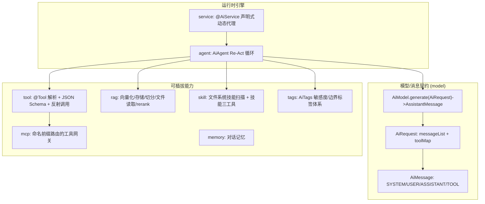
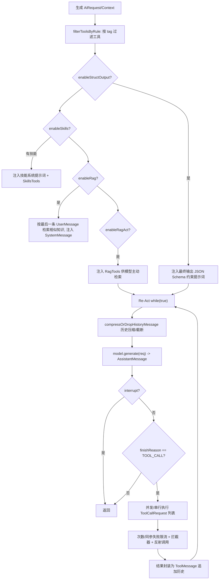

# i2f-ai-std

> AI 能力标准抽象（SPI）模块，仅依赖 JDK8 与 i2f 内部基础模块，定义大模型对话、消息模型、工具（function-calling）、RAG 检索增强、技能（Skill）、MCP 工具网关、对话记忆与 Re-Act Agent 引擎，并提供声明式 `@AiService` 动态代理，将「接口 + 注解」自动翻译为一次完整的 Agent 调用。它是一套「模型无关」的接口契约与运行时骨架，具体模型/向量库由实现方（如 `i2f-extension-ai-*`）落地。

## 模块路径

- `i2f-jdk/i2f-ai-std`

## 模块依赖

| GroupId | ArtifactId | Scope | Optional | 说明 |
|---------|-----------|-------|----------|------|
| i2f.turbo | i2f-typeof | compile | false | 类型系统，用于返回类型判定、泛型解析、基础类型识别 |
| i2f.turbo | i2f-mutator | compile | false | 提供 `BaseMutator` 流式（fluent）构建基类，模块内模型/上下文普遍实现 |
| i2f.turbo | i2f-context-impl | compile | false | `INamingContext`/`IContext` 命名上下文，`@AiService` 据此按名称/类型解析 Agent 与 Tool Bean |
| i2f.turbo | i2f-io-stream | compile | false | 流工具，技能文件、RAG 文档读取 |
| i2f.turbo | i2f-io-file | compile | false | 文件工具，RAG/技能目录扫描 |
| i2f.turbo | i2f-resources | compile | false | 类路径资源读取，技能资源定位 |
| i2f.turbo | i2f-os | compile | false | 操作系统能力，`run_skill_script`/命令式 RAG 文件阅读器（Pandoc/Markitdown/OCR）执行外部命令 |
| i2f.turbo | i2f-serialize-std | compile | false | JSON 序列化标准接口 `IJsonSerializer`，用于参数/结果的结构化收发与结构化输出 |
| i2f.turbo | i2f-proxy | compile | false | 动态代理与 `IProxyInvocationHandler`/`IInvokable`，`@AiService` 代理与工具调用拦截的基础 |
| org.projectlombok | lombok | compile | false | 编译期代码生成（`@Data`、`@NoArgsConstructor`） |

> 本模块**不引入任何第三方 AI/大模型 SDK**，是一层纯粹的运行时契约与算法骨架；构建期通过 `maven-assembly-plugin` 可打包聚合。`RegexUtil`（i2f-match）、`Visitor`（i2f-reflect）、`RichConverter`/`ObjectConvertor`（i2f-convert）等在代码中被使用的能力均由上述内部模块传递依赖提供。

## 模块设计

### 分层与包结构

模块按「模型无关抽象 + 运行时引擎 + 能力扩展」组织，包之间自底向上依赖：



| 包 | 职责 |
|----|------|
| `i2f.ai.std`（根） | 极简函数式接口：`ChatAi`/`RoleChatAi`（`chat(...)`）与 `*Provider`（`name()`+`getChatAi()`），提供「一句话对话」的最小契约 |
| `model` | `AiModel`（模型契约）、`AiRequest`（消息+工具请求体）、`message`（`AiMessage` 及 `User/System/Assistant/Tool` 四种实现、`tool/ToolCallRequest`） |
| `agent` | `AiAgent`（Re-Act 引擎）、`AiAgentContext`（运行配置与 `InheritableThreadLocal` 上下文）、`AiAgentResponse` |
| `tool` | `@Tool/@ToolParam` 注解、`ToolRawHelper`（解析/调用）、`schema`（`JsonSchema`/`JsonSchemaAnnotationResolver`/`FunctionJsonSchema`）、`definition`、`impl`（App 工具管理器）、`intent`（工具意图）、`ToolCallContextHolder`（线程态） |
| `rag` | `RagWorker`（编排 embed+store+similar+rerank）、`RagEmbeddingModel`/`RagEmbeddingStore`/`RagVector`、`RagTextSplitter`、`RagFileReader`（文本/Pandoc/Markitdown/EasyOCR/PDF-OCR）、`RagHelper`、`rerank` |
| `skill` | `SkillDefinition`、`SkillsHelper`（扫描 `./skills` 与解析 SKILL.md、生成技能系统提示词、安全资源路径）、`SkillsTools`（`get_skill_document`/`get_skill_resource`/`run_skill_script`） |
| `mcp` | `McpToolProvider` 契约、`gateway`（`AbstractMcpToolGatewayManager` 按 `provider.tool` 前缀路由）、`impl`（App 级 provider） |
| `memory` | `AiChatMemory`（按 `conversationId` 存取）、`InMemoryAiChatMemory` |
| `service` | `annotations`（`@AiService/@AiAgents/@AiSystem/@AiUser/@AiTools/@AiSkills/@AiParam`）、`proxy`（`AiServiceDynamicProxyHandler`、`AiServices`）、`test` 示例 |
| `tags` | `AiTags` 枚举（只读/可写/敏感/联网/成本等标签）与 `AiTagValues` |

### 核心设计点

**1. Re-Act 循环引擎（`AiAgent.generate`）**

`AiAgent` 是与模型无关的推理-行动（Reason + Act）循环，前置装配 → 循环调模 → 并发执行工具：



- **上下文传递**：进入循环前 `AiAgentContext.CONTEXT.set(context)`（`InheritableThreadLocal`），使 `@Tool` 方法内部可读取角色、权限、`sharedContext` 等绑定信息，`finally` 中 `remove()` 防泄漏。
- **工具并发**：`enableParallelToolCall` 为真时用 `ForkJoinPool`（默认 `availableProcessors*2`）提交，`CountDownLatch` 汇合；`ToolMessage` 收集用 `CopyOnWriteArrayList`。
- **多级限流防死循环**：`maxAllToolCallCount`（总次数）、`maxSingleToolCallCount`（单工具次数）、`maxSingleToolSameArgumentFailureCount`（同参数连续失败）三重 `AtomicInteger` 熔断，超限以错误 `ToolMessage` 回喂模型。
- **历史窗口管理**：`compressHistoryMessage` 达到阈值时调模型「总结上述对话内容」压缩，`maxKeepMessageCount`/`keepFirstUserMessage` 控制截断，兼顾长对话与 token 成本。

**2. 声明式 `@AiService` 动态代理（`AiServiceDynamicProxyHandler`）**

参照 LangChain4j「AiServices」范式，把普通 Java 接口方法翻译成一次 Agent 调用：

- **default 方法穿透**：`method.isDefault()` 的默认方法不拦截，通过 `MethodHandlesUtil` 拿到 `MethodHandle` 绑定 `proxy` 调用（避免 `Method.invoke` 自递归栈溢出），从而允许接口用 `@Tool` 标注 default 方法充当 function-calling 工具（见 `SampleAiService.cancelOrder`）。
- **Agent 三级查找**：方法参数中的 `AiAgent` > 方法/类上的 `@AiAgents`（按 name 或 clazz 从 `INamingContext` 取）> 上下文默认 `AiAgent`。
- **提示词装配**：`@AiSystem`/`@AiUser` 支持 `format()`，用 `${expr}` + `Visitor.visit` 对参数 Map 做模板求值填充；未被特殊消费的参数自动序列化为「arg list」附加到 user 提示词。
- **工具/技能聚合**：类上 → 方法上 → 被代理对象自身，逐级 `ToolRawHelper.parseTools` 合并（后注册覆盖先注册）；`@AiTools`/`@AiSkills` 的 `tags` 汇入 `includeToolTags`/`includeSkillTags` 供上下文过滤。
- **返回类型自适应**：按返回类型判定是否结构化输出——`CharSequence` 取 `last().text()`、`AiMessage` 取 `last()`、`AiAgentResponse`/`Object`/`Void` 原样返回、其余类型注入 JSON Schema 后反序列化为 POJO。

**3. 工具即函数（`tool` 包）**

- `ToolRawHelper.parseTools(resolver, bean)` 反射枚举 `@Tool` 方法，借助 `JsonSchema.getFunctionJsonSchema` 把方法签名转成 OpenAI function 风格的 `{name, description, strict, parameters}` schema；`invokeTool` 反向把模型给的 JSON 参数按形参类型做智能转换（日期解析、`RichConverter` POJO 转换、`ObjectConvertor` 兜底）后反射调用。
- `JsonSchemaAnnotationResolver` 是注解解析的策略点，使 `@Tool`/`@ToolParam` 的读取可被替换（默认实现读取本模块注解）。
- `ToolCallContextHolder` 提供带 `ReentrantReadWriteLock` 的 `InheritableThreadLocal` 态容器，供工具执行期共享变量。
- `intent` 子包（`ToolIntent`/`ReadonlyToolIntent`）表达工具的读写意图，`AiTags` 的 `READONLY/WRITABLE/EXECUTABLE` 等标签与之配合，实现按安全边界过滤。

**4. 标签化过滤链（tag-based filtering）**

`AiAgentContext` 维护 `toolTagsFilterChain`/`skillTagsFilterChain`（`List<Predicate<Set<String>>>`），`AiAgent` 在装配阶段对工具/技能按标签集求交过滤，`hasAnyTagsFilter` 提供「需求标签任一命中」语义，实现「同一 Agent 面向不同角色/环境暴露不同工具集」。

**5. RAG 与 Skill 的可插拔策略**

- RAG：`RagWorker` 编排 `RagEmbeddingModel`（向量化）+ `RagEmbeddingStore`（存储/相似度，含 `InMemoryRagEmbeddingStore`、`BucketRagEmbeddingStore`）+ 可选 `RagRerankModel`；文档入口 `RagHelper.loadDocuments` 递归目录，`RagFileReader` 策略族覆盖文本、Pandoc、Markitdown、EasyOCR、PDF-OCR，`SimpleRecursiveRagTextSplitter` 递归切分。RAG 既可被动注入（`enableRag`）也可作为工具供模型主动检索（`enableRagAct`）。
- Skill：`SkillsHelper.scanFileSystemSkills` 启动时扫描 `./skills/*/SKILL.md`（支持 `SKILL.md/skill.md/index.md/README.md`），解析 `name/description/tags/version/author` front-matter；运行时通过 `SkillsTools` 的三个受控工具按需读取文档/资源/执行脚本，并以 `safeSkillResourcePath` 做目录穿越防护。

**6. MCP 网关的前缀路由（`AbstractMcpToolGatewayManager`）**

聚合多个 `McpToolProvider`，将每个 provider 的工具名加 `provider.` 前缀暴露（`McpNameDelegateToolDefinition` 委托），调用时按前缀 `unwrapPrefixName` 反解并委托给对应 provider（`McpNameDelegateToolBaseCallRequest`），从而在单一工具命名空间下隔离多个 MCP 服务来源。

## 模块目的

- 以**模型无关**的接口契约屏蔽不同大模型/向量库差异，让上层业务只依赖标准抽象。
- 沉淀一套**开箱即用的 Agent 运行时骨架**：Re-Act 循环、工具调用、限流熔断、历史压缩、上下文传递，无需绑定任何具体厂商 SDK。
- 用**声明式注解 + 动态代理**把「写接口」降为「配提示词/工具/技能」，最大化减少样板代码。
- 统一 **Tool / RAG / Skill / MCP / Memory / Tag** 六大 AI 应用能力的抽象，供 `i2f-extension-ai-*`、`i2f-spring-ai` 等实现与集成模块复用。

## 模块功能

| 能力 | 入口 | 说明 |
|------|------|------|
| 一句话对话契约 | `ChatAi` / `RoleChatAi` + `*Provider` | 最小函数式接口，供轻量场景 |
| 模型调用契约 | `AiModel.generate(AiRequest)` | 返回 `AssistantMessage`，含 `text/thinking/finishReason/toolCallRequestList` |
| 请求体构建 | `AiRequest` | `user/system/tool/tools` 流式装配消息与工具 |
| Re-Act Agent 引擎 | `AiAgent.generate(...)` | 推理-行动循环、并发工具执行、限流、历史压缩、结构化输出 |
| 运行时配置 | `AiAgentContext` | 开关（skills/rag/ragAct/structOutput）、标签过滤链、各类阈值、`sharedContext`、拦截器 |
| 工具解析与调用 | `ToolRawHelper` + `@Tool`/`@ToolParam` | 反射转 JSON Schema、参数智能转换、拦截式调用 |
| 声明式服务 | `@AiService` + `AiServices.create()` | 接口方法→Agent 调用，default 方法即工具 |
| 检索增强 RAG | `RagWorker` + `RagHelper` | 向量化、存储、相似检索、rerank、多格式文档加载 |
| 技能系统 | `SkillsHelper` + `SkillsTools` | 文件系统技能扫描、技能文档/资源/脚本三工具 |
| MCP 工具网关 | `McpToolProvider` + `AbstractMcpToolGatewayManager` | 前缀路由聚合多来源工具 |
| 对话记忆 | `AiChatMemory`（`InMemoryAiChatMemory`） | 按 `conversationId` 存取消息 |
| 安全/边界标签 | `AiTags` | 只读/可写/敏感/联网/成本等，配合过滤链 |

## 模块主要使用方法

**1. 直接驱动 Agent（命令式）**

```java
AiAgent agent = new AiAgent()
        .model(yourAiModel)          // 实现 AiModel 接入具体大模型
        .jsonSerializer(yourJson);   // 实现 IJsonSerializer

AiAgentResponse resp = agent.generate("你好，帮我查一下今天的日期");
System.out.println(resp.last().text());
```

**2. 注册工具（function-calling）**

```java
public class UserTools {
    @Tool(description = "根据用户 id 查询昵称")
    public String nickName(@ToolParam(description = "用户 id") String userId) {
        return "ice-" + userId;
    }
}

AiRequest req = new AiRequest()
        .user("id 为 1001 的用户昵称是什么？")
        .tools(ToolRawHelper.parseTools(JsonSchemaAnnotationResolver.INSTANCE, new UserTools()));

AiAgentResponse resp = agent.generate(req, new AiAgentContext().enableSkills(false));
```

**3. 声明式 `@AiService`（推荐）**

```java
@AiService(agent = {@AiAgents(clazz = AiAgent.class)}, tools = {@AiTools(value = {"datetimeTools"})})
public interface SampleAiService {
    @AiSystem("根据要求对订单进行处理")
    @AiTools(value = {"userTools"})
    String orderProcess(@AiUser String question,
                        @AiParam(value = "orderId", description = "订单号") String orderId);

    // default 方法自动成为一个可被模型调用的工具
    @Tool(description = "撤销订单")
    default String cancelOrder(@ToolParam(description = "订单号") String orderId) {
        return "撤销成功";
    }
}

INamingContext ctx = new ListableNamingContext();
ctx.addBean("aiAgent", new AiAgent().model(yourAiModel).jsonSerializer(yourJson));
SampleAiService service = AiServices.create(SampleAiService.class, new AiServiceDynamicProxyHandler(ctx));
String ret = service.orderProcess("撤销该订单", "1001");
```

**4. RAG 知识库**

```java
RagWorker worker = new RagWorker(embeddingModel, new InMemoryRagEmbeddingStore());
worker.loadDefaultDocuments();                 // 从 ./rags 递归加载并切分入库
AiAgent agent = new AiAgent().model(m).jsonSerializer(j).ragWorker(worker);
// context.enableRag(true) 被动注入 / enableRagAct(true) 作为工具主动检索
```

**5. 结构化输出**

```java
OrderVo vo = aiService.detectOrder("解析这条订单文本"); // 返回非字符串类型时自动注入 JSON Schema 并反序列化
```

### 注意事项

- 本模块是**抽象层**，`AiModel`/`IJsonSerializer`/`RagEmbeddingModel`/`RagEmbeddingStore` 均需外部提供实现，单独引入无法直接对话。
- `AiAgentContext.CONTEXT` 与 `ToolCallContextHolder` 均为 `InheritableThreadLocal`：并行工具执行时子线程可继承，但**线程池复用**场景需在任务结束后清理，避免上下文串味。
- 工具限流阈值默认较保守（总 100、单工具 10、同参失败 2），命中上限会以错误 `ToolMessage` 回喂模型而非抛异常。
- `@AiService` 的结构化输出仅对**非** `CharSequence/AiMessage/AiAgentResponse/Object/Void` 返回类型启用，会向模型注入「最终输出约束」提示词并要求严格 JSON。
- 技能默认从工作目录 `./skills` 扫描、命令式文件阅读器（Pandoc/Markitdown/OCR）依赖本机安装对应可执行程序。

## 模块特性总结

- **模型无关**：不绑定任何厂商 SDK，`AiModel`/序列化/向量库全部可插拔。
- **完整 Agent 运行时**：Re-Act 循环 + 并发工具 + 三级限流熔断 + 历史压缩 + 上下文透传。
- **双使用范式**：命令式 `AiAgent` 与声明式 `@AiService` 动态代理并存。
- **六能力一体化**：Tool、RAG（被动/主动）、Skill、MCP 网关、Memory、Tag 安全标签统一抽象。
- **注解驱动**：`@Tool/@ToolParam/@AiSystem/@AiUser/@AiTools/@AiSkills/@AiParam` 全面覆盖，default 方法即可当工具。
- **函数 Schema 自动派生**：方法签名自动转 OpenAI function 风格 JSON Schema，含枚举/日期格式/嵌套 POJO。
- **流式构建风格**：模型、上下文、请求、响应普遍实现 `BaseMutator`，链式装配一致。
- **零三方依赖**：仅依赖 i2f 内部基础模块，符合 `i2f-jdk` 分层定位。
