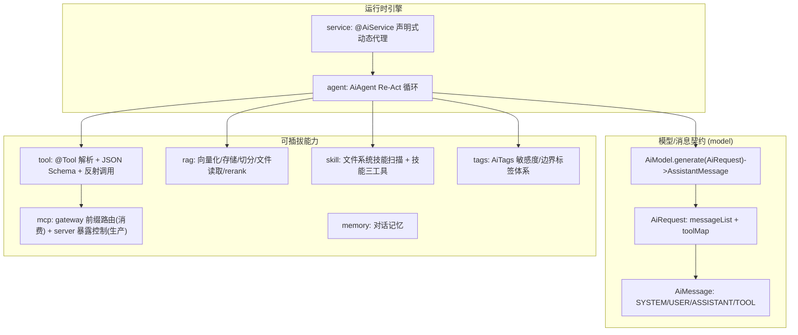
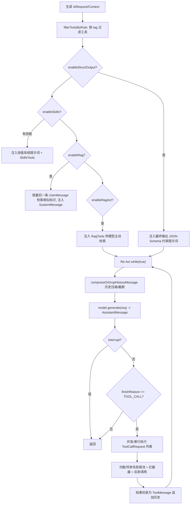
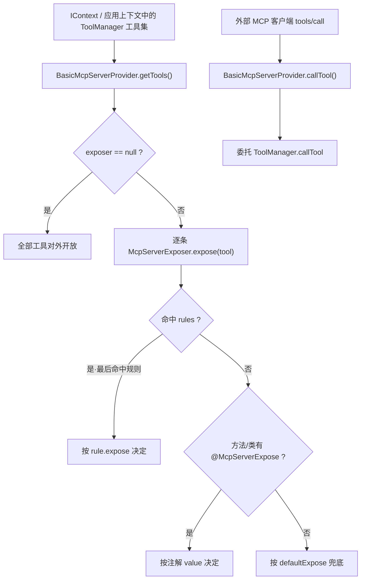

# i2f-ai-std

> AI 能力标准抽象（SPI）模块，仅依赖 JDK8 与 i2f 内部基础模块，定义大模型对话、消息模型、工具（function-calling）、RAG
> 检索增强、技能（Skill）、MCP 工具网关（消费侧前缀路由）与 MCP 服务端暴露（生产侧把本应用工具按规则/注解选择性地开放为 MCP
> 工具）、对话记忆与 Re-Act Agent 引擎，并提供声明式 `@AiService` 动态代理，将「接口 + 注解」自动翻译为一次完整的 Agent
> 调用。它是一套「模型无关」的接口契约与运行时骨架，具体模型/向量库由实现方（如 `i2f-extension-ai-*`）落地，MCP
> 协议报文由下游（如 `i2f-ai-rest-openai`、`i2f-springboot-ai-mcp-server`）落地。

## 模块路径

- `i2f-jdk/i2f-ai-std`

## 模块依赖

| GroupId | ArtifactId | Scope | Optional | 说明 |
|---------|-----------|-------|----------|------|
| i2f.turbo | i2f-typeof | compile | false | 类型系统，用于返回类型判定、泛型解析、基础类型识别 |
| i2f.turbo | i2f-mutator | compile | false | 提供 `BaseMutator` 流式（fluent）构建基类，模块内模型/上下文普遍实现 |
| i2f.turbo | i2f-context-impl | compile | false | `INamingContext`/`IContext` 命名上下文，`@AiService` 据此按名称/类型解析 Agent 与 Tool Bean |
| i2f.turbo | i2f-io-stream | compile | false | 流工具，技能文件、RAG 文档读取 |
| i2f.turbo | i2f-io-file | compile | false | 文件工具，RAG/技能目录扫描 |
| i2f.turbo | i2f-resources | compile | false | 类路径资源读取，技能资源定位 |
| i2f.turbo | i2f-os | compile | false | 操作系统能力，`run_skill_script`/命令式 RAG 文件阅读器（Pandoc/Markitdown/OCR）执行外部命令 |
| i2f.turbo | i2f-serialize-std | compile | false | JSON 序列化标准接口 `IJsonSerializer`，用于参数/结果的结构化收发与结构化输出 |
| i2f.turbo | i2f-proxy | compile | false | 动态代理与 `IProxyInvocationHandler`/`IInvokable`，`@AiService` 代理与工具调用拦截的基础 |
| org.projectlombok | lombok | compile | false | 编译期代码生成（`@Data`、`@NoArgsConstructor`） |

> 本模块**不引入任何第三方 AI/大模型 SDK**，是一层纯粹的运行时契约与算法骨架；构建期通过 `maven-assembly-plugin` 可打包聚合。`RegexUtil`（i2f-match）、`Visitor`（i2f-reflect）、`RichConverter`/`ObjectConvertor`（i2f-convert）等在代码中被使用的能力均由上述内部模块传递依赖提供。

## 模块设计

### 分层与包结构

模块按「模型无关抽象 + 运行时引擎 + 能力扩展」组织，包之间自底向上依赖：


```mermaid
flowchart TD
    subgraph 契约层["模型/消息契约 (model)"]
        M["AiModel.generate(AiRequest)->AssistantMessage"]
        REQ["AiRequest: messageList + toolMap"]
        MSG["AiMessage: SYSTEM/USER/ASSISTANT/TOOL"]
    end
    subgraph 能力层["可插拔能力"]
        TOOL["tool: @Tool 解析 + JSON Schema + 反射调用"]
        RAG["rag: 向量化/存储/切分/文件读取/rerank"]
        SKILL["skill: 文件系统技能扫描 + 技能三工具"]
        MCP["mcp: gateway 前缀路由(消费) + server 暴露控制(生产)"]
        MEM["memory: 对话记忆"]
        TAG["tags: AiTags 敏感度/边界标签体系"]
    end
    subgraph 引擎层["运行时引擎"]
        AGENT["agent: AiAgent Re-Act 循环"]
        SVC["service: @AiService 声明式动态代理"]
    end
    SVC --> AGENT
    AGENT --> M
    AGENT --> TOOL
    AGENT --> RAG
    AGENT --> SKILL
    AGENT --> TAG
    TOOL --> MCP
    M --> REQ
    REQ --> MSG
```

| 包               | 职责                                                                                                                                                                                                                                                                                                                                                          |
|-----------------|-------------------------------------------------------------------------------------------------------------------------------------------------------------------------------------------------------------------------------------------------------------------------------------------------------------------------------------------------------------|
| `i2f.ai.std`（根） | 极简函数式接口：`ChatAi`/`RoleChatAi`（`chat(...)`）与 `*Provider`（`name()`+`getChatAi()`），提供「一句话对话」的最小契约                                                                                                                                                                                                                                                              |
| `model`         | `AiModel`（模型契约）、`AiRequest`（消息+工具请求体）、`message`（`AiMessage` 及 `User/System/Assistant/Tool` 四种实现、`tool/ToolCallRequest`）                                                                                                                                                                                                                                     |
| `agent`         | `AiAgent`（Re-Act 引擎）、`AiAgentContext`（运行配置与 `InheritableThreadLocal` 上下文）、`AiAgentResponse`                                                                                                                                                                                                                                                                 |
| `tool`          | `@Tool/@ToolParam` 注解、`ToolRawHelper`（解析/调用）、`schema`（`JsonSchema`/`JsonSchemaAnnotationResolver`/`FunctionJsonSchema`）、`definition`、`impl`（App 工具管理器）、`intent`（工具意图）、`ToolCallContextHolder`（线程态）                                                                                                                                                          |
| `rag`           | `RagWorker`（编排 embed+store+similar+rerank）、`RagEmbeddingModel`/`RagEmbeddingStore`/`RagVector`、`RagTextSplitter`、`RagFileReader`（文本/Pandoc/Markitdown/EasyOCR/PDF-OCR）、`RagHelper`、`rerank`                                                                                                                                                                 |
| `skill`         | `SkillDefinition`、`SkillsHelper`（扫描 `./skills` 与解析 SKILL.md、生成技能系统提示词、安全资源路径）、`SkillsTools`（`get_skill_document`/`get_skill_resource`/`run_skill_script`）、`SkillScriptRunner`（按脚本后缀可插拔的执行器契约，`SkillsTools` 从上下文 `getBeans` 依 `suffix()` 分派）                                                                                                                 |
| `mcp`           | `McpToolProvider` 契约；`gateway`（`AbstractMcpToolGatewayManager` 按 `provider.tool` 前缀路由，**消费侧**聚合外部 MCP 工具）；`impl`（App 级 provider）；`server`（**生产侧**把本应用 `ToolManager` 的工具开放为 MCP 工具：`McpServerProvider`/`McpServerExposer`/`@McpServerExpose`/`BasicMcpServerProvider`/`BasicMcpServerExposer`/`rule.McpServerExposeRule`/`manager.McpAdditionalToolManager`） |
| `memory`        | `AiChatMemory`（按 `conversationId` 存取）、`InMemoryAiChatMemory`                                                                                                                                                                                                                                                                                                |
| `service`       | `annotations`（`@AiService/@AiAgents/@AiSystem/@AiUser/@AiTools/@AiSkills/@AiParam`）、`proxy`（`AiServiceDynamicProxyHandler`、`AiServices`）、`test` 示例                                                                                                                                                                                                          |
| `tags`          | `AiTags` 枚举（只读/可写/敏感/联网/成本等标签）与 `AiTagValues`；`AiTagRule{pattern,tags}` + `AiTagRuleHelper.resolveTags`（以 `AntMatcher(".")` 按工具名模式批量赋标签，供下游为远程 MCP 工具追加本地标签）                                                                                                                                                                                                |

### 核心设计点

**1. Re-Act 循环引擎（`AiAgent.generate`）**

`AiAgent` 是与模型无关的推理-行动（Reason + Act）循环，前置装配 → 循环调模 → 并发执行工具：


```mermaid
flowchart TD
    A["生成 AiRequest/Context"] --> B["filterToolsByRule: 按 tag 过滤工具"]
    B --> C{enableStructOutput?}
    C -->|是| C1["注入最终输出 JSON Schema 约束提示词"]
    C --> D{enableSkills?}
    D -->|有技能| D1["注入技能系统提示词 + SkillsTools"]
    D --> E{enableRag?}
    E -->|是| E1["按最后一条 UserMessage 检索相似知识, 注入 SystemMessage"]
    E --> F{enableRagAct?}
    F -->|是| F1["注入 RagTools 供模型主动检索"]
    F1 --> G
    C1 --> G["Re-Act while(true)"]
    G --> G1["compressOrDropHistoryMessage 历史压缩/截断"]
    G1 --> G2["model.generate(req) -> AssistantMessage"]
    G2 --> G3{interrupt?}
    G3 -->|是| RET["返回"]
    G3 -->|否| G4{finishReason == TOOL_CALL?}
    G4 -->|否| RET
    G4 -->|是| H["并发/串行执行 ToolCallRequest 列表"]
    H --> H1["次数/同参失败限流 + 拦截器 + 反射调用"]
    H1 --> H2["结果封装为 ToolMessage 追加历史"]
    H2 --> G
```

- **上下文传递**：进入循环前 `AiAgentContext.CONTEXT.set(context)`（`InheritableThreadLocal`），使 `@Tool` 方法内部可读取角色、权限、`sharedContext` 等绑定信息，`finally` 中 `remove()` 防泄漏。
- **工具并发**：`enableParallelToolCall` 为真时用 `ForkJoinPool`（默认 `availableProcessors*2`）提交，`CountDownLatch` 汇合；`ToolMessage` 收集用 `CopyOnWriteArrayList`。
- **多级限流防死循环**：`maxAllToolCallCount`（总次数）、`maxSingleToolCallCount`（单工具次数）、`maxSingleToolSameArgumentFailureCount`（同参数连续失败）三重 `AtomicInteger` 熔断，超限以错误 `ToolMessage` 回喂模型。
- **历史窗口管理**：`compressHistoryMessage` 达到阈值时调模型「总结上述对话内容」压缩，`maxKeepMessageCount`/`keepFirstUserMessage` 控制截断，兼顾长对话与 token 成本。

**2. 声明式 `@AiService` 动态代理（`AiServiceDynamicProxyHandler`）**

参照 LangChain4j「AiServices」范式，把普通 Java 接口方法翻译成一次 Agent 调用：

- **default 方法穿透**：`method.isDefault()` 的默认方法不拦截，通过 `MethodHandlesUtil` 拿到 `MethodHandle` 绑定 `proxy` 调用（避免 `Method.invoke` 自递归栈溢出），从而允许接口用 `@Tool` 标注 default 方法充当 function-calling 工具（见 `SampleAiService.cancelOrder`）。
- **Agent 三级查找**：方法参数中的 `AiAgent` > 方法/类上的 `@AiAgents`（按 name 或 clazz 从 `INamingContext` 取）> 上下文默认 `AiAgent`。
- **提示词装配**：`@AiSystem`/`@AiUser` 支持 `format()`，用 `${expr}` + `Visitor.visit` 对参数 Map 做模板求值填充；未被特殊消费的参数自动序列化为「arg list」附加到 user 提示词。
- **工具/技能聚合**：类上 → 方法上 → 被代理对象自身，逐级 `ToolRawHelper.parseTools` 合并（后注册覆盖先注册）；`@AiTools`/`@AiSkills` 的 `tags` 汇入 `includeToolTags`/`includeSkillTags` 供上下文过滤。
- **返回类型自适应**：按返回类型判定是否结构化输出——`CharSequence` 取 `last().text()`、`AiMessage` 取 `last()`、`AiAgentResponse`/`Object`/`Void` 原样返回、其余类型注入 JSON Schema 后反序列化为 POJO。

**3. 工具即函数（`tool` 包）**

- `ToolRawHelper.parseTools(resolver, bean)` 反射枚举 `@Tool` 方法，借助 `JsonSchema.getFunctionJsonSchema` 把方法签名转成 OpenAI function 风格的 `{name, description, strict, parameters}` schema；`invokeTool` 反向把模型给的 JSON 参数按形参类型做智能转换（日期解析、`RichConverter` POJO 转换、`ObjectConvertor` 兜底）后反射调用。
- `JsonSchemaAnnotationResolver` 是注解解析的策略点，使 `@Tool`/`@ToolParam` 的读取可被替换（默认实现读取本模块注解）。
- `ToolCallContextHolder` 提供带 `ReentrantReadWriteLock` 的 `InheritableThreadLocal` 态容器，供工具执行期共享变量。
- `intent` 子包（`ToolIntent`/`ReadonlyToolIntent`）表达工具的读写意图，`AiTags` 的 `READONLY/WRITABLE/EXECUTABLE` 等标签与之配合，实现按安全边界过滤。

**4. 标签化过滤链（tag-based filtering）**

`AiAgentContext` 维护 `toolTagsFilterChain`/`skillTagsFilterChain`（`List<Predicate<Set<String>>>`），`AiAgent`
在装配阶段对工具/技能按标签集求交过滤，`hasAnyTagsFilter` 提供「需求标签任一命中」语义，实现「同一 Agent
面向不同角色/环境暴露不同工具集」。标签的「赋值」侧由 `AiTagRuleHelper.resolveTags(toolName, rules)`
承担：`AiTagRule{pattern,tags}` 以 `AntMatcher(".")`
按工具名模式批量映射标签，本身不在本模块消费，而是供下游（如 `i2f-springboot-ai-mcp-client`）在 `getTools` 时给远程 MCP
工具追加本地标签，再汇入上述过滤链——即「按名打标签 → 按标签过滤」两段式。

**5. RAG 与 Skill 的可插拔策略**

- RAG：`RagWorker` 编排 `RagEmbeddingModel`（向量化）+ `RagEmbeddingStore`（存储/相似度，含 `InMemoryRagEmbeddingStore`、`BucketRagEmbeddingStore`）+ 可选 `RagRerankModel`；文档入口 `RagHelper.loadDocuments` 递归目录，`RagFileReader` 策略族覆盖文本、Pandoc、Markitdown、EasyOCR、PDF-OCR，`SimpleRecursiveRagTextSplitter` 递归切分。RAG 既可被动注入（`enableRag`）也可作为工具供模型主动检索（`enableRagAct`）。
- Skill：`SkillsHelper.scanFileSystemSkills` 启动时扫描 `./skills/*/SKILL.md`（支持 `SKILL.md/skill.md/index.md/README.md`
  ），解析 `name/description/tags/version/author` front-matter；运行时通过 `SkillsTools`
  的三个受控工具按需读取文档/资源/执行脚本，并以 `safeSkillResourcePath` 做目录穿越防护；`run_skill_script`
  不硬编码解释器，而是按脚本后缀从上下文 `getBeans(SkillScriptRunner.class)` 中匹配 `suffix()` 命中的可插拔执行器委托运行。

**6. MCP 网关的前缀路由（`AbstractMcpToolGatewayManager`）**

聚合多个 `McpToolProvider`，将每个 provider 的工具名加 `provider.` 前缀暴露（`McpNameDelegateToolDefinition` 委托），调用时按前缀 `unwrapPrefixName` 反解并委托给对应 provider（`McpNameDelegateToolBaseCallRequest`），从而在单一工具命名空间下隔离多个 MCP 服务来源。

**7. MCP 服务端暴露控制（`mcp/server` 包，生产侧）**

与「消费侧」网关相对，`mcp/server` 负责把**本应用自己的工具**选择性地开放为 MCP 服务端工具，供外部 MCP 客户端调用：

- `McpServerProvider` 是暴露给协议实现方的契约：`getTools()`
  返回「应对外开放」的工具定义列表、`callTool(ToolBaseCallRequest)` 委托执行。`BasicMcpServerProvider`
  组合一个 `ToolManager`（工具来源）与一个可空的 `McpServerExposer`（过滤策略），`getTools` 用 exposer
  逐条 `filter`、`callTool` 直接透传给 `toolManager`。
- `McpServerExposer.expose(ToolDefinition)` 决定单个工具是否对外开放，默认实现 `BasicMcpServerExposer` 按**三级优先级**
  判定：①`rules`（`McpServerExposeRule{expose,pattern}`）用 `IMatcher`（默认 `AntMatcher(".")`，以 `.`
  为分隔匹配 `provider.tool` 式工具名）匹配工具名——注意循环不 `break`，**最后一条命中的规则胜出**，且 `pattern==null`
  视为通配恒匹配（可作全局兜底规则）；②规则未命中时回读绑定方法或其声明类上的 `@McpServerExpose(value)`
  注解（`ToolRawHelper.extractRawDefinition` 取原始 `ToolRawDefinition`→`Method`）；③仍无则取 `defaultExpose`（默认 `true`）。
- `@McpServerExpose` 为 `METHOD`/`TYPE` 级运行时注解，模块内 `RagTools`、`SkillsTools` 已用类型级 `@McpServerExpose`
  标注，声明这两组内置工具允许被开放为 MCP 工具。
- `McpAdditionalToolManager` 是继承 `ToolManager` 的空标记接口，用于在上下文中区分「额外补充进 MCP
  服务端的工具源」（与业务主 `ToolManager` 分离登记）。


```mermaid
flowchart TD
    CTX["IContext / 应用上下文中的 ToolManager 工具集"] --> P["BasicMcpServerProvider.getTools()"]
    P --> E{"exposer == null ?"}
    E -->|是| ALL["全部工具对外开放"]
    E -->|否| F["逐条 McpServerExposer.expose(tool)"]
    F --> R{"命中 rules ?"}
    R -->|"是·最后命中规则"| RB["按 rule.expose 决定"]
    R -->|否| AN{"方法/类有 @McpServerExpose ?"}
    AN -->|是| AB["按注解 value 决定"]
    AN -->|否| DE["按 defaultExpose 兜底"]
    CALL["外部 MCP 客户端 tools/call"] --> P2["BasicMcpServerProvider.callTool()"]
    P2 --> TM["委托 ToolManager.callTool"]
```

## 模块目的

- 以**模型无关**的接口契约屏蔽不同大模型/向量库差异，让上层业务只依赖标准抽象。
- 沉淀一套**开箱即用的 Agent 运行时骨架**：Re-Act 循环、工具调用、限流熔断、历史压缩、上下文传递，无需绑定任何具体厂商 SDK。
- 用**声明式注解 + 动态代理**把「写接口」降为「配提示词/工具/技能」，最大化减少样板代码。
- 统一 **Tool / RAG / Skill / MCP / Memory / Tag** 六大 AI 应用能力的抽象，供 `i2f-extension-ai-*`、`i2f-spring-ai` 等实现与集成模块复用。

## 模块功能

| 能力              | 入口                                                                                       | 说明                                                                       |
|-----------------|------------------------------------------------------------------------------------------|--------------------------------------------------------------------------|
| 一句话对话契约         | `ChatAi` / `RoleChatAi` + `*Provider`                                                    | 最小函数式接口，供轻量场景                                                            |
| 模型调用契约          | `AiModel.generate(AiRequest)`                                                            | 返回 `AssistantMessage`，含 `text/thinking/finishReason/toolCallRequestList` |
| 请求体构建           | `AiRequest`                                                                              | `user/system/tool/tools` 流式装配消息与工具                                       |
| Re-Act Agent 引擎 | `AiAgent.generate(...)`                                                                  | 推理-行动循环、并发工具执行、限流、历史压缩、结构化输出                                             |
| 运行时配置           | `AiAgentContext`                                                                         | 开关（skills/rag/ragAct/structOutput）、标签过滤链、各类阈值、`sharedContext`、拦截器        |
| 工具解析与调用         | `ToolRawHelper` + `@Tool`/`@ToolParam`                                                   | 反射转 JSON Schema、参数智能转换、拦截式调用                                             |
| 声明式服务           | `@AiService` + `AiServices.create()`                                                     | 接口方法→Agent 调用，default 方法即工具                                              |
| 检索增强 RAG        | `RagWorker` + `RagHelper`                                                                | 向量化、存储、相似检索、rerank、多格式文档加载                                               |
| 技能系统            | `SkillsHelper` + `SkillsTools` + `SkillScriptRunner`                                     | 文件系统技能扫描、技能文档/资源/脚本三工具、按后缀可插拔脚本执行器                                       |
| MCP 工具网关（消费侧）   | `McpToolProvider` + `AbstractMcpToolGatewayManager`                                      | 前缀路由聚合多来源外部工具                                                            |
| MCP 服务端暴露（生产侧）  | `McpServerProvider` + `BasicMcpServerProvider` / `McpServerExposer` / `@McpServerExpose` | 按规则→注解→默认三级策略把本应用工具选择性开放为 MCP 工具                                         |
| 对话记忆            | `AiChatMemory`（`InMemoryAiChatMemory`）                                                   | 按 `conversationId` 存取消息                                                  |
| 安全/边界标签         | `AiTags` + `AiTagRule`/`AiTagRuleHelper`                                                 | 只读/可写/敏感/联网/成本等标签，配合过滤链；按工具名 ant 模式批量赋标签（供下游为远程工具打标签）                    |

## 模块主要使用方法

**1. 直接驱动 Agent（命令式）**

```java
AiAgent agent = new AiAgent()
        .model(yourAiModel)          // 实现 AiModel 接入具体大模型
        .jsonSerializer(yourJson);   // 实现 IJsonSerializer

AiAgentResponse resp = agent.generate("你好，帮我查一下今天的日期");
System.out.println(resp.last().text());
```

**2. 注册工具（function-calling）**

```java
public class UserTools {
    @Tool(description = "根据用户 id 查询昵称")
    public String nickName(@ToolParam(description = "用户 id") String userId) {
        return "ice-" + userId;
    }
}

AiRequest req = new AiRequest()
        .user("id 为 1001 的用户昵称是什么？")
        .tools(ToolRawHelper.parseTools(JsonSchemaAnnotationResolver.INSTANCE, new UserTools()));

AiAgentResponse resp = agent.generate(req, new AiAgentContext().enableSkills(false));
```

**3. 声明式 `@AiService`（推荐）**

```java
@AiService(agent = {@AiAgents(clazz = AiAgent.class)}, tools = {@AiTools(value = {"datetimeTools"})})
public interface SampleAiService {
    @AiSystem("根据要求对订单进行处理")
    @AiTools(value = {"userTools"})
    String orderProcess(@AiUser String question,
                        @AiParam(value = "orderId", description = "订单号") String orderId);

    // default 方法自动成为一个可被模型调用的工具
    @Tool(description = "撤销订单")
    default String cancelOrder(@ToolParam(description = "订单号") String orderId) {
        return "撤销成功";
    }
}

INamingContext ctx = new ListableNamingContext();
ctx.addBean("aiAgent", new AiAgent().model(yourAiModel).jsonSerializer(yourJson));
SampleAiService service = AiServices.create(SampleAiService.class, new AiServiceDynamicProxyHandler(ctx));
String ret = service.orderProcess("撤销该订单", "1001");
```

**4. RAG 知识库**

```java
RagWorker worker = new RagWorker(embeddingModel, new InMemoryRagEmbeddingStore());
worker.loadDefaultDocuments();                 // 从 ./rags 递归加载并切分入库
AiAgent agent = new AiAgent().model(m).jsonSerializer(j).ragWorker(worker);
// context.enableRag(true) 被动注入 / enableRagAct(true) 作为工具主动检索
```

**5. 结构化输出**

```java
OrderVo vo = aiService.detectOrder("解析这条订单文本"); // 返回非字符串类型时自动注入 JSON Schema 并反序列化
```

**6. MCP 服务端工具暴露（生产侧）**

```java
// 组合工具来源与暴露策略，交给下游 MCP 协议实现方（如 i2f-springboot-ai-mcp-server）对外开放
BasicMcpServerExposer exposer = new BasicMcpServerExposer();
exposer.setDefaultExpose(false);                     // 默认不开放，白名单模式
exposer.setRules(java.util.Arrays.asList(
        new McpServerExposeRule() {{ setPattern("order.*"); setExpose(true); }}  // 开放 order 前缀工具
));
// 亦可在工具方法/类上标注 @McpServerExpose(true/false) 精确控制

McpServerProvider provider = new BasicMcpServerProvider() {{
    setToolManager(appToolManager);                 // 工具来源（@Tool 解析所得）
    setExposer(exposer);
}};
List<ToolDefinition> exposed = provider.getTools();  // 协议实现方据此产出 tools/list
Object ret = provider.callTool(someCallRequest);     // tools/call 委托到底层 ToolManager
```

> 在 Spring 环境下由 `i2f-springboot-ai-mcp-server` 的 `McpServerProviderAutoConfiguration`
> 依据 `McpServerProviderProperties`（`defaultExpose`、`rules`）自动装配上述两个 Bean，业务方通常只需配置开关键 + 注解，无需手工
> new。

### 注意事项

- 本模块是**抽象层**，`AiModel`/`IJsonSerializer`/`RagEmbeddingModel`/`RagEmbeddingStore` 均需外部提供实现，单独引入无法直接对话。
- `AiAgentContext.CONTEXT` 与 `ToolCallContextHolder` 均为 `InheritableThreadLocal`：并行工具执行时子线程可继承，但**线程池复用**场景需在任务结束后清理，避免上下文串味。
- 工具限流阈值默认较保守（总 100、单工具 10、同参失败 2），命中上限会以错误 `ToolMessage` 回喂模型而非抛异常。
- `@AiService` 的结构化输出仅对**非** `CharSequence/AiMessage/AiAgentResponse/Object/Void` 返回类型启用，会向模型注入「最终输出约束」提示词并要求严格 JSON。
- 技能默认从工作目录 `./skills` 扫描、命令式文件阅读器（Pandoc/Markitdown/OCR）依赖本机安装对应可执行程序。

## 模块特性总结

- **模型无关**：不绑定任何厂商 SDK，`AiModel`/序列化/向量库全部可插拔。
- **完整 Agent 运行时**：Re-Act 循环 + 并发工具 + 三级限流熔断 + 历史压缩 + 上下文透传。
- **双使用范式**：命令式 `AiAgent` 与声明式 `@AiService` 动态代理并存。
- **六能力一体化**：Tool、RAG（被动/主动）、Skill、MCP 网关、Memory、Tag 安全标签统一抽象。
- **注解驱动**：`@Tool/@ToolParam/@AiSystem/@AiUser/@AiTools/@AiSkills/@AiParam` 全面覆盖，default 方法即可当工具。
- **函数 Schema 自动派生**：方法签名自动转 OpenAI function 风格 JSON Schema，含枚举/日期格式/嵌套 POJO。
- **流式构建风格**：模型、上下文、请求、响应普遍实现 `BaseMutator`，链式装配一致。
- **零三方依赖**：仅依赖 i2f 内部基础模块，符合 `i2f-jdk` 分层定位。
- **MCP 双向对称**：`gateway`（消费外部 MCP 工具，前缀路由）与 `server`（对外暴露本应用工具，规则/注解过滤）构成一进一出的两条
  MCP 契约线。

## 模块瑕疵或错误

> 依据 `project-docs.md`：仅静态识别问题/潜在问题，不做运行实证。

1. **`McpServerProvider.callTool` 未做暴露校验，存在越权调用面**：`BasicMcpServerProvider` 的 `exposer`
   只作用于 `getTools()` 列举过滤，`callTool(request)` 直接透传给 `ToolManager`
   ，不校验目标工具是否命中「未开放」策略。即便某工具被 `@McpServerExpose(false)` 或规则隐藏而未出现在 `tools/list`
   ，外部仍可直接 `tools/call` 调用它——「列举过滤 ≠ 调用过滤」。
2. **`defaultExpose` 默认 `true` 属默认全开**：`BasicMcpServerExposer` 缺省把所有工具（含潜在敏感/可写工具）开放为 MCP
   工具，需显式置 `false` 才转白名单；作为对外服务端时默认值偏危险，实际安全性取决于下游 properties 是否覆盖。
3. **规则匹配语义反直觉**：`expose()` 遍历 `rules` 时不 `break`，**最后一条命中规则胜出**，且 `pattern==null`
   被当作恒匹配（等价全局通配）。因此规则列表**顺序即优先级**、一条 null-pattern 规则会覆盖其前所有匹配，配置易误、缺乏文档化约定。
4. **注解判定仅对「原始方法型」工具生效**：`@McpServerExpose` 依赖 `ToolRawHelper.extractRawDefinition(tool)`
   取到 `ToolRawDefinition`→`Method`。对委托型/网关型定义（如 `DelegateToolDefinition`、MCP `McpNameDelegateToolDefinition`
   等非绑定 Java 方法的工具）返回 `null`，注解层被跳过，只能落到 `defaultExpose` 兜底。
5. **无缓存的全量流式过滤**：`getTools()` 每次对全部工具 `stream().filter(exposer::expose)`，且 `expose`
   内含反射注解读取；工具集较大、`tools/list` 高频时被下游协议栈（其自身有 TTL 缓存）放大调用，存在重复反射开销。
6. **`McpAdditionalToolManager` 为空壳预留契约**：仅 `extends ToolManager`
   无任何成员，当前仓库内除定义外无消费方装配，语义纯靠命名与普通 `ToolManager` 区分，无编译期约束，易被误用/混淆。
7. **`AntMatcher(".")` 分隔符与工具命名强耦合**：暴露匹配以 `.` 为分隔，隐含约定工具名为 `provider.tool` 式；命名风格一旦变化，ant
   模式（`*` 段内、`**` 跨段）匹配语义随之漂移，缺乏对命名约定的显式校验。

## 生态位置

- **上游依赖**：仅依赖 `i2f-jdk` 内部基础模块（见依赖表），不引入任何第三方 AI/大模型 SDK，是 AI 能力族的最底层抽象契约。
- **同族实现方**：`i2f-jdk/i2f-ai-rest-openai` 落地 `AiModel`/`RagEmbeddingModel`/`RagRerankModel` 及 MCP 双协议
  DTO；`i2f-extension-ai-*`（dashscope/openai/langchain4j…）落地具体厂商模型。
- **`McpServerProvider` 的消费方**：
    - `i2f-ai-rest-openai` 的 `HttpSimpleMcpServerImpl` 持有 `McpServerProvider`（simple 私有协议服务端）。
    - `i2f-springboot/i2f-springboot-ai-mcp-server` 的 `McpServerProviderAutoConfiguration`
      依据 `McpServerProviderProperties` 装配 `BasicMcpServerExposer`/`BasicMcpServerProvider`
      ，再供 `StreamSpringWebMcpServerAutoConfiguration`（official v2024/v2026）产出 `tools/list`、`tools/call`。
- **定位**：本模块提供「把应用内 `@Tool` 工具开放为 MCP 服务端」的标准抽象与默认策略；具体 JSON-RPC/HTTP 报文、鉴权、传输由各
  MCP 服务端 starter 落地，实现「契约在 std、协议在 springboot starter」的分层。
