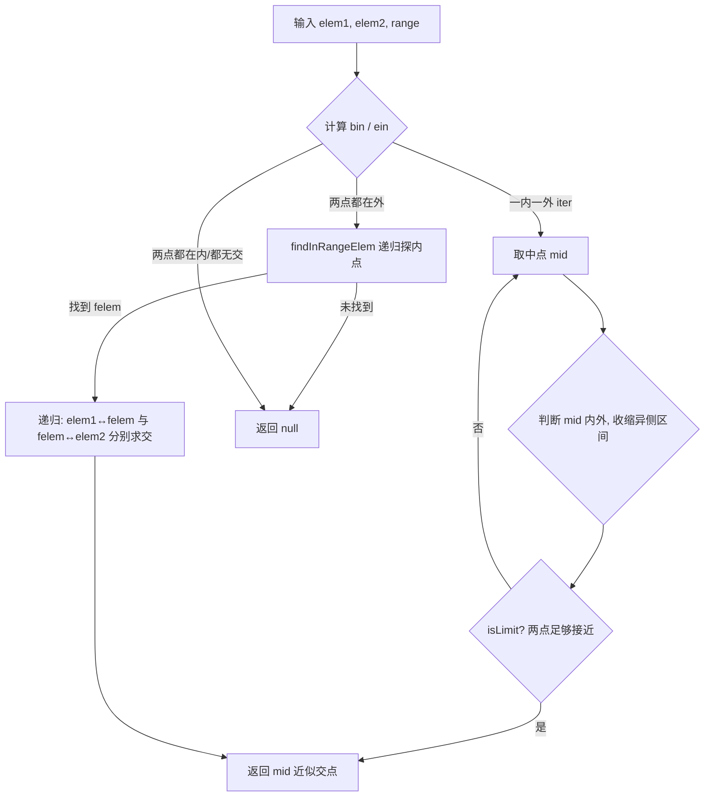

# i2f-algo

> 通用算法模块，收录与业务无关、可独立复用的基础算法。当前提供两类能力：一是「边界近似算法」，用二分（对分区间）思想求两点连线穿越某个范围（1 维数值区间、2 维圆形/多边形）的交点；二是「最短编辑距离（Levenshtein）」动态规划算法，衡量两个字符串通过插入/删除/替换互相变换的最小操作次数。模块仅依赖 JDK8 与 `i2f-graphics-2d` 的几何模型，是纯粹的工具型算法集合。

## 模块路径

- `i2f-jdk/i2f-algo`

## 模块依赖

| GroupId | ArtifactId | Scope | Optional | 说明 |
|---------|-----------|-------|----------|------|
| i2f.turbo | i2f-graphics-2d | compile | false | 二维几何模型与判定工具：`Point`、`Circle`、`Polygon`、`PolygonLocationTool`（`windInCircle`/`windInPolygon` 射线法/绕数法点在区域判定） |
| org.projectlombok | lombok | compile | false | 编译期代码生成（`NumberRange` 上的 `@ToString`） |

> 边界算法中的「点在圆内」「点在多边形内」判定委托给 `i2f-graphics-2d` 的 `PolygonLocationTool`，本模块只负责「用二分逼近求交点」的通用骨架；字符串编辑距离算法完全基于 JDK，无额外依赖。

## 模块设计

模块按算法主题划分为两个互相独立的子包：

```
i2f.algo
├── limit.border        边界近似算法（二分求交点）
│   ├── BorderLimitUtil               统一入口（静态方法 + main 演示）
│   ├── BorderInDecider<E,R>          策略：元素是否落在范围内
│   ├── MiddleElementSplitor<E>       策略：取两元素的中点
│   ├── BorderLimitDecider<E>         策略：两元素是否已足够接近（收敛阈值）
│   └── impl
│       ├── dim1                      一维数值区间实现
│       │   ├── NumberRange           区间模型 [begin, end]
│       │   ├── NumberInDecider       isInRange：begin ≤ x ≤ end
│       │   ├── NumberMiddleElementSplitor   middle：(a+b)/2
│       │   └── NumberLimitDecider    isLimit：|b-a| ≤ lim（默认 1e-12）
│       └── dim2                      二维点位实现
│           ├── PositionMiddleElementSplitor middle：坐标分量取中点
│           ├── PositionLimitDecider  isLimit：欧氏距离 < lim（默认 1e-10）
│           ├── circle.PositionInCircleDecider   委托 PolygonLocationTool.windInCircle
│           └── polygon.PositionInPolygonDecider 委托 PolygonLocationTool.windInPolygon
└── text                字符串算法
    ├── TextEditDistance              最短编辑距离（动态规划）
    └── test.TestTextEditDistance     运行示例
```

### 核心设计模式：三策略协作的通用二分（Strategy + 泛型算法）

`BorderLimitUtil.findBorder` 是一个与「元素类型」「范围类型」都无关的泛型算法骨架，其全部领域相关知识都由三个函数式策略接口注入：

| 策略接口 | 职责 | 一维实现 | 二维实现 |
|----------|------|----------|----------|
| `BorderInDecider<E,R>` | 判定 `isInRange(elem, range)`：点在内/外 | `NumberInDecider` | `PositionInCircleDecider` / `PositionInPolygonDecider` |
| `MiddleElementSplitor<E>` | `middle(a,b)`：给出两点中点，用于对分 | `NumberMiddleElementSplitor` | `PositionMiddleElementSplitor` |
| `BorderLimitDecider<E>` | `isLimit(a,b)`：两点是否已收敛到阈值内 | `NumberLimitDecider`（默认 1e-12） | `PositionLimitDecider`（默认 1e-10） |

换一套实现即可支持新的几何范围（如矩形、任意曲线），无需改动核心算法——这正是策略模式带来的可扩展性。

### 边界近似算法逻辑

算法目标：已知 `elem1`、`elem2` 两点，求其连线与范围边界（`range`）的近似交点。`findBorder` 的要点：

1. **前提判定**：分别算出两点是否在范围内 `bin`/`ein`，`iter = (bin || ein) && !(bin && ein)`——只有「一内一外」才存在穿越边界的交点。
2. **两点都在外的兜底搜索**：当 `!bin && !ein` 时，先用 `findInRangeElem` 递归（最多 12 层）在 `elem1→elem2` 之间探测一个落在范围内的中点 `felem`；找到后，`elem1↔felem`、`felem↔elem2` 便各构成「一内一外」，递归调用 `findBorder` 分别求交，优先返回先命中的结果。
3. **标准二分收敛**：在 `iter` 为真的前提下反复取中点 `mid`，判断 `mid` 落点，收缩「内/外异侧」的那半区间（`elem2=mid` 或 `elem1=mid`），直到 `limitDecider.isLimit` 判定两点足够接近即收敛，返回 `mid`。



### 最短编辑距离算法（动态规划）

`TextEditDistance.editDistance(str1, str2)` 计算把 `str1` 变换为 `str2` 所需的最少单字符「插入 / 删除 / 替换」次数：

- 建 `(m+1)×(n+1)` 的二维表 `map`，边界 `map[i][0]=i`、`map[0][j]=j`（一方为空串时的操作数）。
- 转移：`str1[i-1]==str2[j-1]` 时 `map[i][j]=map[i-1][j-1]`（无需操作）；否则取「删除、插入、替换」三种子问题最优 `min(map[i-1][j], map[i][j-1], map[i-1][j-1]) + 1`。
- 结果 `map[m][n]`。时间/空间复杂度均为 \(O(m \times n)\)。

## 模块目的

- 将「二分逼近求边界交点」这类几何通用问题，从具体图形判定中抽象出来，形成可跨维度复用的算法骨架。
- 以最小依赖、无状态静态工具的形式沉淀基础算法，供上层图形、定位、围栏判定、文本相似度匹配等场景直接调用。

## 模块功能

| 分类 | 入口方法 | 说明 |
|------|----------|------|
| 一维区间边界 | `BorderLimitUtil.findNumberBorder(num1, num2, NumberRange)` | 求两数值连线与区间 `[begin,end]` 的近似交点值 |
| 圆形边界 | `BorderLimitUtil.findPolygonBorder(p1, p2, Circle)` | 求两点连线穿越圆弧的近似交点 |
| 多边形边界 | `BorderLimitUtil.findPolygonBorder(p1, p2, Polygon)` | 求两点连线穿越多边形边的近似交点 |
| 通用边界（可扩展） | `BorderLimitUtil.findBorder(elem1, elem2, range, inDecider, middleSplitor, limitDecider)` | 注入三策略处理任意类型范围 |
| 字符串相似度 | `TextEditDistance.editDistance(str1, str2)` | 最短编辑距离 |

## 模块主要使用方法

### 一维数值区间求边界

```java
// 已知 num1 在区间外、num2 在区间内，求二者之间穿越区间边界的近似点
Double border = BorderLimitUtil.findNumberBorder(
        5.0, 20.0, new NumberRange(10.0, 30.0));
```

### 二维点位与圆形/多边形求边界

```java
import i2f.graphics.d2.Point;
import i2f.graphics.d2.shape.Circle;
import i2f.graphics.d2.shape.Polygon;

// 多边形（如电子围栏）+ 内外部两点 → 求穿越围栏边界的坐标点
List<Point> pts = new ArrayList<>();
pts.add(new Point(119.416421, 26.023969));
pts.add(new Point(119.417018, 26.023887));
pts.add(new Point(119.416857, 26.022865));
pts.add(new Point(119.416246, 26.022966));

Point bd = BorderLimitUtil.findPolygonBorder(
        new Point(119.415954, 26.023319),   // 范围外
        new Point(119.416771, 26.023628),   // 范围内
        new Polygon(pts));
```

### 自定义范围类型（扩展新策略）

```java
// 只需实现三个策略接口，即可让 findBorder 处理任意「范围」
Point border = BorderLimitUtil.findBorder(p1, p2, myRange,
        (elem, range) -> range.contains(elem),   // BorderInDecider
        (a, b) -> new Point((a.getX()+b.getX())/2, (a.getY()+b.getY())/2), // MiddleElementSplitor
        (a, b) -> a.distance(b) < 1e-9);          // BorderLimitDecider
```

### 最短编辑距离

```java
int dis = TextEditDistance.editDistance("love", "lwe"); // = 2（删除 o，将 v 替换为 w）
```

### 注意事项

- `findBorder` 依赖输入两点「一内一外」才存在交点；两点同在内或同在外且探测不到内点时返回 `null`，调用方需判空。
- 收敛阈值由各 `*LimitDecider` 的 `lim` 决定（一维默认 `1e-12`，二维默认 `1e-10`），可通过带参构造调整精度/迭代开销的权衡。
- 结果是**近似**交点，精度受阈值与「两点都在外」时最多 12 层的内点探测深度限制，非解析精确解。
- 点在区域判定委托 `i2f-graphics-2d` 的 `PolygonLocationTool`，其对凹多边形/边界点的表现以该工具实现为准。
- `editDistance` 为原始类型入参，不接受 `null`（会抛 NPE）；表大小为 \((m+1)(n+1)\)，超长字符串需评估内存。

## 模块特性总结

- **主题分域**：`limit.border`（几何边界）与 `text`（字符串算法）两域解耦，各自独立可引用。
- **策略驱动的通用二分**：核心算法与元素/范围类型无关，通过 `BorderInDecider`/`MiddleElementSplitor`/`BorderLimitDecider` 三接口注入领域逻辑，天然可扩展到新几何形状。
- **一维 + 二维双实现**：开箱支持数值区间、圆形、多边形边界求交。
- **两点皆外的兜底搜索**：`findInRangeElem` 递归探测内点，扩大算法适用范围。
- **精度可控**：收敛阈值可配置，在近似精度与迭代次数间权衡。
- **经典 DP 编辑距离**：\(O(mn)\) 的 Levenshtein 距离，用于文本相似度、纠错、模糊匹配。
- **零重型依赖**：仅依赖 JDK8 与 `i2f-graphics-2d`，纯静态工具、无状态、线程安全（策略实例各自持有 `lim` 时按调用点独立 new）。
