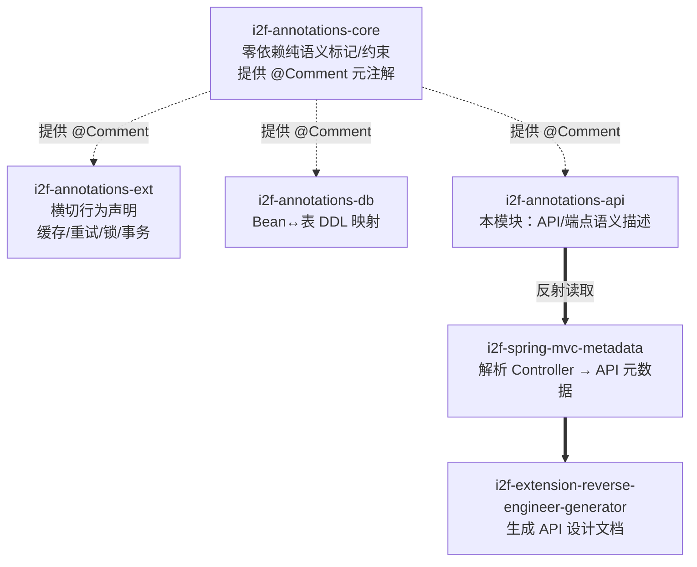

# i2f-annotations-api

> API 描述注解库，定义一组**协议无关**的接口/端点语义标注：模块归属（`@Module`）、处理系统（`@System`）、请求方式（`@Method`）、细分类目标签（`@Label`）、操作描述（`@Operation`）与传输协议（`@Protocol`），用于在代码层声明「一个 API 是什么、属于哪、做什么」，为 API 文档生成、接口归类与治理提供结构化语义。注解本身零行为，由反射消费方（如 `i2f-spring-mvc-metadata` 解析 Controller、`i2f-extension-reverse-engineer-generator` 生成 API 设计文档）读取并解释。`PackageInfo.INFO` 额外给出一套 SpringMVC 场景下的使用指导建议。共 6 个注解 + 1 个说明常量接口。

## 模块路径

- `i2f-jdk/i2f-annotations-api`

## 模块依赖

| GroupId | ArtifactId | Scope | Optional | 说明 |
|---------|-----------|-------|----------|------|
| i2f.turbo | i2f-annotations-core | compile | false | 提供 `@Comment` 自描述元注解，本模块注解沿用其骨架 |

> 本模块是注解家族（core / ext / db / **api**）中面向「接口层语义」的一支，仅依赖 `i2f-annotations-core`，无任何第三方依赖，构建于 JDK 标准注解类型之上。

## 模块设计

### 在注解家族中的定位

i2f 注解体系分四支，`api` 与其他三支正交，专注「API/端点的描述语义」：



### 统一注解骨架

延续 core 范式，6 个注解均采用同一约定：`@Comment` 自描述 + 宽 `@Target`（含 `TYPE_USE`）+ `RUNTIME` 保留 + `@Documented`。以 `@Method` 为例：

```java
@Comment({ "方式、方法", "在API中，用于指定支持的请求方式，在HTTP中则表示 POST、GET、PUT、DELETE ..." })
@Target({ FIELD, PARAMETER, LOCAL_VARIABLE, METHOD, TYPE_PARAMETER,
          TYPE, ANNOTATION_TYPE, CONSTRUCTOR, PACKAGE, TYPE_USE })
@Retention(RetentionPolicy.RUNTIME)
@Documented
public @interface Method {
    String[] value();   // 支持多个请求方式
}
```

### 包结构

单包 `i2f.annotations.api`（无子包），6 注解 + 1 常量接口，按「定位维度 / 行为维度」归类：

| 维度 | 成员 | 成员签名 | 语义 |
|------|------|----------|------|
| 归属定位 | `@System` | `String value()` | 请求的处理系统：微服务体系=子系统，单体=服务本身 |
| 归属定位 | `@Module` | `String value()` | API 所属模块，SpringMVC 中对应 Controller 层次 |
| 归类标签 | `@Label` | `String value()` | 细分类目标签，可标注 Mapping 方法或 Controller（分类） |
| 行为描述 | `@Operation` | `String value()` | 操作描述（如「新增」「删除」），SpringMVC 中用于 Mapping 方法 |
| 行为描述 | `@Method` | `String[] value()` | 支持的请求方式（POST/GET/PUT/DELETE…），协议相关 |
| 行为描述 | `@Protocol` | `String[] value()` | 传输协议类型（HTTP、WebSocket…） |
| 使用指南 | `PackageInfo`（interface） | `String INFO` | 以字符串常量给出 SpringMVC 场景的标注取舍建议 |

### 核心设计点

- **协议无关的分层描述模型**：`System → Module → Label → Operation` 构成从粗到细的接口归类链路，`Protocol` + `Method` 补充「怎么访问」，六者正交组合即可完整刻画一个 API 的语义坐标，不绑定任何具体 Web 框架。
- **单值 vs 多值成员**：`@Method`、`@Protocol` 取 `String[]`（一个端点可支持多种请求方式/协议），其余四个取 `String`（唯一归属/描述）。
- **与框架注解「互补而非替代」**：`PackageInfo.INFO` 明确指出，在 SpringMVC 中 `@Method`/`@Protocol` 通常**无需书写**——请求方式可由 `@GetMapping` 系列推出、协议恒为 HTTP；真正推荐使用的是 `@Module`（Controller）与 `@Operation`（Mapping 方法），`@Label` 视分类需要，`@System` 仅跨系统/外部调用时补。这体现「描述增强」而非「重复声明」的取舍。
- **自描述即文档**：每个注解的 `@Comment` 不仅说明用途，还直接给出在 SpringMVC 中的落点（Controller / Mapping 方法），使注解定义本身就是一份使用规范。

## 模块目的

- 以**声明式注解**为 API 补齐框架注解（URL、请求方式）之外的「业务语义」：属于哪个系统/模块、是什么分类、做什么操作。
- 提供模型/框架无关的接口描述契约，供 API 元数据解析、接口文档生成、接口治理等下游反射消费。
- 用 `PackageInfo.INFO` 沉淀 SpringMVC 最佳实践，指导「哪些该标、哪些可省」，避免冗余标注。

## 模块功能

| 能力 | 入口注解 | 产出语义 |
|------|----------|----------|
| 标注处理系统 | `@System(value)` | 微服务子系统 / 单体服务标识 |
| 标注所属模块 | `@Module(value)` | API 模块归属（≈ Controller） |
| 标注细分类目 | `@Label(value)` | 接口分类标签（方法或 Controller 级） |
| 描述操作含义 | `@Operation(value)` | 端点业务操作（新增/删除…） |
| 声明请求方式 | `@Method(String[])` | 支持的 HTTP 方法集合 |
| 声明传输协议 | `@Protocol(String[])` | HTTP / WebSocket 等协议 |

## 模块主要使用方法

### 1. SpringMVC 推荐用法（遵循 PackageInfo.INFO）

```java
@Module("用户管理")            // Controller 层：声明所属模块
@RestController
@RequestMapping("/user")
public class UserController {

    @Operation("新增用户")      // Mapping 方法：声明操作描述
    @Label("写操作")            // 可选：进一步分类
    @PostMapping
    public ApiResp<Long> add(@RequestBody UserPo user) { ... }
    // @Method/@Protocol 无需书写：请求方式由 @PostMapping 推出，协议恒为 HTTP
}
```

### 2. 跨系统 / 外部调用的补充标注

```java
@Module("订单")
@System("inventory-center")    // 仅外部/跨子系统调用时才需要 @System
public class OrderFeignApi {
    @Operation("扣减库存")
    @Method({"POST"})
    @Protocol({"HTTP"})
    void deduct(...);
}
```

### 3. 被反射消费（示意）

```java
// 伪代码：读取端聚合出一个 API 的语义坐标
Module m = clazz.getAnnotation(Module.class);      // "用户管理"
Operation op = method.getAnnotation(Operation.class); // "新增用户"
Label lb = method.getAnnotation(Label.class);        // "写操作"
// 结合 Spring MVC 的 URL/HTTP 方法，生成结构化 API 文档条目
```

### 注意事项

- **纯契约、零行为**：本模块不含解析逻辑，需搭配反射消费方（`i2f-spring-mvc-metadata` 等）才生效。
- **`@Retention` 必须 RUNTIME**：所有注解运行期可读，改动会破坏解析。
- **勿与框架注解重复**：SpringMVC 下 `@Method`/`@Protocol` 一般省略（由 `@*Mapping` 与 HTTP 协议推出），只补 `@Module`/`@Operation` 等框架无法表达的语义，遵循 `PackageInfo.INFO`。
- **`@System` 按需**：单体项目通常一个 System 即服务本身，无需逐类标注，仅跨系统/外部调用场景使用。
- **`@Label` 双落点**：既可标注 Mapping 方法（细分），也可标注 Controller（整体分类），读取端需处理两级来源。

## 模块特性总结

- **注解家族的接口分支**：与 core（通用语义）、ext（横切行为）、db（表结构映射）并列，专注 API/端点语义描述，共用 `@Comment` 自描述骨架。
- **协议无关的分层描述**：System/Module/Label/Operation 归类 + Method/Protocol 访问方式，正交组合刻画 API 语义坐标。
- **单/多值成员区分**：`@Method`/`@Protocol` 为 `String[]`，其余为 `String`。
- **框架互补、内置最佳实践**：`PackageInfo.INFO` 给出 SpringMVC 标注取舍，强调「增强而非重复」。
- **零第三方依赖**：仅依赖 `i2f-annotations-core`；定义与解析解耦，供文档生成、接口治理等多种下游复用同一契约。
