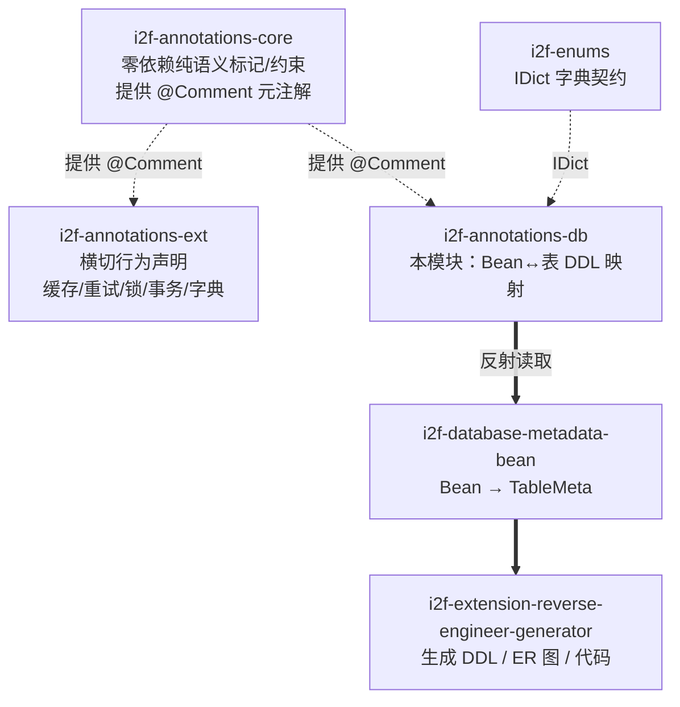

# i2f-annotations-db

> 数据库映射注解库，定义一组描述「Java Bean ↔ 关系表 DDL」双向映射语义的注解：表/库/模式/类目定位（`@Table`/`@Database`/`@Schema`/`@Catalog`）、列与类型（`@Column`/`@DataType`/`@JdbcType`/`@TableType`）、约束与键（`@Primary`/`@AutoIncrement`/`@Foreign`/`@Refer`/`@Unique`/`@Index`/`@Restrict`）以及忽略控制（`@DbIgnore`/`@DbIgnoreUnAnnotated`）。注解本身零行为，仅作为「结构契约」被 `i2f-database-metadata-bean`（Bean→`TableMeta`）、`i2f-extension-reverse-engineer-generator`（Bean→DDL/ER 图）等上层能力反射读取并解释，实现「用注解声明表结构」。共 17 个注解 + 1 个实现 `IDict` 的枚举 `OrderMode` + 1 个说明常量接口 `PackageInfo`。

## 模块路径

- `i2f-jdk/i2f-annotations-db`

## 模块依赖

| GroupId | ArtifactId | Scope | Optional | 说明 |
|---------|-----------|-------|----------|------|
| i2f.turbo | i2f-annotations-core | compile | false | 提供 `@Comment` 自描述元注解，本模块注解沿用其骨架 |
| i2f.turbo | i2f-enums | compile | false | 提供 `i2f.enums.api.IDict`，枚举 `OrderMode` 实现之（code/key/text/remark 字典契约） |

> 本模块是注解家族（core / ext / **db**）中面向数据库结构的一支，除上述两个内部依赖外无任何第三方依赖，构建于 JDK 标准注解类型与 `java.sql.JDBCType` 之上。`maven-assembly-plugin` 仅用于打包产物，不引入运行期依赖。

## 模块设计

### 在注解家族中的定位

i2f 注解体系分三层，`db` 与 `core`/`ext` 并列，但面向「持久层结构」而非通用语义：



### 统一注解骨架

延续 core 范式，绝大多数注解采用 5 条约定（以 `@Index` 为例）：

```java
@Comment({ "索引", "用于表示当前字段属于索引 index ..." }) // ① 自描述：用 @Comment 说明用途
@Target({ FIELD, PARAMETER, LOCAL_VARIABLE, METHOD,          // ② 宽 @Target（含 TYPE_USE）
          TYPE_PARAMETER, TYPE, ANNOTATION_TYPE, CONSTRUCTOR,
          PACKAGE, TYPE_USE })
@Retention(RetentionPolicy.RUNTIME)                          // ③ 运行期保留，供反射读取
@Documented                                                  // ④ 进入 javadoc
public @interface Index {
    String value();                     // 索引名
    int order() default -1;             // 在组合索引中的位次
    OrderMode compare() default OrderMode.DEFAULT; // 升/降序
    String type() default "";           // 索引类型（hash/tree）
}
```

> 例外：`@DbIgnore`、`@DbIgnoreUnAnnotated` 是「控制位」注解，刻意不套 `@Comment`、也不追求宽 `@Target`，仅 `@Target({FIELD, TYPE})` + `@Retention(RUNTIME)`，语义是过滤开关而非结构描述。

### 包结构

单包 `i2f.annotations.db`，按映射职责归类（无子包）：

| 分组 | 成员 | 说明 |
|------|------|------|
| 定位（库/表） | `@Database`、`@Schema`、`@Catalog`、`@Table`、`@TableType` | 映射 DDL 中 `catalog.schema.table` 三级定位与表类型（表/视图），`@Table` 另带 `restricts()` 承载表级约束 |
| 列与类型 | `@Column`、`@DataType`、`@JdbcType` | 列名、DDL 数据类型（含 `precision`/`scale`）、以及 `java.sql.JDBCType` 标准类型枚举 |
| 键与完整性 | `@Primary`、`@AutoIncrement`、`@Foreign`、`@Refer`、`@Unique`、`@Index` | 主键、自增、外键引用、软引用（字典/来源，无外键体系用）、唯一（支持 `value` 聚合联合唯一）、索引（支持组合索引） |
| 约束 | `@Restrict` | 字段/值级约束说明（如非空、范围检查），字符串形式承载 |
| 忽略控制 | `@DbIgnore`、`@DbIgnoreUnAnnotated` | 单字段/单类忽略映射；后者表示「未标注的字段一律忽略」（白名单模式） |
| 辅助类型 | `OrderMode`（enum `implements IDict`）、`PackageInfo`（interface） | 索引排序方向枚举；`PackageInfo.INFO` 常量以 DDL 形式书写整套映射解释 |

### 核心设计点

- **DDL 模板式映射（PackageInfo.INFO）**：模块用一段字符串常量把整套注解「拼回」一条 `CREATE TABLE` 语句，作为「注解 ↔ DDL」双向生成的权威解释，也是反向工程生成器解析 Bean 的规则蓝本：

```sql
create table @Table.value
(
   -- 主键
   @Column.value @DataType.value @Primary @AutoIncrement @Restrict.value @Comment.value,
   -- 外键
   @Column.value @DataType.value foreign key reference @Foreign.table (@Foreign.column) @Restrict.value @Comment.value,
   -- 一般
   @Column.value @DataType.value @Restrict.value @Comment.value,
) @Table.restricts @Comment.value;
```

- **组合结构用 value 聚合，而非容器注解**：`@Index`、`@Unique` 通过相同的 `value()`（索引名/唯一名）把分散在多个字段上的注解归并为一个组合索引/联合唯一，并用 `order()` 决定字段在其中的先后（`Index` 的 `@Comment` 给出 `idx_status_sex(status,sex)` 示例）。这是「同一注解多处出现 + 字符串键聚合」的模式，区别于 core 里的 `@Repeatable` + 容器写法。
- **硬外键 vs 软引用（`@Foreign` vs `@Refer`）**：`@Foreign(table, column)` 表达真实的 DDL 外键约束；`@Refer(table, column, clazz)` 是无外键体系下的「逻辑来源」声明（字典来源、明细单主单 ID 来源），并可指定参照的实体类 `clazz()`，供文档/翻译层使用而不产生 DB 约束。
- **字典化枚举（`OrderMode implements IDict`）**：排序方向枚举实现 `i2f-enums` 的 `IDict` 契约（`code/key/text/remark`），与 `i2f-annotations-ext` 的 `PaddingMode` 一脉相承，使枚举可被字典翻译引擎统一处理（`DEFAULT=0/ASC=1/DESC=-1`）。
- **标记型零成员注解**：`@AutoIncrement` 无任何成员，纯粹以「是否出现」表达布尔语义，读取端只需 `isAnnotationPresent` 判定。

## 模块目的

- 以**声明式注解**取代 XML/手写映射，让 PO/Bean 成为表结构的单一事实来源。
- 为「Bean→元数据→DDL/ER/代码」反向工程链路提供稳定、模型无关的结构契约，注解定义与解析实现解耦。
- 通过 `@Comment` 自描述 + `IDict` 枚举，使表结构信息在生成数据库文档时可读、可翻译。

## 模块功能

| 能力 | 入口注解 | 产出语义 |
|------|----------|----------|
| 声明表名与表级约束 | `@Table(value, restricts)` | `CREATE TABLE <value> (...) <restricts>` |
| 三级库定位 | `@Database`/`@Schema`/`@Catalog` | 限定 `catalog.schema.database.table` |
| 声明列及类型 | `@Column` + `@DataType`/`@JdbcType` | 列名 + 类型（含精度/标度） |
| 主键/自增 | `@Primary` + `@AutoIncrement` | 主键定义、自增修饰 |
| 外键/软引用 | `@Foreign` / `@Refer` | 物理外键约束 / 逻辑来源参照 |
| 唯一/索引 | `@Unique` / `@Index` | 唯一约束、单列或组合索引（含方向、类型） |
| 值约束 | `@Restrict` | 字段/表级约束说明（非空、范围等） |
| 映射过滤 | `@DbIgnore` / `@DbIgnoreUnAnnotated` | 忽略指定成员 / 仅映射已标注成员 |

## 模块主要使用方法

### 1. 在 Bean 上标注表结构

```java
@Table("t_user")
@Comment("用户表")
@Database("app_db")
public class UserPo {
    @Column("id")
    @DataType("bigint")
    @Primary
    @AutoIncrement
    private Long id;

    @Column("username")
    @DataType("varchar", precision = 64)
    @Unique("uk_username")           // 联合唯一用相同 value 聚合
    @Comment("用户名")
    private String username;

    @Column("status")
    @DataType("tinyint")
    @Index(value = "idx_status_sex", order = 0, compare = OrderMode.ASC)
    @Refer(table = "t_dict", column = "code", clazz = StatusDict.class) // 字典来源
    private Integer status;

    @Column("sex")
    @DataType("tinyint")
    @Index(value = "idx_status_sex", order = 1)                          // 组合索引第二段
    private Integer sex;

    @DbIgnore                                   // 不参与建表/映射
    private transient String token;
}
```

### 2. 白名单模式（仅映射已标注字段）

```java
@Table("t_order_item")
@DbIgnoreUnAnnotated          // 类级：未加 @Column 的字段一律忽略
public class OrderItemPo {
    @Column("id") @DataType("bigint") @Primary @AutoIncrement
    private Long id;
    @Column("order_id") @DataType("bigint")
    @Refer(table = "t_order", column = "id")   // 明细单主单 ID 来源于主单表
    private Long orderId;
    private String internalFlag;               // 无 @Column，被自动忽略
}
```

### 3. 被反射消费（示意）

注解本身不产生行为，读取端（如 `i2f-database-metadata-bean`）通过反射聚合出 `TableMeta`：

```java
// 伪代码：解释 @Table/@Column/... 生成结构化表元数据
TableMeta meta = BeanTableMetaResolver.of(UserPo.class);
// meta.getTableName() == "t_user"
// meta.getColumns() 含 id(PK, autoIncrement), username(unique uk_username),
//                    status(index idx_status_sex#0 ASC), sex(index idx_status_sex#1)
```

### 注意事项

- **纯契约、零行为**：本模块不含任何解析逻辑；需搭配 `i2f-database-metadata-bean`（读注解）与 `i2f-extension-reverse-engineer-generator`（生成 DDL/代码/ER 图）才生效。
- **`@Retention` 必须 RUNTIME**：所有注解运行期可读，请勿改为 CLASS/SOURCE，否则反射解析失效。
- **组合键靠字符串聚合**：`@Index`/`@Unique` 的多字段归并依赖 `value()` 完全一致 + `order()` 排序，拼错名称会产生两个独立索引/唯一。
- **`@Foreign` 与 `@Refer` 语义不同**：前者生成物理外键约束，后者仅作逻辑来源/字典说明，不产生 DB 约束，选择时需按是否使用外键体系决定。
- **`OrderMode` 是 `IDict` 枚举**：其 `code/key/text` 面向字典翻译，`compare` 方向（ASC/DESC）与业务排序码可能不同，读取端按需要取 `code()` 或 `key()`。

## 模块特性总结

- **注解家族的结构分支**：与 `core`（通用语义）、`ext`（横切行为）并列，专注 Bean↔表 DDL 映射，共用 `@Comment` 自描述骨架。
- **全链路结构契约**：一套注解覆盖 `catalog.schema.table` 定位、列/类型、主键/自增、外键/软引用、唯一/索引/约束、忽略过滤，可完整表达一张关系表。
- **零第三方依赖**：仅依赖 `i2f-annotations-core` 与 `i2f-enums`，构建于 JDK 注解与 `java.sql.JDBCType` 之上。
- **声明即文档**：`@Comment` + `PackageInfo.INFO` 的 DDL 模板使表结构「可读、可生成、可反向」。
- **组合与聚合能力**：`@Index`/`@Unique` 以 `value` 名称聚合多字段实现组合索引/联合唯一，`order` 控序、`compare` 控方向。
- **可插拔消费**：定义与解析解耦，供元数据读取、DDL 生成、ER 图、代码生成等多种下游复用同一契约。
