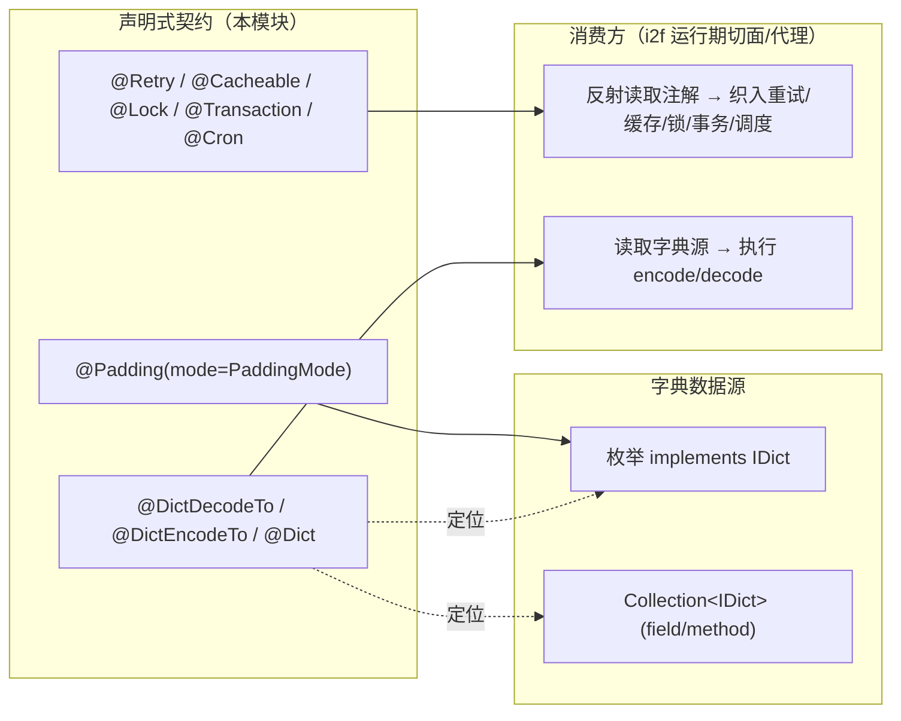

# i2f-annotations-ext

> i2f 注解扩展库，在零行为的 `i2f-annotations-core` 之上，进一步定义一组描述**横切关注点 / 运行期行为语义**的注解：缓存（`@Cacheable`）、远程调用治理（`@Retry`/`@Fallback`/`@Timeout`/`@Keepalived`/`@Native`）、执行控制（`@Async`/`@Sync`/`@Parallel`/`@Before`/`@After`/`@Order`/`@Sequence`/`@Await`/`@Recursive`）、锁（`@Lock`/`@ReadLock`/`@WriteLock`）、事务（`@Transaction`）、调度（`@Cron`/`@Interval`/`@DelayInterval`）、字典翻译（`@Dict`/`@DictDecodeTo`/`@DictEncodeTo`）、原子性（`@Atomic`/`@UnAtomic`）与文本包装（`@Padding`/`@Trim`/`@Ceil`/`@Floor`/`@Round`）。它们本身同样不产生行为，仅作为「声明式契约」被 i2f 的运行期切面/代理引擎读取并解释执行。共 34 个注解 + 1 个实现 `IDict` 的枚举 `PaddingMode`。

## 模块路径

- `i2f-jdk/i2f-annotations-ext`

## 模块依赖

| GroupId | ArtifactId | Scope | Optional | 说明 |
|---------|-----------|-------|----------|------|
| i2f.turbo | i2f-annotations-core | compile | false | 复用「统一注解骨架」与自描述元注解 `@Comment`；语义与 core 保持一致 |
| i2f.turbo | i2f-enums | compile | false | 提供字典接口 `i2f.enums.api.IDict`，`PaddingMode` 实现之，字典翻译注解以 `Collection<IDict>` 为约定数据源 |

> 除上述两个内部依赖外，仅使用 JDK 标准类型（`java.lang.annotation.*`、`java.util.concurrent.TimeUnit`）。`i2f-enums` 主要用于「字典」语义与枚举即字典（`IDict`）的对接，`i2f-annotations-core` 提供被所有沿用的 `@Comment` 自描述范式。

## 模块设计

### 沿用 core 的注解骨架，聚焦「行为语义 + 富成员」

与 `i2f-annotations-core` 一样，本模块每个注解仍是 `@Comment` 自描述 + `RUNTIME` + `@Documented` + 宽 `@Target`。区别在于：core 偏「静态标记/约束」，ext 偏「运行期行为声明」，因此注解成员更丰富，普遍携带 `TimeUnit`、`Class<?>`、枚举等结构化参数，供切面引擎据此装配拦截逻辑。

```java
@Comment({"重试", "value指定重试次数", "delay指定失败后等待的时长", /* ... */})
@Target({ /* 与 core 相同的宽 Target 集 */ })
@Retention(RetentionPolicy.RUNTIME)
@Documented
public @interface Retry {
    int value() default 1;                          // 重试次数
    long delay() default 3;                         // 初始退避时长
    long maxDelay() default 30;                     // 退避上限
    double multiplier() default 1.1;                // 退避递增系数
    TimeUnit unit() default TimeUnit.SECONDS;       // 时长单位
    Class<? extends Throwable>[] breakOn() default {}; // 命中即中断的异常
}
```

### 按关注点分包（9 类，34 注解 + 1 枚举）

```
i2f.annotations.ext
├── atomic       原子性（2）      Atomic / UnAtomic
├── cache        缓存（1）        Cacheable(value,clazz,method,timeout,unit,key)
├── call         调用治理（5）     Retry / Fallback / Timeout / Keepalived / Native
├── control      执行控制（9）     Async / Sync / Parallel / Sequence / Before / After
│                                  / Order / Await / Recursive
├── dict         字典翻译（3+1）   Dict(+Dicts 容器) / DictDecodeTo / DictEncodeTo
├── lock         锁（3）           Lock / ReadLock / WriteLock
├── schedule     调度（3）         Cron / Interval / DelayInterval
├── transaction  事务（2）         Transaction / UnTransaction
└── wrap         文本包装（5+1）   Padding / Trim / Ceil / Floor / Round ＋ enum PaddingMode
```

### 统一的「键/前缀」构造约定

`@Cacheable` 与 `@Lock` 共享同一套 key 组装语义，降低使用方记忆成本：

- `clazz` / `method` 两个布尔开关决定是否在前缀中携带类名、方法名；
- **前缀 = clazz + method + value**，**缓存键 = 前缀 + key**，**锁键 = 前缀**；
- `@Cacheable.key` 为空时以「全部入参」为 key，非空时交由实现按表达式（SpEL/OGNL 等）解析。

### 退避重试算法的声明式表达

`@Retry` 用 `delay` + `multiplier` + `maxDelay` 描述指数/常数退避：初始等待 `delay`，每次失败后「上次等待 × multiplier」，并以 `maxDelay` 封顶；`breakOn` 命中指定异常则不再重试。示例（`delay=4`）：`multiplier=1` → 4,4,4,4；`multiplier=2` → 4,8,16,32；`multiplier=0.5` → 4,2,1,0。

### 字典翻译：注解 + `IDict` 枚举协同

`dict` 包把「编码 ↔ 名称」双向翻译做成声明式：

- `@Dict`（`@Repeatable(Dicts.class)`）在枚举/字段上登记 `value(code)`、`key`、`text`、`remark`、`tags` 一条字典项；
- `@DictDecodeTo(target)`：`num → str`，将本字段字典值翻译写入目标字段；`@DictEncodeTo(target)`：`str → num`，反向编码；
- 字典来源四选一：默认取当前字段；`field=` 取本类指定字段；`clazz=`+`field=`/`method=` 取他类字段或返回 `Collection<IDict>` 的方法；`enums=` 直接指向实现了 `IDict` 的枚举类；`useKey=true` 时以 `key` 而非 `code` 作为字典值。
- `PaddingMode` 本身即 `IDict` 的实现（`LEFT/CENTER/RIGHT` 携带 code/key/text/remark），示范「枚举即字典」，同时作为 `@Padding.mode` 的取值域。



## 模块目的

- 以「注解即配置」的方式，统一表达对方法/字段的**行为增强意图**（缓存、重试降级、加锁、事务、调度、异步编排、字典翻译、文本整形），把 cross-cutting 关注点从业务代码中剥离为元数据。
- 复用 core 的自描述骨架，保证全仓注解风格一致，并可被同一套反射/生成基础设施消费。
- 通过 `IDict` 约定，让「枚举 / 字段 / 方法」三类字典源在翻译注解下统一寻址。

## 模块功能

| 分类 | 注解 | 提供的声明能力 |
|------|------|----------------|
| cache | `@Cacheable` | 可缓存 / 缓存键前缀与过期时长（`timeout`+`unit`、`key`） |
| call | `@Retry` `@Fallback` `@Timeout` `@Keepalived` `@Native` | 重试退避、降级回退、调用超时、保活、Native 来源标记 |
| control | `@Async` `@Sync` `@Parallel` `@Sequence` `@Before` `@After` `@Order` `@Await` `@Recursive` | 异步/同步、并行/顺序、前后置钩子、排序、等待、可递归 |
| lock | `@Lock` `@ReadLock` `@WriteLock` | 互斥/读/写锁及其锁键构造 |
| transaction | `@Transaction` `@UnTransaction` | 事务边界、类型 `type`、隔离级别 `level` |
| schedule | `@Cron` `@Interval` `@DelayInterval` | cron 周期、固定间隔、初始延时，`count` 限次 |
| dict | `@Dict` `@DictDecodeTo` `@DictEncodeTo` | 字典项登记与 num↔str 双向翻译 |
| atomic | `@Atomic` `@UnAtomic` | 操作原子性标记 |
| wrap | `@Padding` `@Trim` `@Ceil` `@Floor` `@Round` | 字符串填充/裁剪、数值取整/进位（配合 `PaddingMode`） |

## 模块主要使用方法

### 声明调用治理与缓存

```java
import i2f.annotations.ext.call.Retry;
import i2f.annotations.ext.call.Fallback;
import i2f.annotations.ext.cache.Cacheable;
import java.util.concurrent.TimeUnit;

@Cacheable(value = "user", timeout = 60, unit = TimeUnit.SECONDS, key = "#id")
@Retry(value = 3, delay = 2, multiplier = 2, maxDelay = 30, breakOn = {IllegalStateException.class})
@Fallback(value = "getDefaultUser")
public User loadUser(long id) { /* ... */ }
```

### 加锁、事务与调度

```java
@Lock(value = "order:", clazz = true, method = true)   // 锁键=类名+方法名+前缀
@Transaction(type = "REQUIRED", level = "READ_COMMITTED")
@Cron("0 0/5 * * * ?")                                 // 每 5 分钟
public void settle() { /* ... */ }
```

### 字典翻译（枚举即字典）

```java
import i2f.annotations.ext.dict.*;

public enum OrderStatus implements i2f.enums.api.IDict {
    @Dict(value = 0, key = "NEW",    text = "待处理") NEW(0, "NEW", "待处理", null),
    @Dict(value = 1, key = "PAID",   text = "已支付") PAID(1, "PAID", "已支付", null),
    ;
    // code()/key()/text()/remark() ...
}

public class OrderVo {
    private Integer status;                 // 编码值

    @DictDecodeTo(value = "statusText", enums = OrderStatus.class) // num -> str
    private String statusText;              // 由引擎回填「待处理/已支付」
}
```

### 文本包装

```java
@Padding(value = 8, fill = "0", mode = PaddingMode.LEFT) // 左填充 0 至长度 8
private String padded;
```

### 注意事项

- 注解**不自动生效**：需 i2f 侧对应的运行期引擎（AOP/代理/调度器/字典翻译器）在字段或调用点上读取并织入；单纯标注不会改变程序行为。
- 与 Spring 的同名/近义注解（`@Async`、`@Cacheable`、`@Retryable`、`@Transactional`、`@Scheduled`）语义相似但**互相独立**，勿在期待 Spring 处理的场景误用本模块注解，反之亦然。
- `TimeUnit` 单位在各注解中默认值不同（`@Cacheable`/`@Retry` 默认 `SECONDS`，`@Interval`/`@DelayInterval` 默认 `MILLISECONDS`），跨注解核对时长语义。
- `@Retry.multiplier` 退避会累积，务必设置合理 `maxDelay` 以防等待时长爆炸；`breakOn` 为空表示不因特定异常提前中断。
- 字典 `@DictDecodeTo`/`@DictEncodeTo` 的字典源四选一（当前字段 / `field` / `clazz+field|method` / `enums`），`method` 须返回 `Collection<IDict>` 且限本对象或本类静态方法；`useKey=true` 改用 `key` 作为字典值。
- `@Dict` 为 `@Repeatable(Dicts.class)`，可多处登记字典项；容器 `@Dicts` 一般由编译器合成，不直接使用。
- 宽 `@Target`（含 `TYPE_USE`）意味着可标注在类型使用处，消费引擎需自行甄别实际标注位置。

## 模块特性总结

- **行为语义扩展层**：在 core 的静态标记之上，补充缓存/调用治理/锁/事务/调度/异步/字典/整形等运行期行为声明。
- **沿用统一骨架**：`@Comment` 自描述 + `RUNTIME` + `@Documented` + 宽 `@Target`，与 core 风格一致、可被同一套反射设施消费。
- **富成员**：普遍携带 `TimeUnit`、`Class<?>`、枚举等结构化参数，支撑切面引擎装配。
- **一致 key 约定**：`@Cacheable`/`@Lock` 共享「clazz+method+value 前缀」组装规则。
- **退避重试可表达**：`@Retry` 以 delay/multiplier/maxDelay/breakOn 声明常数或指数退避。
- **枚举即字典**：`IDict` 打通注解与枚举/字段/方法三类字典源，`@DictDecodeTo`/`@DictEncodeTo` 实现双向翻译。
- **契约与实现分离**：仅提供声明，不绑定任何具体 AOP/调度框架，保持框架无关与零第三方依赖。
