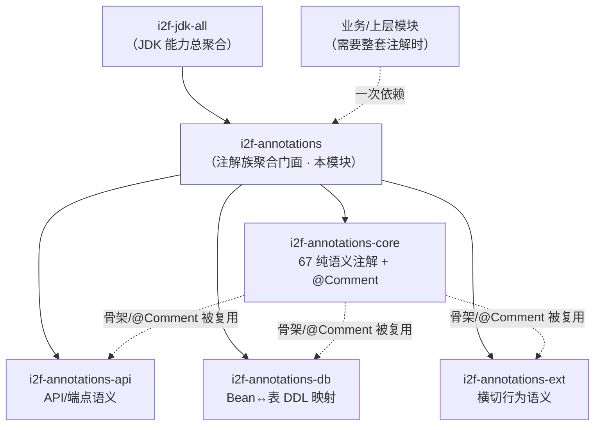

# i2f-annotations

> i2f 注解体系的**聚合（aggregate）模块**，本身不含任何 Java 源码，仅通过 POM 将注解家族的四个分支——`i2f-annotations-core`（纯语义标记）、`i2f-annotations-ext`（横切行为语义）、`i2f-annotations-db`（Bean↔表 DDL 映射）、`i2f-annotations-api`（API/端点语义）——汇总为一个坐标，供使用方「一次依赖、全套注解」引入，避免逐个声明。它是注解族的门面型（facade / umbrella）POM，与 `i2f-jdk-all`、`i2f-graphics-all` 等 `-all` 聚合模块定位一致。

## 模块路径

- `i2f-jdk/i2f-annotations`

## 模块依赖

| GroupId | ArtifactId | Scope | Optional | 说明 |
|---------|-----------|-------|----------|------|
| i2f.turbo | i2f-annotations-core | compile | false | 注解核心库：67 个纯语义标记/约束注解（base/check/doc/env/except/format/naming/resources/value/version 十类），并定义全族共用的 `@Comment` 自描述元注解 |
| i2f.turbo | i2f-annotations-api | compile | false | API 描述注解库：`@Module`/`@System`/`@Method`/`@Label`/`@Operation`/`@Protocol` 等协议无关接口语义标注 |
| i2f.turbo | i2f-annotations-db | compile | false | 数据库映射注解库：`@Table`/`@Column`/`@Primary`/`@Foreign`/`@Index` 等 Bean↔表 DDL 映射语义 |
| i2f.turbo | i2f-annotations-ext | compile | false | 注解扩展库：缓存/重试降级/锁/事务/调度/异步编排/字典翻译/文本整形等横切行为语义声明 |

> - 四个依赖**均不写 `<version>`**，版本由父 POM `i2f-jdk`（`1.0-jdk8`）沿继承链的 `dependencyManagement` 统一管理，保证与仓库内其它模块版本一致。
> - 本模块无第三方依赖，也不引入 `lombok`；`i2f-annotations-ext`/`i2f-annotations-db` 对 `i2f-enums`（`IDict`）、各分支对 `i2f-annotations-core` 的依赖会随传递引入。

## 模块设计

### 定位：聚合门面（Umbrella POM）

`i2f-annotations` 是注解族唯一「不产出 class、只聚合坐标」的模块。其 `<packaging>` 沿用父 POM 默认（jar），但因没有 `src/`，产物为一个仅含 `META-INF`（由 `maven-assembly-plugin` 生成）的空壳 jar，真正的注解内容全部来自四条 compile 依赖的传递。



### 两种引入方式对照

| 场景 | 引入坐标 | 说明 |
|------|----------|------|
| 需要全部四类注解 | `i2f.turbo:i2f-annotations` | 一次拿齐 core+api+db+ext，书写最省 |
| 仅需某一类，追求最小依赖 | `i2f-annotations-core` / `-db` / `-api` / `-ext` | 例如 `i2f-database-metadata-bean` 只依赖 `-db`、`i2f-proxy-handlers` 只依赖 `-ext`，避免拉入无关注解 |

> 仓库内既有「聚合引入」也有「精准引入」：`i2f-jdk-all` 同时列出了 `i2f-annotations` 与四个分支；而 `i2f-bql`（core+db）、`i2f-jdbc-proxy`（core+db）、`i2f-http-proxy`（core）、`i2f-database-metadata-bean`（db）、`i2f-proxy-handlers`（ext）等则按需单独依赖具体分支。本模块服务于「不想区分、一次到位」的使用方。

### 包结构

无 `src/main/java`，模块根仅一个 `pom.xml`：

```
i2f-annotations/
└── pom.xml   # 声明 4 条 compile 依赖 + maven-assembly-plugin，无源码
```

## 模块目的

- **降低使用门槛**：把一个「注解族」压缩成单一 Maven 坐标，使用方无需记忆/罗列四个 artifactId。
- **统一版本口径**：作为聚合点，配合父 POM `dependencyManagement` 保证四分支同版本引入，杜绝版本错配。
- **维护族边界**：注解族内部分支若增删（如未来加入 `-spring` 分支），只需修改本聚合 POM，下游对 `i2f-annotations` 的依赖无需变动。

## 模块功能

| 能力 | 入口 | 说明 |
|------|------|------|
| 一站式引入注解族 | `<dependency>i2f.turbo:i2f-annotations</dependency>` | 传递带来 core/api/db/ext 四支全部注解类型 |
| 供总聚合复用 | 被 `i2f-jdk-all` 依赖 | 作为 JDK 能力全集的注解组成部分 |
| 自描述即文档 | （经 core 的 `@Comment`） | 聚合本身不新增注解，注解语义由各分支承载 |

## 模块主要使用方法

**1）一次依赖引入全套注解（在业务/上层模块的 POM 中）：**

```xml
<dependency>
    <groupId>i2f.turbo</groupId>
    <artifactId>i2f-annotations</artifactId>
    <!-- 版本由父 POM dependencyManagement 管理，无需书写 -->
</dependency>
```

引入后即可直接使用四支中的任意注解，例如：

```java
import i2f.annotations.core.doc.Comment;      // 来自 core
import i2f.annotations.api.Module;            // 来自 api
import i2f.annotations.db.Table;             // 来自 db
import i2f.annotations.ext.call.Retry;       // 来自 ext
```

**2）配合 `maven-assembly-plugin`：** 本模块 build 段仅声明该插件（继承父配置），用于产出聚合 jar；使用方无需感知，正常按依赖引入即可。

**注意事项：**

- 本模块**不含任何注解定义**，不要期望在其 jar 内 `i2f.annotations.*` 包下找到 class——所有类型均来自四条传递依赖。
- 若仅需单一分支，优先直接依赖对应分支模块（见「两种引入方式对照」），避免引入无关注解带来的类路径膨胀。
- 添加新的注解分支时，需同步在此 POM 的 `<dependencies>` 追加，并视需要更新各分支文档与 `menus.md`。

## 模块特性总结

- **纯聚合 / 零源码**：整个模块只有一个 `pom.xml`，不产出自有类型，是注解族的门面坐标。
- **一次引入四支**：core（67 纯语义）+ api（接口语义）+ db（DDL 映射）+ ext（行为语义）随传递依赖全部到位。
- **版本集中托管**：四条依赖均省略 `<version>`，由父 `i2f-jdk`（`1.0-jdk8`）`dependencyManagement` 统一。
- **与精准引入并存**：`i2f-jdk-all` 走聚合，`i2f-database-metadata-bean`/`i2f-proxy-handlers` 等按需精准依赖单支；两种风格各司其职。
- **零第三方依赖**：不引入任何三方库，注解族整体构建于 JDK 注解与 `i2f-enums` 之上。

## 相关模块

- 被聚合的四支：[i2f-annotations-core](./i2f-annotations-core/readme.md)、[i2f-annotations-api](./i2f-annotations-api/readme.md)、[i2f-annotations-db](./i2f-annotations-db/readme.md)、[i2f-annotations-ext](./i2f-annotations-ext/readme.md)
- 上游总聚合：`i2f-jdk-all`（JDK 能力全集，依赖本模块）
- 同类聚合范式参考：`i2f-graphics`（`-2d`/`-3d` 聚合）等 `-all`/门面 POM
