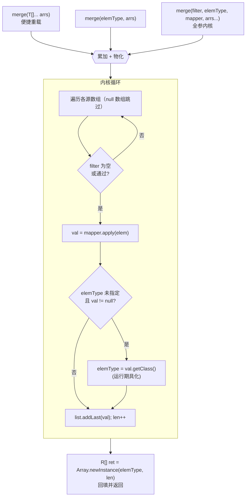

# i2f-array

> 数组工具模块，以单一静态门面类 `ArrayUtil` 收录 **458 个 `public static` 方法**，覆盖数组的判定、反射式读写、构造、与集合互转、映射/过滤、合并、二维扁平化、填充/重置、拷贝（新建 / 写入目标）、反转、比较与相等判断等操作。对**对象数组**与**全部 8 种基本类型数组**（`int/long/short/byte/char/float/double/boolean`）分别提供重载，配合 `Predicate`/`Function`/`Supplier`/`Comparator`/`BiPredicate` 等函数式钩子与 `elemType` 泛型具化，形成一套「零依赖、纯 JDK」的统一数组操作骨架。

## 模块路径

- `i2f-jdk/i2f-array`

## 模块依赖

| GroupId | ArtifactId | Scope | Optional | 说明 |
|---------|-----------|-------|----------|------|
| — | — | — | — | 无 Maven 依赖（`pom.xml` 无 `<dependencies>` 块，仅继承父 `i2f-jdk`） |

> 本模块是**零依赖叶子模块**，`ArrayUtil` 只 import `java.lang.reflect.Array`、`java.util.*` 与 `java.util.function.*`，完全构建在 JDK8 之上，不引用任何 i2f 内部模块，可被任意模块安全依赖。

## 模块设计

### 单一静态门面（Static Facade）

整个模块只有一个类 `i2f.array.ArrayUtil`（3886 行、458 个 `public static` 方法、无实例状态、无字段、无构造约定），API 呈「一族无副作用为主的静态函数集合」。方法可按职责归为若干族：

| 方法族 | 代表方法 | 职责 |
|--------|----------|------|
| 反射式通用读写 | `isArray` / `arrayLength` / `arrayGet` / `arraySet` / `arrayGetRegion` / `arraySetRegion` | 基于 `java.lang.reflect.Array`，对**编译期未知类型**（含基本类型数组）以 `Object` 统一读写/取子区间 |
| 构造 / 工厂 | `of` / `ofInt` … `ofBoolean` / `newArray` | 变长参数便捷建数组；按 `elemType` 或样本数组分配新数组 |
| 数组 ↔ 集合 | `oneList` / `ofList` / `ofAsCollection` / `ofCollection` / `toList` / `asCollection` / `toCollection` | 对象与基本类型数组装箱转 `List`/任意 `Collection`（`Supplier<C>` 指定实现） |
| 映射 / 过滤构建 | `ofArray` / `ofIntArray` … `ofBooleanArray` | 由 `Iterator` 或源数组，经 `filter`+`mapper`+`elemType` 生成（基本或对象）数组 |
| 合并 | `merge` / `mergeInt` … `mergeDouble` | 多数组拼接，支持 `filter`/`mapper`/`elemType` |
| 二维扁平化 | `flat` / `flatInt` … `flatDouble` | `T[][]`（或 `int[][]` 等）展平为一维，支持 `filter`/`mapper` |
| 填充 / 重置 | `fill`（常量 / `Supplier` 生成器）/ `reset` | 整体或 `[index, length)` 区间填值 / 填默认值（`null`/`0`/`false`） |
| 拷贝 | `copy` / `copyInt` … `copyDouble` | 复制为**新数组**，支持区间、`elemType` 重化、`mapper` 转换 |
| 拷贝到目标 | `copy2` | 写入**已有目标数组**（带 `index`/`length`/`offset`/`mapper`），返回 `dst` |
| 反转 | `reverse` | **原地**双指针反转，支持区间 |
| 比较 | `compare` | 字典序逐元素比较（对象需 `Comparator`，基本类型用自然序），空值安全 |
| 相等 | `equal` / `equal(..., BiPredicate)` | 逐元素相等判断（对象默认 `Objects::equals`，基本类型 `==`），长度需一致 |

### 核心模式： telescoping 重载 → 单一收集核心

绝大多数「产出数组」的方法（`ofArray` / `merge` / `flat` / `copy` …）都以**一个全参重载为内核**，其余便捷重载用默认值委托过去。内核统一采用「`LinkedList` 累加 → `Array.newInstance(elemType, len)` 物化」的两段式收集：



要点：
- **泛型具化（reification）**：因擦除，产出 `R[]` 需 `Class<R> elemType`；未显式传入时，从**首个非空映射值**的 `getClass()` 推断（`copy(T[] arr)`、`ofArray(T[] arr)` 则直接用源数组的 `getComponentType()`）。
- **对象版本保留 `null`**，而**基本类型版本（`ofIntArray`/`mergeInt`/`flatInt`/`copyInt` …）会跳过 `mapper` 返回的 `null`**（基本数组无法容纳 null），故其输出长度可能小于输入。
- **空值安全**：源数组为 `null` 时跳过、不抛异常（合并/扁平场景）。

### 位置区间约定（region）

`copy` / `reverse` / `fill` / `reset` / `arrayGetRegion` / `copy2` 等提供 `(arr)`、`(arr, index)`、`(arr, index, length)` 三级重载，内部以 **`length = -1` 表示「到末尾」**，当 `length > 0` 时用 `Math.min(剩余, length)` 收敛：

```java
public static <T> T[] copy(T[] arr)          { return copy(arr, 0, -1, elemType, e -> e); }
public static <T> T[] copy(T[] arr, int index){ return copy(arr, index, -1, ...); }
// 内核：int size = arr.length - index; if (length > 0) size = Math.min(size, length);
```

### `copy` 与 `copy2` 的分工

| | 分配新数组？ | 目标 | 典型用途 |
|---|---|---|---|
| `copy` | 是（`Array.newInstance`） | 返回全新数组 | 截取子区间、类型转换、映射生成副本 |
| `copy2` | 否 | 写入调用方提供的 `dst`（可带 `offset`），返回 `dst` | 近似 `System.arraycopy`，避免额外分配、支持异类/映射搬运 |

### 包结构

```
i2f-array
└── src/main/java/i2f/array/
    └── ArrayUtil.java   # 唯一类：458 个 public static 方法（判定/读写/构造/互转/映射/合并/扁平/填充/拷贝/反转/比较/相等）
```

## 模块目的

- **补齐 JDK 缺口**：`java.util.Arrays` 不含「多数组合并、二维扁平化、映射拷贝、类型具化构造、函数式过滤」等能力，本模块以统一门面集中提供。
- **对象数组与基本类型数组统一**：对 8 种基本类型各给专用重载，既免去手动装箱，又能**产出基本类型数组**（`int[]`…）而非包装类型。
- **零依赖可移植**：纯 JDK 实现，可下沉到任何模块（含注解、SPI 等最底层组件）而不引入传递依赖。

## 模块功能

| 功能 | 入口示例 |
|------|----------|
| 判断是否数组 / 取长度 / 任意数组读写 | `isArray(obj)`、`arrayLength(arr)`、`arrayGet(arr, i)` |
| 简洁构造 | `of(1,2,3)`、`ofInt(1,2,3)`、`newArray(String.class, 10)` |
| 数组转集合 | `toList(intArr)`、`asCollection(HashSet::new, objArr)` |
| 过滤 + 映射 + 类型转换 | `ofArray(list.iterator(), String.class, s -> !s.isEmpty(), s -> s)` |
| 多数组合并 | `merge(a, b, c)`、`mergeInt(intA, intB)` |
| 二维降一维 | `flat(matrix)`、`flatInt(intMatrix)` |
| 批量赋值 / 复位 | `fill(arr, 0)`、`fill(arr, () -> nextId())`、`reset(arr)` |
| 区间复制 / 映射复制 | `copy(arr, 2, 5)`、`copy(objArr, Integer.class, T::hashCode)` |
| 复制到目标（带偏移） | `copy2(src, dst, 0, src.length, dstOff)` |
| 原地反转 | `reverse(arr)`、`reverse(arr, from, len)` |
| 比较 / 相等 | `compare(a, b, cmp)`、`equal(a, b)`、`equal(a, b, BiPredicate)` |

## 模块主要使用方法

**1）构造与互转：**

```java
int[] ids = ArrayUtil.ofInt(1, 2, 3, 4);
List<Integer> boxed = ArrayUtil.toList(ids);          // 基本数组 → List（自动装箱）
Set<String> set = ArrayUtil.asCollection(HashSet::new, new String[]{"a", "b"});
```

**2）过滤 + 映射 + 类型具化（产出基本类型数组）：**

```java
String[] words = {"hi", "", "yo", null};
// 去空、转大写，产出 String[]（显式给 elemType 规避空结果时无法具化）
String[] upper = ArrayUtil.ofArray(words, String.class, w -> w != null && !w.isEmpty(), w -> w.toUpperCase());
// 映射为 int[]：null 结果会被自动跳过
int[] lens = ArrayUtil.copyInt(words, String::length);
```

**3）合并 / 二维扁平化：**

```java
Integer[] all = ArrayUtil.merge(Integer.class, a, b, c); // 建议传 elemType，避免全空时无法具化
int[] flat  = ArrayUtil.flatInt(new int[][]{{1,2},{3},{}});
```

**4）区间复制 / 原地反转 / 比较：**

```java
int[] sub  = ArrayUtil.copy(src, 2, 5);     // 从 index=2 起最多 5 个
ArrayUtil.reverse(sub);                      // 原地反转，返回同一引用
int cmp    = ArrayUtil.compare(sub, other);  // 字典序，null 安全
boolean eq = ArrayUtil.equal(sub, other);    // 逐元素相等，长度须一致
```

**5）写入已有目标（`copy2`，近似 arraycopy）：**

```java
char[] dst = new char[10];
ArrayUtil.copy2(src, 0, 4, dst, 2); // src[0..4) → dst[2..6)
```

**注意事项：**

- **空结果 + 未指定 `elemType` 会抛 `NullPointerException`**：`merge`/`ofArray`/`flat` 等在无任何存活元素且未传 `elemType` 时，`Array.newInstance(null, 0)` 因组件类型为 `null` 失败——对可能为空的转换请显式传 `elemType`。
- **基本类型版本静默丢弃 `null` 映射值**：`copyInt`/`mergeInt`/`flatInt`/`ofIntArray` 等遇到 `mapper` 返回 `null` 会跳过，结果长度可能小于输入；对象版本则保留 `null`。
- **`copy` vs `copy2`**：前者总是分配新数组，后者写入你给定的 `dst` 并返回它（需自行保证 `dst` 容量足够，越界由数组访问抛出）。
- **`reverse`/`fill`/`reset` 为原地操作**，直接修改入参数组并返回同一引用；勿误当作纯函数。
- **`equal`/`compare` 的长度语义**：`equal` 要求长度一致（多出的元素判不等）；`compare` 在公共前缀相等时以长度作最终序（较长者返回 `1`），且 `null` 引用排在非 `null` 之前。
- **region 的 `length` 约定**：内部以 `-1` 表「到末尾」，`>0` 才 `Math.min` 收敛；请优先使用不带 `length` 或传正数的重载。

## 模块特性总结

- **一函数一职责、全 `public static`**：458 个无状态静态方法，按需调用、易检索。
- **对象 + 8 基本类型全覆盖**：每类操作对 `T[]` 与 `int[]/long[]/short[]/byte[]/char[]/float[]/double[]/boolean[]` 各给重载。
- **函数式可组合**：`Predicate`（过滤）、`Function`（映射）、`Supplier`（生成器 / 集合工厂）、`Comparator`、`BiPredicate` 贯穿全族。
- **泛型具化友好**：`elemType` 显式指定或从源/首个非空值推断，产出真实类型数组。
- **纯 JDK、零依赖**：仅 `java.lang.reflect.Array` + `java.util` + `java.util.function`，可作最底层工具被任意模块引入。
- **空值安全但有边界**：源为 `null` 跳过；对「空结果无 `elemType`」「基本数组丢 null」等边界需知悉。

## 相关模块

- 同族集合侧工具：`i2f-container`、`i2f-array` 的兄弟——`i2f-iterator`（迭代器操作）
- 反射式类型处理可配合：`i2f-reflect`（本模块不依赖它，仅用 JDK 反射）
