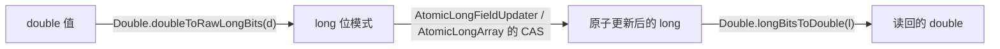
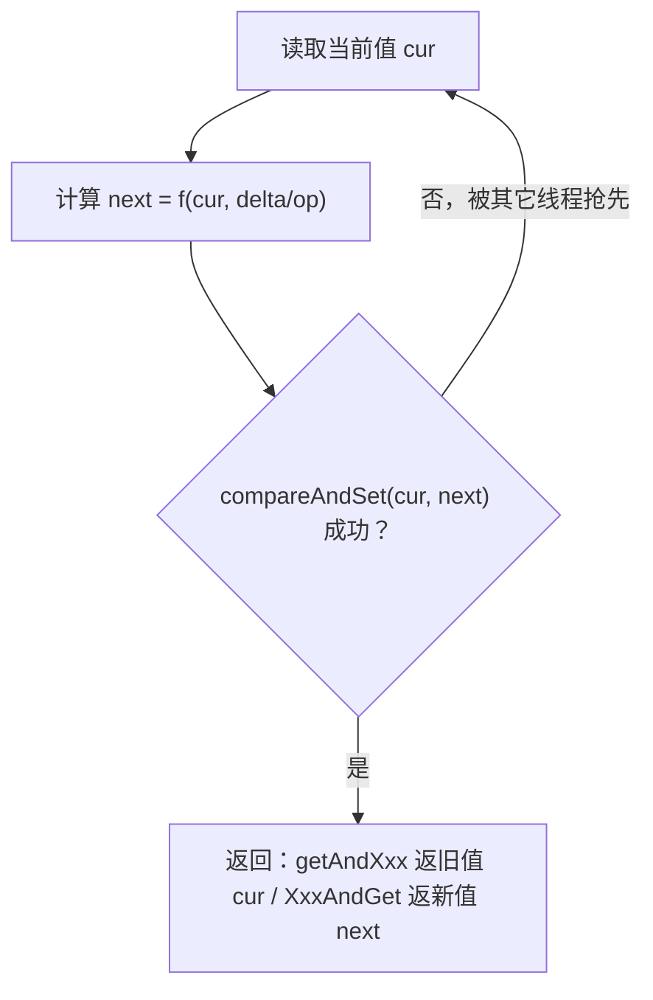

# i2f-atomic

> 原子变量补充模块，提供 JDK 标准库**从未内置**的两个无锁（lock-free）原子类型——`AtomicDouble` 与 `AtomicDoubleArray`。二者把 `double` 经 `Double.doubleToRawLongBits` 编码进 `long`，复用 `java.util.concurrent.atomic` 已有的 `AtomicLongFieldUpdater` / `AtomicLongArray` 做 CAS，从而在不引入任何第三方库（如 Guava 的同名实现）的前提下，补齐 `java.util.concurrent.atomic` 家族中「单个 double」与「double 数组」两处缺失的原子能力，语义与 `AtomicInteger`/`AtomicLongArray` 完全对齐。

## 模块路径

- `i2f-jdk/i2f-atomic`

## 模块依赖

| GroupId | ArtifactId | Scope | Optional | 说明 |
|---------|-----------|-------|----------|------|
| — | — | — | — | 无 Maven 依赖（`pom.xml` 无 `<dependencies>` 块，仅继承父 `i2f-jdk`） |

> 本模块是**零依赖叶子模块**，两个类全部构建于 JDK 标准库之上：`java.util.concurrent.atomic.AtomicLongFieldUpdater`、`java.util.concurrent.atomic.AtomicLongArray`、`java.util.function.DoubleUnaryOperator`/`DoubleBinaryOperator`、`java.io.Serializable`/`ObjectInput(Stream)`/`ObjectOutput(Stream)`。可被任意模块安全依赖，不引入任何传递依赖。

## 模块设计

### 为什么要自建：JDK 的空白

`java.util.concurrent.atomic` 为 `int`/`long`/`boolean`/引用/数组都提供了原子类，**唯独没有 `AtomicDouble`/`AtomicFloat` 及其数组版本**。JDK 给出的高并发浮点求和替代是 `DoubleAdder`/`DoubleAccumulator`（面向高吞吐累加、不保证单次 `get()` 的强一致，也没有 `compareAndSet`）。当需要「对单个 double 做精确 CAS / 增减 / 函数式更新」或「对一组 double 逐元素原子操作」时，标准库无对应类型，社区通常引入 Guava 的 `AtomicDouble(Array)`。本模块以极小的代价自研等价实现，**免除对 Guava 的依赖**。

### 核心技巧：double ↔ raw long bits 编码

浮点值本身无法被 `AtomicLong*` 直接原子写，故用位级转换把 `double` 塞进可原子操作的 `long` 容器：



- 使用 `doubleToRawLongBits`/`longBitsToDouble`（而非会规范化 NaN 的 `doubleToLongBits`）：更快，且完整保留 NaN 的 payload，保证「写入什么位模式就读回什么位模式」，与 CAS 的位比较语义天然契合。

### `AtomicDouble` —— 单值原子

`extends Number implements Serializable`，字段仅一枚 `transient volatile long value`（存 raw bits）。

- **单字段 CAS 靠 `AtomicLongFieldUpdater`**：静态持有 `AtomicLongFieldUpdater.newUpdater(AtomicDouble.class, "value")`，避免每实例一个 `AtomicLong` 对象的开销，是 JDK 对「单 volatile long 字段」做原子操作的标准做法。
- **`get/set/lazySet/getAndSet/compareAndSet/weakCompareAndSet`** 均直接对 `long` 位模式做原子操作，进出各做一次位转换。
- **算术与函数式更新**：`getAndIncrement/Decrement`＝`getAndAdd(±1.0)`；`getAndAdd`/`addAndGet` 以 `do { 读位→解 double→加 delta→编码→CAS } while(!cas)` 自旋实现；`getAndUpdate`/`updateAndGet`（`DoubleUnaryOperator`）、`getAndAccumulate`/`accumulateAndGet`（`DoubleBinaryOperator`）同理，返回旧值或新值二选一。
- **`Number` 契约**：`doubleValue()` 即 `get()`，`intValue/longValue/floatValue` 做窄化转换；`toString()` 输出当前 double 文本。
- **序列化**：因 `value` 为 `transient`，自定义 `writeObject`/`readObject` 显式 `writeDouble(get())`/`set(readDouble())`，令持久化走「值」而非「位」。

### `AtomicDoubleArray` —— 数组原子

`implements Serializable`，内部委托一枚 `final AtomicLongArray array`（JDK 原生，逐元素原子）。

- 构造：`AtomicDoubleArray(int length)` 建全零数组；`AtomicDoubleArray(double[] array)` 逐元素 `doubleToRawLongBits` 灌入。
- 逐元素方法 `get/set/lazySet/getAndSet/compareAndSet/weakCompareAndSet(i, …)` 与单值版一一对应，只是多一个下标 `i` 并转调 `AtomicLongArray` 的同名方法。
- 逐元素算术/函数式更新：`getAndIncrement(i)`…`accumulateAndGet(i, x, op)` 同样基于 `get(i)`+`compareAndSet(i, …)` 的无锁自旋。
- `length()` 返回元素个数；`toString()` 输出 `[v0, v1, …]`。

### 统一的无锁自旋骨架

所有「读-改-写」复合操作都遵循同一 CAS 循环：



## 模块目的

- 用**极小、零依赖**的实现补齐 JDK 原子类家族中缺失的 `double` 原子能力，替代对 Guava `AtomicDouble`/`AtomicDoubleArray` 的依赖。
- 在**无锁**（基于 CAS）前提下为单个 double 与 double 数组提供线程安全的读、写、自增/自减、加法、函数式更新与规约，适配计数、累加、并发统计、金融/指标聚合等场景。
- 保持与 `java.util.concurrent.atomic` 家族**一致的命名与语义**（`getAndXxx` vs `xxxAndGet`、`compareAndSet`/`weakCompareAndSet`/`lazySet`、`Number` 契约、`Serializable`），使熟悉 `AtomicLong`/`AtomicLongArray` 的使用者可零成本迁移。

## 模块功能

| 分类 | `AtomicDouble` | `AtomicDoubleArray` |
|------|----------------|---------------------|
| 读 | `get()` | `get(int i)` |
| 写 | `set(v)` / `lazySet(v)` | `set(i,v)` / `lazySet(i,v)` |
| 交换 | `getAndSet(v)` | `getAndSet(i,v)` |
| CAS | `compareAndSet(expect,update)` / `weakCompareAndSet(...)` | `compareAndSet(i,expect,update)` / `weakCompareAndSet(...)` |
| 增减 | `getAndIncrement` / `incrementAndGet` / `getAndDecrement` / `decrementAndGet` | 各带下标 `i` 的同名方法 |
| 加法 | `getAndAdd(delta)` / `addAndGet(delta)` | `getAndAdd(i,delta)` / `addAndGet(i,delta)` |
| 函数式更新 | `getAndUpdate(DoubleUnaryOperator)` / `updateAndGet(...)` | `getAndUpdate(i,op)` / `updateAndGet(i,op)` |
| 二元规约 | `getAndAccumulate(x,DoubleBinaryOperator)` / `accumulateAndGet(x,op)` | 各带下标 `i` 的同名方法 |
| 其它 | `intValue/longValue/floatValue/doubleValue`、`toString`、序列化 | `length()`、`toString()` |

## 模块主要使用方法

```java
import i2f.atomic.AtomicDouble;
import i2f.atomic.AtomicDoubleArray;

// 1) 单值：跨线程累加一个 double 指标
AtomicDouble rate = new AtomicDouble(0.0);
rate.addAndGet(1.5);            // -> 1.5
rate.incrementAndGet();         // -> 2.5
double before = rate.getAndSet(9.9); // 返回 2.5，值变为 9.9
rate.updateAndGet(v -> v * 2);  // -> 19.8
rate.compareAndSet(19.8, 0.0);  // 成功则置 0.0
System.out.println(rate.doubleValue()); // 复用 Number 契约

// 2) 由长度创建定长数组，逐元素原子累加
AtomicDoubleArray buckets = new AtomicDoubleArray(4);
buckets.addAndGet(2, 0.75);     // 下标 2 -> 0.75
buckets.incrementAndGet(0);     // 下标 0 -> 1.0
buckets.getAndAccumulate(1, 3.0, Math::max); // 下标 1 取 max(0,3)

// 3) 由初始 double[] 创建
AtomicDoubleArray series = new AtomicDoubleArray(new double[]{1.0, 2.0, 3.0});
series.set(1, -2.0);
System.out.println(series);     // [1.0, -2.0, 3.0]
int n = series.length();
```

**注意事项：**

- **`AtomicDouble.lazySet` 当前直接委托 `set`**（普通 volatile 写），并未使用 relaxed/延迟写语义，与其它 JDK 原子类 `lazySet` 的「延迟但最终可见」略有差异；对性能敏感且需要真正 relaxed 写入时请知悉。
- **`AtomicDouble` 的 `getAndAdd/getAndUpdate/getAndAccumulate` 语义正确**：全程在 `long` 位模式层面做 CAS（`AtomicLongFieldUpdater.compareAndSet`），不重复编解码。
- **`AtomicDoubleArray` 的 `getAndAdd(i,..)`/`getAndUpdate(i,..)`/`getAndAccumulate(i,..)` 存在编码不一致的实现瑕疵**：这三个方法先把计算结果 `doubleToRawLongBits(...)` 编码成 `long` 再隐式转回 `double` 存入局部变量，随后交给以 `double` 为入参的 `compareAndSet(i, ..)`（其内部会**再次** `doubleToRawLongBits`），造成**二次编码**，可能写入错误值；而对应的 `addAndGet`/`updateAndGet`/`accumulateAndGet`（直接传未编码 `double`）与 `getAndSet` 是正确的。**建议对数组原子的「带旧值返回」需求，优先使用 `addAndGet`/`updateAndGet`/`accumulateAndGet`，或 `getAndSet` 组合，避开这三个方法。**
- **CAS 的相等是基于位模式**：`compareAndSet` 比较的是 raw bits，`-0.0` 与 `0.0`、不同 payload 的 `NaN` 位模式不同，视为不相等；勿以 `Double.compare`/`==` 的直觉预期 CAS 命中。
- 与所有 `Atomic*` 一样，单次操作原子、线程安全，但**跨多次调用不保证复合不变式**（如「读后判断再写」仍需上层加锁或改用 CAS 循环）。

## 模块特性总结

- **补齐 JDK 空白**：提供标准库缺失的 `AtomicDouble`/`AtomicDoubleArray`，功能对齐 Guava 同名类，**零第三方依赖**。
- **纯无锁**：基于 `AtomicLongFieldUpdater`（单值）与 `AtomicLongArray`（数组）的 CAS 自旋，无 `synchronized`、无 `Lock`。
- **位编码复用**：`double ↔ raw long bits`（用 `doubleToRawLongBits` 保留 NaN payload、更快）。
- **语义与命名与 JDK `Atomic*` 家族一致**：`getAndXxx` 返旧值、`XxxAndGet` 返新值，支持 `DoubleUnaryOperator`/`DoubleBinaryOperator` 函数式更新与规约。
- **可序列化、可当 `Number` 用**：`AtomicDouble extends Number implements Serializable`（自定义读写绕开 `transient`），`AtomicDoubleArray implements Serializable`。
- **已知边界**：`AtomicDouble.lazySet` 未做 relaxed 写；`AtomicDoubleArray` 的 `getAndAdd/getAndUpdate/getAndAccumulate` 有二次编码瑕疵，宜改用其 `...AndGet` 兄弟方法。
