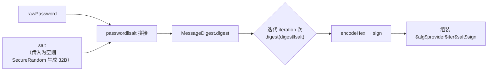
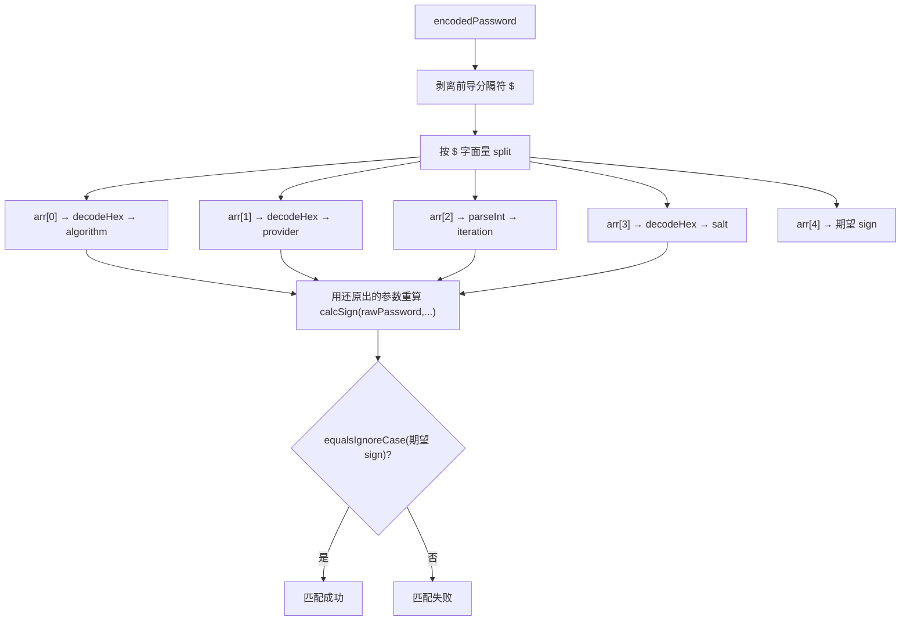

# i2f-authentication

> 认证能力**标准契约（std）** 模块：以框架无关的接口定义「密码编码 / 登录密码解码 / 用户主体（含 RBAC）」三块地基，并给出一个自描述的摘要型密码编码器实现与两组 Lombok Bean。本模块**不依赖 Spring Security / Shiro 等任何安全框架**，而是被它们实现与继承——`i2f-spring-security`、`i2f-springboot-security-starter`、`i2f-springboot-shiro-starter` 都基于此处定义的 `IPasswordEncoder` / `LoginPasswordDecoder` / `IAuthUser` / `IRbacAuthUser` 进行落地，从而实现「核心认证语义在上、框架适配在下」的解耦。

## 模块路径

- `i2f-jdk/i2f-authentication`

## 模块依赖

| GroupId | ArtifactId | Scope | Optional | 说明 |
|---------|-----------|-------|----------|------|
| — | — | — | — | **无 i2f 内部依赖**（不引用任何兄弟模块） |
| org.projectlombok | lombok | provided | true | 编译期注解处理器，仅用于 `BasicAuthUser`/`BasicRbacAuthUser` 生成 getter/setter/构造器等样板代码；由父 POM `dependencyManagement` 统一托管（版本 `1.18.44`） |

> 运行期**零三方依赖**：核心逻辑只使用 JDK 标准库 `java.security.MessageDigest`、`java.security.SecureRandom`、`java.nio.charset.StandardCharsets`、`java.util.regex.Pattern`。Lombok 为 `provided`+`optional`，不进入下游 classpath。
>
> 构建期使用 `maven-assembly-plugin`（继承父 POM 配置）。

## 模块设计

### 分层：契约（接口）与实现分离

模块按职责划分为两个包，均为「接口在上、实现下沉到 `impl`」：

```mermaid
flowchart TD
    subgraph password["i2f.authentication.password"]
        PE["IPasswordEncoder<br/>（encode / matches）"]
        LPD["LoginPasswordDecoder<br/>（decode）"]
        MDPE["impl: MessageDigestPasswordEncoder<br/>摘要 + 盐 + 多轮迭代"]
        PE -. implements .-> MDPE
    end
    subgraph user["i2f.authentication.user"]
        AU["IAuthUser<br/>（username / password）"]
        RBAU["IRbacAuthUser<br/>（roles / permissions）"]
        BAU["impl: BasicAuthUser"]
        RBAU2["impl: BasicRbacAuthUser"]
        AU <|-- RBAU
        AU -. implements .-> BAU
        RBAU -. implements .-> RBAU2
        BAU <|-- RBAU2
    end
```

- **`password` 包**：`IPasswordEncoder` 定义「明文 → 密文」编码与「明文 + 密文 → 是否匹配」校验；`LoginPasswordDecoder` 是**登录传输层的反向钩子**——当前端把密码加密后上传时，由它先解密还原出明文，再交给编码器校验。
- **`user` 包**：`IAuthUser` 是最小主体（用户名 + 密码）；`IRbacAuthUser` 继承之并追加 `roles` / `permissions` 两个 `Collection<String>`，构成 RBAC 主体模型。二者各有一个 Lombok `@Data` 实现（`BasicAuthUser` / `BasicRbacAuthUser`），均 `implements Serializable` 以便会话/缓存序列化。

### 核心：`MessageDigestPasswordEncoder` 的自描述密文格式

编码结果把**校验所需的全部参数内联进密文字符串**，形如（`crypt(3)` 风格，分隔符 `$`）：

```
$ hex(algorithm) $ hex(provider) $ iteration $ hex(salt) $ sign
```



- **参数默认值**：`algorithm="SHA-1"`、`provider=null`、`salt=""`、`iteration=1024`；提供 5 个**伸缩构造器（telescoping）** 从「全默认」到「全指定」逐级覆盖。预置静态常量 `SHA_1 = new MessageDigestPasswordEncoder("SHA-1")` 作为开箱即用的默认实例。
- **盐的处理**：`getSalt(salt)` 在传入盐为空时调用 `generateSalt()`，用 `SecureRandom` 产生 32 字节随机数并十六进制编码——因此 `SHA_1` 每次 `encode` 都会得到**不同的随机盐**，同一明文两次编码结果不同（彩虹表无效化）。
- **为什么对 algorithm/provider/salt 做 hex 编码**：这些字段可能出现 `$`，先 `encodeTextHex` 转成纯十六进制串，保证以 `$` 分割时不会误切，`matches` 再 `decodeTextHex` 还原。
- **签名大小写无关**：`encodeHex` 输出小写，`matches` 用 `equalsIgnoreCase` 比对，容忍大小写差异。

### 校验：`matches` 如何做到「零外部配置」



因为密文自描述了算法/提供者/迭代/盐，`matches` **无需读取任何实例字段或外部配置**即可复现签名——这让「存库密文」与「校验逻辑」彻底自洽，并天然支持**换算法/调迭代时的平滑迁移**（老密文按其内联参数仍可校验）。

> 注意：接口 `IPasswordEncoder` 的 `default matches` 只是「重新 `encode` 后 `equals`」的便捷实现，仅适用于**编码结果确定**（固定盐）的编码器；`MessageDigestPasswordEncoder` 因使用随机盐，**重写**了 `matches` 走上述解析路径。

### 包结构

```
i2f.authentication
├── password
│   ├── IPasswordEncoder              // 编码 / 校验契约
│   ├── LoginPasswordDecoder         // 登录传输密码解码钩子契约
│   └── impl
│       └── MessageDigestPasswordEncoder // 摘要 + 盐 + 迭代的自描述实现
└── user
    ├── IAuthUser                     // 主体契约（用户名 / 密码）
    ├── IRbacAuthUser                  // RBAC 主体契约（角色 / 权限）
    └── impl
        ├── BasicAuthUser             // @Data 实现
        └── BasicRbacAuthUser         // @Data 实现（继承 BasicAuthUser）
```

## 模块目的

- **把「认证语义」从「安全框架」中抽离**：核心只定义 `encode/matches`、`decode`、主体模型等契约，具体由 Spring Security（`SpringPasswordEncoder implements IPasswordEncoder`）、Shiro、SpringBoot starter 去适配实现，避免上层业务与具体框架强耦合。
- **提供一套安全、可自解释、可迁移的密码存储方案**：加盐 + 多轮迭代的摘要编码，密文自描述参数，校验不依赖外部状态。
- **给出可复用的最小主体模型**：`BasicAuthUser` / `BasicRbacAuthUser` 作为通用用户/角色/权限载体，被 `SecurityUser`、`ShiroUser` 等直接继承扩展。

## 模块功能

| 能力 | 载体 | 说明 |
|------|------|------|
| 密码编码 | `IPasswordEncoder.encode(raw)` | 明文 → 密文 |
| 密码校验 | `IPasswordEncoder.matches(raw, encoded)` | 默认「重编码 equals」；摘要实现重写为「解析自描述密文后重算」 |
| 摘要编码 | `MessageDigestPasswordEncoder` | 可选算法/provider/盐/迭代；默认 SHA-1、1024 轮、随机盐 |
| 随机盐生成 | `MessageDigestPasswordEncoder.generateSalt()` | `SecureRandom` 32 字节 → hex |
| 十六进制编解码 | `encodeHex`/`decodeHex`/`encodeTextHex`/`decodeTextHex` | 内部工具，也 `public static` 可复用 |
| 登录密码解码 | `LoginPasswordDecoder.decode(encodePassword)` | 前端加密上传的密码在服务端还原为明文的钩子 |
| 用户主体 | `IAuthUser` / `BasicAuthUser` | 用户名 + 密码 |
| RBAC 主体 | `IRbacAuthUser` / `BasicRbacAuthUser` | 追加 `roles` / `permissions`（`Set<String>`，默认初始化为 `HashSet`） |

## 模块主要使用方法

### 1. 摘要方式编码 / 校验密码

```java
// 直接用预置默认实例（SHA-1，随机盐，1024 轮）
IPasswordEncoder encoder = MessageDigestPasswordEncoder.SHA_1;
String stored = encoder.encode("user@pass");     // 形如 $37...$00$1024$<hexSalt>$<sign>
boolean ok = encoder.matches("user@pass", stored); // true（从密文自解析参数复算）
```

### 2. 自定义算法 / 固定盐 / 迭代轮数

```java
// 指定算法
IPasswordEncoder sha256 = new MessageDigestPasswordEncoder("SHA-256");
// 指定算法 + 固定盐（编码结果确定，可由接口 default matches 校验）
IPasswordEncoder fixed = new MessageDigestPasswordEncoder("SHA-256", "my-site-salt");
// 全参：算法 + provider + 盐 + 迭代
IPasswordEncoder full = new MessageDigestPasswordEncoder("SHA-256", null, "salt", 10000);
String enc = full.encode("pwd");
boolean match = full.matches("pwd", enc);
```

### 3. 落地登录传输层解码钩子

```java
// 前端用约定方式加密（如 RSA/AES）上传密码时：
public class RsaLoginDecoder implements LoginPasswordDecoder {
    public String decode(String encodePassword) {
        return rsaPrivateKeyDecrypt(encodePassword); // 还原为明文，再交给 IPasswordEncoder.matches
    }
}
```

### 4. 承载用户与 RBAC 主体

```java
BasicAuthUser u = new BasicAuthUser();
u.setUsername("ice2faith");
u.setPassword(MessageDigestPasswordEncoder.SHA_1.encode("raw"));

BasicRbacAuthUser ru = new BasicRbacAuthUser();
ru.setUsername("admin");
ru.setPassword("...");
ru.getRoles().add("ROLE_ADMIN");            // roles/permissions 已初始化为 HashSet
ru.getPermissions().add("user:write");
```

### 注意事项

- **随机盐使编码不确定**：`SHA_1` 等默认实例（盐为空 → 每次随机），同一明文多次 `encode` 结果不同，只能用配套的 `matches` 校验，不能用字符串 `equals` 比较两次 `encode` 输出。
- **`matches` 对密文格式敏感**：`MessageDigestPasswordEncoder.matches` 按 `$` 严格切分出 5 段（algorithm/provider/iteration/salt/sign），传入非本格式生产的密文会抛 `IllegalArgumentException`（内部异常统一包装）。
- **接口 `default matches` 的适用边界**：仅当编码器 `encode` 结果确定（固定盐）时，默认「重编码 equals」才成立；随机盐实现必须重写 `matches`。
- **安全强度提示**：默认 `SHA-1` + `1024` 轮属历史级配置，生产环境建议显式选用更强的 `algorithm` 并调大 `iteration`（如 `SHA-256` / 更高轮数）。
- **`IAuthUser.getPassword()` 语义**：契约只约定「取密码」，存明文还是密文由使用方决定；框架 starter 通常在其中存放编码后的密文。

## 模块特性总结

- **框架无关的认证契约层**：`IPasswordEncoder` / `LoginPasswordDecoder` / `IAuthUser` / `IRbacAuthUser` 四个接口是 Spring Security、Shiro、SpringBoot starter 共同实现/继承的上游抽象，实现「核心在上、适配在下」。
- **自描述密文格式**：`$hex(alg)$hex(provider)$iter$hex(salt)$sign` 把校验参数内联，`matches` 无需外部配置即可复算，天然支持算法/迭代迁移。
- **加盐 + 多轮迭代（密钥拉伸）**：`SecureRandom` 随机盐 + `digest(digest‖salt)` 迭代，抵御彩虹表与暴力破解。
- **字段 hex 化防分隔符冲突**：algorithm/provider/salt 先十六进制编码再以 `$` 拼接，规避字段内含分隔符导致的解析歧义。
- **伸缩构造器 + 预置常量**：5 个构造器覆盖不同配置粒度，`SHA_1` 常量提供零配置默认实例。
- **Lombok 精简主体 Bean**：`@Data`+`@NoArgsConstructor` 的两级 Bean（基础 / RBAC），`Serializable` 便于会话与缓存；Lombok 为 `provided`+`optional`，运行期零负担。
- **运行期零三方依赖**：仅使用 JDK `java.security` 与集合 API，符合 `i2f-jdk` 分组的「零依赖通用能力」定位。
