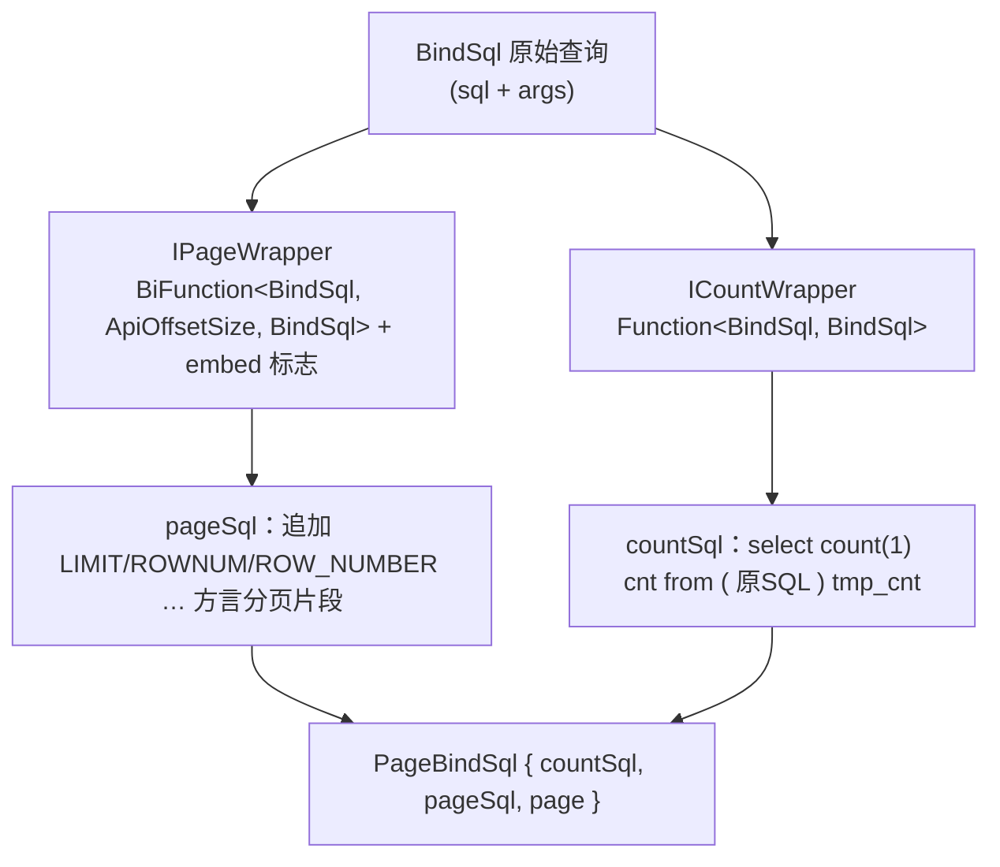
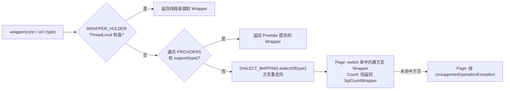

# i2f-bindsql-page

> 分页 / 计数 SQL 方言适配器模块。在 `i2f-bindsql` 的 `BindSql`（SQL 文本 + 绑定参数）之上，针对**主流关系库的分页语法差异**提供一层可插拔的方言改写：`IPageWrapper` 把一条查询改写成各库的「取第 N 页」语句，`ICountWrapper` 把同一条查询改写成 `select count(1)` 总数语句。`BindSqlWrappers.page(...)` 一次产出 `PageBindSql{countSql, pageSql, page}` 供持久层执行。它解决的是「同一段 SQL 在 MySQL / Oracle / PG / SQLServer / DB2 … 下分页写法各不相同」的痛点，并保留 `?` 参数化、支持 SPI/ThreadLocal 多级扩展。

## 模块路径

- `i2f-jdk/i2f-bindsql-page`

## 模块依赖

| GroupId | ArtifactId | Scope | Optional | 说明 |
|---------|-----------|-------|----------|------|
| i2f.turbo | i2f-bindsql | compile | false | 提供被改写的 `BindSql`（`getSql()` / `getArgs()` / `new BindSql(sql)`） |
| i2f.turbo | i2f-page | compile | false | 提供分页参数模型 `ApiOffsetSize`（offset / size / end + `prepare()`） |
| i2f.turbo | i2f-database-type | compile | false | 提供 `DatabaseType` 方言枚举与 `DatabaseDialectMapping` 方言重定向 |
| org.projectlombok | lombok | provided | true | 编译期注解处理（`@Data` / `@NoArgsConstructor`，仅用于 `PageBindSql`） |

> 本模块**运行期零三方依赖**，仅依赖三支 i2f 内部兄弟模块与 JDK（`java.sql`、`java.util.ServiceLoader`、`java.util.concurrent`）。它是 `i2f-bindsql` 的**上层扩展**——只消费 `BindSql`，不修改其内核。

## 模块设计

### 双扩展点：分页改写 与 计数改写

模块围绕两个对称的函数式契约展开，都作用于 `BindSql` 并**返回新的 `BindSql`**（不改入参）：



- `IPageWrapper.apply(BindSql, ApiOffsetSize, boolean embed)` 是唯一的抽象方法，`embed` 决定是否把 offset/size **内联进 SQL 文本**还是用 `?` 参数化。
- `ICountWrapper extends Function<BindSql, BindSql>`，直接复用函数式语义，单一默认实现 `SqlCountWrapper` 用子查询包一层。

### 统一的四级解析链（Page 与 Count 结构一致）

`PageWrappers.wrapper(...)` 与 `CountWrappers.wrapper(...)` 都提供 `Connection` / `jdbcUrl` / `DatabaseType` 三种入口（前两者先探测出 `DatabaseType`），解析优先级完全相同：



1. **`WRAPPER_HOLDER`（ThreadLocal）**：允许调用方在当前线程强制指定一种 Wrapper（应对特殊库、灰度、测试），优先级最高。
2. **`PROVIDERS`（`CopyOnWriteArraySet`）**：可插拔的注册式扩展；`PageWrappers` 在 `static` 块中通过 `ServiceLoader.load(IPageWrapperProvider.class)` 自动装配 SPI 实现，`CountWrappers` 则需**编程式 `add`**（无 `static` SPI 块）——这是两者的细微不对称。
3. **`DIALECT_MAPPING.dialectOf(type)`（方言重定向）**：把众多小众库归并到语法兼容的基础方言后再查表。
4. **内置分发**：`PageWrappers` 用 `switch` 映射到 9 个 `*PageWrapper.INSTANCE`；`CountWrappers` 因只有一种计数写法，恒返回 `SqlCountWrapper.INSTANCE`。

### 方言重定向表（`PageWrappers.DIALECT_MAPPING`）

`init()` 中登记大量 `redirect(源, 目标)`，让小方言复用兼容的大方言分页写法：

| 目标方言 | 重定向进来的源方言 |
|---------|-------------------|
| `MYSQL` | MARIADB、GBASE、XU_GU、CLICK_HOUSE、OCEAN_BASE、Hive、TDengine、HerdDB |
| `POSTGRE_SQL` | OSCAR、H2、SQLITE、HSQL、KINGBASE_ES、PHOENIX、GAUSS、HighGo、YaShanDB、Snowflake、Databricks、RedShift、Trino |
| `ORACLE` | DM（达梦） |
| `SQL_SERVER` | ORACLE_12C、FIREBIRD |

> 注意：`FIREBIRD` 被重定向到 `SQL_SERVER`，因此虽然本模块提供了 `FirebirdPageWrapper`，但它**不在 `switch` 分发路径内**（`switch` 无 `FIREBIRD` case，且重定向已先行改写），只能通过自定义 `IPageWrapperProvider` 或直接使用 `FirebirdPageWrapper.INSTANCE` 触达。

### 各分页方言的 SQL 模板

以 `offset`（起始下标，0 基）、`size`（页大小）、`end = offset + size`（`ApiOffsetSize.prepare()` 计算的**排他**结束下标）为变量，`embed=true` 时把数值直接写入文本，`embed=false` 时用 `?` 占位并按顺序追加到 `args`：

| 方言 | offset+size 时的分页片段 | 参数顺序 |
|------|--------------------------|----------|
| MySQL | `原SQL \n limit offset , size` | offset, size |
| PostgreSQL | `原SQL \n limit size offset offset` | size, offset |
| SQL Server | `原SQL \n offset offset rows fetch next size rows only` | offset, size |
| Oracle | 双层嵌套 `SELECT * FROM (SELECT ROWNUM PAGE_ROW_ID,TMP_PAGE.* FROM (原SQL) TMP_PAGE WHERE ROWNUM < end+1) TMP WHERE PAGE_ROW_ID >= offset+1` | end+1, offset+1 |
| DB2 | 嵌套 `ROWNUMBER() OVER() AS PAGE_ROW_ID … WHERE PAGE_ROW_ID >= offset+1 AND PAGE_ROW_ID < end+1` | offset+1, end+1 |
| CirroData | `原SQL \n limit (offset+1 , end)` | offset+1, end |
| IBM AS400 | `原SQL \n offset offset rows fetch first size rows only` | offset, size |
| Informix | `select skip offset first size * from (原SQL) TMP_PAGE` | offset, size |

> 每个 Wrapper 都对「只有 offset」「只有 size/end」做了降级分支（例如 MySQL 只有 offset 时用 `limit offset , Integer.MAX_VALUE`）。`page == null` 时原样返回、不分页。

### `embed` 标志的意义

- **参数化（embed=false）**：`apply(BindSql, page)` 默认路径，把 offset/size 作为 `?` 追加到 `args`，交给 `PreparedStatement` 绑定——用于 `i2f-jdbc-impl` 等直接走 JDBC 的场景。
- **内联（embed=true）**：`apply(String, page)` 便捷路径，把数值拼进 SQL 文本——用于 **MyBatis** 这类自行管理参数映射、无法为追加的 offset/size 提供绑定位点的框架（`MybatisPaginationProxyHandler.wrapPageSql` 正是调用 `apply(boundSql.getSql(), page)`）。

## 模块目的

- **屏蔽方言差异**：让上层只需给出「一条普通查询 + 分页参数」，由本模块按目标库方言生成正确的分页/计数 SQL。
- **保留参数化安全**：分页数值在 JDBC 场景仍以 `?` 绑定，不破坏 `BindSql` 的「文本与参数同行流动」契约。
- **可插拔可扩展**：ThreadLocal 强制、SPI/编程式 Provider 注册、方言重定向表三级扩展，无需改动内核即可支持新库或特殊策略。
- **与 MyBatis 等框架解耦协作**：通过 `embed` 双模式同时满足「自管参数」与「框架管参数」两类执行方式。

## 模块功能

| 能力 | 入口 | 说明 |
|------|------|------|
| 一步生成分页+计数 | `BindSqlWrappers.page(conn/url/type, BindSql, ApiOffsetSize)` | 返回 `PageBindSql{countSql, pageSql, page}` |
| 分页改写 | `PageWrappers.wrapper(...).apply(bql, page[, embed])` | 各方言 `IPageWrapper` |
| 计数改写 | `CountWrappers.wrapper(...).apply(bql)` | `SqlCountWrapper` 子查询包 `count(1)` |
| 线程级强制 | `PageWrappers/CountWrappers.WRAPPER_HOLDER.set(...)` | 绕过方言解析 |
| Provider 扩展 | `PROVIDERS.add(IPageWrapperProvider/ICountWrapperProvider)`；Page 侧 `static` 块自动装载 SPI | 注册自定义方言支持 |
| 方言归并 | `DIALECT_MAPPING.redirect(from, to)` | 小方言复用大方言写法 |
| Wrapper 适配 | `IPageWrapper.ofFunction(BiFunction)` / `toFunction(embed)` | 在「BiFunction」与「三参接口」间互转 |

## 模块主要使用方法

### 1. JDBC 场景：一次拿到 count + page 两条参数化 SQL

```java
// conn: 目标数据库连接；sql/args: 原始查询与绑定参数；page: 分页参数
PageBindSql pbs = BindSqlWrappers.page(conn, new BindSql(sql, args), ApiOffsetSize.of(10, 5));
Long total = jdbc.get(conn, pbs.getCountSql(), Long.class);   // select count(1) cnt from (...) tmp_cnt
List<Row> rows = jdbc.query(conn, pbs.getPageSql(), ...);      // 原SQL limit ? , ?  （args 末尾追加了 10、5）
```

### 2. MyBatis 场景：内联数值（框架自管参数）

```java
// embed=true：offset/size 直接写入 SQL 文本，不产生额外绑定位点
IPageWrapper w = PageWrappers.wrapper(databaseType);
String pagedSql = w.apply(boundSql.getSql(), page);            // 等价 apply(new BindSql(sql), page, true)
String countSql = CountWrappers.wrapper(databaseType).apply(new BindSql(boundSql.getSql())).getSql();
```

### 3. 注册自定义方言 / 强制覆盖

```java
// 方式 A：SPI——实现 IPageWrapperProvider 并在 META-INF/services 登记，会被 static 块自动加载
// 方式 B：编程式注册
PageWrappers.PROVIDERS.add(type -> type == DatabaseType.MY_DB, () -> myDbPageWrapper);
// 方式 C：当前线程强制（例如临时按 PG 写法跑异构库）
PageWrappers.WRAPPER_HOLDER.set(PostgreSqlPageWrapper.INSTANCE);
```

### 4. 扩展新的分页方言

```java
public class MyDbPageWrapper implements IPageWrapper {
    public static final MyDbPageWrapper INSTANCE = new MyDbPageWrapper();
    @Override
    public BindSql apply(BindSql bql, ApiOffsetSize page, boolean embed) {
        if (page == null) return bql;
        page.prepare();
        BindSql out = new BindSql();
        out.setSql(bql.getSql());
        out.setArgs(new ArrayList<>(bql.getArgs()));
        // 追加本方言分页片段；embed 决定是否用 ? 并 out.getArgs().add(...)
        return out;
    }
}
// 并在 PageWrappers 的 switch 或 DIALECT_MAPPING 中接入
```

### 注意事项

- **计数不改写内层**：`SqlCountWrapper` 用 `select count(1) cnt from ( 原SQL ) tmp_cnt` 简单包裹，**不剥离 `ORDER BY`**，对绝大多数库安全，但极少数库可能因内层排序报错/变慢，可用 Provider/ThreadLocal 换更激进实现。
- **`ApiOffsetSize.end` 是排他结束下标**（`end = offset + size`），Oracle/DB2/Cirro/Firebird 等基于区间的模板据此 +1/-1 换算；调用 `apply` 前 Wrapper 内部会 `page.prepare()` 补全 `end`。
- **未接入的 `FirebirdPageWrapper`**：`FIREBIRD` 被重定向到 `SQL_SERVER`，该实现不在默认 `switch` 路径，需显式使用。
- **Count 侧无 SPI 自动装载**：`CountWrappers.PROVIDERS` 无 `static` `ServiceLoader` 块，计数扩展需编程式注册。
- **不支持自动路由的方言会抛异常**：`PageWrappers.wrapper(type)` 在未命中且未被重定向时抛 `UnsupportedOperationException`，此时应注册 Provider 或指定兼容方言。

## 模块特性总结

- **方言可插拔的分页/计数改写器**：`IPageWrapper`（9 种内置方言 + 降级分支）与 `ICountWrapper`（子查询计数）双扩展点，均作用于 `BindSql`、返回新实例。
- **四级解析链**：ThreadLocal 强制 → SPI/编程式 Provider → 方言重定向 → 内置分发，兼顾默认易用与极端可干预。
- **方言归并表**：20+ 小众库（MariaDB、达梦、ClickHouse、Gauss、Snowflake、RedShift、Trino 等）映射到 MySQL/PG/Oracle/SQLServer 复用写法。
- **`embed` 双模式**：同一 Wrapper 同时服务 JDBC 参数化执行与 MyBatis 自管参数执行。
- **一次产出成对 SQL**：`BindSqlWrappers.page(...)` 直接给出 `countSql` + `pageSql`，并透传 `page`，简化分页查询编排。
- **零三方依赖、职责单一**：构建于 `i2f-bindsql`/`i2f-page`/`i2f-database-type` 之上，作为持久化族的「分页方言层」被 `i2f-jdbc-impl`、`i2f-extension-mybatis`、`i2f-extension-xproc4j` 消费。
