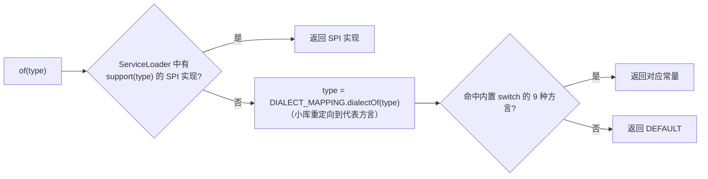

# i2f-bindsql-stringify

> 参数化 SQL 的「文本化（stringify）」模块。把 `i2f-bindsql` 的 `BindSql`（**带 `?` 占位符的 SQL 文本 + 绑定参数 `List<Object>`**）还原成一条**完整、自包含、可直接阅读/执行**的 SQL 字符串：扫描 SQL 文本，将其中的每个 `?` 用对应参数渲染成的 **SQL 字面量**回填，且按目标数据库**方言**正确格式化日期/数值/布尔/字符串/null。核心用途有二——① 日志中打印参数已展开的完整语句；② 喂给不支持预编译占位符的脚本执行器（如 `i2f-jdbc-procedure` 的 `SqlRunnerNode` 走纯 `Statement` 的 `JdbcScriptRunner`）。

## 模块路径

- `i2f-jdk/i2f-bindsql-stringify`

## 模块依赖

| GroupId | ArtifactId | Scope | Optional | 说明 |
|---------|-----------|-------|----------|------|
| i2f.turbo | i2f-bindsql | compile | false | 提供被文本化的输入 `BindSql`（读取 `getSql()` / `getArgs()`） |
| i2f.turbo | i2f-match | compile | false | 提供 `RegexUtil.regexFindAndReplace`——按正则把 SQL 拆成「匹配/非匹配」分片并回调替换 |
| i2f.turbo | i2f-database-dialect | compile | false | 提供 `DatabaseObject2SqlStringifier` 及各方言实现（单个对象 → SQL 字面量的真正落地者） |
| org.projectlombok | lombok | provided | true | 父 POM 托管；本模块 3 个类实际未直接使用 Lombok 注解（沿用家族统一声明） |

> **传递依赖说明**：源码 `import` 了 `i2f.database.type.DatabaseType` / `DatabaseDialectMapping`，但 `pom.xml` **未显式声明** `i2f-database-type`——它经 `i2f-database-dialect`（其 pom 依赖 `i2f-database-type` 与 `i2f-convert`）**传递引入**。同理 `ObjectConvertor`（对象→`LocalDateTime`/`Boolean` 的类型试探转换）来自传递的 `i2f-convert`。
>
> 本模块运行期**零第三方依赖**：全部构建于 JDK + i2f 内部模块之上，是 `i2f-bindsql` 持久化族里「输出侧」的一层轻量适配器。

## 模块设计

整个模块只有 3 个类，职责边界极其干净——**「SQL 文本扫描回填」与「单对象字面量渲染」两件事被彻底解耦**：

```mermaid
flowchart TD
    A["BindSqlStringifiers.of(conn / jdbcUrl / type)"] -->|解析方言| B{选择 Stringifier}
    B -->|SPI support| C["ServiceLoader&lt;BindSqlStringifier&gt;"]
    B -->|DIALECT_MAPPING 重定向 + 内置 switch| D["WrappedBindSqlStringifier（包装某方言）"]
    D -->|stringify(bql)| E["RegexUtil.regexFindAndReplace(sql, tokenRegex, mapper)"]
    E -->|命中原子 token| F{"是 '字符串'/注释 ?"}
    F -->|是| G[原样保留，不消耗参数]
    F -->|否（即 ?）| H["iterator.next() → paramToString(obj)"]
    H --> I["object2SqlStringifier.stringify(obj)<br/>（按方言渲染 null/数值/布尔/日期/字符串）"]
    I --> J[拼接还原完整 SQL]
    G --> J
```

### 1. 契约：`BindSqlStringifier`（可 SPI 扩展）

```java
public interface BindSqlStringifier {
    boolean support(DatabaseType databaseType);
    String stringify(BindSql bql);
}
```

一个「输入 `BindSql`、输出完整 SQL 文本」的函数式契约，`support` 用于 SPI 路由。

### 2. 实现：`WrappedBindSqlStringifier`（包装/适配器模式）

这是全模块的核心。它**不自己实现对象→字面量的方言细节**，而是**包装（wrap）**一个来自 `i2f-database-dialect` 的 `DatabaseObject2SqlStringifier`：

- `stringify(BindSql bql)`：取 `bql.getArgs().iterator()`，用一条组合正则把 SQL 切成 token 序列，只把 `?` 替换成字面量，其余原样保留；
- `paramToString(Object obj)`：先给 `preParamToString(obj)` 兜底钩子（默认返回 `null` 不拦截），否则委托包装对象 `object2SqlStringifier.stringify(obj)`；
- `support(type)`：直接委托包装对象的 `support`。

**原子 token 保护正则**（与 `BindSql.toMergeSql` 同一设计哲学——把字符串/注释视为不可破坏的原子）：

| 分组 | 正则片段 | 处理 |
|------|----------|------|
| 字符串字面量 | `('[^']*')` | 命中即原样保留，**不消耗**参数 |
| 单行注释 | `(--[^\n]*($|\n))` | 原样保留 |
| 多行注释 | `(/\*[^*]*\*/)` | 原样保留 |
| 占位符 | `(\?)` | **唯一**消耗一个参数并渲染字面量的 token |

> `mapper` 内通过 `str.startsWith("'")/("--")/("/*")` 判定前三类直接返回；只有落到 `?` 分支才 `iterator.next()`。因此**位于字符串或注释内部的 `?` 不会被误当作占位符**，参数顺序与「裸 `?`」严格同序。

**真正的对象→字面量渲染**在 `i2f-database-dialect` 的 `AbsDatabaseObject2SqlStringifier` 中，按类型分派：

| 类型 | 默认渲染 | 方言差异点 |
|------|----------|-----------|
| `null` | `null` | — |
| 数值 | `String.valueOf` | — |
| 布尔 | `1` / `0` | — |
| 字符串/`CharSequence` | `'...'`，内部 `'`→`''` 转义（`decorateAsSqlString`） | — |
| **日期** | `'yyyy-MM-dd HH:mm:ss'`（引号包裹） | **MySQL**：`STR_TO_DATE('...','%Y-%m-%d %H:%i:%s')`；**Oracle**：`TO_DATE('...','yyyy-MM-dd HH24:mi:ss')` |

> 可见 `WrappedBindSqlStringifier` 的「包装」价值：**把「遍历 SQL 找占位符」这份通用逻辑写一次，把「各方言怎么渲染一个日期/字符串」这份差异交给被包装对象**，二者正交组合。

### 3. 门面：`BindSqlStringifiers`（方言路由）

- **预置常量**：`DEFAULT` / `MYSQL` / `ORACLE` / `POSTGRE` / `H2` / `PHOENIX` / `GUASS` / `DB2` / `SQL_SERVER` / `HIVE`——每个都是一个已绑定对应方言 `*DatabaseObject2SqlStringifier` 的 `WrappedBindSqlStringifier`（`DEFAULT` 绑 `DefaultDatabaseObject2SqlStringifier`）。
- **`DIALECT_MAPPING`**：一个匿名 `DatabaseDialectMapping`，把小库/兼容库**重定向**到代表方言——`MARIADB / GBASE / OSCAR / XU_GU / CLICK_HOUSE / OCEAN_BASE / KINGBASE_ES → MYSQL`，`DM / ORACLE_12C → ORACLE`。
- **三级解析入口 + 解析优先级链**：



`of(Connection)` / `of(String jdbcUrl)` 分别先经 `DatabaseType.dialectOfConnection` / `dialectOfJdbcUrl` 归一为 `DatabaseType`，再进入 `of(type)` 的解析链。

## 模块目的

- 让「参数化 SQL」在**需要一整条可执行/可展示语句**的场合不再受限于 `?` 与参数分离：日志打印、SQL 导出、纯 `Statement` 脚本执行等。
- 在**多方言**环境下把占位符参数渲染成**语法正确**的字面量（尤其日期函数、字符串引号转义），避免拼接出错或语义偏差。
- 用「包装 + SPI + 方言重定向」把**通用回填逻辑**与**方言渲染细节**解耦，新增方言只需在 `i2f-database-dialect` 加一个 `*DatabaseObject2SqlStringifier`，本层几乎零改动。

## 模块功能

| 能力 | 入口 | 说明 |
|------|------|------|
| BindSql → 完整 SQL 文本 | `BindSqlStringifier#stringify(bql)` | 扫描 SQL，把裸 `?` 依次回填为字面量 |
| 方言选择 | `BindSqlStringifiers.of(conn / jdbcUrl / type)` | 从连接/URL/类型解析出应使用的 stringifier |
| 直接按方言文本化 | `BindSqlStringifiers.MYSQL.stringify(bql)` 等常量 | 跳过路由，指定某方言 |
| 字符串/注释保护 | stringify 内的原子 token 正则 | `'...'`、`--`、`/* */` 内的 `?` 不被误替换 |
| 字面量转义 | 委托 `AbsDatabaseObject2SqlStringifier` | `'`→`''`、null/布尔/数值的规范写法 |
| SPI 扩展 | `ServiceLoader<BindSqlStringifier>` | 提供自定义 stringifier 并 `support` 目标方言即可优先命中 |
| 小库方言归并 | `DIALECT_MAPPING` | MariaDB/达梦/ClickHouse/OceanBase… 映射到代表方言 |

## 模块主要使用方法

```java
// 1) 从已有 JDBC 连接解析方言并文本化
BindSql bql = BindSql.of("select * from t where ct > ? and name = ?", now, "o'brien");
try (Connection conn = ds.getConnection()) {
    BindSqlStringifier stringifier = BindSqlStringifiers.of(conn);
    String fullSql = stringifier.stringify(bql);
    // MySQL 方言下：
    // select * from t where ct > STR_TO_DATE('2026-09-09 10:00:00','%Y-%m-%d %H:%i:%s') and name = 'o''brien'
}

// 2) 只有 jdbcUrl / DatabaseType 时
String sql2 = BindSqlStringifiers.of("jdbc:postgresql://...").stringify(bql);
String sql3 = BindSqlStringifiers.of(DatabaseType.ORACLE).stringify(bql);

// 3) 已知目标方言，跳过路由直接用常量
String mysqlSql = BindSqlStringifiers.MYSQL.stringify(bql);

// 4) 自定义参数渲染：继承并覆写 preParamToString 钩子（返回非 null 即拦截）
public class MyStringifier extends WrappedBindSqlStringifier {
    public MyStringifier() { super(MysqlDatabaseObject2SqlStringifier.INSTANCE); }
    @Override public String preParamToString(Object obj) {
        if (obj instanceof byte[]) { return "0x" + hex((byte[]) obj); } // 例如自处理二进制
        return null; // 交回默认渲染
    }
}
```

**注意事项（源码实测）**：

1. **参数个数需与裸 `?` 数匹配**：`stringify` 用一个 `Iterator` 顺序取参数，若 `?` 多于 args 会在 `iterator.next()` 抛 `NoSuchElementException`；若 args 多于 `?` 则多余参数被忽略、不出现在结果里。
2. **字符串/注释内的 `?` 安全**：只有正则识别为「裸 `?`」的 token 才消耗参数；引号串、`--`、`/* */` 内的 `?` 原样保留。
3. **正则 `'[^']*'` 不认转义引号整体**：像 `'a''b'`（SQL 里表示 `a'b`）会被切成 `'a'` 与 `'b'` 两个字符串 token，中间无裸 `?` 时不影响结果，但依赖此行为的极端写法需留意。
4. **`of(type)` 每次都会 `ServiceLoader.load`**：本门面不像 `i2f-bindsql-page` 那样用静态块缓存 SPI 实例，高频调用建议自行持有返回的 `BindSqlStringifier` 或直接用 `MYSQL`/`ORACLE` 等常量。
5. **文本化 = 脱离预编译**：结果是把参数写进 SQL 文本，`stringify` 已做 `'`→`''` 转义（含日期/字符串），但用它替代 `PreparedStatement` 执行仍不如参数化安全，官方定位是**日志展示与脚本执行器**场景。
6. **命名瑕疵**：常量 `GUASS`（对应 `GAUSS` 方言）拼写少一个字母，仅命名层面，不影响功能；未命中 9 种内置方言时统一回落 `DEFAULT`（日期以引号串形式渲染）。

## 模块特性总结

- **单一职责的薄适配层**：只负责「遍历 SQL、回填占位符」，方言字面量渲染全部委托 `i2f-database-dialect`，关注点正交。
- **包装器模式**：`WrappedBindSqlStringifier` = 通用回填 + 可替换的 `DatabaseObject2SqlStringifier`，`preParamToString` 提供子类拦截钩子。
- **方言感知**：MySQL `STR_TO_DATE`、Oracle `TO_DATE`、默认引号串——同一 `BindSql` 在不同库下渲染出各自可执行的整条语句。
- **三级解析链**：`conn`/`jdbcUrl`/`type` 入口，经「SPI → 方言重定向 → 内置 9 方言 switch → DEFAULT」定位实现。
- **原子 token 保护**：字符串/行注释/块注释内的 `?` 不被误替换，参数与裸 `?` 严格同序。
- **可 SPI 扩展**：注册自定义 `BindSqlStringifier` 并正确 `support` 即可优先于内置分发。
- **运行期零第三方依赖**：纯正则 + `java.time` + i2f 内部模块，位于 `i2f-bindsql` 持久化族的输出侧。

## 相关模块

- 上游：`i2f-bindsql`（`BindSql`）、`i2f-database-dialect`（各方言 `DatabaseObject2SqlStringifier`）、`i2f-match`（`RegexUtil`）、`i2f-database-type`（`DatabaseType`/`DatabaseDialectMapping`，传递引入）。
- 下游：`i2f-jdbc-procedure` 的 `SqlRunnerNode` 用 `BindSqlStringifiers.of(conn).stringify(bindSql)` 把 BindSql 脚本还原为纯 SQL 交给 `JdbcScriptRunner`；并经 `i2f-jdk-all` 聚合引入。
- 近邻：`i2f-bindsql-page`（分页/计数方言改写，同为 `BindSql` 上层扩展，但改写的是 `?` 结构而非回填字面量）。
