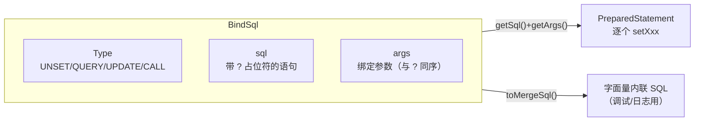
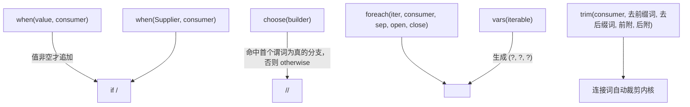
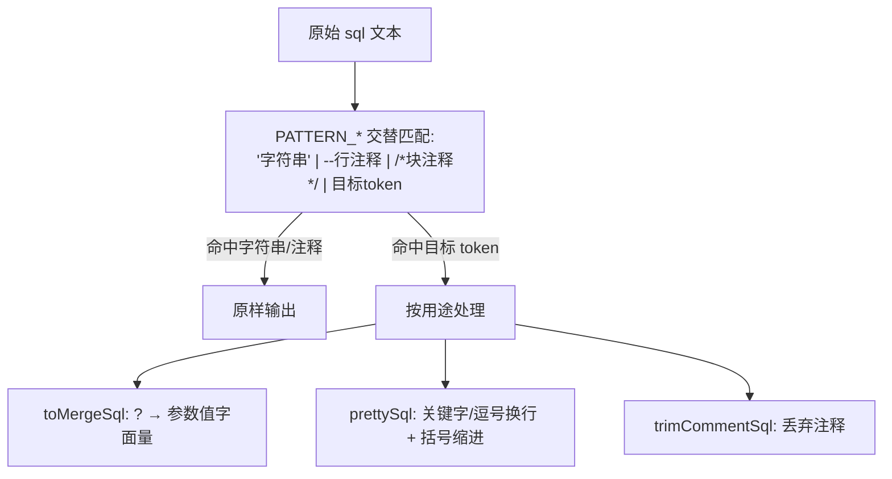

# i2f-bindsql

> 参数化 SQL 流式构建器（Bind Sql）。单一核心类 `BindSql` 把「SQL 文本」与「绑定参数 `List<Object>`」封装为一体，用**链式 DSL** 拼装 SELECT/INSERT/UPDATE/DELETE/DDL 语句，内建 MyBatis 风格的**动态 SQL**（`when` / `choose` / `foreach` / 连接词自动裁剪），并提供把 `?` 占位符**回填为字面量**、**美化缩进**、**剥离注释**三类基于正则的 SQL 文本处理能力。它是 i2f 持久化体系的地基——`i2f-bindsql-page`（分页）、`i2f-bindsql-stringify`、`i2f-bql`、`i2f-jdbc-impl` 及 mybatis/velocity/antlr4 等扩展都构建于其上。

## 模块路径

- `i2f-jdk/i2f-bindsql`

## 模块依赖

| GroupId | ArtifactId | Scope | Optional | 说明 |
|---------|-----------|-------|----------|------|
| — | — | — | — | **无 i2f 内部依赖**（不引用任何兄弟模块，是持久化族的最底层） |
| org.projectlombok | lombok | provided | true | 编译期注解处理器，仅用于内部类 `ChooseBranch` 的 `@Data`/`@NoArgsConstructor`；由父 POM `dependencyManagement` 统一托管（版本 `1.18.44`） |

> 运行期**零三方依赖**：全部逻辑构建于 JDK 之上——`java.util.regex`（SQL 文本处理）、`java.time` + `java.text.SimpleDateFormat`（日期字面量格式化）、`java.lang.reflect.Array`（数组判空）、`java.util.function.*`（DSL 的函数式钩子）。
>
> 构建期使用 `maven-assembly-plugin`（继承父 POM 配置）。

## 模块设计

### 1. 三元组值对象 + 链式构建

`BindSql` 的本质是一个不可变风格的值对象，携带三段状态：



- **`Type` 枚举**：`UNSET(0)` / `QUERY(1)` / `UPDATE(2)` / `CALL(3)`，以 `code()` 暴露，语义对齐 JDBC 语句类别（查询 / 更新 / `CallableStatement` 调用），随对象一同传递给下游 JDBC 层选择执行方式。
- **`sql` 与 `args` 同步增长**：每追加一个 `?` 占位符，就同步向 `args` 压入对应值，使「语句」和「参数」永远成对流动——这正是 *Bind*Sql 之名的由来，也是与下游 `PreparedStatement` 天然对接的关键。

### 2. 两个基础拼装原语：`concat` vs `add`

| 原语 | 行为 | 分隔 |
|------|------|------|
| `concat(...)` | 直接拼接 SQL 文本与 args | **无空格** |
| `add(...)` | 拼接 SQL 文本与 args | 中间加**一个空格** |

二者各有三个重载：`(String sql, Object... args)`、`(Function<BindSql,BindSql> consumer)`（在临时 `BindSql.of()` 上求值后拼接）、`(BindSql)`。均**返回新实例**而非原地修改（函数式链式风格）。辅助方法：`val(Object)`（追加 `?`+值）、`line()` / `space()` / `tab()` / `spacing()` / `trim()`（空白整形）、`escapeSqlString` / `descapeSqlString`（`'...'` 字面量转义与还原）。

> ⚠ 由于结构方法不修改 `this`，链式调用**必须使用返回值**（如主方法里 `BindSql x = BindSql.of().select(...)....`），丢弃返回值不会改变原对象。

### 3. 动态 SQL：MyBatis 语义的编程式复刻



- **`when`（条件拼接）**：`when(value, consumer)` 仅当 value「有内容」时才追加子句，默认判空谓词为 `BindSql::isEmpty`；另有 `when(Supplier<Boolean>, consumer)` 走布尔开关。
- **`choose`（择一分支）**：内部类 `ChooseBranch`（`predicate` + `consumer`）与 `ChooseBranchBuilder` 组合，`choose(...)` 顺序取第一个谓词为真（或谓词为 `null`）的分支；`ChooseBranch.of(consumer)` 默认谓词 `() -> true`，即 `<otherwise>`。
- **`foreach` / `vars`**：`foreach` 复刻 MyBatis `<foreach>`（分隔符、前缀、后缀）；`vars` 是其特化，把集合渲染为 `(?, ?, ?)`，用于 `in (...)`、批量 values 等。
- **`trim`（裁剪内核）**：先求值子构建器，再按需剥离**开头词**（如悬挂的 `and` / `or` / `,`）与**结尾词**，最后前后附加包裹词。`where(consumer)`、`on(consumer)`、`having(consumer)` 借此自动去掉首个多余 `and`/`or`；`select`/`groupBy`/`orderBy`/`set` 借此去掉首尾逗号；`bracket(consumer)` 用 `(`…`)` 包裹。

### 4. SQL 关键字 DSL 家族

一大批方法把 SQL 关键字封装成链式节点，按用途归类：

| 类别 | 代表方法 |
|------|----------|
| DML 起始 | `select()` / `select(fn)`、`insert()`+`into()`+`values()`、`update()`+`set(fn)`、`delete()` |
| 子句 | `from()`、`where()` / `where(fn)`、`groupBy(fn)`、`orderBy(fn)`、`having(fn)`、`asc()` / `desc()` |
| 连接 | `leftJoin()` / `rightJoin()` / `innerJoin()` / `outerJoin()`、`on()` / `on(fn)` |
| 逻辑/比较 | `and(fn)`、`or(fn)`、`eq/neq/gt/lt/gte/lte(value)`、`like` / `startsWith` / `endsWith`、`between(b,e)`、`in(iter)`、`isNull()` / `isNotNull()`、`exists(fn)` |
| 集合/CTE | `with()` / `with(alias, fn)`、`as()`、`not()`、`nil()`（`null`）、`is()`、`to()` |
| DDL/权限 | `create`/`table`/`view`/`index`/`unique`/`drop`、`primaryKey()`、`foreignKey()`+`references()`、`grant`/`revoke`、`comment()` |

比较类方法**一律参数化**：`eq(v)` → ` = ?` 且把 `v` 压入 args；`like(v)` → `like ?` 且绑定 `%v%`（`startsWith`→`v%`、`endsWith`→`%v`）；`between(b,e)` → `between ? to ?`；`in(iter)` → `in (?, ?, ...)`。

### 5. 基于正则的 SQL 文本处理

三个静态处理共用一条设计原则：**把字符串字面量 `'...'` 与注释 `-- …` / `/* … */` 作为原子 token 优先匹配、原样保留**，从而只对「真正的 SQL 结构」做变换，绝不破坏引号/注释内的内容（`main` 里特意写入含 `?` 的注释与字符串来验证）。



- **`toMergeSql()` / `toMergeSql(valueConvertor)`**：按 `PATTERN_MERGE` 逐个把 `?` 替换为 `args` 中的实际值（跳过字符串与注释），产出**字面量内联**的完整 SQL。默认转换器 `defaultMergeSqlValueConvertor`：`null`→`null`、`Number`→原样、`CharSequence`→转义加引号、`Date`/`LocalDateTime`/`LocalDate`/`LocalTime`→按 `yyyy-MM-dd HH:mm:ss` 等格式化并加引号、其它→`toString` 加引号。日期用 `ThreadLocal<SimpleDateFormat>` 规避其非线程安全。
- **`prettySql(String)`**：按 `PATTERN_PRETTY` 在主要关键字前换行、逗号后换行，并用左右括号维护缩进层级（`level` 以制表符缩进），保留字符串/注释。
- **`trimCommentSql(String)`**：按 `PATTERN_COMMENT` 剥离 `--` 与 `/* */` 注释，保留字符串字面量。
- 三者均有实例版（`pretty()` / `trimComment()` 返回带处理文本的新 `BindSql`）与静态版（直接处理 `String`）。

### 6. 包结构

```
i2f.bindsql
└── BindSql        // 唯一类：Type 枚举、ChooseBranch/Builder 内部类、
                   // 三元组状态、concat/add 原语、动态 SQL、关键字 DSL、文本处理
```

## 模块目的

- 以**纯 JDK、零三方依赖**提供一套类型安全的编程式 SQL DSL，替代手写字符串拼接，杜绝占位符与参数错位。
- 让「语句 + 参数 + 语句类型」作为单一值对象在持久化链路中流转，向下无缝对接 `PreparedStatement` / `CallableStatement`。
- 复刻 MyBatis 动态 SQL 能力但**不依赖 MyBatis**，使分页/字符串化/方言包装等上层模块可在纯 Java 内组合条件、循环、择一逻辑。
- 提供 merge/pretty/trim-comment 文本处理，兼顾**调试可读**（内联字面量 SQL）与**方言包装前的规整**。

## 模块功能

| 能力 | 载体 | 说明 |
|------|------|------|
| 参数化构建 | `add` / `concat` / `val` / 比较类 DSL | `?` 与 args 同序累积 |
| 语句类型标注 | `Type` + `getType/setType` | QUERY/UPDATE/CALL 传递给 JDBC 层 |
| 条件拼接 | `when(...)` | 值有内容 / 布尔开关时追加子句 |
| 择一分支 | `choose(...)` + `ChooseBranch` | 类 `<choose>/<when>/<otherwise>` |
| 集合展开 | `foreach` / `vars` | `(?, ?, ?)`、自定义分隔与前后缀 |
| 连接词裁剪 | `trim` / `bracket` / `where` / `on` / `having` / `select` / `groupBy` / `orderBy` | 自动去悬挂 `and`/`or`/逗号 |
| 关键字 DSL | select/insert/update/delete/join/… | 覆盖 DML/DDL/连接/权限 |
| 字面量内联 | `toMergeSql([convertor])` | 生成可读的完整 SQL（调试用） |
| SQL 美化 | `prettySql` / `pretty()` | 关键字换行 + 括号缩进 |
| 注释剥离 | `trimCommentSql` / `trimComment()` | 去 `--` 与 `/* */` |
| 字面量转义 | `escapeSqlString` / `descapeSqlString` | `'…'` 与内部 `'` 加倍 |

## 模块主要使用方法

### 1. 链式构建参数化查询（取自类内 `main`）

```java
BindSql q = BindSql.of()
    .select(s -> s.add("a.*").add("... as text"))
    .from().add("sys_user").add("a")
    .where(w -> w
        .and(s -> s.add("a.user_id").eq(1001))
        .and(s -> s.add("a.status").in(Arrays.asList(1, 2, 3)))
        .choose(c -> c
            .add(() -> someFlag, s -> s.and(v -> v.add("a.nick_name").like("123")))
            .add(s -> s.and(v -> v.add("a.user_name").eq("admin")))  // otherwise
        )
    );
q.getSql();  // "... where a.user_id = ? and a.status in (?,?,?) ..."
q.getArgs(); // [1001, 1, 2, 3, "123"→"%123%", "admin"] 与 ? 同序
```

### 2. 交给 JDBC 执行

```java
PreparedStatement ps = conn.prepareStatement(
    q.getType() == BindSql.Type.CALL ? sql : q.getSql());
List<Object> args = q.getArgs();
for (int i = 0; i < args.size(); i++) ps.setObject(i + 1, args.get(i));
```

### 3. 打印可读 / 内联字面量 SQL（调试）

```java
System.out.println(q.toMergeSql());          // 把 ? 回填为实际值，便于观察
System.out.println(BindSql.prettySql(raw));  // 关键字换行 + 括号缩进
String clean = BindSql.trimCommentSql(raw);  // 去掉注释后再执行/美化
```

### 4. 动态条件与集合展开

```java
BindSql sql = BindSql.of().select("count(1)").from("t_user")
    .where(w -> w
        .when(name,  s -> s.and(v -> v.add("name").like(name)))   // name 非空才拼
        .when(deptId != null, s -> s.and(v -> v.add("dept_id").eq(deptId)))
        .when(ids, s -> s.and(v -> v.add("id").in(ids)))          // in (?, ?, ...)
    );
```

### 注意事项

- **结构方法返回新实例，不修改原对象**：链式必须接住返回值；`setType/setSql/setArgs` 例外（原地修改并返回 `this`）。
- **`toMergeSql` 仅用于展示/日志，不宜用于执行**：它把参数**字面量内联**，绕过了预编译参数绑定，对不可信输入存在 SQL 注入风险；执行请始终用 `getSql()` + `getArgs()`。
- **占位符与参数强同序**：手动 `add("?")` 却不压参、或用不带 `?` 的 `add` 混排，都会使 `toMergeSql` 与 JDBC 绑定错位。
- **字符串/注释中的 `?` 不被替换**：`toMergeSql`/`pretty`/`trimComment` 的正则把 `'...'`、`--…`、`/*…*/` 视为原子，勿依赖占位符在这些区域内生效。
- **两处疑似缺陷（按现状如实记录，使用相关 DSL 时需规避）**：
  1. 无参 `set()` 实际追加的关键字是 `"not"` 而非 `"set"`（源码 `return add(BindSql.of("not"))`），因而 `set(consumer)` 的前缀也会生成错误的 `not …`；构造 `update … set …` 时应改用显式 `add("set")`。
  2. 带 `Function` 的 `or(consumer)` 内部委托的是 `and()` 而非 `or()`，会拼出 `and …` 而非 `or …`；需要 `or` 分组时请显式使用无参 `or()` 或 `add("or")`。
- **`isEmpty` 语义为「有内容」**：`BindSql.isEmpty(obj)` 在 `null`→`false`、非空串/集合/Map/数组→`true`、其它对象→`true`，命名与返回值相反（实为 `isNotEmpty`）；作为 `when` 默认谓词时表现为「值非空才拼接」。

## 模块特性总结

- **SQL 与绑定参数一体化**：`?` 与 `args` 同序流动，杜绝错位，直连 `PreparedStatement`。
- **纯 JDK 零依赖**：正则 + `java.time` + 函数式接口即可支撑，符合 `i2f-jdk` 分组定位。
- **链式关键字 DSL**：覆盖 DML / DDL / 连接 / 比较 / 权限，类型安全、可读性强。
- **MyBatis 式动态 SQL**：`when` / `choose` / `foreach` / `vars` / `trim` 连接词自动裁剪，无需引入 MyBatis。
- **正则原子 token 保护**：merge / pretty / trim-comment 对字符串与注释安全无副作用。
- **字面量内联可观测**：`toMergeSql` 一键还原完整可读 SQL，便于调试与日志。
- **持久化族地基**：向上支撑 `i2f-bindsql-page`（多方言分页）、`i2f-bindsql-stringify`、`i2f-bql`、`i2f-jdbc-impl` 及 mybatis/velocity/antlr4/rag-sqlite 等扩展。
- **不可变风格值对象**：拼装方法产出新实例，利于分支复用与函数式组合。
